# CodeBuddy新版发布，MCP与Craft

[以前](https://yishulun.com/blog/2025/1.html)我介绍过[腾讯云代码助手](https://copilot.tencent.com/)（CodeBuddy），没有想到很快它又迎来了重大更新。这次更新我主要体验了两点：MCP和Craft。

## MCP

什么是MCP？它是Model Context Protocol的简写，是大模型上下文协议。

它是OpenAI在2024年11月公开发布的。MCP的发布，标准着像扣子（Coze.cn）一样的低代码平台走向了终点，同样的事情，使用MCP就可以达成，且还能开放做得还更好。在此之前，OpenAI就曾经公开过ChatGPT Plugin的开发能力及文档，可以说，Plugin就是MCP的实践前身，Plugin让OpenAI看到了互联网需要一个开放的、开源的、格式统一的互联网能力调用协议。特别是今年中国Manus的大火，更加坚定了OpenAI开放大语言模型协议的决心。

MCP是一项协议，如下所示，一个MCP Server会提供一系列的tools能力。这一点与最初的Plugin是类似的，当初在Plugin描述里面，也有接口及参数的详细说明。

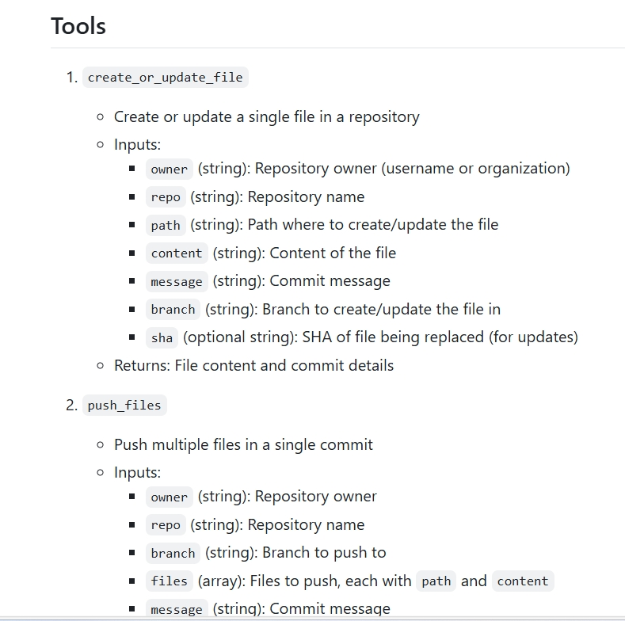

此外，MCP还要求MCP Server实现一批对大语言模型友好的接口，如下所示，这些接口，基本上就是给AI读写的。MCP像一个USB-C接口，一边连接虚拟，一边连接现实。再过十年，MCP Server到处都是，且还埋在应用的底层，甚至程序员都不知道底层调用了哪些MCP能力。

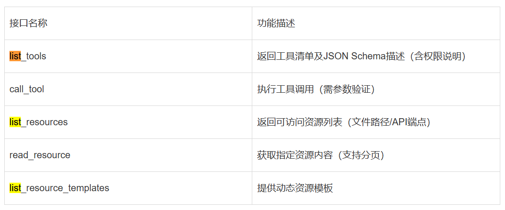

一个完整的MCP节点包括三部分：MCP Host、MCP Client和MCP Server。MCP Host必须具备AI模型能力，因为它要负责理解和拆解用户的自然语言指令，例如Cursor IDE。MCP Client从Host接收请求，转换为MCP标准格式（JSON-RPC 2.0），再转发给MCP Server，由MCP Server处理后通过SSE（Server-Sent Events）协议返回。MCP Server是可以提供服务能力的第三方，相当于原来开发Plugin的厂商。

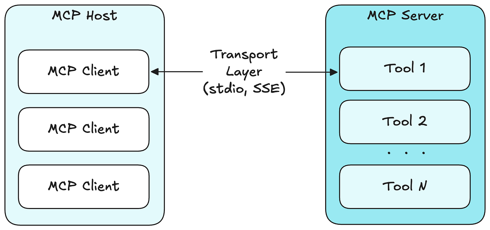

在CodeBuddy中，已经集成了MCP市场，已经有一些MCP Server，例如腾讯云的COS对象存储MCP、Github的仓库MCP。众多大公司提供的MCP能力将成为AI时代的基石，像电力一样，隐藏于所有应用之下。像谷歌，在传统互联网时代，它是最成功的搜索引擎，在AI时代，它将成为最大的互联网网页索引数据库。MCP像一个USB-C接口，使用它，任何开发者都可以借用谷歌的数据。元宇宙来临时，很多人吹捧它，但最终还是没能起来，MCP来临的时候，大家都不吭声，但都默默开发并亮出了自己的MCP，以图在基础设施市场尽早占领一席之地。

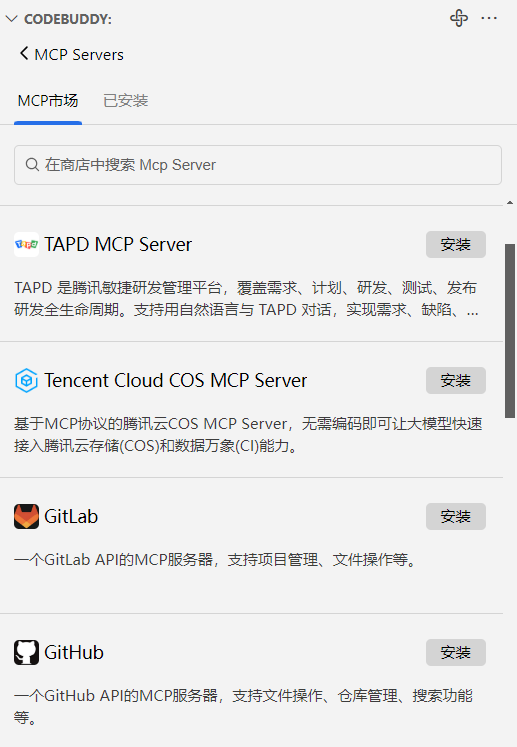

个人也不必着急，着急也没用，只有具有强大实力和丰富资源的大厂才能发布MCP，个人和小团队什么也没有，发布了也没用。

## Craft

这个单词好像是“精雕细琢”，它的功能也如它的名字一般，像一把手术刀，具有对项目代码使用自然语言进行精雕细琢的能力。

CodeBuddy支持多个客户端，包括微信开发者工具。安装微信开发者工具以后，在文件导航面板所在的地方，有一个插件市场，输入CodeBuddy就可以安装插件。遗憾的是，微信开发者工具中的CodeBuddy插件与VSCode中的CodeBuddy插件，不是同一个版本，目前前者比后者要落后。这也说明微信开发者工具并不是一个VSCode简单套的壳。

好消息是，我可以使用VSCode编辑代码，使用微信开发者工具编译与测试小游戏就可以了。这不影响我接下来使用Craft进行微信小游戏的开发体验。

使用方法非常简单，操作不值一提。

例如，我在Craft窗口中说：解释这个项目中的核心逻辑。（默认是工具创建的小飞机项目。）

然后，AI就开始巴拉巴拉给我解说，速度很快，几乎没有什么延迟。也没有故作深沉的思考。

例如，我又说：将所有本地代码删除，然后重新创建一个俄罗斯方块小游戏。

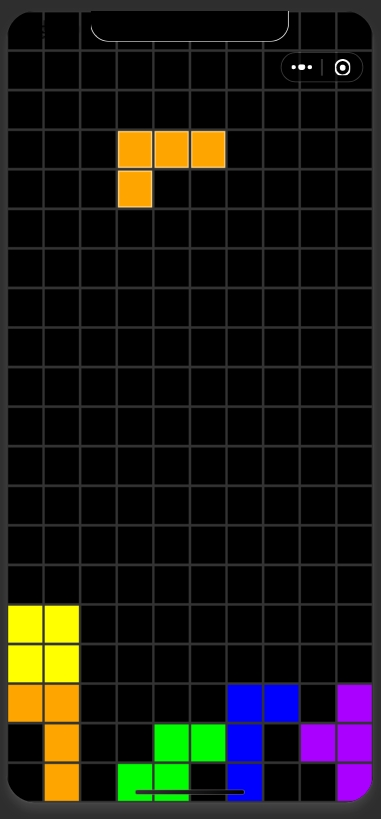

然后，AI就开始删除旧文件，一步一步创建新文件。

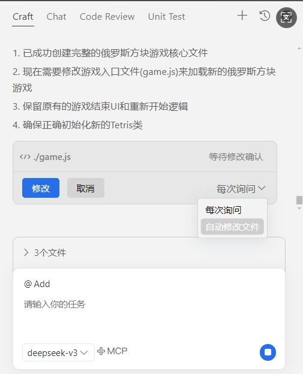

Craft有自动选项，选上以后，我们只需要端一杯咖啡，看它干活就可以了！

这也太幸福了！

我一向以为，我做为一名老程序员，见证了PC互联网向移动互联网变迁，没有想到，刚开局就结束了，我们这一代程序员，难道还要见证传统编程的消失吗？好像是这样。以后或许再也不会有用VI写代码、用记事本写代码、使用原生方式进行Debug的程序员了。

在原来的Chat窗口，有Codebase选项，这是个神奇的选项，选中它，代表可以将当前整个项目的代码作为问答基础提交给AI。在Craft窗口，我没有看到这个选项，这个选项似乎被内置了，因为我发现，我随时可以问项目里的任何代码问题，不管我有没有艾特它们。

在艾特文件方面也有变化，如果当前有文件在打开着，单击艾特符号看到的首先是打开的文件。

在Chat窗口，我们可以艾特“微信小游戏”，将官方文档拉进来。无论什么时候，官方文档都是最权威的。在Craft中目前还不能这样用，这个后续可能会有。

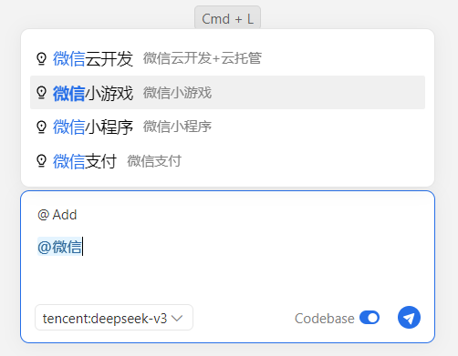

还有一个“接受”与“全部接受”的功能，也很nice。在一次互动中，如何我们对本次结果满意，可以全部接受，反之可以全部拒绝。

这也太方便了！代码不小心搞乱了，或一个想法走不通，直接撤销，一秒钟就回去了。

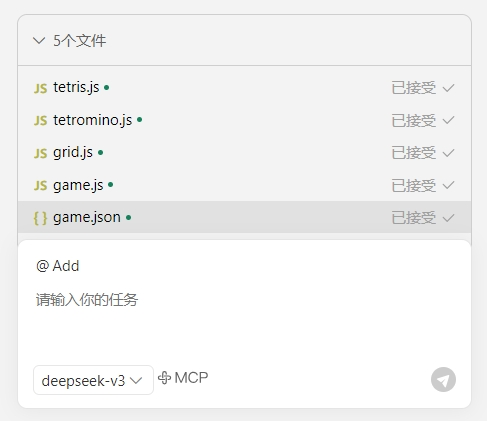

还有对每个文件的每次修改，都有记录，这种对比显示的方式与git操作风格很像，使用毫无认知负担。

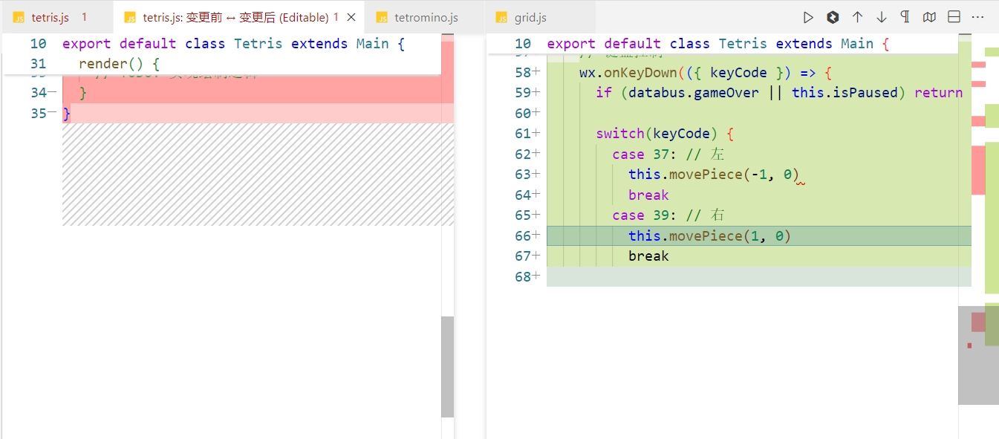

下面说两个不好的点吧。

一，在Craft终端准备执行的脚本，第一个字母会自动被截断。截断之后，肯定就不能正常执行了。

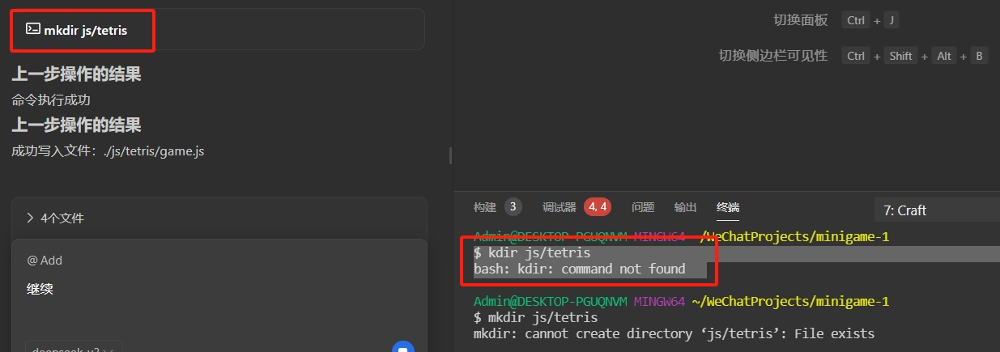

这是一个小Bug，可能与我使用了Git Bash有关。我的系统是Windows 10。

二，当我在微信开发者工具中使用Craft时，我的CPU被吃满了，内存被它吃了7个多GB。太恐怖了。

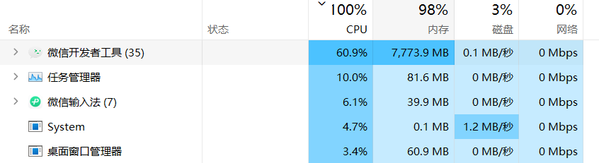

这种情况可能发生在，Craft在自动修改代码的时候。一般开发者工具都是自动保存、自动编译的，代码不断生成，特别在新代码不断有错的情况下，发生内存泄漏就不奇怪了。

后来我用VSCode与Craft互动、编辑代码，资源占用就小多了。

除了上面这两点，整体体验还是很nice的，Craft的操作方式很棒。

Craft给我的感觉，它是一个使用MCP的智能体。以后在编程领域，这样的自动智能体会越来越多，MCP Server在底层的使用也会越来越广泛。至于程序员，也会越来越多，且是以会使用AI、会使用Craft的新程序员。

不要觉得有了AI与Craft，编程与技术就不需要学习了，这样的想法是错误的。Craft的本质仍然是工具，它只不过是一个效率更高的工具而已。对于新程序员，以开发微信小游戏，要学习的有：

1. 微信开发者工具、VSCode、Craft等工具的使用技巧，这是简单的。
2. 微信小游戏的启动流程、底层架构与原理，主要组件及功能。有人可能觉得不是可以艾特官方文档库吗？是这样的，我们不需要死记硬背，但我们需要知道有那些能力可以用。
3. 基本的编程语言（JS），语法要懂，语言机制要理解，例如this如何判定等。
4. 休闲游戏的基础设计知识，如何设计排行榜、如何设计等级等，这些也要了解。
5. 学习与AI共舞的能力。这项能力是通用的，不仅在小游戏开发中有用，在其他技术开发中一样有用。这种能力本质上是一种结构化思维的能力，简单说是一种可以制造填空题并让AI完成的能力。不论提示语如何优化，AI的能力本质上是一种填空的能力，其实不光AI，我们何尝不是如何。比如，“对于1、3、x、7、9、11，其中x是什么”，是5，我们知道是5，AI也知道，我们和AI一样，都是在寻找规律，然后给出一个概率最大的答案。

在以前，学习这些东西我们要一口一口啃，现在有了CodeBuddy和Craft，我们仍然要啃，但可以啃得更快了。开发效率也更高了。现在的程序员在装备了AI以后，基本都可以是全栈开发者，全能开发者。

2025年4月24日
