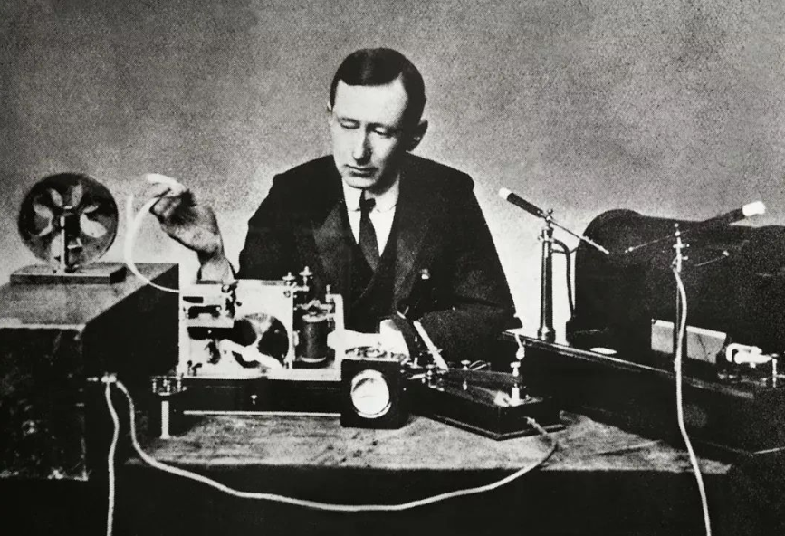

# 无限电报

1860年代,麦克斯韦提出电磁场的理论,并从理论上推测到电磁波的存在,可惜他也是英年早逝,只活了48 岁,未能用实验来证明自己推测的正确性。麦克斯韦理论将电、磁、光现象统一为同一物理本质。

麦克斯韦认为变化的电场会产生磁场，变化的磁场会产生电场，这种相互作用会以波的形式在空间中传播，其传播速度等于光速。

麦克斯韦的理论不仅解释了已知的电磁现象，更预言了电磁波的存在，最终由赫兹的实验完美验证。这一理论被誉为“19世纪物理学最伟大的成就之一”，其数学形式（麦克斯韦方程组）至今仍是电磁学的核心框架。

当时许多科学家（如开尔文勋爵）对位移电流和电磁波的存在持怀疑态度，直到1887年赫兹通过实验证实电磁波后，理论才被广泛接受。

如果把电磁理论的建立比做一座宏伟的大厦,那么,为这座大厦奠定了坚实地基的是法拉第；在坚实的地基上建成这座大厦的是麦克斯韦；为这座雄伟的大厦进行内部装修,使它能够最后被人们广泛使用的是赫兹。

**赫兹的实验**

海因里希·赫兹（Heinrich Hertz）在1887年至1888年间进行了一系列开创性实验，首次在实验室中证实了电磁波的存在，从而验证了麦克斯韦的电磁理论。

当与感应线圈两极相连的金属球间有火花跳过时，环的间隙处也有火花跳过。当火花在 A、B 间跳动时，在周围空间建立了一个迅速变化的电磁场，按照麦克斯韦的理论，这种变化的电磁场以电磁波的形式在空间传播。当电磁波经过接收器时，导致接收器产生感应电动势，使接收器两球间隙处产生电压；当电压足够高时，两球之间就会产生火花放电现象，从而证明了电磁波的存在。

**马可尼——无线电通讯农夫鸣枪测试**

距离赫兹实验已经过去了6年，且马可尼是在杂志上看到的，然后就开始实验。

马可尼20岁时，1894年的夏天，通过杂志上的文章了解到海因里希·赫兹关于电磁波的实验。马可尼在杂志上读到的那篇文章，就是他的老师奥古斯托·里纪为了纪念在1894年1月英年早逝的赫兹而写的论文。

在距离实验室2.4千米外的一个小山丘上，竖立着一个由铁皮制成的天线。只要这个天线接收到无线电波的信号，与之连接的电铃就会发出声响。而等候在旁的农夫则根据马可尼的指示，听到声响就鸣枪回应。

马可尼成功地在室内实现了无线电波的传送。后来，他逐渐延长传送距离，从100米到400米一直到2.4千米都取得了成功。

马可尼在意大利申请专利不被重视，马可尼的母亲有个亲戚在爱尔兰经营一家酿酒厂，酿造的威士忌十分有名，于是他在母亲的帮助下前往英国。1896年，马可尼得到英国邮政部的支援，开始在英国进行无线电报的研究，并且在同年取得了专利。意大利不识货，英国当了先。

**为什么意大利人马可尼却在英国获得了无线电报的研究机会和专利？**

他生下来就有一对大耳朵，好像预言着这是人类有史以来第一对收听千里外声音的耳朵。他的家庭十分富裕，他在家庭教师的指导下学习。少年时的马可尼几乎没有在正规的学校读过书，但他经常在父亲的私人图书馆中博览群书。母亲在阁楼上腾出一个房间给他做实验室，还说服了，一位大学物理教授给马可尼做指导。

1909年，马可尼获得诺贝尔物理学奖。第一次世界大战时——1914年，马可尼在意大利军队服役，担任无线通信的顾问。1937年，63岁的马可尼去世。据说在马可尼去世的第二天，全世界的无线电报都停用2分钟以示哀悼。

**马可尼是干什么的，农夫是谁？**

马可尼出生于1874年4月25日，成长于意大利博洛尼亚的一个富裕家庭。他没有接受过正规的学校教育，但对物理和电学有着浓厚的兴趣。

他的母亲为他在阁楼腾出一个房间作为实验室，并说服了博洛尼亚大学的物理学教授奥古斯托·里吉（Augusto Righi）——他的邻居指导他。

马可尼有一个邻居兼启蒙老师——当时博洛尼亚大学的物理学教授奥古斯托·里吉（ Augusto Righi）。

马可尼在1895年开始进行无线电通信的实验。他的工作为现代无线电通信技术奠定了基础，包括无线电广播、无线电话、雷达等众多领域。1901年，马可尼成功实现了跨大西洋的无线电通信，这一成就使他声名远扬，并在1909年获得了诺贝尔物理学奖。

在马可尼早期的实验中，农夫并不是一个特定的人物，而是被雇佣来协助实验的普通人。

1898年，马可尼受都柏林某报社的委托，通过无线电实况转播了金斯顿帆船比赛情况。搭载了无线电装置的拖船一路跟随比赛的帆船，通过无线电将比赛实况传达回去。这次转播也令无线电名声大噪。

们普遍认为电波是直线前进的。在学者们看来，因为地球是圆的，所以电波不可能传送到地球的另一面，甚至连几百千米之外也传送不到。这种想法情有可原，毕竟当时人们还没有发现电离层的存在。

**实践走在了理论前面**

1899年，他成功地在英国的南福兰和法国的维姆勒间传送了无线电信号，两地相距50千米，这也是世界上第一次发送的国际无线电报。1899年，他成功地在英国的南福兰和法国的维姆勒间传送了无线电信号，两地相距50千米，这也是世界上第一次发送的国际无线电报。

甚至有科学家已经想到，既然电波能够传达到3400千米之外的地点，那么在空中一定存在着能够反射电磁波的某种物质。不过，电离层直到1924年才正式被人类发现。

他对电离层是否存在也并不感兴趣。对于马可尼来说，他只关心电波是否能够实际传达到。所以，他只需要获得实验结果，至于理论则以后再总结。

他在费城号蒸汽船上安装了一套无线电报装置，然后在蒸汽船航行的过程中从波尔杜向其发送无线电报。结果证明，如果在夜间的话，即便距离超过3300千米，费城号仍然能够接收到无线电报的信号。这次的实验因为有通信记录和船长的证言，所以非常具有说服力。虽然还搞不清楚原理究竟是什么，但科学界在如山的铁证面前也不得不承认电波能够传送到地球的另一边。

**卖的是人的服务**

马可尼公司采用的商业模式也并非销售而是租赁，这一点和贝尔电话公司的商业模式十分相似。马可尼公司给签订合同的商船派遣经过训练的通信员，负责与陆地上的无线电通信站进行联系，进而收取通信员的派遣费以及无线电通信站与设备的使用费。

**个人和意外事件推动社会进步**

信息不共享，在有线电报、电话、无线电报上都一样。

1902年，德国的海因里希亲王搭乘威廉大帝号前往美国访问，因为在威廉大帝号上搭载有马可尼公司的设备，所以有关海因里希亲王的消息被实时地传送到马可尼公司的无线电台，使海因里希亲王在美国大受欢迎。但亲王从美国返回德国时搭乘的船舶没有马可尼公司的设备，结果他在船上发给美国总统的电报遭到马可尼无线电通信站的拒收。

后来发生了一件震惊世界的大事件，迫使马可尼公司也不得不接收其他公司的通信。这次事件就是著名的泰坦尼克号沉没事件。

泰坦尼克号的排水量高达4.6328万吨，比卡纳德旗下3.1万吨级的豪华客船卢西塔尼亚号和毛里塔尼亚号更加庞大。

排水量是指船体浸入水中的部分所占据的体积。排水量是衡量船舶大小的一个重要指标。一般来说，排水量越大，船舶的体积和尺寸也越大。根据阿基米德原理，任何在液体中漂浮的物体都会受到一个向上的浮力，这个浮力等于它排开的液体的重量。

1912年4月14日，利兰航运公司的加州人号曾经向它发送过紧急电报，电报的内容是：“3座大型冰山位于我们南方5英里（约8千米）区域。请注意！”但当时忙于发送电报的菲利普斯并没有接收到加州人号发来的信息。更不幸的是，加州人号的通信员在发送多次警告信息无果之后，选择了关闭无线电去睡觉，当时距离泰坦尼克号撞上冰山只剩下15分钟。

船长前往马可尼室要求通信员菲利普斯发出遇难信号。菲利普斯问道：“是CQD吗？”“嗯，CQD。遇难信号。这是我们的位置。”史密斯船长这样说着，将记载有西经50度14分、北纬41度46分的纸条递给菲利普斯。菲利普斯则按照船长的命令发送了“CQD”。CQD是马可尼公司制定的船舶遇难信号，信号CQ（“sécu”，即法语sécurité“安全”的略称）代表呼叫沿线所有的电台，宣布警告或预警性的信息，同样在海事无线电中，“CQ”也表示对所有人的呼叫。然而，在有线电报中并不存在紧急求救信号，因此马可尼公司在“CQ”后加入了字母“D”，代表“紧急情况”（Détresse），用于紧急呼救。但在前面提到过的第一届国际无线电报会议上，决定将“SOS”作为统一的国际求救信号，用莫尔斯电码表示就是“···---···”。不过在会议之后，仍然有很多船只继续使用“CQD”作为求救信号，泰坦尼克号也不例外。幸好助手布莱德想到了会议上的决议，并将这件事告诉给菲利普斯，于是他将求救信号从“CQD”变更为“SOS”。虽然在电影中并没有描写这一场面，但泰坦尼克号实际上发出了全世界第一个“SOS”求救信号。

**可以避免的灾难给人最大警示**

距离泰坦尼克号只有30千米的加州人号因为关闭了无线电，所以没能接收到求救信号。虽然加州人号上的瞭望员发现了泰坦尼克号发射的求救火箭，但并没有当成求救信号。最先接到泰坦尼克号求救信号的是德国客船法兰克福号，但这艘船距离泰坦尼克号大约250千米远。接到求救信号并率先抵达的是卡纳德航运公司的卡帕西亚号，这艘船距离泰坦尼克号大约100千米。泰坦尼克号于1912年4月15日凌晨2点20分完全沉没。卡帕西亚号抵达时，泰坦尼克号已经沉没了一个半小时以上。只有700余名乘员获救，其余1500余人都和泰坦尼克号一起沉入了海底。位于纽芬兰岛的无线基地接到求救信号，是在泰坦尼克号完全沉没的一小时之前。泰坦尼克号遇难的消息从纽约通过海底电缆被送往欧洲。4月15日一大早，全世界都得知了泰坦尼克号遇难的消息。

> ### 发出求救信号的时间
>
> - **1912年4月14日23时40分**：泰坦尼克号撞上冰山。
> - **1912年4月14日23时50分**：船长史密斯下令无线电操作员杰克·菲利普斯（Jack Phillips）发出求救信号。
> - **1912年4月14日23时58分**：泰坦尼克号首次发出求救信号“CQD”。
>
> ### 求救信号的内容
>
> - **CQD**：这是当时国际通用的求救信号，表示“Attention All Stations, Distress”（所有电台注意，紧急求救）。
> - **位置**：西经50度14分，北纬41度46分。
> - **附加信息**：泰坦尼克号的船名“Titanic”和其Morse电码呼号“MGY”。
>
> ### 后续求救信号
>
> - 在发出“CQD”信号后不久，泰坦尼克号的无线电操作员还尝试使用了新的国际求救信号“SOS”，这是国际无线电报公约新规定的求救信号，但当时尚未广泛使用。
> - **1912年4月15日00时15分**：泰坦尼克号首次发出“SOS”信号。

沉没用了2小时20分钟，距离最近的加州人号赶过去，加州人号以最高速度全力开过去，大约需要**75分钟**（1小时15分钟）才能到达泰坦尼克号的位置。当时船还没有完全沉掉。

- 泰坦尼克号的船长爱德华·约翰·史密斯（Edward John Smith）在沉船过程中坚守岗位，最终与船一起沉没。根据目击者的证词，史密斯船长在船沉没之前被看到淹死在舰桥操舵室里。
- 伊西多·施特劳斯（Isidor Straus）和艾达·施特劳斯（Ida Straus）是一对决心赴死的老夫妻。伊西多是美国梅西百货的创办人之一，他们都是头等舱的乘客。当泰坦尼克号撞上冰山后，艾达作为女性本有机会优先登上救生艇，但她拒绝了，表示要和丈夫在一起。伊西多也拒绝了优先逃生的机会，表示要和其他男性乘客一起等待。最终，他们一起留在船上，手牵手面对死亡。（当时女性和孩子有优先上逃生艇的机会）
- **泰坦尼克号总设计师托马斯·安德鲁斯（Thomas Andrews）**：他在船沉没时选择留在船上，**班杰明·古根海姆（Benjamin Guggenheim）**：这位富有的乘客在让出救生艇位置后，选择换上晚礼服，准备“像个绅士那样”面对死亡，**乐队指挥华莱士·赫特利（Wallace Hartley）和乐队成员**：他们在船上继续演奏音乐，安抚乘客，直到最后一刻，全数遇难。

**这是一场本来可以避免的人间悲剧！**

加州人号（SS Californian）并不是马可尼公司的船只，而是属于**利兰航运公司**（Leyland Line）。这是一家英国的航运公司，主要运营跨大西洋的货运和客运航线。

在泰坦尼克号沉没事件中，加州人号的无线电设备在关键时期关闭，导致其未能接收到泰坦尼克号发出的求救信号。此外，尽管加州人号上的瞭望员看到了泰坦尼克号发射的求救火箭，但船长斯坦利·洛德（Stanley Lord）并未将其视为求救信号，也未采取有效的救援行动。

加州人号（SS Californian）的无线电设备确实是由马可尼公司提供的。在1912年4月，加州人号安装了马可尼无线电系统，其无线电操作员赛勒斯·埃文斯（Cyril Evans）也是马可尼公司的员工。

然而，尽管加州人号配备了马可尼无线电设备，但其无线电操作员在泰坦尼克号沉没的关键时刻未能收到求救信号，原因是操作员在泰坦尼克号发出求救信号之前已经关闭了无线电设备并去睡觉。这个操作员这么做，也是符合要求的，在1906年在德国柏林召开了第一届国际无线电报会议。会议决定所有的设备都有相互通信的义务。但因为会议上也规定了例外情况，所以马可尼公司仍然拒绝接收其他公司的通信。

无线电操作员的工作时间是有限制的，他们需要休息。例如，加州人号的操作员在泰坦尼克号发出求救信号之前已经关闭了无线电设备并去睡觉。这种做法在当时是符合行业规范的，因为操作员不可能24小时不间断工作。

**马可尼一家因为儿子生病避开了灾祸**

当时，已经获得诺贝尔物理学奖的马可尼本来也受邀全家一起搭乘泰坦尼克号的处女航行，但他因为工作上的事情而提前乘船前往美国；他的妻子和2岁的儿子原计划搭乘泰坦尼克号，但在乘船之前儿子忽然生病，所以他的妻子和儿子便放弃了乘船的计划。马可尼一家意外躲过了这次灭顶之灾。

如果马可尼一家上了这艘船，并且船仍然沉了，遇难，那可就世纪遗憾。

**新标准的制定：无限设备+24小时职守**

事故发生2年后的1914年，13个海运国家的代表在英国伦敦召开了首次国际海上人命安全会议，并签订了《国际海上人命安全公约》。公约确定了船只结构、救生设备、无线设备等国际标准。要求搭乘50人以上的船只都必须配备无线设备、保持24小时开机并有专人负责。这说明，要想充分发挥技术的效果，相应的保障制度也极其重要。