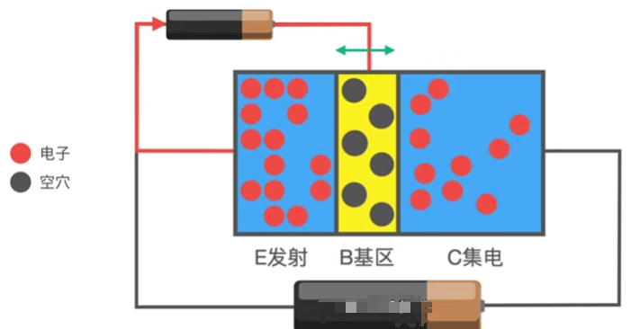
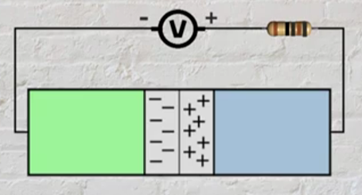

# 无限广播

被称为“无线电之父”之一（与马可尼、特斯拉齐名），他的三极管奠定了现代电子工业的基础。

在约翰·安布罗斯·弗莱明（John Ambrose Fleming）发明的二极管基础上改进，加入第三个电极（栅极），发明了 三极管（Triode）。这一发明使得电子信号可以被放大，成为现代电子工业的基础元件，广泛应用于无线电、电话、计算机等领域。

他将自己的计划展示给银行家和投资家，遗憾的是几乎没有人对他的计划感兴趣。

1906年，德·福雷斯特在弗莱明发明的真空二极电子管里，加进一个极——“栅极”，经过反复试验，终于发明了真空三极电子管，并于1907年向美国专利局申报了发明专利。

因发明新型电子管，德·福雷斯特竟无辜受到美国纽约联邦法院的传讯。有人控告他推销积压产品，进行商业诈骗。法官判决说，德·福雷斯特发明的电子管是一个“毫无价值的玻璃管”。

1908年，德福雷斯特来到法国，在巴黎的埃菲尔铁塔上设置了一台功率极高的广播设备，并成功地用留声机广播了音乐。据说这次广播覆盖了半径800千米的范围。

1908年，德·福雷斯特与一位名叫诺拉·斯坦顿·布拉奇的女工程师结婚。在蜜月旅行期间，德·福雷斯特和新娘用无线电从埃菲尔铁塔顶传输音乐。1910年初，李·德·福雷斯特甚至首次在舞台上现场直播了歌剧。李·德·福雷斯特似乎即将成为广播革命的先锋。然而，他的收音机音质糟糕透顶。由于他不想让妻子工作，他的婚姻破裂了。

1910年1月20日，他在纽约大都会歌剧院进行了世界上第一次公开无线电广播，转播了男高音恩里科·卡鲁索（Enrico Caruso）的演唱（歌剧《乡村骑士》和《丑角》），约有50名听众通过接收器收听了节目。

1916年，他在纽约建立实验性广播电台2XG，播放新闻和音乐，被认为是早期广播电台之一。

但德福雷斯特的想法还是太过超前。由于他的公司迟迟无法盈利，投资者们以诈骗罪将他告上了法庭。为了筹集诉讼费用，他不得不将真空三极管专利以39万美元的低价卖给了美国电话电报公司（AT&T）。AT&T利用该技术垄断了美国长途电话业务，并获得了巨额利润。这对于德福雷斯特来说实在是一个非常遗憾的结果。

为人，聪明但自负、甚至自大，疏狂的人，言语并不谨慎，但他也不是一个阴险、甚至十分精明的人

背景：德·福雷斯特和怀特共同创立了美国德福雷斯特无线电报公司。怀特利用德·福雷斯特的热情和发明能力，通过夸大宣传和虚假承诺向公众超发股票，获取了大量资金。

诉讼：费森登（Reginald Fessenden）起诉德·福雷斯特抄袭了他的无线电检波器技术。这场诉讼最终以费森登胜诉告终。
怀特的行为：在费森登胜诉后，德·福雷斯特的公司面临财务危机。怀特为了保护自己的利益，采取了以下行动：
背后捅刀：怀特背叛了德·福雷斯特，通过“创造性地重新安排财务状况”（即操纵公司财务）来保护自己的利益。
摧毁公司：怀特的行为最终导致德·福雷斯特的公司被彻底摧毁。
德·福雷斯特的反应：德·福雷斯特对此感到极度悲痛，他将公司的失败比作“第一个孩子的葬礼”，并指责怀特是一个“强盗”。

他从小就孤单，个子矮小，相貌丑陋，饱受家人和邻居的冷落和虐待。他总是喜欢摆弄各种东西。十几岁的时候，他以为自己发明了一台永动机，这让他确信自己是个天才，这种感觉从未动摇过。

大学期间，他在日记中写道：“我从未怀疑过自己的天才。” 在他七十多岁的时候，他甚至试图说服他的第四任妻子写一本名为《我嫁给了一个天才》的书。23岁时，德·福雷斯特读了一本关于特斯拉线圈的书，从此对电和无线电产生了浓厚的兴趣。事实上，他成为了第一位获得无线电波研究博士学位的人。

李·德福雷斯特立刻想到了这一点。他预言：“总有一天，新闻，甚至广告，都将通过无线方式传播。”

三极管原理

三极管具有电流放大特性。

二极管原理

单向导电。

正向偏置

反向偏置

**业余无线电爱好者**

虽然这些人被称为业余无线电爱好者，但他们的无线电技术一点也不业余。他们甚至侵入了军队的无线通信频道，向军舰下达伪造的命令；或者发送求救信号，欺骗海岸警卫队去救助这艘并不存在的船只。美国政府在泰坦尼克号遇难的1912年颁布了限制无线通信的法案，规定业余无线电爱好者只能使用200米以下的波段，因为200米以下的短波被认为属于通信质量较差的波段。

除了这些恶作剧之外，业余无线电爱好者的增加也使得无线电信号变得非常混乱。因此，美国政府在泰坦尼克号遇难的1912年颁布了限制无线通信的法案，规定业余无线电爱好者只能使用200米以下的波段，因为200米以下的短波被认为属于通信质量较差的波段。即便如此，业余无线电爱好者的数量仍然有增无减。据说到了1917年，没有正式执照的业余无线电台的数量多达15万个。

业余无线电爱好者必须通过考试并获得业余无线电操作证书。

《业余无线电台操作证书》A/B/C三类证书。

5.3-5.4MHz（60米波段）、40、30、20这四个波段收到业余者爱好者喜爱。

**广播电台**

西屋电气公司的副总裁哈利·戴维斯，在报纸上看到广告之后才知道康拉德的广播节目如此受欢迎。他一直认为无线电话最大的缺点就是难以保护通话的秘密，不过，无线电话也能够实时地在更广范围内传送信息。这样一来，其最大的缺点反而变成了最大的优势。

戴维斯立刻命令康拉德在位于东匹兹堡的工厂里设置无线广播电台，每天晚上进行广播。这就是1920年11月2日开播的全世界第一个商业广播电台——KDKA广播电台。

KDKA广播电台开播时，全美收音机的数量大约为1.5万台。4年之后，这个数字就变成了500万台，广播电台的数量也增加到530个。美国出现了前所未有的广播热潮。

无线广播在开始就具有平民的特征。无线广播的诞生就不是出于商业的目的，而是因为无线电爱好者们的好奇心。

