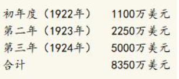

# **无线通信员戴维·萨尔诺夫**

戴维·萨尔诺夫于1891年出生在俄国明斯克的一个小村庄，他是犹太裔俄罗斯人。萨尔诺夫从小就展现出过人的商业天赋。最初，他只是一名普通的卖报童，但很快他就开始向杂货店和商店批发报纸。他还优先将300份报纸分给6个报童，让他们在街头销售，而自己则赚取手续费。在父亲病情恶化之后，身为长子的萨尔诺夫扛起了养家糊口的重担。

萨尔诺夫早在1915年就向上司建议说“无线电音乐盒”（Radio Music Box）会成为热销商品。萨尔诺夫所说的无线电音乐盒就相当于收音机。他在20世纪20年代就看到了电视的未来，还曾预言电视机将成为家庭的一部分。

1912年4月14日，泰坦尼克号撞上冰山，当时萨尔诺夫在约翰·沃纳梅克电台担任无线通信员。这个电台位于纽约曼哈顿大厦的顶楼，是当时世界上最先进的电台之一。当天，值夜班的萨尔诺夫在耳机里偶然收听到距离2200千米以外的奥林匹克号发来的紧急信号：“泰坦尼克号撞上冰山，正在迅速下沉。”

时任美国总统的威廉·塔夫脱下令除了沃纳梅克电台之外的其他通信站全都暂时关闭。有亲朋好友搭乘泰坦尼克号的人们全都涌到沃纳梅克百货，就为了第一时间知道萨尔诺夫接收到的信息。

萨尔诺夫也感到自己身上的责任重大，连续三天三夜寸步不离地坚守在电台旁接收信息并实时转发。由于他的英雄事迹，他被提升为首席检查员和总经理 Edward J. Nally 的得力助手。

第二年，即 1913 年，21 岁的萨尔诺夫 参加了一个名叫霍华德·阿姆斯特朗 (Howard Armstrong) 的产品展示。  他想出了如何制造三极真空管、产生平滑的无线电波。 相比之前的方法，利用三极管可将信号放大 5,000 倍。萨尔诺夫随后邀请阿姆斯特朗在马可尼公司的一座大楼里展示他的设备，他们在一个寒冷的小屋里连续呆了 13 个小时，接收来自世界各地的信号。 多年后，萨尔诺夫说： “无论外边多么的寒风凛冽，但当我第一次听到来自大西洋和太平洋彼岸的信号时， 内心涌现的激动热火将寒风点燃。” Sarnoff 试图让 Marconi 公司购买该专利，但老板们不同意。  可能是因为觉得他们并不是真空三极管的原始发明者，也没有相应的专利。  Sarnoff 和 Armstrong 很失望，但他们仍然是朋友。

**萨尔诺夫的7500万计划**

1915年，萨尔诺夫在写给马可尼无线电报公司的副总裁兼总负责人爱德华·纳里的信中第一次提到了无线电音乐盒的概念。当时萨尔诺夫24岁，他在信中对无线电音乐盒市场发展的可能性与无线广播的未来发展进行了如下的设想：我有一个使无线电成为像钢琴和留声机那样的“家庭用品”的开发计划。这个计划就是通过无线电将音乐发送到各家各户……无线电接收机只是一个单纯的“无线电音乐盒”，可以调整多个不同的波段，但必须设计成只需要按一个开关或者一个按钮就能切换波段的设备。萨尔诺夫还提出，适合进行广播的节目包括音乐会、歌剧、歌曲、国家大事、棒球比赛的分数等，这些就相当于新闻。此外，无线电音乐盒的价格在实现批量生产之后能够控制在一套75美元左右，是大众比较能够接受的价格。

当时美国有1500万个家庭，如果7%的也就是大约100万个家庭购买的话，就可以创造大约7500万美元的销售额。萨尔诺夫的计划是第一年生产10万套，销售额达成750万美元；第二年生产30万套，销售额成长到2250万美元；第三年生产60万套，销售额进一步达到4500万美元，这样销售额累积达7500万美元。

看似完美的计划必被拒绝。

纳里也是一名优秀的经营者，但在当时的管理层看来，萨尔诺夫的计划简直就是痴人说梦。最终，管理层以为时尚早为由拒绝了萨尔诺夫的提案。但萨尔诺夫并没有放弃，在一战后他又再次启动了无线电音乐盒的计划。

**哪里有绝对的自由，美国当初对英国也有股份和国营管制**

第一次世界大战结束后的1919年，美国政府尤其是美国海军意识到国家企业在无线通信领域的必要性。当时，美国无线电市场的代表企业只有马可尼无线电报公司，但这是一家英国资本的公司。于是，在美国海军的授意下，萨尔诺夫同公司的实际负责人纳里和通用电气（GE）的代表们一同前往英国，要求马可尼公司转让股份。

1919年12月1日，美国无线电公司（Radio Corporation of America，RCA）成立。RCA最大的股东是通用电气，美国电话电报公司、西屋电气公司以及联合果品公司等拥有无线技术专利的公司成为其联名股东。RCA的公司章程规定，公司高层干部必须是美国人，外国资本不能持有超过20%的股份，而且管理层中必须有海军的代表。对于美国的民营企业来说，这种具有浓厚国营色彩的制度可以说是非常罕见。萨尔诺夫在RCA中担任营业部长。

我国对外资有哪些具体管制？

我国实行外商投资准入负面清单制度，明确列出禁止和限制外资进入的领域。

自2024年起，中国已取消银行保险机构的外资股份比例限制，外国资本可以持有银行保险机构100%的股权。负面清单之外的领域，按照内外资一致原则实施管理。2024年版负面清单限制措施进一步缩减至29条。

根据最新的《外商投资准入特别管理措施（负面清单）（2024年版）》，以下是一些具体的限制领域及举例：

### 农、林、牧、渔业

- 小麦新品种选育和种子生产的中方股比不低于34%，玉米新品种选育和种子生产须由中方控股。
- 禁止投资中国稀有和特有的珍贵优良品种的研发、养殖、种植以及相关繁殖材料的生产。
- 禁止投资农作物、种畜禽、水产苗种转基因品种选育及其转基因种子（苗）生产。

### 采矿业

- 禁止投资稀土、放射性矿产、钨勘查、开采及选矿。

### 电力、热力、燃气及水生产和供应业

- 核电站的建设、经营须由中方控股。

### 批发和零售业

- 禁止投资烟叶、卷烟、复烤烟叶及其他烟草制品的批发、零售。

### 交通运输、仓储和邮政业

- 国内水上运输公司须由中方控股。
- 公共航空运输公司须由中方控股，且一家外商及其关联企业投资比例不得超过25%，法定代表人须由中国籍公民担任。
- 民用机场的建设、经营须由中方相对控股，外方不得参与建设、运营机场塔台。
- 禁止投资邮政公司、信件的国内快递业务。

### 信息传输、软件和信息技术服务业

- 电信公司：限于中国入世承诺开放的电信业务，增值电信业务的外资股比不超过50%（电子商务、国内多方通信、存储转发类、呼叫中心除外），基础电信业务须由中方控股。
- 禁止投资互联网新闻信息服务、网络出版服务、网络视听节目服务、互联网文化经营（音乐除外）、互联网公众发布信息服务。

### 租赁和商务服务业

- 禁止投资中国法律事务（提供有关中国法律环境影响的信息除外），不得成为国内律师事务所合伙人。
- 市场调查限于合资，其中广播电视收听、收视调查须由中方控股。
- 禁止投资社会调查。

### 科学研究和技术服务业

- 禁止投资人体干细胞、基因诊断与治疗技术开发和应用。
- 禁止投资人文社会科学研究机构。
- 禁止投资大地测量、海洋测绘、测绘航空摄影、地面移动测量、行政区域界线测绘，地形图、世界政区地图、全国政区地图、省级及以下政区地图、全国性教学地图、地方性教学地图、真三维地图和导航电子地图编制。

### 教育

- 学前、普通高中和高等教育机构限于中外合作办学，须由中方主导。
- 禁止投资义务教育机构、宗教教育机构。

### 卫生和社会工作

- 医疗机构限于合资。

### 文化、体育和娱乐业

- 禁止投资新闻机构（包括但不限于通讯社）。
- 禁止投资图书、报纸、期刊、音像制品和电子出版物的编辑、出版、制作业务。
- 禁止投资各级广播电台（站）、电视台（站）、广播电视频道（串）、广播电视传输覆盖网（发射台、转播台、广播电视卫星、卫星上行站、卫星收转站、微波站、监测台及有线广播电视传输覆盖网等），禁止从事广播电视视频点播业务和卫星电视广播地面接收设施安装服务。
- 禁止投资广播电视节目制作经营（含引进业务）公司。
- 禁止投资电影制作公司、发行公司、院线公司以及电影引进业务。
- 禁止投资文物拍卖的拍卖公司、文物商店和国有文物博物馆。
- 禁止投资文艺表演团体。

这些措施旨在保障国家经济安全、社会稳定以及特定领域的健康发展，同时为外资提供明确的准入指引。

只能说，控的好，清单是必要的。美国在工业革命开始时，他们也有限制。

---

1921年，30岁的萨尔诺夫成为RCA的总经理，他终于可以启动被搁置许久的无线电音乐盒计划了。虽然RCA比KDKA电台迟了半年进入市场，但还有迎头赶上的可能。

萨尔诺夫发现美国人十分喜爱拳击比赛，于是他计划实况转播杰克·登普西与乔治·卡尔庞捷的重量级拳王争霸赛。萨尔诺夫向RCA申请了1500美元经费，在泽西市的比赛现场设置了实况转播基地。此外，他还在美国中部以及东部大西洋一侧的电影院里设置了无线电接收机，以便那些自己没有收音机的人也能收听到这场拳击界的“世纪大战”。据说，有40万人通过无线广播收听了这场比赛。当登普西在第四回合KO卡尔庞捷取得胜利之后，当时正在伦敦休假的RCA总裁纳里立刻给萨尔诺夫发了一封电报，电报的内容是“你们创造了历史”。

RCA广播事业发展的速度，也直接表现在其收音机的销量上：

萨尔诺夫曾经预计收音机的销售额将在3年间达到7500万美元，但实际情况甚至超出了他的预想。美国购买收音机的家庭越来越多，1922年有6万户家庭拥有收音机，到了1924年这个数字就增加到了125万，1929年更是激增到1025万。

原来，他设想，美国有1500万个家庭，如果7%的也就是大约100万个购买。真是情况是，有1025万家庭购买，2/3的家庭都会选择盒子音乐机。

WLS Show Boat——娱乐内容先行

20世纪20年代中期，出现了将音乐和谈话融合在一起的节目，比如芝加哥广播电台WLS播放的“WLS Show Boat”就是其中的代表。WLS是西尔斯·罗巴克百货公司于1924年成立的广播电台，WLS是“World's Largest Store”的缩写。这个节目面向的听众群体是西尔斯·罗巴克百货在中西部乡村地区的顾客们。

“WLS Show Boat”一经播出就大受欢迎，这个每周五晚上的广播，其实就是对航行在美国河流上的演出船（也被称为水上戏班）表演的节目进行转播。船长负责主持整个节目，水手们则配合演出，主要的节目内容由乐器演奏和演唱组成。广播电台在节目演出的同时进行转播，相当于现在所说的现场直播。

前面提到过的WLS电台就是西尔斯·罗巴克百货公司出资运营的，目的在于通过电台广播宣传自己的产品，吸引更多的顾客前来购买。在互联网出现之后，如今很多企业都开设了自己的官方网站，和以前的企业开设广播电台的性质是一样的。

不同的是，后来的官方网站只是官方网站，并没有节目。

西尔斯·罗巴克百货公司通过WLS电台向中西部乡村地区的顾客传播音乐和娱乐内容，旨在吸引顾客的关注，提升品牌知名度和美誉度。这种娱乐节目能够增强顾客与品牌之间的联系，让顾客在享受节目内容的同时，对西尔斯·罗巴克百货产生更深厚的情感认同，从而间接促进销售。节目中有“Maple City Four”等乐队的表演，以及“船长”和“大副”之间的幽默互动。这些内容为听众提供了轻松愉悦的娱乐体验，缓解了日常生活的压力。

广告是主要的也是唯一的收入的来源

1922年，电话市场巨头的美国电话电报公司进军无线电市场，该公司旗下的WEAF广播电台的最大特点是通过播放广告来获取收益（到了1927年，几乎所有的广播电台都将播放广告作为主要的收入来源）。

1928年由宝洁公司赞助的家庭喜剧《阿莫斯和安迪》开播时，美国有1/3的人都守在收音机前收听节目；而宝洁借此机会宣传的白速得牙膏也取得了惊人的销量。广告仍然时

反垄断

美国电话电报公司却在1926年将自己的广播电台卖给了RCA，而RCA则在同年成立了专门的广播公司——全国广播公司（National Broadcasting Company，NBC），进而垄断了美国的广播事业。不过，后来NBC的垄断行为受到美国政府的限制，于是分割出了美国广播公司（American Broadcasting Company，ABC）。

中国的《反垄断法》于2008年8月1日正式生效，是中国规范市场竞争行为、维护市场公平竞争环境的重要法律。

**阿里巴巴“二选一”案**

阿里巴巴集团自2015年以来滥用该市场支配地位，对平台内商家提出“二选一”要求，禁止平台内商家在其他竞争性平台（例如京东、拼多多、唯品会）开店或参加促销活动，并采取多种奖惩措施保障“二选一”要求执行，以获取不正当竞争优势。

阿里巴巴因强迫商家在平台之间“二选一”被罚款182.28亿元人民币，这是中国反垄断执法史上罚款金额最高的案件之一。

2015年2月14日，滴滴打车与快的打车宣布战略合并。有人认为这个合并并不违法。滴滴与快的合并后，虽然在网约车市场占据较大份额，但市场竞争并未完全消失。一方面，传统出租车行业仍然是重要的出行选择；另一方面，美团等新进入者也在网约车市场展开竞争。因此，合并后的滴滴并未形成绝对的市场支配地位。

对广告的态度

萨尔诺夫对广播广告持否定的态度，他认为广播公司应该以广告之外的收益来维持运营。因为广播属于公共事业，任何人都可以收听，听众必须能够免费收听广播节目，所以广播事业者要自己想办法筹集运营费用。德福雷斯特也认为广告影响了广播节目的品质，有些广播公司忙于赚取利润，疏忽了节目的制作质量。

后来成为NBC强大竞争对手的哥伦比亚广播公司（Columbia Broadcasting System，CBS）的总裁威廉·佩里对广告十分支持。佩里认为，广播需要花费大量的资金，但政府并没有给予相应的支持，因此广播公司只能依赖广告来获取资金。

萨尔诺夫与德福雷斯特和佩里的看法分别代表了广播发展的两种可能性方向，都有实现的可能性。如果国家控制了无线电广播，那么在广播节目中或许就不会允许有广告出现。最初以国营形式开始的日本广播事业就是如此。

但是有时候，即使国家控制的，也有广告。

**6万块的奢侈品——新东西开始都较贵**

子之中，使其看起来和家具更加搭配。西屋电气公司推出的收音机“AERIOLA GRAND”拥有豪华的桃花心木外壳，全套价格高达409.5美元，换算成现在的价格大约为6万元人民币。当时这种高级的收音机可以说是上流家庭的象征。同时，收音机的体积也开始向小型化的方向发展，甚至出现了可以手持的小型收音机。

AERIOLA GRAND是一款台式接收机，尺寸为12英寸（高）×15英寸（宽）×16英寸（深），属于较大的家用设备。

广播节目和收音机的出现，自然而然地改变了人们的生活方式，比如很多家庭主妇开始一边听肥皂剧一边做家务。后来，随着电视的普及，人们更习惯一边看电视一边做家务，但这种生活方式的起源都是从收音机时代开始的。

人类的生活方式只能填充，并不能改变。后来做家务的这个习惯，改成了听App。

美国这个国家的有趣之处在于，每当有新技术出现的时候就会第一时间开始使用，遇到问题则解决问题。年轻人就是如何。

