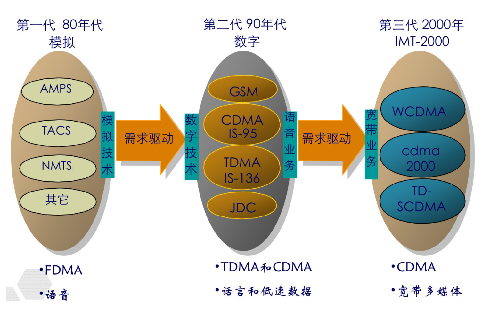
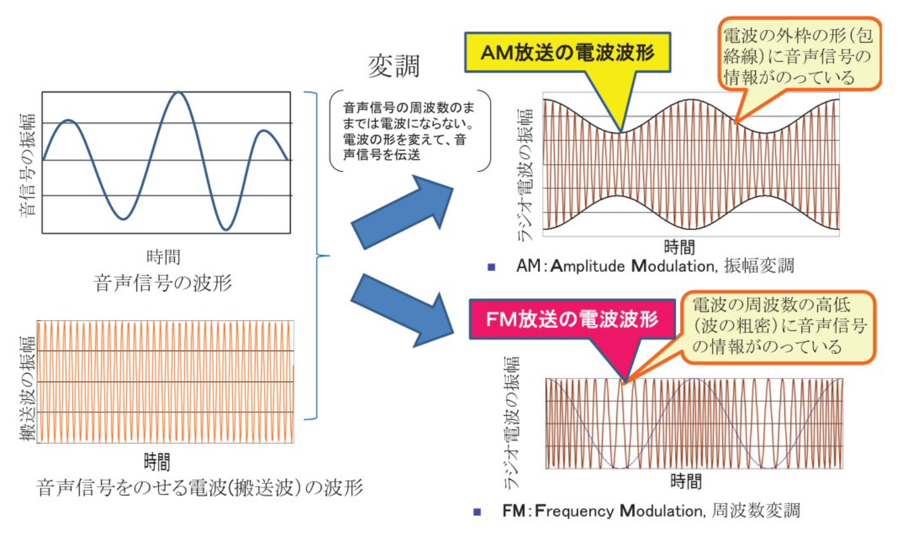
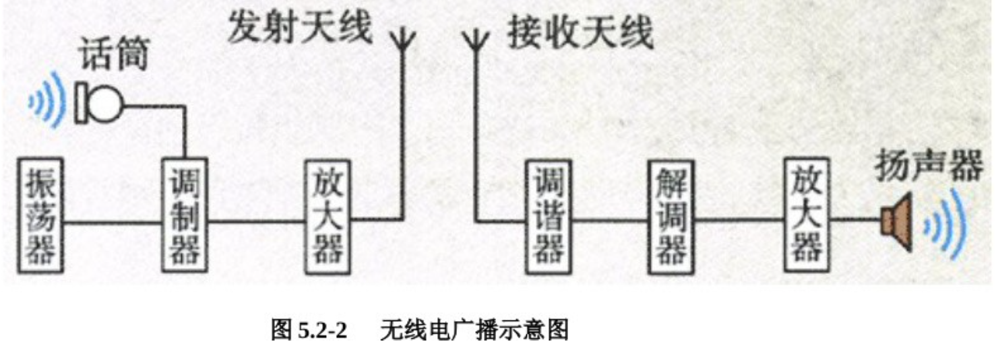
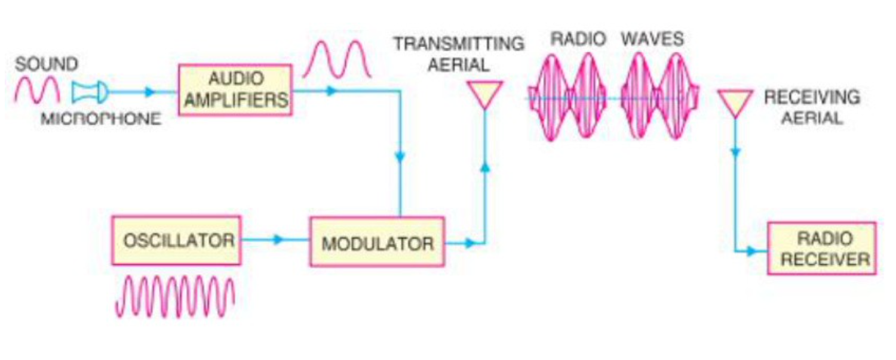

### 计算机的诞生

三次技术变化浪潮

不过，21世纪的数字化信息技术和19世纪的数字化信息技术之间存在着巨大的差异。全新的数字化信息技术将所有信息都通过“binary digit”（二进制数字）——简称“bit”（比特）来表示。比特代表0和1，所有的信息都可以还原为0和1。正如原子是物质的最小单位一样，比特也是信息的最小单位。通过比特来表示所有的信息，就是21世纪数字化信息技术的最大特点。也就是说，现在正在出现的第三次浪潮，虽然和第一次浪潮一样都属于数字信号信息技术，但却与视觉通信和电报具有完全不同的特征。

```
用户提到的三次信息技术浪潮，本质上是信号处理方式的演变:从离散的数字信号到连续
的模拟信号，再到全面数字化的比特信号。以下是三次变革的原理与特点，结合资料中的
关键信息进行阐述:
```

第一次浪潮:**19** 世纪数字信号技术的开端

```
核心原理:用离散的物理状态(如电流的通断)表示信息。
典型技术:电报(摩尔斯电码)、早期数字通信设备。
```

实现方式:

二进制编码:将字母、数字转化为简单的通断信号组合。例如，摩尔斯电码中“点”(短 脉冲)和“划”(长脉冲)的组合代表不同字符 6。

机械传输:通过开关电路控制电流的导通与断开，远距离传递编码后的信号。例如，电 报机通过按键产生电脉冲，接收端通过电磁铁驱动纸条记录点划符号[9]。

特点: 抗干扰性差:信号只能简单区分“有”和“无”，容易受线路噪声影响。

效率低:信息容量小，传输速度慢(依赖人工编码和解码)。 意义:首次实现远距离快速通信，为后续技术革命奠定基础[10]。 第二次浪潮:**20** 世纪模拟信号技术的繁荣 核心原理:用连续变化的物理量(如电压、频率)直接模拟原始信号。

内容为 AI 生成，可能不准确，请谨慎参考

典型技术:电话、广播、电视(模拟制式)、第一代移动通信(如 AMPS)[8]。



实现方式: 直接模拟:将声音、图像转化为连续的电信号。例如，电话话筒将声波振动转化为电流

强度变化，接收器再将电流还原为声音[1]。

调制技术:为解决低频信号传播问题，将声音信号“搭载”到高频载波上。 内容为 AI 生成，可能不准确，请谨慎参考

调幅(**AM**) :通过改变载波振幅传递信息(如广播电台)。

调频(**FM**) :通过改变载波频率传递信息(如高保真音乐广播)[1]。

特点:

高保真:连续信号能更真实地还原声音和图像。

易受干扰:传输中任何噪声都会叠加到信号上(如电话杂音、电视雪花)。

日本企业的崛起:

20 世纪 70-80 年代，索尼、松下等企业在模拟电子设备(如收音机、录像机)领域占据 主导地位，推动消费电子产业的爆发[[资料未直接提及，需推测]]。

局限性:模拟信号无法高效压缩和纠错，难以适应复杂数据处理需求[8]。 第三次浪潮:**21** 世纪全面数字化(比特革命)

核心原理:所有信息(文字、声音、图像)均转化为二进制数字(**0**和**1**) ，即“比特” (bit)。

典型技术:计算机、互联网、5G、物联网、人工智能[4][5][7]。 实现方式:

1.数字化采样:将连续信号(如声音)按固定间隔测量并量化成离散数值。例如，CD 音频 每秒采样 44,100 次，每次采样值转化为 16 位二进制数[9]。

2.编码与压缩:通过算法(如 MP3、JPEG)减少数据量，提高传输效率。 3.数字传输:利用光纤、无线通信等技术传输比特流，通过纠错码(如 5G 的 LDPC 码)抵

抗干扰[4][8]。
 与 **19** 世纪数字信号的区别:

全面性:19 世纪的数字信号仅用于简单编码(如电报)，而现代数字化覆盖所有信息类 型。

内容为 AI 生成，可能不准确，请谨慎参考

智能化:通过计算机处理，实现数据存储、分析和实时交互(如视频通话、自动驾驶) [5][7]。

技术突破: 集成电路:微电子技术使数十亿晶体管集成到芯片中，处理能力指数级提升。 网络化:互联网和物联网(IoT)将终端设备互联，形成“万物数字化”生态[4][5]。 意义: 高效与可靠:数字信号可通过纠错码修复传输错误，抗干扰能力远超模拟信号。 无限复制:信息可无损复制和传播(如数字音乐 vs 磁带翻录)[14]。

总结对比表

| 维度       | 第一次浪潮(**19** 世 纪) | 第二次浪潮(**20** 世 纪) | 第三次浪潮(**21** 世 纪)       |
| ---------- | ------------------------ | ------------------------ | ------------------------------ |
| 信号类型   | 离散数字信号(通 断)      | 连续模拟信号(波 形)      | 高密度二进制比特 (0/1)         |
| 典型技术   | 电报、摩尔斯电码         | 电话、广播、模拟 电视    | 计算机、互联 网、5G、IoT       |
| 信息处理   | 人工编码/解码            | 直接模拟原始信号         | 数字化采样、压 缩、纠错        |
| 抗干扰能力 | 弱                       | 弱(噪声叠加)             | 强(纠错码修复)                 |
| 应用场景   | 简单文字传输             | 语音、广播、电视         | `多媒体、实时交 互、人工智能 ` |

```
补充视角:技术演变的驱动力
```

内容为 AI 生成，可能不准确，请谨慎参考

1.需求升级:从传递文字(第一次)到追求音视频质量(第二次)，再到实时交互与大数 据处理(第三次)[8][12]。

2.材料与工艺:半导体技术(如集成电路)和光纤通信的突破，使数字化从理论变为现实 [4][7]。

3.社会变革:数字化推动全球经济一体化(如跨境电商)、生活方式变革(如远程办公) [6][15]。

通过这三次变革，信息技术从“机械开关”发展到“比特宇宙”，彻底重构了人类社会的运行 方式。


调制和解调的原理

调制和解调是无线通信中将声音信号搭载到电波上传输的关键技术，其原理可以用“搭便车”来形象理解。

调制原理：原始声音信号频率低（如人声在20Hz-20kHz），直接发射难以远距离传播。调制就像给声音“叫一辆快递车”——将声音信号叠加到高频载波（如100MHz的无线电波）上。

具体有调频调幅两种常见方式：

调制和解调是无线通信中将声音信号搭载到电波上传输的关键技术，其原理可以用“搭便 车”来形象理解:

调制原理:

原始声音信号频率低(如人声在 20Hz-20kHz)，直接发射难以远距离传播[1][17]。调制就 像给声音“叫一辆快递车”——将声音信号叠加到高频载波(如 100MHz 的无线电波)上。 具体有两种常见方式:

内容为 AI 生成，可能不准确，请谨慎参考

1.调幅(**AM**) :让载波的“音量”(振幅)随声音大小变化。比如大声时载波振幅变大， 小声时变小，类似波浪高低起伏[7][15]。



上图中有两种方式

2.调频(**FM**) :让载波的“音调”(频率)随声音变化。比如高音时载波频率加快，低音 时减慢，类似改变波浪的疏密程度[7][12]。

调制后的信号既能保留声音信息，又可借助高频特性远距离传输[9][17]。



解调原理:

接收端需要从高频载波中“拆包裹”提取原始声音:

1.接收与选频:天线捕获所有电波，调谐电路筛选出特定频率的调制信号(如锁定某个电 台)[11][18]。

内容为 AI 生成，可能不准确，请谨慎参考

2.解调:通过检波器(AM)或鉴频器(FM)检测载波的振幅或频率变化，剥离出低频声 音信号[16]。例如，AM 解调会提取振幅波动，还原成声音波形;FM 解调则追踪频率变化 转化为声音[5][16]。

3.放大与播放:解调后的微弱信号经放大器增强，最终由扬声器转换为可听声音[3][18]。



总结:调制是“装车发送”，解调是“拆包收货”，两者配合实现了声音信号的无线传输。 AM 和 FM 如同不同的“包装方式”，分别通过改变载波的振幅或频率来搭载信息[7][15]


IBM

何乐礼的制表机得到了社会的高度肯定，1890年被美国用于国税调查。何乐礼也在华盛顿成立了公司，主要向政府、保险公司以及铁路公司出售制表机。这家公司后来成为计算制表记录公司（Computing Tabulating Recording Company，CTR），并迎来了曾经在国家收银机公司（National Cash Register Company，NCR）担任高管的托马斯·沃森出任总裁。1924年，CTR将公司名称变更为International Business Machines，也就是我们现在非常熟悉的IBM。

第一台完备的计算机

ENIAC重达30吨，需要大约167平方米的空间放置，内部搭载有1.7468万个真空管，完全是一个庞然大物。ENIAC在运转时会消耗大量的电力，据说当打开ENIAC开关的时候，整个费城的电灯都会随之变暗。一名熟练的计算员使用机电式计算器计算60秒内的弹道轨迹需要花费20个小时的时间，而ENIAC只需要30秒就能完成计算。