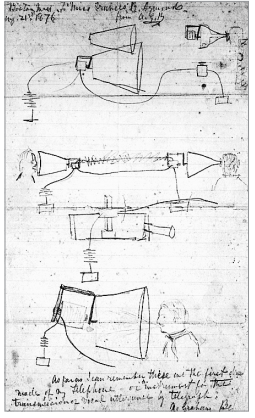

# 互联网发展简史

假如互联网彻底瘫痪了，你担负起了重建世界互联网的使命，你会怎么做？

## 旧目录

以下目录是应杜金房邀请第一次撰写《Web开发》拟定的目录。

在《大道至简》第九章之前，已经有Git、HTTP协议、Html/XML、JSON的内容的介绍。重写时，应该借鉴《耶鲁简明科学史》，注重Web发展的历史，减少知识的说教。前面已经有的内容，只需要提及以下即可。

## **技术发展关键事件**  

#### **1836年**  互联网的鼻祖-电报：信息时代的开始：上帝创造了何等的奇迹
- [电报](18.电报.md)诞生（库克和惠斯通申请专利，莫尔斯与维尔申请专利），奠定远程通信基础，采用类似二进制的点线编码（莫尔斯码）。 

#### **1858-1866年**  
- 跨[大西洋海底电缆](18.大西洋海底电缆.md)铺设，实现欧美快速通信，现代互联网仍依赖海底光缆。

1858年，美国实业家赛勒斯·菲尔德成功铺设了纽芬兰与爱尔兰之间横跨大西洋的海底电报线路。时任美国总统布坎南与英国女王维多利亚即通过这条线路进行了交流。但两个月后这条线路就失效了，直到1866年美国和英国之间才真正实现稳定的电报通信。在这件事情中，汤姆森居功甚慰。

#### 1843传真

传真什么，需要先排好字母，也可以传输别的，例如图像。

发明自动电解式记录电报机的人是英国的亚历山大·拜恩，他在1843年11月27日取得了这项发明的专利。莫尔斯的电报机在1844年才成功运转，由此可见拜恩取得这项专利的时间有多么早。这款装置需要用到能够同时移动的金属针和通电后就会变色的纸。但遗憾的是，Pantelegraph的传真服务在1870年就停止了，似乎是受同年爆发的普法战争影响。

首先，通信双方都要准备由电报线连接的金属针，而且要保证双方的金属针能够上下左右同时移动；然后，发送信息的一方将金属制的字母放在木制的模板上，每个金属字母都连着导线；最后，接收信息的一方则将通电后就会变色的具有电解性的纸（类似于感热纸之类的东西）覆盖在连着导线的金属板上，准备工作这样就完成了。

发送信息的一方在放有金属字母的木制模板上移动金属针，当金属针接触到木制模板时没有电流通过，但接触到金属字母时就会有电流通过。而接收信息的一方的金属针会同时移动，当有电流通过时，覆盖在金属板上的纸张就会变色，而没有电流通过时纸张则没有变化。这个过程连续起来，接收信息的一方就能够收到对方发来的信息。

#### **1876年** -通过电力传递声音
- 电话发明（亚历山大·格雷厄姆·贝尔），为互联网底层交换系统奠定基础。

因为亚历山大·格拉汉姆·贝尔和伊莱沙·格雷分别申请电话专利的时间是在1876年2月14日。贝尔只因为不到3个小时的时间差在与格雷的专利竞争中获胜的故事，现在可以说是家喻户晓了。

1876年3月10日，贝尔的助手托马斯·沃森通过电话听到了这句著名的话。但根据贝尔本人的记录，他说的是“沃森先生，请来一下，我想见你”（Mr. Watson, come here, I want to see you）。可能是因为当时电话的性能有限。

英国著名物理学家、被授予“开尔文勋爵”称号的威廉·汤姆森，也在会场听到了哈姆雷特的这句名言，他盛赞道：“对于如此伟大的发明，我们只能在心底发出赞叹。”

英国著名物理学家、被授予“开尔文勋爵”称号的威廉·汤姆森，也在会场听到了哈姆雷特的这句名言。

贝尔于1877年成立了贝尔电话公司，这家公司就是现在美国最大的通信企业——美国电话电报公司（AT＆T）的前身。哈伯德担任总裁，贝尔担任电力技师，沃森担任生产部门负责人。

==西联坐等贝尔做大-**世纪大误判**==

1876年，哈伯德打算将电话专利以10万美元的价格卖给西联公司。西联电报公司于1851年在纽约成立，1856年更名为西联公司（WU）。最初，西联公司只是美国众多电报公司中的一家，但后来，它接连收购了其他电报公司，旗下拥有4000多家电报局，几乎垄断了美国的电报事业。西联公司的总裁威廉·奥顿断然拒绝了哈伯德的专利转让。但讽刺的是，后来在电话事业上大获成功的AT＆T获得了西联公司的经营权。因此，奥顿的决策也被称为“世纪大误判”。

因为话筒和听筒是同一个设备，所以使用时要先把设备放在嘴边大声说话，然后再把这个设备放在耳朵上仔细听，整个通话过程中要不断地重复这一步骤。

**1. 腾讯QQ：从濒临倒闭到社交帝国**

**（1）早期困境：差点被卖掉**

- **1999年**，腾讯推出OICQ（后改名QQ），但由于缺乏盈利模式，公司资金紧张。
- **2000年互联网泡沫破裂**，腾讯陷入困境，马化腾曾尝试以**100万元人民币**的价格出售QQ，但无人接手7。
  - **深圳电信**曾有意收购，但只愿出价60万元，腾讯拒绝。
  - **联想、新浪、搜狐**等公司均未看好QQ的未来。

（2）**误判的代价**

- 如果当时某家公司收购了QQ，今天的中国互联网格局可能完全不同。
- **腾讯最终依靠增值服务（QQ秀、会员）和游戏（如《穿越火线》《英雄联盟》）崛起**，成为全球市值最高的科技公司之一。
- **对比西联公司**：西联错失电话业务，最终被AT&T吞并；而错失QQ的公司（如新浪、搜狐）逐渐衰落。

---

**（1）摩托罗拉错过收购华为（2003年）**

- **背景**：2003年，华为因CDMA和小灵通业务受挫，任正非决定以**80亿美元**将华为设备业务卖给摩托罗拉1。
- **关键转折**：摩托罗拉CEO候选人**迈克·扎菲罗夫斯基**支持收购，但最终董事会选择了**爱德华·桑德尔**，后者认为“华为不值这个价”1。
- **结果**：
  - 摩托罗拉错失华为，后来在通信设备市场衰落，最终被谷歌收购又转卖联想。
  - 华为成长为全球最大通信设备商，2023年营收超9000亿元。

**（2）雅虎错失谷歌（1998年）**

- **1998年**，谷歌创始人拉里·佩奇和谢尔盖·布林曾想以**100万美元**将PageRank技术卖给雅虎，但雅虎拒绝7。
- **2002年**，雅虎再次有机会以**50亿美元**收购谷歌，但仍未行动。
- **结局**：
  - 谷歌崛起，市值一度突破**2万亿美元**。
  - 雅虎衰落，2017年被威瑞森收购，核心业务几乎消失。

**（3）诺基亚拒绝Android（2007年）**

- **2007年**，谷歌希望诺基亚采用Android系统，但诺基亚CEO**康培凯**坚持塞班系统，认为“Android太开放，难以控制”8。
- **结果**：
  - 诺基亚手机业务崩溃，2013年被微软收购。
  - Android成为全球最大移动操作系统，市场份额超70%。

**（4）柯达发明数码相机却放弃市场（1975年）**

- **1975年**，柯达工程师**史蒂夫·萨松**发明了第一台数码相机，但公司高层认为“会冲击胶卷业务”，未大力推广7。
- **结局**：
  - 2012年柯达破产，数码相机市场被索尼、佳能、尼康占据。

**（5）Blockbuster拒绝收购Netflix（2000年）**

- **2000年**，Netflix创始人**里德·哈斯廷斯**提出以**5000万美元**将公司卖给Blockbuster（百视达），但Blockbuster CEO**约翰·安蒂奥科**嘲笑Netflix的订阅模式7。
- **结局**：
  - Blockbuster在2010年破产，Netflix成为全球最大流媒体平台，市值超**2000亿美元**。

#### 1878年-贝尔电话

但要想电话提高网络外部性，某个网络参与者与其他参与者之间必须连接1对n的专用线路，这就显得非常没有效率。为了解决这一问题，就必须用到电话交换机。接线员可以根据使用者的要求，通过电话交换机将线路连接到对方的电话上。在纽黑文开展电报事业的乔治·科伊于1878年发明了第一台电话交换机，因此科伊也成为世界上第一个电话接线员。

- **基本组成**：主要由交换机架、接线板、接线员操作台等组成。
- **工作过程**：
  - **用户呼叫**：当用户拿起电话听筒时，电话机通过线路向交换机发送一个信号，接线员会听到一个铃声或看到一个指示灯亮起，表明有用户需要通话。
  - **接线员操作**：接线员通过操作台上的插孔和插头，将呼叫用户的线路连接到交换机的接线板上。然后询问用户要拨打的电话号码。
  - **建立连接**：接线员根据用户提供的号码，找到被叫用户的线路，并将两条线路通过交换机的接线板连接起来。这样，主叫用户和被叫用户之间就建立了一条临时的通信线路，可以进行通话。
  - **通话结束**：通话结束后，用户挂断电话，线路自动或由接线员手动断开连接，释放交换机的线路资源，以便进行下一次通话。

这种人工电话交换机的出现，极大地提高了电话通信的效率，解决了之前电话之间需要一对一专用线路的问题。

**贝尔电话机原理？**——伟大的贝尔

1922年夏，贝尔因糖尿病在加拿大新斯科舍省布雷顿的家中去世，在举行贝尔的告别仪式时，北美地区的电话停止运行1分钟，以表示对这位电话之父的悼念。

贝尔利用电磁感应原理，通过振动膜片和电磁铁之间的相互作用，将声音的振动转换为电流变化。**首次通话**：1876年3月10日，贝尔在实验中不小心将硫酸溅到腿上，他对着送话器呼救：“沃森先生，快来呀！我需要你！”

电磁感应是指当穿过闭合电路的磁通量发生变化时，闭合电路中会产生感应电流的现象。

看得见的声音

1872年，贝尔受邀来到美国。他在波士顿开办了一所聋人学校。两年以后，贝尔传承了祖辈的事业，成为第三代语言学教师，他更进一步完善了父亲的发明——音标字母（phonetic alphabet），过去为摩霍克语发明语音符号的经验使他很快地创造出了一种“看得见的声音”的英语。它由30个符号组成，每个符号分别表示不同的唇、齿、舌的位置及呼吸的方法。只要看到符号，即使听不见，也能把声音发出来。渐渐地，聋人能依照这些符号开口说话了。这一成果引起了一位富商的注意。他有个聋哑女儿梅布尔，贝尔用这种方法教梅布尔发声，使她学会了说话。1877年7月11日，贝尔与梅布尔相爱后结为夫妻。

贝尔在看到电报后，想让电流传递声音。

贝尔电话的发明事出偶然，它是从一片簧片引起的。1875年6月的一天，贝尔和他的助手沃森在地下室做实验。他和助手分别在两个相邻的房间里，他们想模仿电报机收发密码，利用电流来传播声音。沃森用金属板拍出声音，把声音变成强弱电流，传送到贝尔的房间里，贝尔再用电磁铁，把电流变成声音接收。按照现在的眼光，这个实验的原理非常简单，但他们总是无法实现所希望实现的效果。

一天正在做实验的时候，沃森的一块簧片被磁铁卡住不动了，他下意识地用手指弹了弹这块簧片，簧片快速振动，发出一种“嗡”的特殊声音。沃森忽然看到贝尔冲了进来，一边喊道：“你刚才做什么了，再做一遍！”他们发现，发讯机的簧片被弹动时，所发出的声音能被收讯机接收到。一再试验，屡试不爽。这是一个关键的现象，依照这个现象，他们把大小不同、高低不同的声音由发讯机通过电线传到收讯机，再把这些“振动”变成各种簧片的“振动”，语音果然发了出来，电话就这样诞生了。

电话交换机——本城电话簿

电话交换机的诞生使电话的使用者只要接通与电话局的线路，就可以与所有的使用者进行通话；而电话公司则可以用最少的线路提高网络外部性。可以说，电话交换机是具有极大划时代意义的发明。

加入电话网络的人越来越多，自己不认识的人和店铺也越来越多，如果能够有一本书将所有的电话使用者都记录在上面就方便得多了。科伊在发明电话交换机的那一年，制作了一份只有一页的使用者名单，这就是全世界第一本电话簿。

当时的电话没有电话号码，因此在科伊的电话簿上也没有电话号码。使用者只需要打给接线员，告诉要联系的人的姓名，接线员就会将线路转接过去

1879年使用电话号码

在1879年秋季，马萨诸塞州洛厄尔的医生摩西·格里利提出用号码来识别电话的方法，他提出的这一方法立刻被电话局采用。

年轻女性在技术革新中更有耐心，职业地位也在不断提升。

每台交换机都要配备一名接线员，担任接线员的几乎都是十几岁的青年男性，但他们对无聊的接线工作感到非常厌烦，经常与使用者发生争执。于是到了19世纪80年代初，接线员几乎都被换成了性格更加温和的年轻女性。

**老电话，用之前，要先摇一下，为什么？**

老式电话使用前需要摇一下，是因为其内部装有磁石式发电机，通过摇动手柄产生电压信号，用于通知总机或对方电话。而在通话过程中，不需要继续摇动的原因主要有以下几点：

1. **通话电流由话筒提供**：通话时，话筒内的碳粒会根据声音的振动改变电阻，从而产生话音电流，这个电流足以维持通话。因此，通话过程中不需要额外的电压信号。
2. **线路已建立连接**：在通话前摇动产生的电压信号已经完成了呼叫和线路连接的工作。一旦通话线路建立，通话双方就可以直接通过线路传输声音信号，无需再次摇动。
3. **避免干扰**：如果在通话过程中继续摇动，可能会产生额外的电压信号，干扰正常的通话，导致声音失真或中断。

贝尔最初的电话机（如1876年专利模型）不需要外部电源，其工作原理是声电转换。说话时，声音振动带动膜片和电磁铁，产生微弱的模拟电信号，通过导线传输到接收端后还原为声音。这种无源设计依赖声能直接转换，信号强度随距离快速衰减，因此早期电话的通信距离通常仅限几公里。

- 早期电话系统在用户端安装干电池（如碳锌电池），为电路提供直流电（约3-6V），增强信号强度。

- 中央供电系统：20世纪初，电话局采用共电式交换机，由中央电池组统一供电（如-48V直流），取代用户自备电池。
- 1900，被动元件之普平线圈：长距离线路需间隔安装**电感线圈**（普平线圈，1900年代）减少信号衰减，但无法真正放大信号。米哈伊洛·普平因其在电信领域的革命性贡献而闻名于世。他最重要的发明——普平线圈，解决了长距离有线电报和电话传输的难题。
- 

#### **1936年**  

- 艾伦·图灵提出“图灵机”概念，奠定计算机理论基础。

#### **1945年**  
- 冯·诺依曼提出“存储程序计算机”架构，影响现代计算机设计。

#### **1957年**  
- 苏联发射首颗人造卫星，推动美国成立ARPA（高级研究计划局），促进互联网军事研究。

#### **1969年**  
- **ARPANET**（互联网前身）建立，连接UCLA、斯坦福等四所大学。  
- Unix操作系统在贝尔实验室诞生。

#### **1971年**  
- 首个电子邮件程序发明，ARPANET扩展至15个节点。

#### **1973年**  
- 以太网概念提出，奠定局域网基础。  
- 文件传输协议（FTP）制定，实现计算机间文档交换。

#### **1974年**  
- **TCP/IP协议**由罗伯特·卡恩和温顿·瑟夫提出，成为互联网通信标准。

#### **1979年**  
- **MVC（1979）**：MVC（模型-视图-控制器）是一种软件架构模式，将应用程序分为三个主要部分，以提高代码的可维护性和可重用性。

#### **1983年**  
- **DNS（域名系统）**推出，实现域名与IP地址映射。

#### **1989年**  
- **HTTP 协议（1989-1991）**：HTTP（超文本传输协议）是用于在万维网上传输数据的基础协议。

#### **1990年**  
- **HTML 标记语言（1990）**：HTML（超文本标记语言）是创建网页的标准标记语言，用于定义网页的结构和内容。  
- **HTTP Server（1990）**：HTTP服务器是能够接收HTTP请求并返回HTTP响应的软件或硬件，是万维网的核心组件之一。  
- 首个网页服务器和浏览器（WorldWideWeb）诞生。

#### **1993年**  
- **Mosaic浏览器**发布，推动图形化网页浏览普及。

#### **1994年**  
- 中国全功能接入国际互联网（64K专线）。  
- **网景公司（Netscape）**成立，推动浏览器商业化。

#### **1995年**  
- **Apache 服务器（1995）**：Apache HTTP服务器是一个开源的Web服务器软件，用于托管和提供网站内容。  
- **JavaScript**诞生，使网页具备动态交互能力。  
- **CSS 样式语言（1996）**：CSS（层叠样式表）用于控制网页的布局和外观，使网页更加美观和用户友好。

#### **1996年**  
- **cURL（1996）**：cURL是一个用于传输数据的命令行工具和库，支持多种协议，广泛用于测试和调试网络请求。

#### **1998年**  
- **XML（1998）**：XML（可扩展标记语言）是一种用于存储和传输数据的标记语言，具有良好的可读性和可扩展性。  
- **CDN（1998）**：CDN（内容分发网络）是一种分布式网络服务，用于提高网站的加载速度和可用性。

#### **1999年**  
- **HTTP 认证机制（1999）**：HTTP认证机制用于验证客户端的身份，确保只有授权用户可以访问受保护的资源。

#### **2000年**  
- **RESTful API（2000）**：RESTful API是一种基于HTTP的设计风格，用于创建易于扩展和维护的Web服务。

#### **2001年**  
- **JSON（2001）**：JSON（JavaScript对象表示法）是一种轻量级的数据交换格式，易于阅读和编写，广泛用于Web应用程序中。

#### **2002年**  
- **Nginx 安装与配置（2002）**：Nginx是一个高性能的HTTP服务器和反向代理服务器，以其高并发处理能力而闻名。

#### **2004年**  
- **Markdown（2004）**：Markdown是一种轻量级标记语言，用于编写易读易写的纯文本格式的文档，常用于Web开发中的文档编写。

#### **2006年**  
- **jQuery（2006）**：jQuery是一个轻量级的JavaScript库，简化了HTML文档的遍历、事件处理和Ajax交互。

#### **2008年**  
- **DevOps（2008）**：DevOps是一种软件开发和运营的实践方法，强调开发和运维团队之间的协作和自动化流程。

#### **2011年**  
- **Bootstrap（2011）**：Bootstrap是一个开源的前端UI框架，提供了丰富的CSS和JavaScript组件，用于快速开发响应式网站。

#### **2012年**  
- **Webpack（2012）**：Webpack是一个模块打包器，用于将现代JavaScript应用程序的多个模块合并成一个或多个浏览器可识别的文件。  
- **OAuth 2.0（2012）**：OAuth 2.0是一个授权框架，允许用户授权第三方应用访问其资源，而无需共享密码。

#### **2013年**  
- **React（2013）**：React是一个用于构建用户界面的JavaScript库，特别适用于单页应用程序和动态内容的开发。

#### **2014年**  
- **Vue.js（2014）**：Vue.js是一个渐进式JavaScript框架，用于构建用户界面和单页应用程序。  
- **HTML5 新特性（2014）**：HTML5是HTML的第五个主要版本，引入了新的元素、属性和API，增强了网页的交互性和功能。

#### **2015年**  
- **gRPC（2015）**：gRPC是一个高性能、开源的RPC框架，支持多种编程语言，适用于微服务架构的应用程序。

#### **2020年**  
- **5G商用**加速，推动物联网与AI应用。

#### **2023年**  
- **Bun（2023）**：Bun是一个新兴的Web开发工具，旨在简化和加速Web应用程序的开发和部署。

#### **2025年（预测）**  
- **6G技术**标准制定启动，AI与量子通信可能成为核心。

