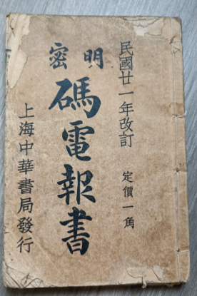

# 电报

骑马送信的驿站

CM

18世纪中期，就有一个署名“CM”（据说其名叫查尔斯·莫里森或者查尔斯·马歇尔）的人在《苏格兰杂志》上提出利用电力来传递信息的方法。这个方法需要事先准备代表26个字母的26根电线，接收信息一方的电线上都连着一个写有相应字母的纸片。发送信息的一方拿起想要传送的字母所对应的那根电线，用摩擦发电机在那根电线上通电。这样一来，接收信息一方的那根电线上连着的纸片就会被吸上来，于是接收信息的人就会知道对方想要传达什么字母。

俄国的外交官维尔·希林。他想到可以利用电表指针的摆动来表现文字，于是制作了一个由6组电线、线圈和磁针组成的通信机。每根电线的另一头连接着一个拥有黑白成对按键的键盘，发送信息的人只要按下键盘上的按钮就可以传送电流过来。

五针式铁路商用电报机（库克与惠特斯通）

当时的英国铁路公司使用一种被称为时间间隔法的方法来安排列车的运行，这种方法简单地说就是当前一趟列车出发一段时间之后再安排下一趟列车出发。但这种方法有一个非常致命的缺点，那就是一旦前一趟列车在途中因出现故障而停车，而下一趟列车却不知道前方的情况，就很有可能导致撞车事故。铁路公司为了避免出现事故，打算将时间间隔法改为当前一趟列车抵达前方车站之后再安排下一趟列车出发的距离间隔法。库克认为自己发明的电报刚好能够满足铁路公司的这一需求。

库克在1837年取得相关专利后，便向伦敦伯明翰铁路公司提出使用电报的建议，并且在尤斯顿和卡姆登镇之间（1.5千米）进行了实验。虽然实验大获成功，但伦敦伯明翰铁路公司却并没有采纳库克的建议，因为他们仍然对电报缺乏信赖。顺带一提，当时这家铁路公司的管理者是被称为“火车之父”的乔治·史蒂芬逊的儿子罗伯特。改革者的后代并不一定具有改革基因。

库克为铁路公司设计电报通讯系统。

库克在1836年辞去军队的职务后进入德国海德堡大学学习解剖学，不过偶尔也去旁听电力学的课程，并且在课堂上见到了电磁式电报机的演示。库克对这种通信装置产生出极大的兴趣，开始尝试开发同样的通信装置。但他在技术上遇到了许多难题，便找到伦敦国王学院的自然科学教授查尔斯·惠特斯通寻求帮助。1837年，两人共同成立了一家公司，并且在英国获得了五针式电报机的专利权。这是世界上第一个关于电报机的专利。摩尔斯取得自己的专利，是1848年的事。

五针电报机，意思就是有五根磁针，这五根针排列在一个菱形刻度盘的中心线上。 刻度盘上画有字母。 发报者可以控制其中任意两根磁针的偏转，通过排列组合来指向特定字母。

这个机器只能传送20个字母，J、C、Q、U、X、Z是没法表示的。如果再加一根线，就可以表达30个符号，除了26个字母，还可以表达4个数字。但不需要了。早期的电报主要用于传递简单的信号，例如，为了指示单向通道是否畅通，操作员可能会发送“等待”或“继续”的短消息。这主要是在铁路系统中通讯使用的。==库克是在希林的基础上做的改进，他是不会再加一根针的。==

表盘式电报机（第一个商用的电报机）

Breguet是其家族制表公司Breguet&Fils的经理，不久之后，他开发了一种具有时钟外观和工作机制的表盘式电报机。

表盘分成26个槽，内圈是数字，外圈是字母。开始的位置是在顶部，由一个十字标记，留下25个字母的空间。在每个单词的末尾，指针会回到起始位置。有些版本省略了字母W；其他版本省略了字母J。

在马德里技术大学电信系统工程学院博物馆展出。这个博物馆是在20世纪70年代由一小群教授创建的，他们在古董店和跳蚤市场四处搜寻，收集代表通讯历史的艺术品。博物馆没有把展品限制在一个专门的空间里，而是在整个学校的走廊里放置陈列柜，学生、访客和其他人每天都能在那里偶然发现它们。（很有意思）

莫尔斯民用电报机

在电报发明之前，消息都是通过邮递方式传递。 

电报是第一种实现即时数据传输的技术，同时电报机也是有史以来首次采用电子信号传输数据的设备。

莫尔斯电码的编码方式基于点和划的组合。点和划都有各自的代码，这些代码由一系列短脉冲和长脉冲组成。短脉冲称为点，长脉冲称为划。点和划的排列组合代表了不同的字母和数字。

点的持续时间是一个基本单位，而划的持续时间是点的三倍。发报员在操作时，无论按下的时间稍长或稍短，只要在一定的误差范围内，都会被识别为对应的点或划。

无线电的莫斯码通讯。D1电台要给D2电台发送电报，在约定的通信频率上，D1会先呼叫D2，呼叫时会发送类似“D2 DE D1”的信号，意思是“D2，这里是D1”。如果是要呼叫任何电台，就会使用“CQ”这种通用呼叫信号。

响应呼叫：如果D2电台在监听这个频率并且听到了D1的呼叫，就会进行响应，回复类似“D1 DE D2 OK”的信号，意思是“D1，这里是D2，可以发送了”。

比如发现敌人的突然袭击，D1可能不会先按照常规流程呼叫，而是直接发送紧急信号，比如连续发送三个“SOS”，这样周围的友军电台听到后就会立即响应，询问情况并准备接收后续的电报内容。

传播距离。像二战时期，红军谍报人员使用功率仅十几瓦的电台，就能完成从上海到延安1000多公里的联络。电报机的传输距离较短，通常在100公里以内。这是因为在长距离传输中，电信号的强度会逐渐减弱，到达一定距离后无法再被接收。

电报是电报机的电信号直接传递。在有线电报中，发报员通过操作发报机上的电键，将文字信息转换为Morse码的点和划，这些点和划实际上是不同长度的电信号（电流的通断）。

电报机的原理？

电报机利用摩尔斯电码进行通信，这是一种通过点（短脉冲）和划（长脉冲）的组合来表示字母、数字和标点符号的编码系统。电报机通过电流的通断来传输这些信号。

- 塞缪尔·莫尔斯（Samuel Morse）1838年的首次公开演示中，用单线加大地回路传输约3.2公里（2英里），但信号质量不稳定。
- 实际商用电报线路（如1844年华盛顿至巴尔的摩线）很快改用双线制，确保60公里以上的可靠通信。

单线大地回路的“短距离”一般限于 **1–3公里**，且需理想环境。超过此范围必须使用双线。因此，上面的双线线路图是合理的。

塞缪尔·莫尔斯是哪国人（美国画家），他为什么要发明电报机？

他从四十多岁才开始致力于电报机的发明工作，是一次偶然的机会促成的。1832年10月，他在第二次留学欧洲后，乘“萨丽”号邮船回纽约。和莫尔斯同一舱室的一位波士顿科学家查尔斯?杰克逊为了在漫长的航程中消磨时间，一天傍晚，召来许多旅客来观看他搞的电学实验。杰克逊把买来的一块欧洲新发明的电磁铁和电池一会接通，一会断开，一块铁片也就一会被磁铁吸住，一会又掉下来。

在旁边仔细观看的莫尔斯问杰克逊：“线圈的导线增长，电流的速度会减慢吗？”杰克逊回答说，不管导线多长，电是瞬间传送的。于是，一种想法在莫尔斯脑海里形成：如果能够使眼睛看到在导线的什么地方有电存在，那就能够利用电将消息瞬间传送到很远的地方。

他的初步设想是：发报的一方和收报的一方用导线连结起来形成一条电路，发报一方将电路接通和断开以传送信号，在收报一方显示出眼睛能看到的信号，再记录下来。当船驶到纽约时，他的关于电报的基本构思已差不多成熟了。

他向纽约大学的化学教授伦纳德?盖尔坦诚求教，请他教给自己组装电池和制造电磁铁的方法。正是由于盖尔的帮助，在1835年年底，莫尔斯很快就用废料制成了第一台电报机。

一个名叫阿尔弗莱德·维尔的人在看到莫尔斯公开的实验成果之后对电报的事业化很感兴趣，于是以共享专利权为条件向莫尔斯提供了资金援助。正是在维尔的协助下，莫尔斯电报机的性能取得了飞跃性的提升。因为维尔的父亲是一家机械工厂的经营者，且维尔对机械装置的设计和制造也颇有心得。

 1838年 1月。莫尔斯和贝尔进行了三英里距离的收发电报实验，获得成功。在4月他们申请了有关电报的全部专利，从此在各地进行了电报的公开实验。

在1843年由美国国会通过了对莫尔斯拨款三万美元，在华盛顿和巴尔的摩之间架设70公里长的电线，然后莫尔斯和贝尔在两地之外互拍电报，电文是：“上帝创造了何等的奇迹。”

为什么国会会支持莫尔斯3万美元（约合今天的百万美元）？

1，在1842年12月，莫尔斯就在美国国会大厦的两个委员会会议室之间架设电线，成功演示了电报的即时通信能力1。这种技术相比传统的邮政或信号塔通信速度更快、更可靠，对政府、商业和军事都有巨大价值。国会亲眼见证了电报的潜力，认为它可能彻底改变美国的通信基础设施。

2，电报线路沿巴尔的摩和俄亥俄铁路（B&O Railroad）铺设，铁路公司希望电报能优化列车调度，防止相撞事故。

3，亨利·莱维特·埃尔斯沃思（Henry Leavitt Ellsworth）（美国专利专员）是莫尔斯的重要支持者，帮助他争取国会拨款。莫尔斯此前在欧洲和美国多地游说，但均遭拒绝，直到1843年国会以微弱优势（仅多6票）通过拨款。国会中的科技倡导者认为，==美国不应落后于欧洲（如英国的库克-惠斯通电报系统），应发展自己的通信技术==。

4，最后一点最牛逼，书上都没有提到：亨利·埃尔斯沃斯是**美国专利局局长**，是专利专利专员，他也是莫尔斯暗地的岳父，因为安妮是莫尔斯的恋人，虽然两人相差35岁。

1846年，以莫尔斯为主导，设立了电磁电报公司，电报终于走向企业化的道路。但直到1848年，法院才最后确认了莫尔斯关于电报发明的优先权，正式批准了他的专利。之前，由于他曾以“外行”的身份请教过“内行”，引起了剽窃非议。

1911 年，阿尔弗雷德·维尔逝世 52 年后，他的另一个儿子 J·卡明斯·维尔将父亲在莫里斯敦圣彼得教堂的墓碑更新为“电报点划字母表的发明者”。爱德华·莫尔斯愤怒地要求圣彼得教堂删除这句。教堂教区长拒绝了，并指出这块墓碑属于维尔家族。

电报中继站-继电器的原理？

【中继站】和【你朋友的电报站】结构很相识，都是一个带线圈的铁棒，通电之后会有磁性，磁性吸动铁片。只不过【中继站】的铁片是连接电路，而【你朋友的电报站】是击打铁块发出声音。

继电器是一个意义非凡的设备，它突破了距离的限制。当然，它是一个开关，但是这个开关的闭合和断开并不是由人来操纵的，而是由电流控制的。

电报发信人如何写？

> 【路由头】  
> 经香港 新加坡 孟买 亚丁 苏伊士 马赛 转
>
> 【收报人】  
> 致：约翰·史密斯  
> 地址：英国伦敦针线街32号
>
> 【正文】  
> 货物已由飞马号发运 预计20日抵伦敦港 到货请确认
>
> 【发报人】  
> 上海李氏商行

经哪里中转也要写上，电报是预付费，走陆运与海底电缆，价格是不一样的。在发报时，电报员要查询《电报路由手册》。

中文仍是数字。是莫尔斯原本设计的样子了。

警察利用电报的及时性抓获小偷的历史故事

19世纪40年代，英国警方利用电报成功抓捕了一伙臭名昭著的小偷费尔多·迪克（Fuld Dick）及其团伙。这个团伙在拥挤的火车站作案后，迅速跳上火车逃跑，之前因没有比火车更快的通讯方式，他们屡屡得手。但电报的出现改变了局面，警方在他们作案后，通过电报将消息迅速传送给下一站的警员，当火车到达下一站时，警员已提前在站台等候，将小偷一网打尽。这一案例让执法部门深刻认识到电报在快速传递信息、协助破案方面的巨大潜力，促使他们下定决心批准电报的大范围使用。

保密性？

某些国家迫使电报公司保留消息表单，从而在需要调查案件时便于警察检查这些内容。

政府禁止加密，很可能是出于维护国家安全和稳定的需求，因为电报加密可能会被不法分子利用来进行非法活动。

最后的电报馆（最后的倔强）

最后一家采用传统’电动’基础设施的电报公司是印度的BSNL；它在2013年关闭运营。而美国的西联公司甚至早在这之前就不已再经营电报发送业务了。而在很久以前，电报已经失去了其作为重要通信基础设施的地位。

摩尔斯密码到底事谁发明的？

摩尔斯的朴素编码：莫尔斯的想法是利用电流的通（点）和断（空）来表示数字。比如要发送“323”的时候，就像“··· ·· ···”这样来对电流进行通和断。与此同时，只要再制作一个将英语单词和数字对应的编码本，就可以通过数字来传递信息。

维尔：维尔对电报使用的编码进行了改良。最初莫尔斯是利用点的数量来表示数字，然后用数字对应特定的单词，而维尔则将电流点和划的排列组合直接对应特定的数字和字母。维尔专门去报社调查了每个字母的使用频率，然后将E和T这种使用频率比较高的字母用简单的编码表示。最后的结果是，E只用一点、T只用一划来表示，P和Q等使用频率比较低的字母则用四五个点或划的排列组合来表示。然后，维尔又根据编码的特征发明了信号发送装置——电键。这也可以说是维尔做出的重大贡献之一。他还废除了用锯齿形的线条做记录的方法，改为上下移动记录点和划的方法。

（莫尔斯的电码系统）

最开始，摩尔斯也只是想让自己的电报机传输 0–9 十个阿拉伯数字，然后再从代码本上，根据收到的数字来查询每个单词。显然，这样的效率实在是太低了。好在摩尔斯还有个天才一般的助手——阿尔弗雷德·维尔。1840 年，维尔开发了一套编码系统，用点、线和空三个形状组合，来表示字母和数字。就这样，摩尔斯电码诞生了。这一编码系统的出现，极大地提高了电报的信息传递效率，也为电报技术的普及和应用提供了可能。

维尔发明了著名的“Vail键”，也就是杠杆电键，这种电键能够实现电流的“开”和“关”操作，是电报系统中用于发送信号的关键装置。

==[维尔码](https://www.historynet.com/morses-partner-argued-he-invented-famous-code-to-no-a-vail/)==

短暂触碰产生一个点，长按产生一个划。“威廉，我们可以设计一个按键，并像弹钢琴一样轻松地以完美的节拍弹奏它，”韦尔告诉巴克斯特。韦尔构思出了一种效果极佳的字母表，莫尔斯将其纳入了他的专利修正案中，这可以说是软件领域的第一个专利修正案。

==电线一开始就是埋在地下的，后来用电线杆架了起来。==

他们使用的 16 号导线，通过在棉布上涂一层虫胶进行绝缘，必须穿过由另一位发明家埃兹拉·康奈尔铺设的 40 英里长的铅管。康奈尔后来以自己的名字命名了一所大学，他用自己获得专利的管道铺设装置埋设了这条导线。然而，仅仅铺设了 10 英里的导线后，康奈尔就报告说，导线的棉布和虫胶绝缘层开始分解。这种分解使水分渗入铜层，导致腐蚀，最终导致电路短路。

这一缺陷的消息可能会让国会放弃电报。莫尔斯和维尔拖延时间来解决这个问题。康奈尔“意外”损坏了他的铺管机，并确保报纸报道了他的“事故”，为维尔和莫尔斯的思想腾出了空间。他们决定把电线高高地拉起来，把它们架在砍倒、砍断枝干、定型并保留树皮的栗树树干上。“想象一下，”阿尔弗雷德在给妻子简的信中写道，“铁路沿线的电线杆相距 200 英尺，中间拉着两根电线。”工人们砍下并处理了数百棵树，将生成的 30 英尺高的电线杆的一端埋入四英尺深以固定，每英里大约有 26 根树干。到 1844 年春天，这批带电线的电线杆队伍已经到达了马里兰州的安纳波利斯枢纽，距华盛顿 22 英里。

美国第十一任总统与电报的关系（电报第一次发挥神奇作用）

莫尔斯等人立刻利用正在修建中的电报线路，将谁当选了总统候选人的消息第一时间传往华盛顿。选举的结果在5月1日发布，当选美国总统候选人的是詹姆斯·波尔克（后来的美国第十一任总统）。在巴尔的摩得知这一消息的人利用火车将消息传给正在工地上修建通信线路的维尔，维尔则用电报将信息传给了在华盛顿的莫尔斯，莫尔斯立即将波尔克成为美国总统候选人的消息公之于众。大约一小时后，从巴尔的摩开来的火车抵达华盛顿，并且带来了波尔克当选美国总统候选人的消息。这下子，就连之前半信半疑的人也不得不承认电报的实力了。

报社——最早的电报使用者

民间最早认识到电报的作用并且成为电报最大客户的是报社，使用电报的报社是为了比其他报社更早地获取最新消息。但报社使用电报的起因则稍微有些复杂。例如，民间最早认识到电报的作用并且成为电报最大客户的是报社，使用电报的报社是为了比其他报社更早地获取最新消息。但报社使用电报的起因则稍微有些复杂。

通讯社——路透社

每个时代新技术产生时，都有新机会。一些弱关系、弱信息往往隐藏着巨大的商机。

通讯社是专门面向报社、杂志社、广播、电视等媒介机构发布新闻和信息的组织，它本身不向普通大众发送新闻。通讯社成败的关键就在于能否第一时间入手准确的信息。

路透社

1849年，路透也从哈瓦斯通讯社辞职，并且在亚琛成立了通讯社。1851年，这个时候路透结识了因为铺设电报线路而来到亚琛的维尔纳·西门子（西门子公司的创始人），并且得知多佛尔海峡已经铺设了海底电报线路，这意味着伦敦和巴黎之间的电报线路即将开通。于是，路透在西门子的邀请下于1851年前往伦敦，踏上了建立世界顶级通讯社的征程。

路透遵循着“电缆到哪我到哪”的信条，跟着电报线路拓展业务范围，坚持收集与发送最新的消息。在上海与长崎之间开通电报线路一年之后的1872年，路透社就在长崎安排了通信员。当时，丹麦大北电报公司在长崎设有电报局，而路透社正是聘请了该电报局的电报员兼职通信员。

电报——气象

1854年，参加克里米亚战争的英法联合舰队在海上遭遇了暴风雨的袭击，伤亡惨重。这次事件之后，人们意识到天气预报的重要性。同年，英国设立了气象局，开始通过电报从各地收集气象信息并分析绘制天气图。《泰晤士报》也开始每天刊载气象信息，对农作物投资者、农夫、水手来说，这是非常宝贵的信息。

时区——标准时间

比如电报的内容是“请于明日上午10点之前回复”，如果送信人和收信人的时间不同就会导致严重的问题。**在电报出现之前，难以同步共享时间是阻碍标准时间范围扩大的主要因素，而电报的出现则完美地解决了这一问题。**英国早在19世纪40年代就于格林尼治天文台和电报局之间开通了电报线路用来传达时间信息。

电报的价格——贵

1908年，一个日本人从美国向本土发一封电报，竟然可以卖3000多碗荞麦面。为了省钱，电报生生催生出了一类减少字数的编码畅销书，及一种文体——电报体。海明威在成名之前，据说就当过报社的海外通讯员，这促使他锤炼出了简洁的文风。

有一次，路透社的年轻编辑收到从美国发来的电报，上面只有3个单词“McKinley Shot Buffalo”。McKinley是美国第25任总统麦金莱，但后面的两个单词，这位年轻的编辑就看不懂了：“为什么美国总统要射击野牛呢？”就在他感到困惑的时候，另一位老编辑看到了这份电报，立刻意识到电报的内容应该是“麦金莱在布法罗遭到枪击”（McKinley was shot in Buffalo）。1901年9月6日，时任美国总统麦金莱在纽约州的布法罗遭到暗杀。幸亏老编辑经验丰富，路透社才没有错过这个重大消息。

中文的编码——对词汇编码

清末商行自编《电报快译》，将常用词压缩为3位码（如“货款=001”），但仅限内部使用。例如：上海茶商发电报“001 002 003”代表“货款已付速发货”。

**中文为什么不用拼音编码？**

1，中国方言多，拼音无法统一。数字信号在长距离电缆传输中更抗干扰（如“0-9”仅10种符号），而拼音字母组合（如“zh/ch/sh”）易因方言口音或拼写差异导致误译。在邮政官方对拼音的使用中，如Peking（北京）、Tsingtao（都已经扶正了），可见当时推行拼音不太可能。例如，“上海”在粤语中读“Hoeng Hoi”，没有标准化的拼英是没有办法使用的。

2，省钱。按字计费：国际电报按字数收费，数字编码（4位=1字）比拼音（如“shanghai”=8字母≈2字）更省钱。

3，拼音无法区分同音字：例如“li”对应“李、里、礼、力”等上百个汉字，电报员操作：收到数字“2487”直接查码本译出“李”。

