# 硬币纸币收藏相关

## 什么是大团结？

人们通常把 1956 年版的拾元券人民币称为“大团结”。这是因为拾元券 的票面是穿着民族服装的汉、蒙古、藏、回、壮、维吾尔、苗、侗、布依、 朝鲜等各族人民代表的图案，说明我国的最高权力机构中各族人民都拥有自 己的代表参与国政，体现了全国各族人民的大团结。

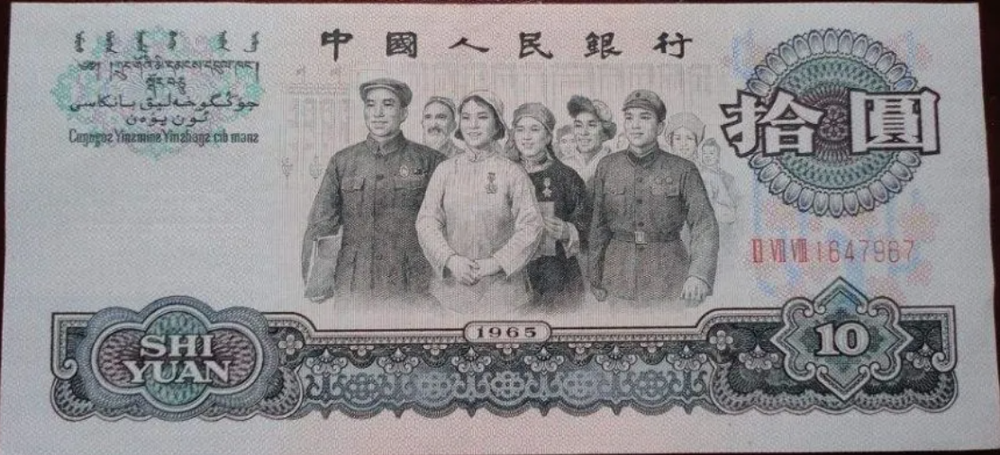

## 第一套人民币

第一套人民币从1955年3月1日（首发）至1964年（部分面额停用）。实行币制改革：1万圆第一套=1圆第二套，引入分币体系。以后钱一再贬值，可以再万换一，将物价降低。

我国的铝质分币自 1957 年 11 月 9 日开始发行，至今已有 30 多年了。铝质辅币由铝镁合金铸成，有壹分、贰分、伍分 3 种面值，圆形，边有 直齿。壹分币直径 18 毫米，重 0．67 克，贰分币直径 21 毫米，重 1．08 克， 伍分币直径 24 毫米，重 1．80 克。整套硬币的正面图案均为国名和国徽，背 面图案都是相同的装饰性麦穗并记面值和发行年份。

这套铝分币，它的材质虽然都是铝合金，但仔细观察后，发现其中还是 有区别的，其中最明显的是 1955 年号的 2 种分币，色泽较暗，材质也软。可 以看出，当时使用的合金性能很差，在流通了一段时期后，币面花纹磨平， 腐蚀严重。如收集稍晚，就很难找到好品相的 1955 年号铝币。目前，1955 年号的铝币已基本绝迹。而 1956 年号的铝币，硬度较前有所增加，色泽也明 亮些，但和以后发行的诸年号铝币相比较，也显逊色。

意钱币上的各种细小变化，称为版别。在貌似相同 的铝分币上，也有很多可以观察到的差异，如 1955 年和 1956 年的伍分币， 稍加观察，即可发现它们均有两种不同的版别，而 1982 年的壹分币，则更是 由两套风格各异的模具铸造而成的。观察铝币的花纹变化，从贰分币上看， 差异不大，仅发现 1981 年的年号字体特别细，而 1971 年的壹分币及以后 1972、1974、1976、1978 等年号的壹分、伍分币上的图案、字体均不同于以 前。而逢单的 1973、1975 等年号又和前些年的花纹一样，并无变化，这种每 年版别各异的现象一直持续到 1984 年始告结束。

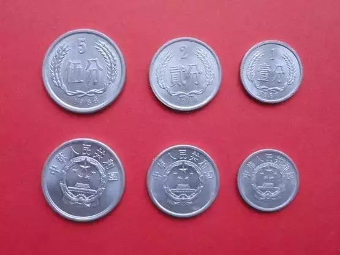

下面是1、2、5分铝分币年号表

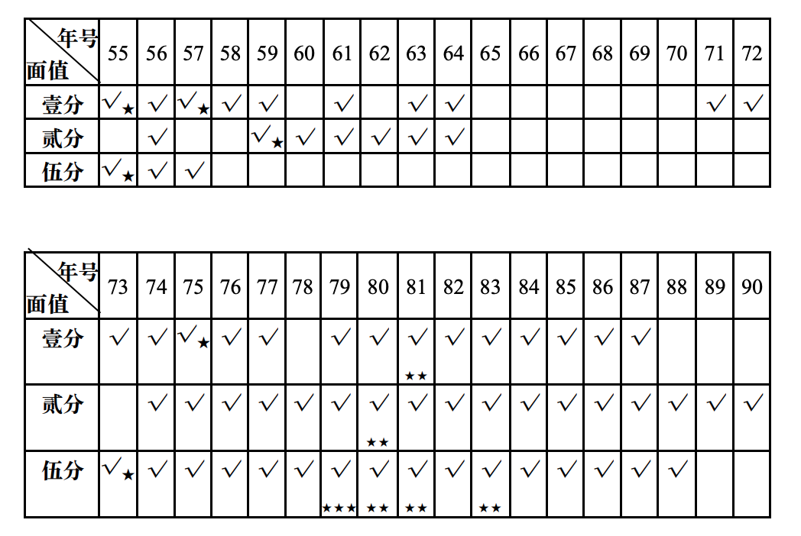

打“★”者为稀少程度。这套硬币是第二套人民币辅币。硬币年份标注为铸造年份，而非发行年份。1965-1970年因文化运动可能暂停生产，部分年份（如1973年5分）未铸造。

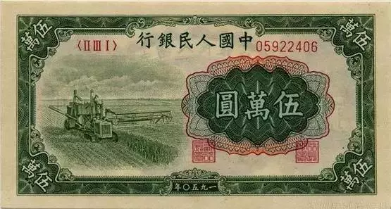

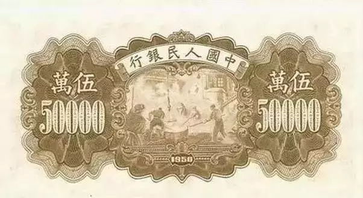

人民银行发行的最大面额。

## 第二套人民币（长城币）

铸造时间：1980-1986年。退出流通时间：2000年7月1日。

| 面额    | 铸造年份  | 材质     | 发行范围              |
| ------- | --------- | -------- | --------------------- |
| **1角** | 1980-1986 | 铜锌合金 | 流通币（1980-1986年） |
| **2角** | 1980-1986 | 铜锌合金 | 流通币（1980-1986年） |
| **5角** | 1980-1986 | 铜锌合金 | 流通币（1980-1986年） |
| **1元** | 1980-1986 | 铜镍合金 | 流通币（1980-1986年） |

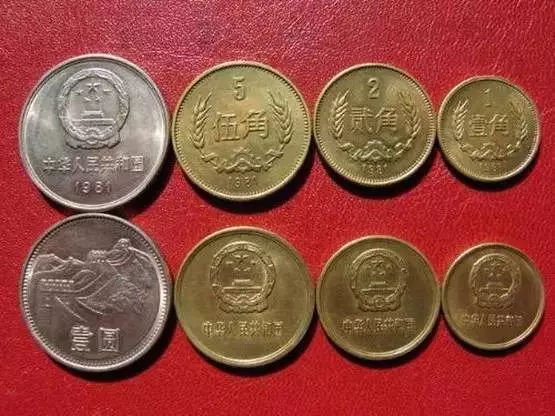

1982、1984、1986年仅铸造精制套装币，未流通，市场罕见。1元币背面为长城图案，故称“长城币”。

1 分

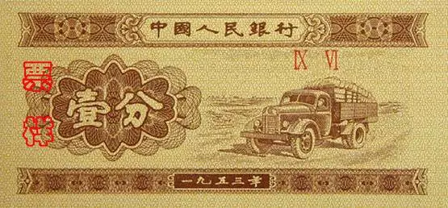

2 分

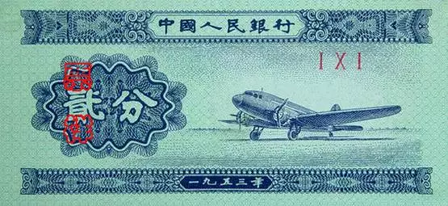

5 分

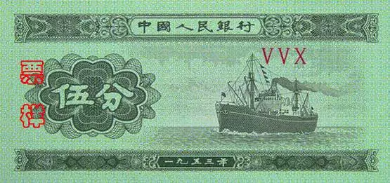

1 角

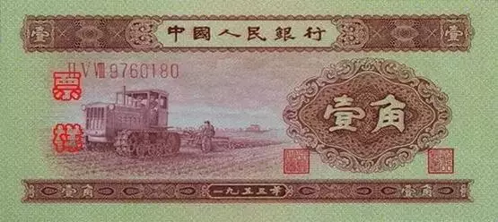

2 角

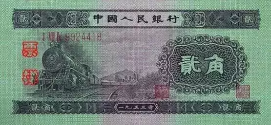

5 角

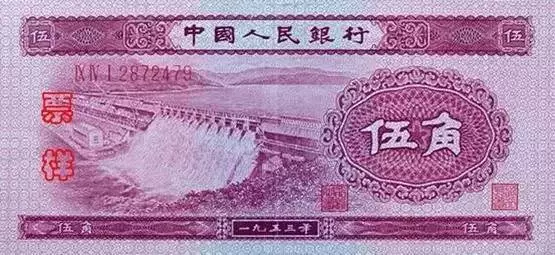

1 元

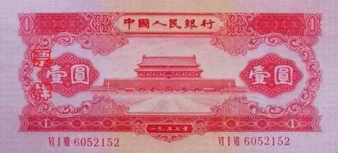

2 元

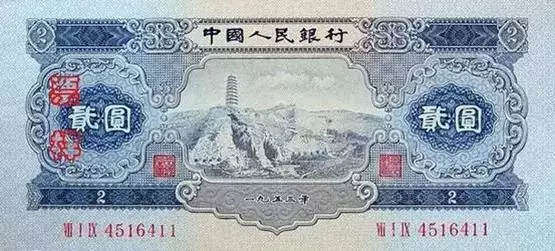

3 元

**绿叁圆（3元1953年）** ：中国唯一3元纸币，全品5万元。

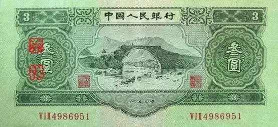

这里出现的全品，特指收藏品的完整度与保存状态，例如纸钞：四角尖挺，无折痕、污渍，油墨清晰；硬币：原光未流通（UNC级），无氧化斑点；邮票：背胶完整，齿孔无损伤，颜色鲜艳如新。评级品也是一种品级。

近三年，全品与评级品的价差呈现以下趋势：

| **品类**       | **全品年均涨幅** | **评级品年均涨幅** | **溢价扩大原因**                                             |
| -------------- | ---------------- | ------------------ | ------------------------------------------------------------ |
| **机制币**     | 8%-12%           | 15%-22%            | PCGS/NGC评级份额占全球交易85%，标准化推动资本入场。          |
| **现代纪念钞** | 5%-8%            | 10%-18%            | 央行数字货币推广使实体钞成"技术文物"，评级需求激增。         |
| **文革邮票**   | 3%-6%            | 8%-15%             | 年轻藏家依赖评级降低学习成本，如"全国山河一片红"评级品交易量涨300%。 |

年年都涨。

5 元

**红伍圆（5元1956年）** ：1956年改版海鸥水印，全品8万元。

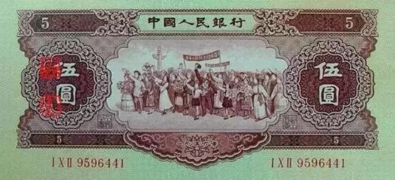

10 元

**大黑拾（10元1953年）** ：苏联代印，存世量不足百张，评级品达50万元。

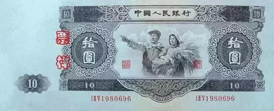

## 第三套人民币（花卉系列）

1991-2000年（1992年正式发行）。退出流通时间：2016年起部分面额退出。仍在流行的收藏价值不高。早期套别（一至三套）升值空间趋稳。

| 面额    | 铸造年份范围 | 材质     | 图案 |
| ------- | ------------ | -------- | ---- |
| **1角** | 1991-1999    | 铝镁合金 | 菊花 |
| **5角** | 1991-2001    | 铜锌合金 | 梅花 |
| **1元** | 1991-1999    | 钢芯镀镍 | 牡丹 |

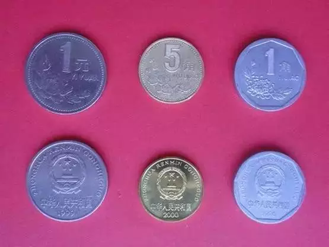

1 角（1962年）

正面人物向右行走，被批“右倾”后改版。**市场价**：全品超5000元。

另有背面菊花图案为绿色，与2角纸币混淆后紧急回收。**细分带水印版**：存世量不足千张，市场价超4万元。**无水印版**：约5000元。

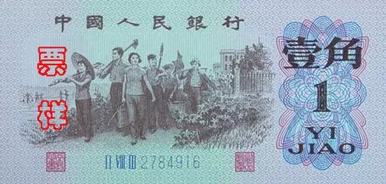

2 角（1964年）

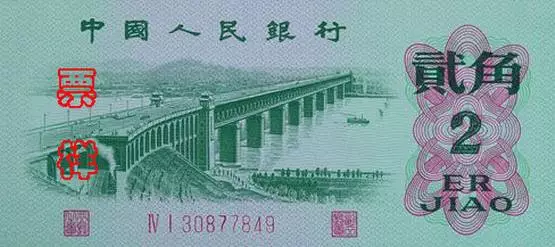

5 角

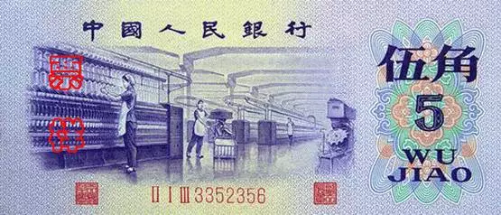

1 元

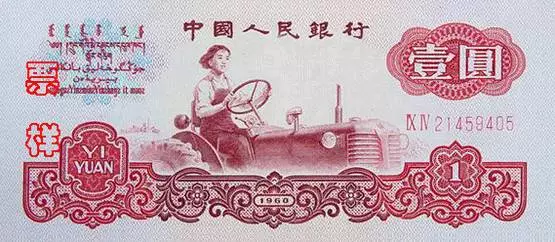

2 元

车床工人图案，分“古币水印”和“五星水印”两版。**市场价**：古币水印版约3000元，五星水印版约2000元。

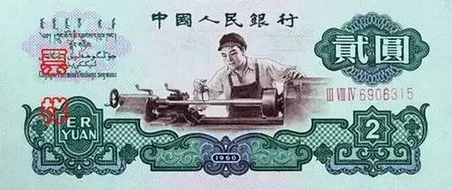

5 元

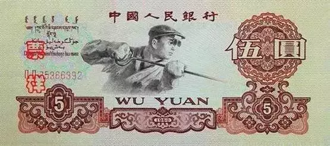

10 元

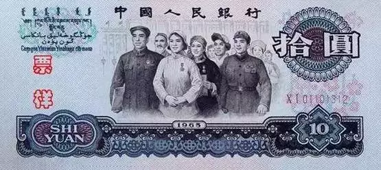

## 第四套人民币（新三花）

铸造时间：1999年制版，2000年起发行。流通状态：部分面额仍在流通。

| 面额    | 铸造年份范围 | 材质变化                          | 图案 |
| ------- | ------------ | --------------------------------- | ---- |
| **1角** | 2000-2019    | 铝合金→不锈钢（2005年起）         | 兰花 |
| **5角** | 2002-2019    | 钢芯镀铜合金→钢芯镀镍（2019年起） | 荷花 |
| **1元** | 2000-2019    | 钢芯镀镍                          | 菊花 |

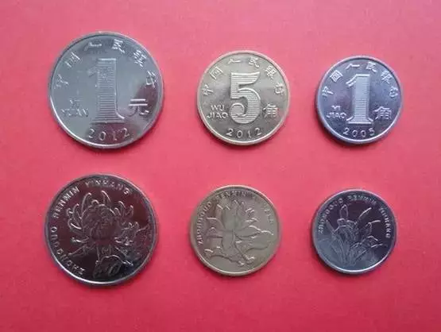

目前，除1、2、5分三种硬币外，第一套、第二套和第三套人民币已经退出流通，目前是第四套人民币和第五套人民币，以第五套为主，两套人民币同时等值流通。

1 角

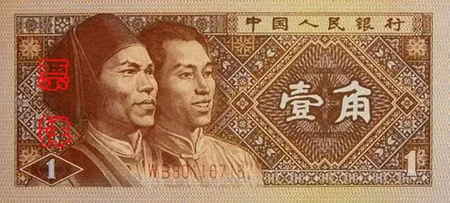

2 角

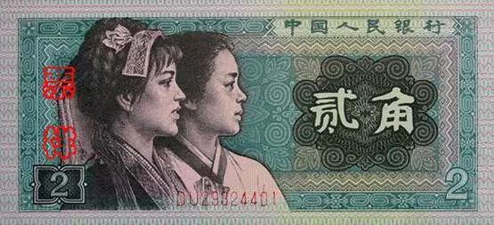

5 角

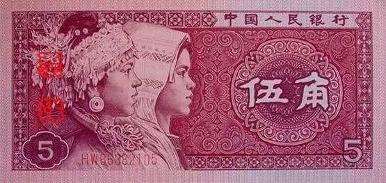

1 元（1996年）

- **独特性**：唯一独享年号纸币，红色主色调。
- **市场价**：首发冠（CP）评级品达1880元

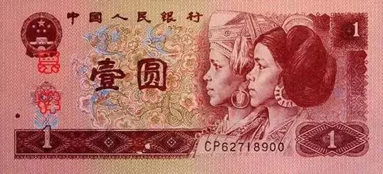

这里提到“首发冠”指的是纸币首次发行的冠号，例如第四套人民币的80版首发冠多为CP。CP冠号在第四套中具有特殊意义。

2 元

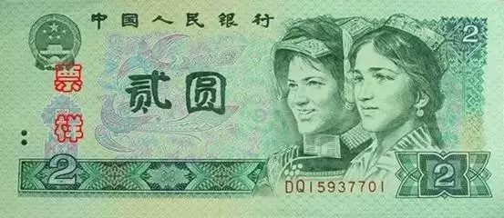

5 元

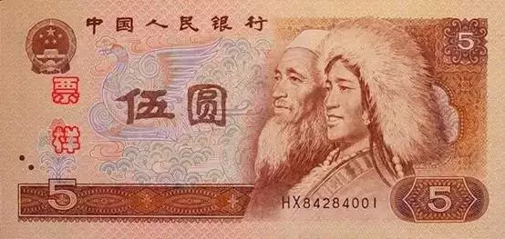

10 元

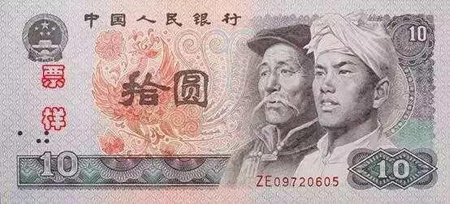

50 元（1987年）

- 工人、农民、知识分子头像，存世量稀少。
- **市场价**：首发冠（CP）全品约5000元。

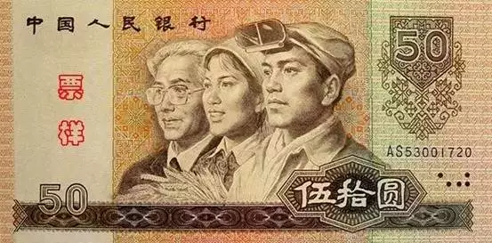

100 元（1988年）

- 四大伟人浮雕头像，防伪技术初代应用。
- **市场价**：全品约1500元。

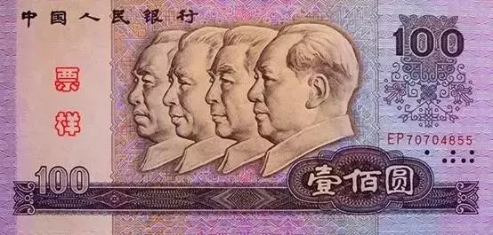

## 第五套人民币

1 元

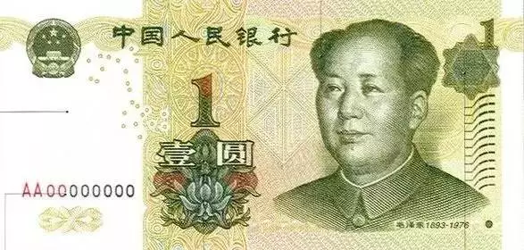

5 元

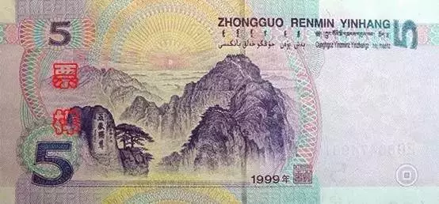

10 元

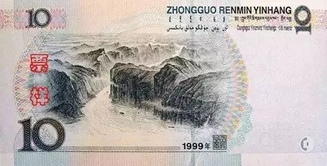

20 元

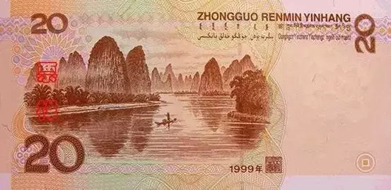

50 元

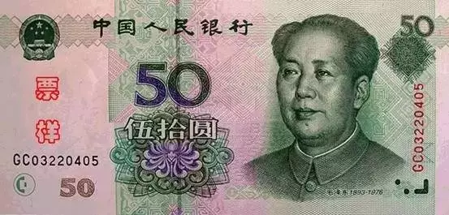

100 元

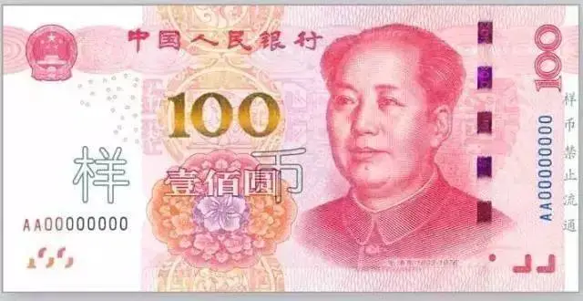

## **纸币与硬币辅币套系对应关系**

| 纸币套系         | 发行时间   | 对应辅币（硬币）       |
| ---------------- | ---------- | ---------------------- |
| **第一套人民币** | 1948-1955  | 无硬币                 |
| **第二套人民币** | 1955-1964  | 第一套硬币（硬分币）   |
| **第三套人民币** | 1962-2000  | 第二套硬币（长城币）   |
| **第四套人民币** | 1987-2018  | 第三套硬币（花卉系列） |
| **第五套人民币** | 1999年至今 | 第四套硬币（新三花）   |

硬币年份为铸造年份，纸币年份为设计定稿年份。硬币有多个年份，但纸币没有。

2角硬币仅存在于第二套（长城币），1980-1986年铸造。5角硬币材质历经铜锌合金（长城币）、铜锌合金（花卉系列）、钢芯镀铜合金（新三花）三次变化。

一般而言，早期分币（1955年5分）、长城币（1986年精制套装）、花卉系列（2000年牡丹1元）因稀缺性成为收藏市场焦点。

“五珍”指的是早期发行的硬币，包括1955年、1956年、1957年、1959年的硬币，因其稀少和高收藏价值而备受关注。

1993年梅花五角因发行量少、材质优良，收藏价值较高。2000年牡丹一元硬币为“关门币”，仅少量发行。

2025 年 5 月 8 日
