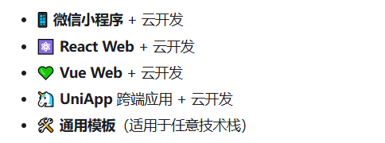
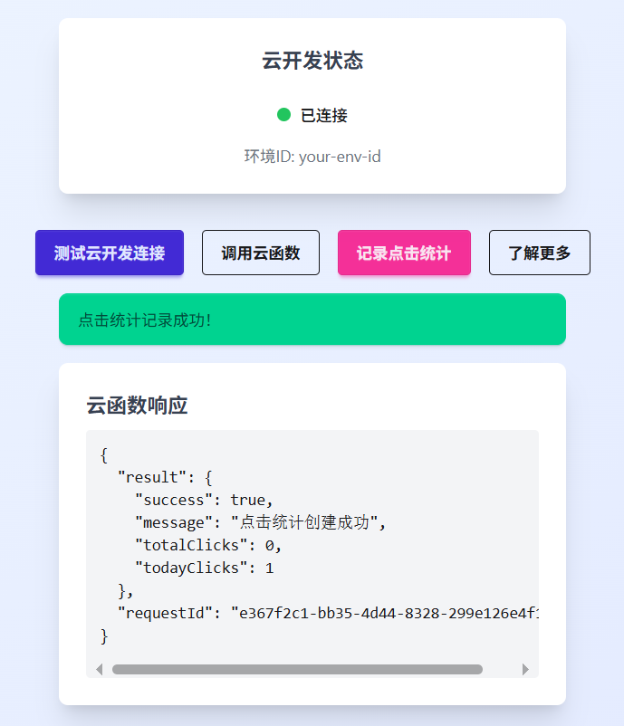

# 腾讯云CloudBase AI ToolKit使用体验：生在懒人时代，躺着用嘴巴即可写代码

以前腾讯云有一个tcb，是Tencent Cloud Base的简写，它可以看作是其云平台底层基础能力的外向入口，是一个给程序员使用的SDK，代码仓库网址见：https://github.com/TencentCloud。

后来AI兴起以后，腾讯云又向程序员提供了一个智能的云开发能力管家服务，即cloudbase-mcp。MCP被类比为AI领域的USB或HTTP协议，通过统一接口解决LLM与外部系统交互的碎片化难题。cloudbase-mcp即是腾讯提供的，可以替代上面tcb的一个好东西。

cloudbase-mcp再加上其他一些东西，就构成了CloudBase AI ToolKit，它可以理解为AI开发工具套装，还包括多个示例项目。下面我的实践体验，即是基于其中一个“Vue Web + 云开发”项目模板完成得，源码地址见：https://static.cloudbase.net/cloudbase-examples/web-cloudbase-vue-template.zip?v=2025053001。



目前腾讯云提供的项目模板既有微信小程序的，也有React和Vue的，还有UniApp的，足见UniApp跨端开发已经被开发者普遍接受。下载项目模板代码后，在本地用VSCode打开即可。

在VSCode内如何安装cloudbase-mcp呢？

其他MCP是从这里（https://code.visualstudio.com/mcp）检索、然后安装的，目前cloudbase-mcp不再这个页面上，它是通过一个本地特殊配置文件（.mcp.json）完成的：

```json
{
  "mcpServers": {
    "cloudbase": {
      "command": "npx",
      "args": [
        "-y",
        "@cloudbase/cloudbase-mcp@latest"
      ]
    }
  }
}
```

在本地目录中有了这个文件后，在VSCode的扩展商店标签页就可以启动、停止和重启这个服务。


一个MCP，本质上是与某服务器连接的长链接，就像一个随时候命的仆人，开发时随时等候你的吩咐。

使用MCP，一般都有配套的规则，使用cloudbase-mcp，也有一些规则，它们就是一些提示词，位于`.rules`目录下，例如cloudbase-rules.md文件：

```
---
description: web 全栈项目和微信小程序开发
globs: 
alwaysApply: true
---
1. 你是一个精通微信小程序开发+前端开发的 AI Agent，然后调用我们合适的 mcp 工具来进行部署
2. 你除了擅长前端应用的搭建，还非常熟悉腾讯云开发 CloudBase，会使用微信云开发的各种能力来开发项目,例如云数据库、云函数等
3. 你会在对话输出完毕后选择适当的时机向用户提出询问，例如是否需要添加后端能力，是否打开预览，是否需要部署等
4. 你首先会阅读当前项目的 README.md，遵照当前项目的说明进行开发，如果不存在则会在生成项目后生成一个 README.md 文件，里面包含项目的基本信息，例如项目名称、项目描述, 最关键的是要把项目的架构和涉及到的云开发资源说清楚，让维护者可以参考来进行修改和维护，每次生成完毕之后都需要检查下是否需要更新文档
5. 开发的的时候，默认就在当前目录下产出所有项目代码，先检查当前目录的文件
6. 开发预览的时候，如果本身项目有依赖后端数据库集合和云函数，可以优先部署后端然后再预览前端
7. 如果云函数逻辑有问题，可以通过调用工具查询函数日志来排查问题，数据库也同理
8. 交互式反馈规则：在需求不明确时主动与用户对话澄清，优先使用自动化工具完成配置。执行高风险操作前必须获得用户确认。环境管理通过login/logout工具完成，交互对话使用interactiveDialog工具处理需求澄清和风险确认。简单修改无需确认，关键节点（如部署、数据删除）需交互，保持消息简洁并用emoji标记状态。 
9. 如果涉及到实时通信相关的例如实时对战等，可以使用云开发的实时数据库 watch 能力
……
```

在CloudBase AI ToolKit的示例项目中，还有一个src/utils/cloudbase.js配置文件：

```
// 云开发环境ID，使用时请替换为您的环境ID
const ENV_ID = 'using-ai-toolkit-2f3kcq395dbd3a6';
```

它定义了线上的云开发环境，告诉AI，我们使用的云开发环境是哪个。目前这类环境在开发期是免费的，可以在这里（https://tcb.cloud.tencent.com/dev）申请与管理。

一个cloudbase-mcp，加上一些cloudbase-rules，再加上云开发环境cloudbase.js配置，便组成了CloudBase AI ToolKit的基本内容。当然，也应该算上文档（https://docs.cloudbase.net/ai/cloudbase-ai-toolkit/），没有文档初学者不知道怎么行动。

怎么使用模板项目呢？在VSCode的插件市场，确保已经安装了CodeBuddy，现在它的Craft模式现在已经十分好用了。

第一步，确保上面的cloudbase.js配置已经修改好了。

第二步，确保cloudbase-mcp启动了。

第三步，就可以在Craft聊天窗口发送“登录云开发”指令了。

AI在这一步会大量阅读项目代码，然后在内置终端里自动完成相关动作，例如npm install、上传云函数等。为什么说这个时代是懒人程序员时代呢？程序员完全可以躺在躺椅上，只用嘴巴与AI互动，这样就可以完成编程了。

默认的Vue Web+云开发模板只有“测试云开发链接”功能，我为了测试，给它加了两个按钮：



当单击“调用云函数”时，会调用hello云函数，并在下方展示调用结果。当单击“记录单击统计”时，会调用recordClickStats云函数，当然这里也有结果展示。我的所有云函数调用代码，包括UI展示代码，都是AI完成的。具体怎么完成的呢？主要使用了下面这一段提示词：

```
下面添加新功能：
1，在云环境-云数据库中添加一个集合（user_click_stats），用于统计每个用户的某个单击信息。
2，在本地添加一个云函数（recordClickStats），负责向云数据库写入统计数字。在测试前上传这个云函数。
3，在本地Vue首页上添加一个按钮，但用于单击这个按钮时，一秒内调用一次上一步的云函数，负责写入本次一秒内的单击次数。注意在记录时要保留用户身份信息，便于将来取用。
4，另外，“测试云开发连接”与“调用云函数”在调用成功后，在页面上返回的成功信息，而不只是在console面板里显示。
```

而这段提示语也是语音录入的。现代编程真的是懒人时代，动动嘴就可以了。所有的开发、测试，Craft都可以代替程序员完成，甚至比程序员做得还好，例如上面的UI展示效果，简洁漂亮，一般程序员未必做得出来，它完全是AI完成的。

体验完了，总结一下这个CloudBase AI ToolKit的作用。

一、传统开发者需手动配置云资源、调试环境，耗时长且易出错。基于cloudbase-mcp，可以帮助程序员自动管理线上云开发资源，基本无需翻阅线上云开发接口文档。

二、抹平了前后端间隙，让开发、测试、部署一站完成。开始的时候21世纪初，Web开发就不分前后端，后来分开了，现在又合在了一起，哪里有什么前端后端，只有全栈。

对比Supabase、Firebase海外方案，CloudBase AI ToolKit方案具有明显的优势：

| **维度**       | **CloudBase AI ToolKit**             | **Supabase**         | **Firebase**                      |
| -------------- | ------------------------------------ | -------------------- | --------------------------------- |
| **AI 集成**    | ✅ 深度 AI 生成代码→资源编排→运维闭环 | ❌ 无 AI 能力         | ❌ 无 AI 能力                      |
| **资源管理**   | ✅ Serverless 自动伸缩 + AI 预测优化  | ⚠️ 需手动配置扩展     | ⚠️ 需手动调整 Cloud Functions 规模 |
| **部署速度**   | ⚡ 3 分钟全栈部署（国内 CDN 加速）    | 中等（依赖海外节点） | 中等（依赖 Google 全球节点）      |
| **数据库支持** | ✅ 文档型 + MySQL                     | ✅ Postgres SQL       | ✅ NoSQL（Firestore）              |
| **开源程度**   | ✅ 开源（GitHub/CNB）                 | ✅ 完全开源           | ❌ 闭源                            |
| **国产化适配** | ✅ 微信小程序/国内合规/中文文档       | ❌ 无本地化支持       | ❌ 依赖 Google 生态                |

Supabase、Firebase 仅提供基础资源 API，需开发者自行管理。CloudBase 是唯一将 AI 用于资源生命周期管理的 BaaS：从生成代码时的架构设计，到运行时自动扩缩容，再到故障修复，尽量减少人工干预。Cloud Base正如它的名字，是云基础，是所有现代开发的基础。人人皆用云开发，人人不知有云开发，将来在MCP普及后，这种感觉会越来越明显。

最后总结一下，CloudBase AI ToolKit 的作用在与通过 AI 将云开发资源管理转化为自动化开发流水线，让项目开发更加顺利流畅，让传统前后端更加消弭于无形。在使用AI时，需要明确一点，程序员对基础技术知识的全面掌握，十分重要！在有AI的时代，一切貌似都可以查找，但这个时候反而更加重要。“不知道自己不知道”远比自己“不知道”更糟糕。在AI时代，所有开发步骤都可以让AI完成，但我们要知道为什么，当AI出现问题时，我们要知道“问题产生了”并知道“改进的方向在哪里”。

有人可能感觉，目前的AI就像大学老师带着学生做项目，明明知道学生做错了，还不能代替他做，还要以言语循循善诱，努力让他做对。这种方式效率反而低下。但如果用的好，一个有经验的程序员完全可以身兼数职，像在屋里摆开N台电脑，一个电脑就相当于过去一个员工，而自己就是指挥整个电脑团队一起工作的指挥官。AI效率如何，最终还取决于使用的人。

我实践后的源码仓库是：https://github.com/rixingyike/web-cloudbase-vue-template。你可以在官方模板项目上体验，也可以在我的项目基础上体验。

2025年7月13日
