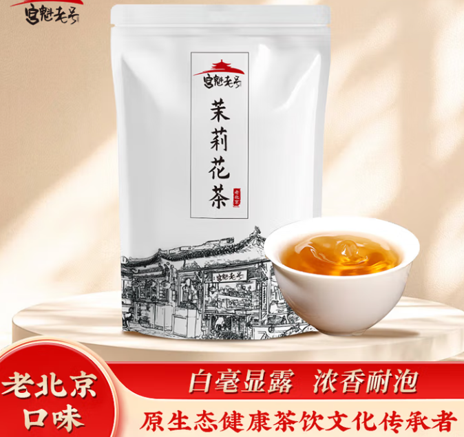

# 由茉莉高碎想到的北京小吃

最近茶叶喝完了，在京东买了一斤茶。25一斤的价格喝出了1000块的口感！茶香浓郁，口感清透，没有苦涩感。唯一的缺点就是太碎了，翻看了一下用户评论，最不满意的也是太碎了，说应该叫“高末”。不过这一点对我没有影响，我喝茶是煮茶，将茶叶投进锅里，大火烧开，烧一锅，凉凉了慢慢喝，茶叶都会沉到锅底，对喝茶丝毫没有影响。

老北京人喝茶为什么喜欢喝高碎，尤其是茉莉高碎？这大概与喜欢吃卤煮、喜欢吃麻酱火烧、喜欢吃门钉肉饼是一个道理。

京东上一斤牛油大约六块钱，将固态的牛油混在馅里，包在面皮里包成肉饼，煎熟了要蘸醋趁热吃，一咬一口油，放凉了牛油凝固了就不好吃了。芝麻磨过香油，剩下的芝麻酱里面还有很多油，成本低廉，和面粉制成麻酱烧饼，很扛饿。以前在通县运河码头装船卸船走漕运的汉子，最喜欢带这个饼——便宜、油大、夏天还不易坏。最后再说下卤煮，这个硬菜里面的成分都是猪下水——猪肠、猪肺、猪心和猪肝，不是油大盐大，就是胆固醇高。清末老北京人——尤其是没落的八旗子弟，平时吃不上鱼肉，就靠捞这个打牙祭。古人不是天天吃，没有什么健康问题，但今天的人不缺吃的，吃这个普遍就觉得腻，尤其是卤煮里的死面饼子，以前吃的是实在，是充实，现在吃就是太实在了。

门钉肉饼、麻酱烧饼和卤煮，北京的这些老小吃如果还保持老式做法，生存市场只会越来越小。唯有茉莉高碎可以一直保持下去。古人喝不起好茶，还想喝好茶，于是到茶庄里，让伙计把瓶底罐底的茶叶末子搓起来称一斤，低端茶的价格，却能喝出高端茶的味道，老北京人穷讲究，就喜欢这一口。现代人喝高碎没有健康负担，保持和发扬这个传统没有任何问题。除非有一天，好茶的价格都很便宜了，人们才可能放弃喝高碎的习惯。但好茶的价格是不可能降下来的，好茶的成本主要在人工里，从采茶到制茶，甚至工序里还有八窨八窖的讲究。人是需要吃喝的，在任何朝代里，复杂的人工都不可能太低，除非以后机器人学会了炒茶。

2025年8月11日
