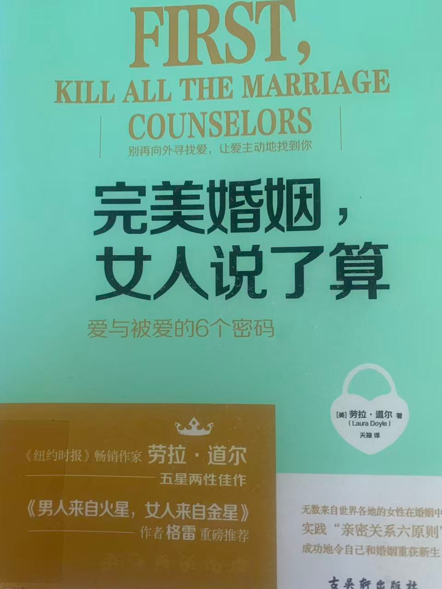

# 女权主义不利于提高婚育率

最近读了一本书，书名叫《完美婚姻，女人说了算》，是一本英文翻译书，作者劳拉·道尔是一位美国女性。这算是一本从实践出发，总结优秀经验而写成的书。很有指导意义，经验之谈的图书总是值得阅读。书的内容总的来讲，在告诫女性读者在家庭中不要企图拿控一切、评论一切，要学会示弱，学会尊重、赞美和感激丈夫，要多看开一些、少一点较真，只有这样才能建立一个和谐、亲密和充满激情的婚姻关系。

具体讲是六原则：

1，学会爱自己，每天做一件让自己放松的事情。
2，男人需要的是尊重，请给他们。
3，对丈夫少一点控制，多一点亲密。
4，坦然接受来自丈夫的好意。
5，示弱，让妻子更具女人味。
6，感激是最有力的亲密技巧之一，请多使用。

女权独立主义讲究思想独立、经济独立、情感独立，仔细对比上面的亲密关系六原则，发现女权主义与这些让婚姻幸福的技巧竟然是相悖的。怪不得经济越发达，离婚率越高。这不是经济发达直接导致的，是经济发达之后，女权思想越普遍和被女性接受，婚姻越来越不幸福了，离婚率自然就高了。当然还有到处都是的离婚事务所，为离婚提供了大大的方便。  

这本书有一个巨大的缺点，大标题和小标题之间的逻辑性不强。一开始我以为是作者的问题，大概女性作者很难在一个宏大的层面上将所有知识点网罗在一起——其实也不只是女性作者，男性作者有时候也是这样。能够在宏观的结构上对书籍内容进行把控，是一种少数作者具有的天赋。

后来，当我尝试在小节与小节之间加入自己理解的链接文字后，我突然恍然大悟。哪里是作者的逻辑性不强，分明是译者瞎翻译。中文版本一些不恰当的意译，让原书内容看起来像是被肢解了一样缺乏逻辑性。原书内容逻辑性不强，内容长略显啰嗦，其实是作者在拿着六原则依次和读者聊天。

饶是译文可能不佳，外文翻译书的质量也普遍比国内中文书的质量要高。因其经过了时间、读者的检验，更具有阅读价值。这些书混在中文书架上，一眼就能识别出来。如果是挑选中文书，则需要到京东、当当平台，一看出版时间，没有活过两年的也不要看；二看图书的销量，当然销量越大越好。

最近看了一个视频，说是韩国政府为了改善低迷的结婚率和生育率，在城市里为女性大大提供便利措施，提高女性居民的生活体验。结果搞了几年，结婚率和生育率反而更低了。原因也简单：改善女性居民生活、工作体验，是在助长女权主义，女权主义普遍了，婚姻满意率和生育率自然就下降了。

我不是对女权主义有意见，实则这本书里的六原则也需要女性朋友学习下。如果能够独立，还能掌握这六原则的精髓，婚姻则更容易幸福。还有，这六原则体现的思想不仅可以应用在家庭中，还可以应用在职场中，甚至男性也可以学习和运用。它本质是一种以退为进的女性生存智慧。

