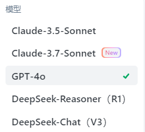

# Manus vs Coze，Trae vs Copilot

最近AI的风暴越大，有点应接不暇的感觉。我还没有拿到Manus的注册码，但我看到它的介绍及作品，已经深为震撼。

什么是Manus？它与之前的AI产品最大的区别是“知行合一”，它可以独立进行逻辑思考、独立规划和执行复杂任务，并直接交付最终结果。官方放出的一个“活体”示例是“容器与虚拟机发展传记小说”：

https://manus.im/share/Aa0M0gvOybi9cRwDK0RNpx?replay=1

打开这个链接，就能直接看到Manus是如何思考、如何行动的，以及最终的行动结果。DeepSeek有深度思考，Manus不仅思考，还开始了行动，Manus被誉为全球首款通用AI Agent。

“通用AI Agent”，对这种描述是不是感觉似乎相识？在ChatGPT出现之前，人类也已经开发出了具体行业的人工智能，例如下棋赢了世界冠军柯洁的谷歌AlphaGo。在Manus之前，人类也有AI Agent，例如Coze平台，它允许新程序员用拖拽的方式制作AI Agent，体验用代码控制世界的感觉。现在Manus以全新的理念出现了，Coze突然黯然失色了。Manus的成功，证明Coze的路走得有点偏了。

在Coze中，程序员要负责所有逻辑及所有“行动”，即使是一个简单的for循环，也要拖拽许久。在Manus中，AI被赋予了一定的使用电脑能力的权限，它可以使用网络，可以使用浏览器，可以调用接口（包括被授权的私域接口），还可以使用其他被允许的桌面软件。事实上沿着这条路走下去，Manus可以使用所有宿主能力，甚至如果电脑装在了具象智能机器人身上，Manus也能使用机器人的身体，那它就算是硅基智能人的“露西”。

接下来Coze的方向预测必然会调整了，Coze平台会给予语言大模型更多的权限和行动能力，会朝着让新程序员少写代码、少操作而实现更多智能功能的方向进化。最终低代码的编程方式，一定与老程序员的传统编程方式是不同的，如果是相同或相似的，那它的意义就不大，特别是当像Manus这样的通用AI Agent诞生之后。

说完Manus与Coze，再说下Trae。我用了Microsoft Copilot，即使是基础额度也感觉不错。现在Trae提供了DeepSeek V3、GPT-4o、Claude 3.7 Sonnet等诸多大模型的能力，辅助能力更强了。

目前是限时免费的，并没有言明什么时候开始收费。也有可能在Copilot、腾讯AI代码助手一直免费的情况下，一直都是免费的。对于程序员，只要代码在本地，仓库在Github上，使用哪个Copilot又有什么关系呢？何况Cursor和Trae在启动的时候，都提供了从VSCode导入配置的能力。

有人可能会想，既然Trae支持免费使用大模型，那我们所有事情都在Trae里使用不就可以了吗？

不行，Trae里的模型是专用于技术开发的，是做了限制的，不能用于写小说或做其他事情。辅助编程，现在不需要在浏览器里进行互动了，在AI IDE里就可以了。其它行业的AI Agent，适合通过sdk调用DeepSeek的接口进行探索。Coze低代码平台是另一种方向，给不手写代码的新程序员使用的，那是另一个道理，与老程序员深入搜索行业AI Agent的方向是不同的。

相关链接：

- https://www.coze.cn

- http://trae.ai
- https://manus.im

2025年3月7日
