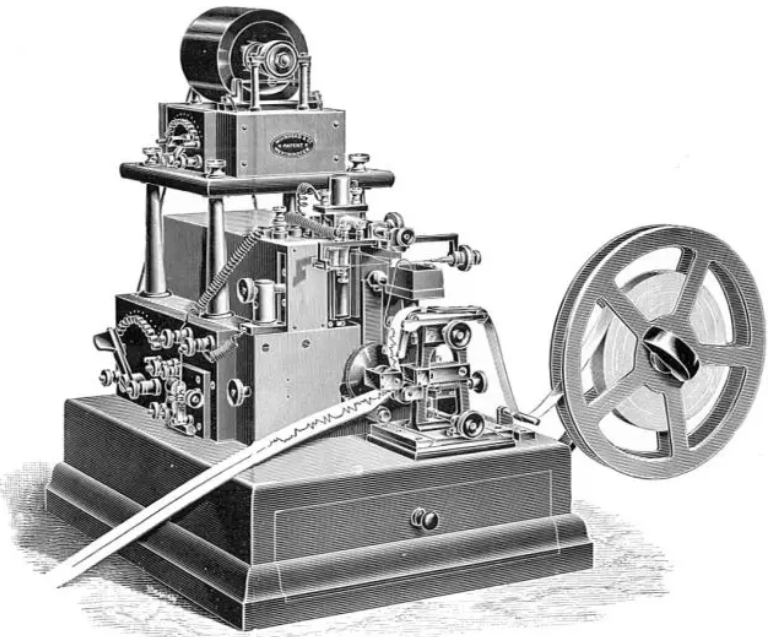
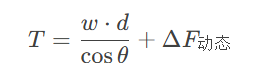

# 大西洋电缆的艰难铺设

[大西洋电缆铺设](https://ptcc.phys.nthu.edu.tw/articles/67bc28f91efd7411b20c957a)——8年才完工，艰难的铺设之路

1858年，美国实业家赛勒斯·菲尔德成功铺设了纽芬兰与爱尔兰之间横跨大西洋的海底电报线路。时任美国总统布坎南与英国女王维多利亚即通过这条线路进行了交流。但两个月后这条线路就失效了，直到1866年美国和英国之间才真正实现稳定的电报通信。

汤姆森开发了一个完整操作海底电报的系统，能够每3.5秒发送一个字母。1858年，他给他的系统中的关键部分，也即反射镜检流计（英语：[mirror galvanometer](https://www.wikiwand.com/zh/articles/mirror_galvanometer)）（镜式检流计）和虹吸记录器（英语：[Syphon recorder](https://www.wikiwand.com/zh/articles/Syphon_recorder)），申请了专利。牛逼，在1858年就已经发明出来了。

汤姆森认为，信号通过缆线的速度与芯部的长度的平方成反比。该结果在1856年英国协会会议上被大西洋电报公司（英语：[Atlantic Telegraph Company](https://www.wikiwand.com/zh/articles/Atlantic_Telegraph_Company)）的[电气工程](https://www.wikiwand.com/zh/articles/电气工程)师怀尔德曼·怀特豪斯（英语：[Wildman Whitehouse](https://www.wikiwand.com/zh/articles/Wildman_Whitehouse)）驳斥。怀特豪斯可能曲解了他自己的实验结果，但无疑是感到财政上的压力，因为电缆计划已经有条不紊地进行。他认为，汤姆森的计算暗示电缆必须“被抛弃，因为实用上和商业上都不现实”。

汤姆森在与著名杂志《Athenaeum》的通信中[[28\]](https://www.wikiwand.com/zh/articles/第一代开尔文男爵威廉·汤姆森#cite_note-28)批判了怀特豪斯的论点，使得自己进入公众视线。汤姆森推荐一个较大的导体与绝缘的更大的横截面[[需要解释](https://zh.wikipedia.org/wiki/Wikipedia:格式手冊/不要模稜兩可)]。

1857年8月，汤姆森登上了电缆敷设船阿伽门农号（英语：[HMS Agamemnon (1852)](https://www.wikiwand.com/zh/articles/HMS_Agamemnon_(1852))），开始航行，怀特豪斯则因病留在岸上，但航行380英里（610 km）后电缆不幸断开了。对此，汤姆森在《Engineer》发表了铺设[海底电缆](https://www.wikiwand.com/zh/articles/海底電纜)所涉及到的[应力](https://www.wikiwand.com/zh/articles/应力)的完整理论，并表明，当缆线以恒定的速度离开船体，进入到深度均匀的水中时，它会保持倾斜的直线的形状下沉，该直线从入水点延伸到触及底部的点。

T：电缆张力
w：单位长度电缆水下重量
d：水深
θ：电缆入水角度

怀特豪斯还是觉得能够忽略汤姆森的许多意见和建议。直到汤姆森说服董事会，使用更加纯净的铜更换电缆的丢失部分，以改善数据输送能力，汤姆森才第一次对项目的执行产生了影响。

董事会坚持让汤姆森加入1858年的电缆敷设远征，没有任何经济补偿，并在项目中的积极参与。作为回报，汤姆森获得了试验他的反射镜检流计的机会，对此董事会不甚感兴趣，怀特豪斯旁边的装备。然而，在1858年6月的灾难性风暴之后，阿伽门农号只好打道回府。（没有钱也干）。董事会打算通过销售电缆减轻其损失的程度。这个时候，是汤姆森坚持了下来。在某些历史时刻，个体是英雄，群体是降智的。

回到伦敦后，董事会几乎要放弃该项目，并打算通过销售电缆减轻其损失的程度。汤姆森、赛勒斯·韦斯特·菲尔德（英语：[Cyrus West Field](https://www.wikiwand.com/zh/articles/Cyrus_West_Field)）和柯蒂斯·米兰达·兰普森（英语：[Curtis Lampson](https://www.wikiwand.com/zh/articles/Curtis_Lampson)）说服了董事会再尝试一次，汤姆森坚持认为技术问题是容易处理的。（大家都准备放弃了）

汤姆森担忧的事情终于发生了：怀特豪斯的设备被证明不够敏感，必须由汤姆森的反射镜检流计所取代。但怀特豪斯坚持认为，是他的装置提供了服务，并开始涉足绝望的措施来做出一些补救。结果，他只是成功地用 2,000 V 的电压彻底损坏了电缆。（第一次失败，因为怀特豪斯的刚愎自用）

当电缆完全失败，怀特豪斯被开除；汤姆森表示反对，还被董事会谴责他的干扰。这之后汤姆森感到后悔，他太随便地默许了许多怀特豪斯的提议，并没有花足够的力气去质疑他。（汤姆森反省自己太有绅士风度了）

接下来开始数年的调查，明白了是怀特豪斯的问题。汤姆森被选入一个五人委员会，受命为新的电缆制定规范。1863年10月，该委员会发表了报告。

1865年7月，汤姆森参与了[大東方號](https://www.wikiwand.com/zh/articles/大東方號)（SS Great Eastern）的电缆敷设远征航行，但航程再次受到技术问题的困扰。在铺设了1200英里（1900千米）后电缆又不幸丢失，远征不得不放弃。还是应力的问题。汤姆森修正了他先前的应力理论。

最后成功了，1866年11月10日，汤姆森与该项目的其他主要负责人一起被封为爵士。这条电缆的铺设成功，代表海洋作业专业开始被设立。

**第二次失败与成功的深层原因**

| **对比维度**   | **1858年电缆**               | **1866年电缆**                 |
| :------------- | :--------------------------- | :----------------------------- |
| **绝缘材料**   | 古塔胶（易裂）               | 多层马来树胶+麻布包裹          |
| **铺设船只**   | 普通军舰（需中途对接）       | “大东方号”（一次性承载全电缆） |
| **信号传输**   | 依赖原始摩尔斯电码，高误差率 | 开尔文检流计，低功耗高精度     |
| **资金与经验** | 首次尝试，预算不足           | 吸取教训，英美政府联合资助     |

