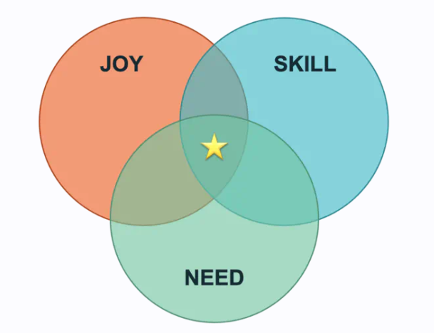
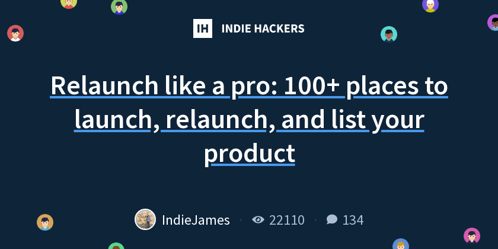
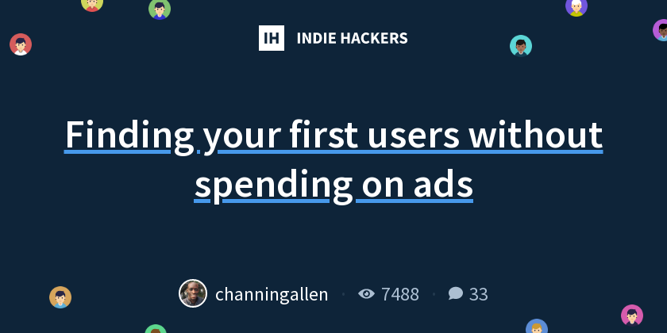
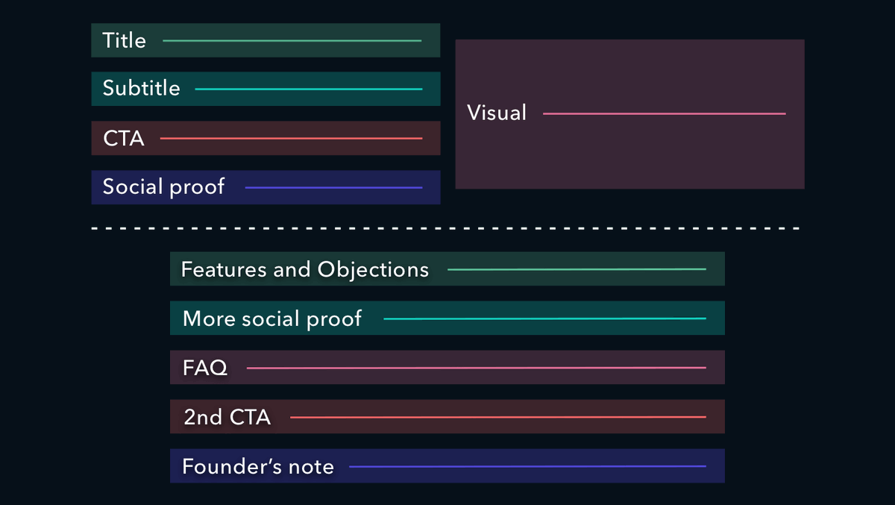
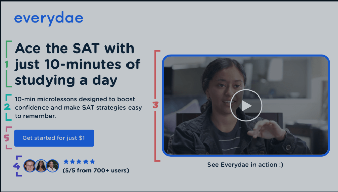
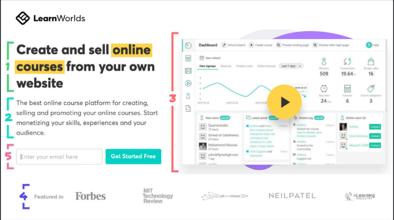
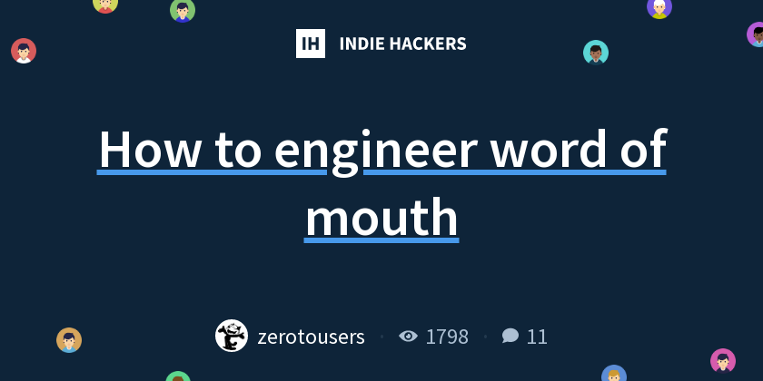
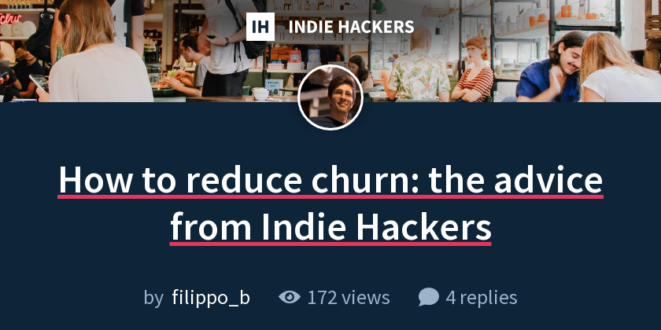
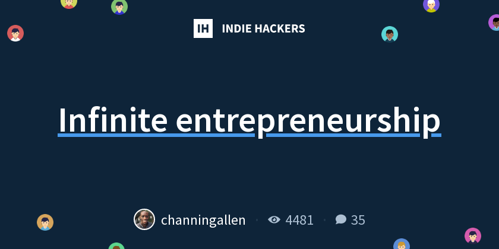

# 独立黑客成长手册

以下内容由作者[@coderliyi](https://twitter.com/coderliyi)的帖子内容生成，你也可以访问原地址：
https://twitter.com/coderliyi/thread/1707997856534007813

通过对这些内容的阅读和学习，相信你和我一样，也能全面理解独立黑客，并知悉如何做为一名独立黑客开发独立产品。有许多个性崇尚自由的工程师，他们靠发布独立产品，轻松实现了每月上万美刀的睡后收入。希望你从中学到精髓，该手册价值连城，且完全免费与公开。

**什么是独立黑客？**

独立黑客也称为独立开发者，或许因为开发者不够份量，这里用了黑客一词，意指十分有经验的技术开发者，通过创建可以盈利的在线应用赢取经济独立，创作自由，以及一个自己可以作主的行事时间表。

从独立的项目中赚取收入比以往任何时代都更加容易，但如果没有任何指导，可能根本无法开始。学是第一步。

## 总目录

这分为 4 部分：
1，了解什么能做
2，迈出第一步
3，公开建造与发布（在上线的第 1 天就争取获得关注？）
4，保持成长，进化与演进

## 1，了解什么能做

第 1 部分又分为 3 部分：
1，从别人的故事得到启发
2，打造独立应用的基础知识
3，具体可以做细分领域

作者自称是一位独立潜伏者，这是他自己从潜伏者向独立黑客进化的故事。很了不起，也非常激励人心。

主要分享了这些经验：

第一点。不要一定要求自己要有一个伟大的点子或者想法，才开始自己的行动。对于已经存在竞品的市场，只要有完善的方案，或者从新角度解决痛点的方案，就可以尝试去做。

第二点，要选对平台，例如 Product Hunt、Hacker News，在这些平台上公开发布自己的产品，使用小步快跑的方式不断积累正向反馈，不断听取社区的意见，并保持对产品的打磨与改进。

第三点，很多独立黑客他们的赚钱想法非常简单，就是做一个月入一万美金的产品，服务一小部分市场的一小部分群体，定这样的小目标，而不是宏大的目标。

第四点，也是最后一点，就是从自己熟悉的领域开始，做自己最擅长、最愿意做的事情。同时，选择的行动方案，也是最稳妥的，无论是成功或者是失败，自己都有理由坚持做下去。

这篇分享的是 750 字私人日记程序，每月为作者带来了 20k 美金收入。

不要只看作者的网站收入多，这个网站已经有十多年之久，曾经因为负担过重，作者想关闭这个站点。读了此篇，有以下几点值得铭记：

1，故意不优化。作者在 5 年间创建了 20 个独立产品，平均每 3 个月创建一个，但只有两个活了下来。在产品没有展现出它的生命力之前，不要过早优化。关于优化这个话题，是一个辩证的话题，既要积极响应用户的反馈以演进，又不能瞎优化。

2，关于商品模式，开始是免费，接着是捐赠，最后是可以 30 天免费试用的 5 元月租模式。作者用了许多时间才积累了种子用户，付费比差不多是 1%。

独立黑客要想有自己的应用，还是要本着真心实用，积极进行实践探索。

这篇文章讲了一个所谓的工作服务于生活的 lifestyle business。作者讲，工作是为了更好地活动，如果感到工作影响到了生活，那么就应该停下来。如果你作为一家初创公司的 CEO，你可能不得不把自己每天的档期排满，甚至连吃个晚饭的时间都没有，只能随便从饼干盒抓几个小点心果腹，因为投资人是你的上级，你不得不为它们卖命工作。但作者提倡的 lifestyle business 不是这样的，团队保持精简，不追求规模，当感觉生活要被影响时，便会主动减少业务规模。

这篇文章描述的生意很历害！作者制作并制造内容，以一种我看起来不可思议的方式创造了收入。或许是因为作者的 twitter 够多吧。

在虚拟产品的定价方面，作者建议学一学迪士尼。迪士尼一张影片先卖 20 元，过一段时间降到 15，再过一段时间降到 5 元，最后就免费了。

每个人如何找到自己的受众呢？如果每个人都有自己的一万受众，每个人都可以直接发行付费的虚拟电子产品。

这篇关于独立黑客的文章干货很多，很值得一读，特别是程序员。👍

这位程序员仅用两年时间，就在 Twitter 上获得了 10w 粉丝，以及通过独立订阅产品每月稳定获取了 4.5w 美金的收入。这是非常鼓舞人心的。

关于 X 的运营，有以下几点值得注意：
1，做一个有趣的人，分享有趣的内容；👋
2，热切与他人互动，做一个友善的人；
3，多使用表情，多写笑话，多写故事；
4，使用 thread。

关于独立产品，有以下几点值得学习：
1，少发布、频繁发布、小步快跑，快速建立反馈；
2，在 X、Reddit 上建立自己的受众；
3，多实践，可能会失败，但也可能会成功。作者先是尝试开发一个大而全的读取 MacOS 日志的应用，扑街了；后来写了 DevUtils、Black Magic、TyingMind 等产品，其中与当下潮流合势的 TyingMind 最为成功；
4，不要从自己的角度思考，要从用户的角度思考，从他们的角度思考。😀

这篇文章我没能学到更有价值的内容，没有学到作者是如何聚集有效目标用户的，或许作者仅是在 7 年前因为爱好创建了这个音乐博客，并不断聚集了人气。

我主要从中学习到了这几点：
1，越来越多的人选择投递 Indie shuffle，说明有越来越多的用户知道这个音乐博客平台，而用户越多，会有更多的音乐人或公司这个平台。这是一个正向循环，建立一个这样的循环，才可以保证独立品牌不断增值。
2，作者使用 meteor 和 React 技术构建自己的博客辅助工具，作者选择的是最省力、最快速的方式，这是一种最聪明的做法。
3，作者在构建程序时，每天工作 8 小时，连续 1 个月，没有休息日，才完成自己想要的功能。作者的需求是明确的，他不需要在需求取舍时纠结，但完成他不擅长的这项工作也付出了巨大的努力。

现在学习 1.2 部分，对基本技能的学习

这篇文章主要列了一些问题，这些问题许多我都没有确切的答案。或许它们存在的意义不是让人回答，而是引导人思考，思考的终点就是做一名独立黑客，开发独立产品。

我过去喜欢从事哪些工作？
过去什么样的工作让我发疯？
我热衷于什么？
上一次我如此兴奋得几乎无法控制自己是什么时候？
上次我因为某件事而非常生气呢？
我通常是独自工作更快乐还是与其他人一起工作更快乐？
我希望生活中有多少空闲时间？
我最喜欢告诉别人什么？
我一生中花最多时间学习的是什么？
我相信大多数人不相信的是什么？
我想赚多少钱？
我想结识什么样的人并与他们互动？
我特别擅长什么？
我有什么不好？
我过去获得过哪些赞扬和荣誉？
人们对我的什么评价让我感觉最好？
我什么时候善于激励自己，什么时候需要别人对我负责？
什么事情即使变得很困难，我也永远不会感到厌倦？
什么给我能量？
是什么让我感到压力？
我过去容易犯哪些错误？
我想了解什么或想变得更好？
我尊重谁？
我嫉妒谁的生活？
我希望我被迫定期做什么？
我希望和什么样的人（如果有的话）一起工作？有具体的个人吗？
无论如何，我希望保持生活中的哪些方面完好无损？
在理想的世界里，我想要过什么样的生活，成为什么样的人？
我想改变我周围的世界什么？
经营企业的哪些部分让我感到害怕或担心？哪些部分让我兴奋？

一个人如何不需要运气而获得成功？
下面这些话值得反复阅读与思考：

追求财富，而不是金钱或地位。财富就是拥有可以在睡觉时赚取的资产。金钱是我们转移时间和财富的方式。地位是你在社会等级制度中的位置。
了解道德财富创造是可能的。如果你暗自鄙视财富，财富就会远离你。
忽略那些玩地位游戏的人。他们通过攻击玩财富创造游戏的人来获得地位。
出租时间是不会致富的。您必须拥有股权（企业的一部分）才能获得财务自由。
通过给予社会想要但尚不知道如何获得的东西，你就会变得富有。规模化。
选择一个可以与长期人员进行长期博弈的行业。
互联网极大地拓宽了职业的可能空间。大多数人还没有弄清楚这一点。
玩迭代游戏。生活中的所有回报，无论是财富、人际关系还是知识，都来自复利。
选择智力高、精力充沛、最重要的是诚信的商业伙伴。
不要与愤世嫉俗者和悲观主义者合作。他们的信念是自我实现的。
学习销售。学习建造。如果你能做到这两点，你将势不可挡。
用特定的知识、责任感和影响力武装自己。
特定知识是你无法通过培训获得的知识。如果社会可以训练你，它也可以训练其他人，并取代你。
通过追求真正的好奇心和热情，而不是现在热门的东西，来找到特定的知识。
积累特定的知识对你来说就像玩耍，但对其他人来说却像是工作。当教授特定知识时，是通过学徒而不是学校进行的。
特定知识通常具有很强的技术性或创造性。它不能外包或自动化。
承担责任，以自己的名义承担商业风险。社会将回报你责任、公平和影响力。
最负责任的人拥有独特的、公开的、有风险的品牌。
“给我一根足够长的杠杆和一个站立的地方，我就能撬动地球。” 阿基米德说。
财富需要杠杆。业务杠杆来自资本、人员和产品，没有边际复制成本（代码和媒体）。
资本意味着金钱。为了筹集资金，请运用您的专业知识，承担责任，并表现出良好的判断力。
劳动力是指为你工作的人。这是最古老、最具争议的杠杆形式。劳动力杠杆会给你的父母留下深刻的印象，但不要浪费你的生命去追逐它。
资本和劳动力是被许可的杠杆。每个人都在追逐资本，但总得有人给你。每个人都试图领导，但必须有人跟随你。
代码和媒体是无需许可的杠杆。他们是新富背后的杠杆。您可以创建适合您睡觉时使用的软件和媒体。
机器人大军是免费提供的——它们只是被装在数据中心内以提高热量和空间效率。用它。
如果您不会编码，请写书和博客、录制视频和播客。杠杆是你判断力的倍增器。
判断力需要经验，但可以通过学习基础技能来更快地建立。
没有一种技能叫做“生意”。避免阅读商业杂志和商务课程。
如果要读书，首先应该阅读《无限的开始》和《现实的结构》。

这篇文章讲述的是如何创办一家公司，而不是作为一名独立黑客打造独立产品。在这篇文章中，这些内容让人印象深刻：

1，想法并不重要，创办企业从来不靠一个天才的想法成功。 一方面，很多细分领域，即使已经存在竞争对象，只要有改进的解决方案和不同角度对某部分人更好的解决方案，都值得一试。另一方面，很多企业在发展起来后都背离了它们当初创建时拟定的想法，例如微软在开始时想以贩卖编程语言的方式赚钱。

2，关于招人，招什么样的人？作者说要招牛马一样干活的“动物”，他们作为员工要足够聪明、能够完成工作任务，同时还要考虑性格上不要太出格，以致于与其它人无法正常协作。据说乔布斯就是一位很难和同事和睦共处的人，有一段时间乔布斯在一家公司打工，他的同事们上白班，他一个人上夜班。

3，关于合伙人。创业一定需要合适的合伙人，有人负责产品与技术，有人是首席财务官负责注册公司及一切财会事务，有人负责营销把产品卖出来，有人是客户支持。还有关于年龄，文中提到合伙人最好在 23~38 岁之间，这个限制并不是绝对的，要知道比尔盖茨创业时才 18 岁，而褚时健晚年种橙创业时，已经是耄耋之年。

如果想做独立黑客，打造 lifestyle 独立产品，这篇文章的参考意义不大。

人人都需要从小处着手，不断通过积累正向反馈，建立做事的信心。这篇文章主要介绍了如何积累正向反馈。

兴趣+技能+需要

如果能找到三个圆交叉的五星区域，将值得我们一直持续地投入。一个人一辈子不需要做很多事，只做一件事就足够了。

完全匹配的情况很少见，大多数时候是三缺一，甚至更少。文章中举了三种缺失的病状情况：

1，Joy + Skill - Need
这种情况如何首席技术官窝起来研究技术，而不是处理公司网站上的 Bug。
2，Joy + Need - Skill
冒然做自己不擅长的事情而把时机白白错失。例如一个并不懂得 adWords 的首席执行官非要自己研究并制订广告计划，结果三个月后，计划出来了，时间投入了很多，但却不知道计划是不是合理的。
3，Skill + Need - Joy
这种情况最为常见，它普遍以倦怠存在。员工机械地应付工作，而不是主动完成任务。

一个人如何找到自己三圆中心呢？文中列举了一些辅助问题（老外不擅于直接给出答案，而是启发，让读者自行发现答案）：

即使当我还是个孩子的时候，我也会**\_\_**，而且我仍然发现自己被它所吸引。
最近我发现每当**\_\_**的时候我就喜欢它，这会让十年前的我感到惊讶。
如果我能回到过去，我会告诉自己少担心**\_\_**，多担心**\_\_**。
当我放长假时，我很想**\_\_**；我就是忍不住。
当我开始谈论**\_\_**时，我的父母/朋友总是笑，因为我太兴奋了，无法停止谈论它。
我的父母总是说我会成为一个**\_\_**，因为即使我三岁......
每当我**\_\_**时，我都会沉浸在工作中，并且在工作结束时感到精力充沛（而不是精疲力尽！）。
如果我能（回到）大学，我会获得**\_\_**学位。
我真正喜欢的最后一个项目是**\_\_**。
当我**\_\_**时，我很惊讶我的同事对我的工作如此赞赏；也许我比我想象的更擅长这一点。
最近，我在做**\_\_**时完全沉浸、投入、兴奋和快乐。
我问了一些认识我的人，以及我相信谁是深思熟虑和善于观察的人，他们说我的特殊优势是**\_\_**。

下面是一些反向问题：
我非常害怕任何我们**\_\_**的会议。
上次我不得不**\_\_**时，我做了一件令人尴尬的微不足道的工作，因为我无法让自己做得更好。
如果我的工作开始要求我用 10% 的时间**\_\_**，我至少会考虑换工作。
当我面对**\_\_**时，我的身体感觉“我的胃”在下降。
当我面临**\_\_**时，我甚至会拖延去做我不喜欢且通常会避免的家务。
老实说，虽然我真的很想擅长**\_\_**，但事实是我永远不会擅长这件事。
每当我整天**\_\_**时，我知道我做得很好，但我绝对精疲力尽；晚上剩下的时间就会在沙发上进行无意识的娱乐。
我知道我应该喜欢/做**\_\_**，但事实是我永远不会对此感到兴奋。

这真是一篇好文章！👋

找到一个自己能做的、擅长做的、喜欢做的、社会需要的独立事业，是一个人一生的追求。如果你在年轻人就找到了，那么请欢呼并坚持做它吧！👍

这位作者绝对是一位聪明的独立开发者，是一名真正的独立黑客，因为他在文章这样说道：

1，哎，你要开发独立产品需要编程，干吗要去编程学院学习，使用谷歌自学就可以了！
2，他认为，与人合作做项目，不如一个人做更得心应手。的确，一个人跑得更快。他在一年内创建了 12 个独立应用！

他将一个独立应用的开发周期划分为：
1，想法
2，构建与发布
3，成长
4，货币化
5，机器化
6，脱手

作者认为雇佣人干活，不如写个机器人干活，因此在他的服务器上有许多机器人日夜不停地在为他干活。（但他也承认，雇佣一个自然人看着这些机器人可能是必要的，因为有时候机器人会宕机。）

他在线撰写了一本《独立黑客手册》，每天都有不俗的销量。这种以独立页面存在的产品，是一种非常非常好的形式，它通过 API 在线销售与验证，并提供阅读服务。这看起来真的很不错。作者让潜在的买家看到目录、看到销量、甚至看到加密后的内容，这可能是一种不错的销量方式。作者在他的单页面产品底部，一直展示了一个折扣购买按钮。

这时候，我们经常在上述资料中看到 MRR，什么是 MRR？

独立黑客口中讲的 MRR 指的是 Monthly Recurring Revenue，即每月经常性收入。

独立黑客@levelsio 讲，他创造的 70 多个项目中，只有 4 个盈利了，良品率只有 5%。所以想做独立黑客的新手，遇到困难不要灰心。有人靠快速迭代快速试错获得了成功，有人靠坚守阵地结硬寨打呆仗获得了成功，成功没有定式，任何一种策略做到极致都有可能成功，做自己就好，不要在模仿他人中左右摇摆。

这篇文章主要讲了一个决定初创产品生死的一个很重要的概念：产品市场契合度。

或许没有 100%完美的团队，因为完美的团队都退休了。真正好的团队可能就是与市场一同成长的团队，就像微软那样，即使开始设定的目标需要改变也没有关系，找到新的市场，打造新的产品磨砺团队就可以了。

特意记录几个独立黑客用于发布产品的广播渠道：
1，Product Hunt
2，Hacker News
3，Reddit

great！👋

这篇文章主要列举了 15 种适宜新手快速构建的独立产品（以下内容中的我即作者）：

Ebooks & Guides：Ayush 制作了它们，您也可以。它们不需要太长——我读过一些只有 10 页左右的书。

Guide：Ayush 称它们为“剧本”，但无论你如何称呼它们，它都为人们提供了一个简洁、可操作的指南，告诉人们如何做你已经成功完成的事情，或者你非常了解的事情。

newsletters：作者现在正在亲自构建一个，作者真的很喜欢它。到目前为止，作者已经在 7 个月内将其建立为 1100 多个订阅者，而没有任何关注，并且即将推出付费套餐（尽管作者建议早点这样做）。它还给作者带来了其他机会，比如每周成为拥有 20 万以上订阅者的 Youtube 频道的嘉宾，以及可能共同创立现有产品的机会。

Blog：如果您走博客路线，您可以通过广告、赞助商或付费专区获利。或者您可以用它来建立您的品牌并改善搜索引擎优化。

Podcasts：播客可以发挥作用，要开始播客，您所要做的就是说话。不过，种植它可能并不那么容易。通过广告、赞助商、优质内容、推广您的其他产品或捆绑销售剧集（如果您已成立）来获利。

Services：好吧，这不是一个产品，但您可以很快找到在您构建产品时为您提供支持的客户

Productized Services：（在我看来）比提供服务更好的是销售产品化服务。产品化服务只是像产品一样包装和销售的服务，具有明确的“功能”和价格标签。使这项工作成功的关键在于系统化和流程，这样您就不必像提供正常服务一样工作。只要看看 @brettwill1025 和他的产品化服务业务 DesignJoy，它每年就能赚到 150 万美元。他自己。令人兴奋。

Swipe Files：这本质上是一个可以用来获取灵感的示例集合。该集合可以是营销技巧、销售电子邮件、优秀的文案，凡是你能想到的。

Toolkits：顾名思义，是在特定情况下使用的工具（有时还有说明）列表。尝试缩小利基市场。阿尤什做了一件事。

Design assets：这可能需要更长的时间，但我见过独立黑客这样做。将图标、字体、头像等设计资产作为产品提供。

Courses：如果你有一些专业知识（我敢说每个人都有），那么你可以将你的知识浓缩成一门课程，并将其放在 Udemy、Coursera、Gumroad 等上。

Webinar：这往往需要关注者，但网络研讨会是赚钱的快速方法。您甚至不需要成为专家——您可以为分享体验的客人提供提成。这将产生额外的影响，将他们的观众带到你身边。旁注：如果您没有观众但您有专业知识，您可以成为嘉宾。

Masterminds：正如我们在上面看到的，Ayush 在他的策划者方面做得非常好，他的收费为 75 美元。它的美妙之处在于，由于这是一群同龄人，因此您将从中获得的收益与参与者一样多。您所需要做的就是召集一个小组，设定议程并进行调节。

Digital templates：这包括网页横幅、电子邮件、文档等。

Website themes：这与模板非常相似，但对于设计师来说是一个很好的选择。只需设计一个漂亮的登陆页面并在网站构建器或 CMS 上进行销售即可。

Toturials：人们出售教程。 YouTube 上提供的所有教程都是免费的，我很难相信这些教程很容易赚钱。但事实仍然是它们是一种选择。

Ecommerce：实体产品可能不是我们大多数人想要提供的，但它仍然是一种可能性。您可以在一天之内在 Shopify 上开设一家商店，并在社交媒体上进行宣传。

MVP Product：当然，如果您准备好直接使用一款软件，您可以（并且可能应该）真正地筛选您的功能，并推出产品的非常有限的版本。 MVP 是获得验证并开始吸引用户的绝佳方式。尽管这取决于产品，但我听说 MVP 的构建时间不应超过 30 天。

我个人喜欢研究性质的东西，其中电子书、编程课程、读书笔记比较适合我。Newsletters 是一种不错的方式，可惜目前不知道如何将它货币化。

听说是一个将时事通讯货币化很好的平台之一。它在上个月有 4600 万读者，世界排名前 2000 名之内，是一个绝对不容小觑的平台。

这篇文章劝我们以“教学”为创建独立产品的开始，首先创建课程、教程之类的产品。主要理由有：

1，这个市场足够大，人们的学习方式和学习品类足够丰富而不必担心竞争太多而无法获取到用户。
2，每个人都有成就，都可以在一件或几件事上成为别人的老师。在有成就感的前提下，事情就容易继续。
3，这种类型的在线产品容易建立受众。

上面那篇文章中提到了一个编程教学领域的大 V——Wes bos，他太历害了，他有一个博客网站，上面有不少他创建的课程，并且销量很好。

[**Wes Bos**](https://wesbos.com/)https://wesbos.com/

这篇讲了产品化的技巧，我得到的启示主要是：

1，先确定你能提供的产品/服务是什么？别人曾经找你问过什么问题，你为他们提供过什么样的有效的帮助？
2，确定哪些人会使用你的产品/服务，用户画像越精准越好。最好可以由一个人的需求开始打造产品，而不是生产一个产品然后去找这个用户。要找好自己的产品契合度。
3，最后便是实现货币化，自动化和机器化，使产品/服务像超市货架上的物品一样销量。要有销量反馈，要随时有数据可以支持自己调整策略。

以上就是关于第一部分“认识什么是可能的”的所有内容了。它们的作用可能仅是认识上的了解，我阅读到目前为止，知道了独立黑客是干什么的、他们在创作什么类型的产品（小而美）、他们是如何不易（5%的良品率）、他们像英雄一样（一周就发布一个独立产品、一月就发布一个程序产品），等等。

很有意思，塔尖上的人特别光鲜，但大多数人我相信，他们的独立产品并不高。任何人在准备做一名独立黑客时，都要明白，收入可能很少。这个群体它是契合那些天生自由的人，如果你的性格恰好是这样的，你恰好有时候兴趣来了可以一直工作，有时候没兴致了又会一直睡觉，风格很随性，同时又很认真、很用力，那么，独立黑客这个不是工作的职业可能便是适合你的。

## 2，迈出第一步

下面进入第二部分的学习：迈出第一步。这部分又分为三个小部分：
2.1 留出金钱和时间
2.2 找到你的团队
2.3 想出一个点子

2.1 留出金钱与时间

下面这篇文章教导我们在业余时间积极开辟我们的副业，并举出了爱因斯坦在当专利局审核员时发明了《相对论》的示例。

我们并没有多少人有爱因斯坦那样的智商，但每个人却都像爱因斯坦一样需要吃饭，需要保住一份稳定的工作。如果老板们发现，员工要么私在摸鱼，要么在积极拓展副业，他会怎么想？

事实上，有的老板不但不反对员工积极思考副业，反而还鼓励这样做。文中作者举了谷歌让员工拿出 20%的时间用于副业研究的示例。谷歌在员工 20%的时间里胡搞出来的项目中间确实发现了金子项目，例如 gmail、google maps 等。

下面这篇文章提到了很多“新”概念，非常值得我关注，例如：

1，把时间作为资产。事情大概可以分为两类，一类是创造型的，一类是事务型的。对于创造型我们难于评估结果，我们只能使用时间评估投入；对于事务型我们很容易评估结果，但却很难增长其价值和效果。所以最好的评估方式是这样的：创造型以时间评估投入，事务型以结果评估投入，而不是反过来。有些公司团队愚蠢透顶，用结果评判创新性业务，反过来却用时间评估事务型工作并还奖励鼓劲，没有比这更愚蠢的啦。

2，代码在独立产品的成功要素中，或许仅占 10%。

3，确立计划结构，不断缩小范围，是最好的计划策略。时间就是资产，用时间保证做一件事的效果，而不是用雄心壮志。

4，在动手之前确定真实的需求。这一点作者写得非常好，下面这三段做得反复、经常阅读：

有些人声称很难找到可写的应用程序。我一直不明白这一点：与人交谈。人们都会遇到问题——很多问题，比你一百辈子都无法列举的多。与木匠交谈，询问他木工工作很糟糕。与牙医诊所的接待员交谈——询问她的工作有何糟糕之处。与老师交谈——询问她认为对一天来说最没有价值的时间花在了哪些时间上。（我敢打赌，答案是“准备！”或“文书工作！”）

当你听到问题后，找到一个可以通过软件解决的问题，并且人们愿意花钱来解决。一个快速测试是看看他们目前是否花钱来解决问题：如果人们花费数十万美元以低效、半手动的方式来做一些你可以用 Hello World 和随机数生成器完成的事情，你可能会专注于某事。（例如，如果你对教育市场一无所知，只要看看全国各地教育商店里的阅读词汇宾果卡并做一些快速的操作，你就可以推断出每年至少有数十万美元的阅读词汇宾果卡销量）零售数学。很明显，人们在阅读词汇宾果游戏上花钱。事实并非如此假设他们可能会为软件付费。）

您在想法中寻找的其他内容是您在网站的“福利”部分中看到自己使用的任何东西，以吸引人们购买它。（好处，而不是功能。人们购买软件不是因为它的功能，而是因为它会给生活带来积极的改变。）如果你认为“人们应该购买这个，因为它会让他们赚钱，拯救他们”时间，让他们更快地回到孩子身边”，那么你可能就有了一个可行的想法。

4，在发布产品之前，想好有效的产品营销钩子。下面这段话同样值得反复阅读：

在致力于构建任何东西之前，我会寻找的另一件事是营销钩子 - 您可以利用它以有效的方式营销您的产品。对于宾果卡，我知道有比任何一家公司所能发布的更多的活动，这给了我希望，我最终能够超越市场的其他部分。（四年后，这个核心理念仍然驱动着我的大部分营销活动。）也许你的想法具有内在的病毒性（如果你能得到它就好了——有时我真的很羡慕 Facebook 的人群，尽管我想他们可能会羡慕拥有一个客户）为软件付费的基地），用于获取链接的内置挂钩或类似的东西。如果你想不出任何办法，请在构建之前解决它。

5，避免公开可查的最后期限。更聪明的回复是：“感谢您的反馈。我会考虑它并考虑将其包含在该软件的更高版本中。”

6，要充分理解和应用两种时间：挂钟时间、日历时间。你可以用日历时间向用户收费，单位员工都是这样的。但要以挂钟时间诚实地计算自己的投入。

7，记好文档。在任何项目中都是一个最先要撰写和被阅读的内容。

这篇文很好，它不是所谓的营销文、应付文，作者是放了料的。

这一篇主要讲了创建公司时主要会涉及哪些费用，作为独立黑客开发独立产品，尤其作为副业开发，这里面很多费用都不会涉及。

不过，里面有几句话写的很好：

软件产品神话的要点是，在某些时候，您的销售量太少，无法养活自己，但工作量却太大，无法舒适地度过晚上和周末。无论您的数字是 1000 美元/月、1500 美元/月还是 5000 美元/月，与这一点的关系都为零……重要的是构建产品比大多数人想象的要困难得多。

这种付出了许多劳动，但产品的销量却不多的情况，才是独立黑客面临的常态。只有在需求把握、产品市场契合度、营销钩子等方面都做好的情况下，才有可能迎来幸福的时光。我不太相信任何人，从零开始，都可以马上成为独立黑客并赚到满意的报酬，这肯定需要积累。

2.2 搭建团队

下面这篇文章主要讲了如何寻找技术合伙人，作者假设创始人不懂技术。让我感到宽慰的是，作者并不认为打造 MVP 产品是技术联合创始人的事，他认为，在寻找技术合伙人之前，自己不仅要有点子，还需要有获取用户的一两渠道，得到初步验证的模式，及一个基本可用的 MVP 产品。

赞！作者寻找的是合伙人，并不是苦力。相反，有一些合伙人自己早上起床刚想到一个点子，就打电话寻找合伙人并把做出 MVP 产品作为对合伙的人测试，这是傲慢与不负责任的。

文中还有一些与天使投资人、合伙人连接的网站，由于我对这些不敢兴趣，就不列举了。如果你感兴趣，可以从文中查看。我认为，花是不需要寻找蜜蜂的，蜜蜂要采蜜，主动寻找花是应该的。

这一篇主要讲在哪里找到技术合伙人。我对此不感兴趣，当把自己当成猎人寻找猎物的时候，也要提防自己做为别人的猎物。文中作者讲，寻找合伙人，从自己的家人、亲戚、朋友、老同事着手是最快的选择，这确实是好建议，毕竟熟悉，不需要更多的时间了解了。

[indiehackers.com/post/meeting-c…](https://www.indiehackers.com/post/meeting-cofounders-27-places-to-find-them-780bb9ad73)

我们是否需要寻找合伙人？

这里有相反的观点，有人需要，有人不需要，但在更高的层次上看，相反的观点也是统一的。基本是这样的：

1，如果你是一位 ISTP（鉴赏家）或其它类型的更倾向于独立、自由、自主做事的人，那么寻找合伙人对你来说可能是痛苦的。

2，即使需要合伙人，这里不仅要考察合伙人的能力，还要看创始人能否与合伙契合，这需要缘分。普通认为：优秀团队>独立黑客>糟糕团队。所以，如果找不到合适的创始人，不如自己单干；如果有缘遇到了，不如就合伙干，毕竟一个人走得快，一帮人走得更远。

下面这篇文章是一个讨论贴，楼主很开放，他抛出了这个话题，但没有限制答案。答案不是唯一的，因人而异，答案在评论区里。

这一篇非常好，值得多次反复阅读。主要讲如何找到适合自己的商业模式。

什么是好的商业模式？商业模式不同于产品点子。它至少包括 5 个部分：

1，痛点
2，拥有痛点的用户
3，连接用户的渠道
4，可以持续为用户服务的商业模式
5，解决方案

[indiehackers.com/post/how-to-br…](https://www.indiehackers.com/post/how-to-brainstorm-great-business-ideas-ab51c3d51c)

[**How to brainstorm great business ideas**Learn how to develop a successful business idea, from an expert who's interviewed hundreds of founders. Avoid making common mistakes that lead to failure.](https://www.indiehackers.com/post/how-to-brainstorm-great-business-ideas-ab51c3d51c)https://www.indiehackers.com/post/how-to-brainstorm-great-business-ideas-ab51c3d51c

创始人在寻找用户痛点容易犯的 4 个致命错误：

1，从心中解决方案开始，拿着锤子满世界找钉子。

在这里你需要对自己诚实，因为这有时是微妙的。如果您已经对想要构建的产品、技术或功能集的特定想法产生了兴趣，那么这将破坏您找到可靠问题并客观分析它的能力。你把解决方案放在第一位，但它却让你看不到机会。

2，排除已经解决或正在解决的问题，不敢与人竞争。

几乎所有成功的企业都是从解决具有流行的、预先存在的替代解决方案的问题开始的。太多的创始人正在努力解决未解决的问题，却没有意识到这些问题往往无法解决，因为它们不重要，人们也不关心。如果人们已经在使用解决方案，那就证明问题确实存在。

3，害怕解决高价值的问题，以为便宜才有销路。

独立黑客尤其因只解决廉价、低价值的问题而臭名昭著。但你不必低价出售某些东西才有机会获得成功。那是倒退了。卖便宜的东西实际上更难，因为人们不在乎。即使您是一家小型、斗志旺盛的初创公司，情况也是如此。我遇到过两个人的团队，他们的软件以每位客户每年 10,000 美元的价格出售。选择一个高价值的问题并收取高价。

4，心里没有特定的客户，用自己归纳的产品功能特征给假想中的用户画像。

如果您无法明确说明您正在解决谁的问题，那么您的网站将如何明确说明？如果你想等着看谁是最好的客户，这听起来很像一把钥匙寻找一把锁。如果您认为您的产品适合所有人，那么您就忽略了使其适合任何特定群体。如果您通过组合一堆属性来描述您的目标客户（例如“需要完成任务但更喜欢现代、干净的 UI 的 iOS 用户”），那么这并不是一个真正的人群。您只是描述了您已经偏向于构建的产品的功能。

这 4 点写的非常好。斜体内容摘录于上面的文章链接。

不要轻易跳过分发，要注意渠道。

什么是渠道？渠道包括搜索引擎优化、媒体、内容营销、社交媒体、销售、合作伙伴关系、广告等，一切有助于让产品触达目标用户的，都是渠道。

您开始的第一个渠道几乎总是应该是直接外展，通过电话或面对面的方式与客户进行一对一的对话。

这通常是获得第一批客户的最简单方法。您不必是营销天才才能发送电子邮件或拨打电话。您个人也会比您的网站本身更有说服力，并且您将从这些对话中学到重要的教训。

大公司不这样做的唯一原因是它成本昂贵且无法扩展，但这对你来说并不重要。当您尝试从 0 个客户增加到 1 个，或者 1 个客户增加到 10 个，甚至 10 个客户增加到 100 个时，您不必关心规模。当您还是小公司时，不要复制大公司正在做的事情公司，否则你就会放弃你的天然优势。

然而，后来可扩展的渠道就很重要了。仅仅进行一次炫目的发布是不够的，因为通常只能进行一次。您需要对长期、可重复的渠道进行一些思考。

创始人找到渠道的方法并不复杂，也不神秘，是由点到面的，先找到一两个用户，然后看他们是从什么渠道来的，然后再去考虑这些渠道。这是一个极其务实的做法。

如何快速找到一个小的利基市场并构建解决方案？

下面这几段话写得非常好：

您将如何为您的客户解决问题？

不要只是复制竞争对手正在做的事情。是的，我建议你选择一个简单的、经过验证的问题。但不要将您的解决方案默认为这一点。

如果有的话，您希望以与竞争对手完全相反的方式解决问题。这就是你脱颖而出的地方。这就是你创新的地方。尽可能多地注入您独特的个性和理想。它甚至可以是简单的事情。

更重要的是，您的解决方案应该根据首要原则构建（第一性原理）。您应该利用您对客户的了解，并逆向工作，构建适合他们对问题的独特体验的最佳解决方案。

这是产品与市场契合的本质：专门根据客户的需求定制产品。您想让它非常适合这些特定的人，让他们毫不费力地使用它。例如，Stripe 知道其目标客户是开发人员，因此他们重点关注出色的 API 设计和出色的文档。

只有在开始解决方案之前确定客户及其问题，您才能获得这种优势。否则你会构建一些通用的东西。

您还需要产品分布适合。找到一种方法来扩展您的解决方案，使其完美适合您选择的分销渠道。例如，韦斯·博斯 (Wes Bos) 在推特上发布了他即将开设的课程的教育花絮，这是 Twitter 上最好的内容之一。 Indie Hackers 的第一大发行渠道是 HN，因此我根据在 HN 上看到的持续成功的帖子专门对网站上的采访进行了建模。同样，只有在开始考虑您的产品/服务之前确定了分销渠道，您才能获得这种优势。

如果您想不出一个好的解决方案，或者构建解决方案对您来说太难或太昂贵，或者竞争完全无懈可击（由于网络效应或规模经济等原因），那么您可能需要后退一两步。

通常，您需要做的就是将步骤 1 中发现的问题缩小一点。让它更具体，这样它影响的人会稍微少一些（利基市场），然后尝试专门为他们想一个渠道和解决方案。

这些内容写的非常好！它在告诉我们独立黑客找到一个小的利基市场的方法，大概分为这几步：

1，选择一个简单的、经过验证的市场。
2，从典型的实在的目标用户出发，找到自己的产品市场契合度，尝试选择与竞争对象相反的思路或注入你的个性、思想以提供解决方案。
3，如果找不出这样的解决方案，就把利基市场缩小，服务更小众的人。如果仍然发展不起来，就换一个方向。

从小处着眼。

例如， 的创始人 Joel 在 YouTube 上找到了一堆视频，将它们放入 ZIP 文件中，然后以一定的价格将它们提供给其他人的邮件列表。这与今天的书呆子所做的事情相去甚远。但他不可能从今天的位置开始，就像你不可能从底层直接跳到楼梯顶一样。

当您考虑要解决的问题和市场规模时；当您考虑分销渠道时；当您考虑产品时：从小处着眼。

只有在考虑盈利模式时，在考虑收费时，应当收取自己当下可以接受的费用。压低价格以求快速占领市场，这是大公司做的事情，独立黑客不应该这样做。[egghead.io](http://egghead.io/)

[**Expert led courses for front-end web developers.**expert led courses for front-end web developers and teams that want to level up through straightforward and concise lessons on the most useful tools available.](http://egghead.io/)[http://egghead.io](http://egghead.io/)

这一篇讲精益创业，通过从小处着眼，构建 MVP 产品，通过犯小的错误避免犯大的错误。

[**Validation is backwards**If Startuplandia had a bible, you might guess it was The Lean Startup. And credit to Eric Ries where credit is due - he’s managed to get the masses h](https://stackingthebricks.com/validation-is-backwards/)https://stackingthebricks.com/validation-is-backwards/

这里有许多产品想法，阅读这些想法或许能给你带去灵感。

https://www.indiehackers.com/round-table/how-to-come-up-with-profitable-online-business-ideas

第 2 部分迈出第一步结束了，这部分主要讲了如何想出一个点子。它不止是一个点子，进一步拓展，要形成一个完整的商业模式。

## 3，公开建造与发布

构建接下来开始进行第 3 步：公开建造与发布。主要有 3 部分：

3.1 快速构建一些东西
3.2 推出产品
3.3 找到第一批用户

这篇文章里介绍了不知多少种，各种各样的，建造 App 的，构建 Web 的，还有自动动的无代码工具。

完全无代码->辅助开发->完全手写研发，这是三个层次。大多数情况下独立黑客仅需要在前两个层次活动。

这个页面很棒，列举了那么多无代码工具。这说明独立黑客有广泛的编程需求，他们将脑海中的想法转化为产品。

这一篇列举了作为技术人员他们是如何是使用什么技术或框架构建独立产品的。

这属于前面介绍的第二层次的辅助开发一类。

[**What tech stacks are indie hackers using for their products?**I asked several indie hackers about the tech stacks powering their businesses. Check out the technologies, methods, and thought processes behind the pro...](https://www.indiehackers.com/post/what-tech-stacks-are-indie-hackers-using-for-their-products-2ab076c62f)https://www.indiehackers.com/post/what-tech-stacks-are-indie-hackers-using-for-their-products-2ab076c62f

这篇文章开始介绍独立黑客的做事规范。首先是开发规则：

1，选择正确的技术堆栈：这显然会产生很大的影响，最重要的是您对所选择的技术堆栈感到满意。同样重要的是：速度、第三方支持、社区支持等。选择好用、易用且愿意使用的技术栈。bun？vue？react？

2，选择正确的 IDE：您为集成开发环境选择的内容实际上取决于您的特定需求和语言。做出明智的选择。vscode 是一个不错的选择，为什么要固执地选择 vim 呢？

3，使用一个存储库：有些人对接口、API、基础设施等使用不同的存储库，但对所有内容使用一个存储库可以简化开发。便宜且稳定的 serverless 服务是独立黑客的最爱，google cloud？

4，利用第三方解决方案：第三方解决方案、开源库等意味着您不必重新发明轮子。使用其他人已经创建的内容。如果有现成的开尖类库可以复用那是最好的，但调查、熟悉这些类库也需要时间。

5，重用代码：这个来自评论中的@johnrushx，我添加它是因为它很可靠。重用代码而不是从头开始。有一些用于代码重用的平台，例如 Flutterflow、MarsX 和 Xano。这些平台值得研究一下。

6，外包：您的时间对您来说值多少钱？外包一些简单的工作可以节省大量时间。 @philmcp 举了外包的例子，当时他需要有人编写一小段代码来抓取数据。用钱换取时间也是一个好办法。

7，利用低代码（甚至无代码）：更少的代码通常意味着更快的冲刺。这是我写的一篇文章，其中包含一些有关无代码的信息。实现需求是最重要的，实现手段并无高下之分，使用低代码并不代表产品低级。

8，避免硬编码：将值直接写入代码可能会导致麻烦。尽可能避免。时间长了会忘记，避免硬编码可以节省自己的时间。

9，CI/CD 管道：如果您碰巧与团队合作，请考虑持续集成/持续交付管道，其中每个人都不断地将代码合并到中央存储库，并且发布是自动化的。有持续的自动化部署方案，明显可以节省自己的时间。

10，避免技术债务：在紧要关头，走捷径可能会奏效，但从长远来看，除非您尽早清除该债务，否则会付出代价。如果你不善于记住解决问题，那么就永远不要积累债务（即不要走捷径）。如果您确实选择承担一些技术债务，请对其进行跟踪。但同时也要避免完美主义，太过追求完美会让自己陷入泥沼。

11，放慢速度：通常情况下，速度越慢，速度就越快。避免返工。这主要指心态上。

12，不要成为完美主义者：好的，所以我说过，从长远来看，编写高质量的代码可以加快开发速度。但有时短期是必要的——尤其是对于 MVP 而言。所以不要忘记“足够好”就足够好了。这是一种平衡。

13，不断学习：要提高速度，最好的办法就是获得更多经验。尝试新技术、创建新产品、为开源项目做出贡献、结对编程、参加训练营、尝试黑客马拉松，并且保持好奇心。找工作或自由职业客户也是学习的好方法。实验和学习……但要根据您所知道的进行构建。保持终身学习。

这篇文章非常好，值得反复阅读。

独立黑客如何管理自己的时间？

1，尽可能分解任务：将项目分解为任务，将任务分解为子任务，等等。越小越好（在合理范围内）。分解任务是一项能力，如果实在分不好，就按时间分。

2，限制 WIP（Work in Process）：追随您的热情固然很好，但您不希望有一堆正在进行的任务。通常最好在开始下一个任务之前关闭一个任务。例外的是，如果你碰壁了——那么继续前进会有所帮助。同时只专心做一件事即可。

3，设置您的 KPI：找出对您最重要的指标。不是您产品的 KPI，而是您的 KPI。你如何判断你的进度——编写的代码行数？功能完成了吗？错误数量？抓住关键矛盾很重要。

4，设定现实的期望：失败和灰心丧气并不会让你更有效率。不知所措也不会。设定严格但可行的目标。太乐观的人不容易过这一关。

5，不要同时处理多项任务：研究表明，同时处理多项任务是行不通的。不要这样做。这一条与第 2 条有部分重复。

6，采取“精益”心态：真正的“精益”开发并不是没有团队的事情，但您仍然可以从这些原则中受益。精益，是一种经验实用主义。

7，制定一个例行公事：找出你最有效率的时间，然后围绕它计划你的日程安排。大多数人早上和下午各有一次高峰。利用这些时间进行深度工作。在指定的时间，习惯做某件，会形成习惯。

8，番茄工作法：工作 25 分钟，然后休息 5 分钟。完成四个“番茄钟”后，休息更长的时间。注意：这可能不适用于深度工作，所以也要留出时间来做这件事。番茄工法并不适合感性的人，特别对于喜欢自由的独立黑客，很少是合适的。

9，批处理类似的任务：转换需要时间，因此如果您正在处理某些事情，请继续下去。这是在用结构帮助自己完成计划，事实上这很有效。

10，吃掉那只青蛙：这意味着首先要完成最有影响力、最重要的任务。我还要补充一点，消除你最抗拒的任务可能会有所帮助。把最难的事情先做掉。

11，进入心流状态：我在这里写了如何做到这一点。当你心流时，你永远不会做得更好。稳定的环境，规则的作息，有利于进入心流状态。

以上这些内容都非常好。

独立黑客健康的心态和生活方式：

1，少做一点也没关系：做更多的工作并不一定更有价值。辨别你做什么和不做什么。并注重结果；不是小时。这是宁精勿多的规则。

2，经常说不：老板、客户、顾客、家人——学会说不。不要做烂好人，学会说不，会让工作更有效。有时候还会让关系更加融洽。

3，不要成为完美主义者：当然，做好工作很重要。但到了某个时候，这只是拖延。坚持完美，很容易就陷入拖延的泥沼。

4，减少工作量：看似违反直觉，但却是事实。大多数人只能在短时间内真正高效地工作。长时间工作会导致返工。我最近与 x-workaholic、Holiday API 的 @joshtronic（6,500 美元/月）进行了交谈，他支持这一点，“我发现我投入的日常工作较少，但也得到了同样的效果。结果，即使不是更好的结果。”少即是多，有时间做得少，就是做得多。

5，休息一下：并有意识地休息。列宁说，不会休息的人就不会工作。休息同学重要。

6，健康饮食：一项研究表明，每天吃两份蔬菜可以使人的注意力比年轻 5 岁的人年轻。绿叶蔬菜和蓝莓特别有助于集中注意力。不要用节食的方式减肥，要运动同样也要保持健康的饮食，要多吃蔬菜和水果，少食用碳水。

7，睡眠：我每晚通话 6-8 小时。并且需要良好的睡眠。

8，锻炼：定期锻炼实际上可以提高大脑的生长速度。锻炼与休息是部分重复的，散步是一种很好的休息兼锻炼的方式。有时候散步更容易进入心流，更能产生好的想法。

9，保持水分：一项研究表明，补充水分可以让您的思考速度提高 14%、注意力更持久、更具创造力。要适合补充干净的水分。

10，创建最佳的办公桌/办公室设置：我发现这非常有用。在您的一生中，您会经常坐在办公桌前，所以要让办公桌能够让您的工作更快更好。还有一些对你的身体有好处的东西。查看这篇文章以获取更多信息。有一个干净、整洁的办公环境是让人感觉幸福的。

11，消除干扰：无论是在物理空间还是数字空间，消除任何会分散您注意力的事物。安卓手机有一个“数字健康”模式，可以阻止通知和应用程序。 @jssk6 的屏幕在特定时间变成黑白。有很多应用程序/网站拦截器，例如 StayFocusd 和 AppBlock。或者在工作时将手机放在另一个房间。远离那些负面的人和负面的群体，那些没有意义，留着他们不如删除它们。

这些都是好的建议！

下面是一些提交个人生产力的工具。

KissTodo 是 @maximedupre 开发的一款可靠的待办事项列表应用程序

@typographer 的 timeivy 会跟踪您每天在应用程序和网站上花费的时间，以让您负责。

ClickUp 是一款可以完成所有任务、文档、聊天、目标等的应用程序。他们大胆地保证您每周可以节省一天的时间。我无法证实这一点，但这听起来令人印象深刻。

提供可以提高注意力的音乐。

StayFocusd 会跟踪您的在线活动并阻止占用最多时间的网站。

Toggl 允许您跟踪您的时间。

这真让人印象深刻！ 没有想到连独立黑客的专属音乐、时间花费在了哪在这些东西都有人考虑到了。只要独立黑客有需要，就有人构建出来。

不过，在 2023 年还有一个重要的工具——ChatGPT，它作为提交独立黑客生产力的工具怎么可以或缺呢？

@MaximeDupre @typographer 3.2 开始推出你的产品

对于任何产品任何独立黑客来讲，这个大而全清单都是有参考价值的。每个人适合根据它拟定自己的一份清单，然后按计划执行下去。

[**How to bring a product to market: A product launch checklist (36 steps)**Launching a product can be a juggling act. With so many balls in the air, a solid todo list can save your launch (and your sanity). So I did some diggin...](https://www.indiehackers.com/post/how-to-bring-a-product-to-market-a-product-launch-checklist-36-steps-939ea077ab)https://www.indiehackers.com/post/how-to-bring-a-product-to-market-a-product-launch-checklist-36-steps-939ea077ab

@MaximeDupre @typographer 在哪里发布产品？

这里有许多网站，它们可以帮助你发布独立产品。非常棒！它们都值得我研究一下。

[**Relaunch like a pro: 100+ places to launch, relaunch, and list your product**For indie hackers, makers, and other entrepreneurs, one launch won't usually cut it. It's becoming increasingly common for companies to launch and relau...](https://www.indiehackers.com/post/relaunch-like-a-pro-100-places-to-launch-relaunch-and-list-your-product-7c67875635)https://www.indiehackers.com/post/relaunch-like-a-pro-100-places-to-launch-relaunch-and-list-your-product-7c67875635

这篇文章同样重要，它至少给我们两点启示。第一点，如何在预算不多的前提下打造有指数级增长潜力的爆款？

1，走出大楼，与目标用户交谈。确定他们最痛苦、未解决的问题，之一即可。如果目标太大，就缩小范围。

2，努力帮助他们解决问题。

3，免费提供您的产品或服务样品，这一步是为了获取信任。

4，他们是否对此赞不绝口并立即与朋友分享？要密切关注这个问题。

5，如果没有看到目标用户自动增长，请收集他们的反馈并从第一步重新开始。

第二点启示是如何专注做事情？下面是文章中分享的一人小故事：

你可能不知道该关注哪里：你可以做很多事情，可以使用很多渠道，你脑子里有很多想法。
您如何选择首先关注哪个项目？
只需选择一个简单的，或者正如 Seth Godin 所说：“制作一个旋转器并旋转轮子”。
做一件事并坚持下去。
刚入职时，我就像一只无头苍蝇：没有耐心，一眨眼就从一个项目转到另一个项目。
7 年前，我推出了一个关于营销的博客（法语），写了 9 篇文章，但因为没有足够的人阅读而停止了。
四年前，我想创建一个社区，供囊性纤维化患者相互联系（我的弟弟患有囊性纤维化）。我在创业周末提出了这个想法，研究了两周，然后退出了。
几个月后，当我开始采访严肃的营销人员时，我顿悟了：我的每一位客人都用他们自己的话说，提到了宁静的美德。
在斯多葛主义中，宁静的定义是：“相信自己，相信自己走在正确的道路上，并且不会因为追随那些在各个方向徘徊的无数小路而感到怀疑”。
我不再每 30 分钟在 Twitter 上检查一次我的提及，我不再每天在 Google Analytics 上检查我的网站统计数据，我不再每周二查看我的播客下载量（当我在《人人讨厌营销者》上发布新一集时）。
相反，我决定制作一个旋转器并旋转轮子。我决定每周都创造价值，不再期待明天成功就会来敲门。
我知道成功一定会到来；我只是不知道什么时候。

所以，秘诀就是：从更高的战略层次统盘考虑，坚持把时间投入到有价值的、正确的事情上面去，其它的交给时间。至于如何避免陷于细节的泥沼而产生动摇，要养成复盘、自省的习惯。

@MaximeDupre @typographer 3.3 如何找到第一批种子用户？

这里各有各的方法，在产品发布后，甚至发布之前都可以来这里转转，看看能给什么启发。

[**Finding your first users without spending on ads**How do you find your first users? This might be the most common question among indie hackers — especially those working on their first products with sma...](https://www.indiehackers.com/post/finding-your-first-users-without-spending-on-ads-69d79d88ba)https://www.indiehackers.com/post/finding-your-first-users-without-spending-on-ads-69d79d88ba

什么是数字生意？

作为我们初始增长战略的一部分，我们研究了应用商店中的比特币游戏。当然，我想瞄准比特币游戏玩家，因为我们最初的产品是一款围绕加密货币的游戏。因此，对于 Android 应用程序的版本 0，我们实际上只是封装了一个指向我们的 Web 应用程序的嵌入式 Web 浏览器（我们的 Web 应用程序是移动响应式的），将其部署到应用程序商店，并将针对这些用户的广告放在一起。我们能够以不到 8 美分的价格购买点击次数，转化率为 25%，并且从这些活动中看到了一些巨大的初始回报。

这就是数字生意。就像过去，沈万三从东北进购木材，然后卖到江南一样，在虚拟世界，独立黑客也善于做数字生意，将一种资源整合到另一个体系内。

在现实世界中，地区是自然的隔离，人们和资源被分隔到不同的国家、省份和城市内；在虚拟城市内，不同厂家的生态系统，不同的技术生态，不同的 App 就相当于现实世界中的不同城市，城市之间资源的流动便是生意。

@MaximeDupre @typographer 前面提到，一个人如何专注做事情，除了保持具有战略层次的时刻自省，还需要保持一种宁静的心态，这种心态用中国古代诸葛亮的名言表达便是：

非宁静无以致远，非淡泊无以明志。

精神上的宁静，与物质生活上的淡泊非常重要。

如何联系博主以获得产品的自然推荐？

这真是一个极棒的方法，具体如下（下面是作者的口吻写的）：

1，我在谷歌上搜索了适合产品的搜索查询（例如“如何创建数字工作表”或“构建交互式工作表”）

2，挑选了 5 篇排名前 10 的文章，其中作者看起来很平易近人。

3，我给作者发了电子邮件。由于我认为他们是教师数字工具领域的专家（我也写过），所以我礼貌地要求他们测试 并给我反馈。在电子邮件的末尾，我提到如果他们喜欢我的产品，如果他们能将我的产品包含在他们的文章中，我将非常高兴。

作者的运气不错，有博主回应了他，他获得了一些种子用户。

下面还有一个联系博主的范文：

嗨<人名>，
我读了您的文章“创建交互式工作表的 14 种方法”，认为它对教师非常有帮助。
我目前正在开发一个网络应用程序，以尽可能轻松地创建、分发和评估数字工作表。我刚刚开始并刚刚在 xxx 发布了该应用程序的第一个版本。
由于您对（数字）教学以及教师通过您的博客面临的问题了解很多，因此如果您可以尝试该工具并写信给我如何改进它，那就太棒了。
如果你喜欢的话，如果你博客里的 14 种可能性变成 15 种可能性，我当然会很高兴。
Best regards and have a nice weekend
最好的问候，并有一个愉快的周末
署名

非常赞的一个副本。

通过上面作者联系博主以获取第一批种子用户的方式，我有了如下启示：

独立黑客打造产品最好的方式和最好的方向，并不是独特的、专有的，而是已知的，而是融入一个上下游数字生态。因为当你融入的时候，上下游才有可以利用的资源。

最糟糕的是，独立不是独特的，是大众的，然后却没能利用上下游的资源。

接下来这位博主分享的内容让我惊讶，他向我们展示了如何打造了一个独立产品单页面的细节。

主要包括：
（一）
解释您提供的价值（标题）
解释你将如何创建它（副标题）
让用户可视化（视觉）
使其可信（社会证明）
让下一步变得容易 (CTA)
（二）
使价值具体化（特征和反对意见）
将您的报价变为现实（社会证明）
打结松散的末端（常见问题解答）
重复您的号召性用语（第二次 CTA）
让自己令人难忘（创始人的话）

这套细则分为 10 步，主要分为两页，每个页面 5 步。它是面向读者设计的，所有信息的部署都是围绕用户展开的。（不仅单页面产品如此，网文等其它内容均是如此，面向读者是内容生产的第一准则！）

这样的页面在英文中叫 landing pages，翻译为中文是单页面，自动翻译的结果可能是登录页面，登录页面是不确切的。

landing page 也有模板可以选择：

补充两张 landing page 的页面结构图。一个好的设计师，不仅仅要会修图，还要网页用户心理学。

## 4，保持成长

下面开始学习第 4 部分，也是最后一部分：保持持续成长。这部分主要包括：

1，寻找更多的客户
2，让老用户回来
3，设计你的生活方式

4.1 寻找更多客户

那些有效的 11 个常青渠道

1，SEO
通过 Google 关键字为产品引流，通常这个过程需发数月的时间。它有效，但需要时间的积累。

2，产品发布平台：Product Hunt、Beta List

3，生态应用程序交换市场，例如 shopify、Slack、salesforce 等，它们本身有广泛的用户群，在上面发布对平台用户有价值的插件产品。小程序/小游戏本身也是这一类的平台。

4，具有 10w 小社区的 Reddit，对开发者比较友好的小社区有/r/web_design、/r/html5、/r/frontend 和 /r/webdev 等。

5，Cold Mail，冷邮件
用邮件主动联系不认识的人，就是冷邮件。邮件内容可能是热情的，但形式却是冷的。它是最简单、创始人最易掌握的营销渠道。

6，建议免费用户和付费用户添加 Powered by..

7，Hacker news，有时间回帖和发帖同样有营销效果。

8，实时的 SEO
取得 Google Adword 的博客具有长尾优势，以前可能需发几周就可以完成，现在因为内容太多， 可能需要几个月。不过这值得的。有一种方法，就是追踪前沿新关键字，同保持原创，这可以获得更快的成长速度。

9，通过已有用户进行口碑传播，请用户进行口碑传播的秘诀是让用户获取额外的、更多的好处。用口碑带来新用户的老用户，也值得平台给于更多利益。

10，软件目录——流量经纪人平台，例如 Capterra、G2、GetApp。它们的数字生意是怎么做的呢？从谷歌购买 adwords 广告，拿到流量，然后再向独立黑客收到投放产品的费用。就是这样。

这 10 个渠道十分朴素。长远来看，经营一个博客，一个 twitter 帐号，一个 Reddit 帐号，不断积累用户和影响力是常久之道。

争取口碑不能被动地等待用户讲给他人听，要有主动刺激。这篇文章介绍了一些刺激用户口碑传播的小技巧。

[**How to engineer word of mouth**Marketing usually works like this: You have a product -> You find a way to get users -> The users sign up and use your product \*\*There's a small problem...](https://www.indiehackers.com/post/how-to-engineer-word-of-mouth-8aaff01ce0)https://www.indiehackers.com/post/how-to-engineer-word-of-mouth-8aaff01ce0

前面提到复盘，这里有 5 条复盘细则，它们都极为重要。长久坚持下去，必有涅槃一般的提升。

1.将 10%的时间花在高风险、高回报的活动上。
浏览一下你的待办事项清单，问：哪种行动需要最少的投入，却能给我带来最高的产出？

2.寻找战略合作伙伴
时事通讯、社区、影响者。谁已经拥有您的理想受众？你能和谁合作？

3. 如何少做，而多得？

每个人生命都有限，每天你都想问自己：我怎样才能做得更少，取得更多成就？

4. 思考 10 倍的事情？

思考 10 倍的用户增长，或 10 倍的财富增长。

5. 增加推荐

想办法增加推荐、增加用户、增长收入

4.2 如何让老用户回来

这篇文章介绍了分析用户流失原因，让老用户回来、留下的方法。

[**How to reduce churn: the advice from Indie Hackers**In my last post, I asked everyone to share their best churn tips. Here I've cleaned up all the feedback and compiled a list from all the suggestions, en...](https://www.indiehackers.com/post/how-to-reduce-churn-the-advice-from-indie-hackers-a396ab3af0)https://www.indiehackers.com/post/how-to-reduce-churn-the-advice-from-indie-hackers-a396ab3af0

如何使用“打孔卡”提升用户忠诚度？

过去，麦当劳和星巴克等公司发放了客户忠诚度打孔卡。每当有人进来买汉堡或咖啡时，收银员都会使用定制的打孔器在卡上做标记。第六次之后，客户因忠诚而获得了免费产品的奖励。

在电子商务中，这一原则基本上保持不变。然而，现在可用的忠诚度营销工具使小型企业可以更轻松地将此功能添加到其网站中。有两种流行的方法可以将此类程序添加到您的站点。

1，积分系统
2，通过积分免费兑换商品的商品系统

减少每月的流失，就等于增加用户。

[**How you can decrease your monthly churn**It costs you between **five to 25 times** more to acquire a new customer than to keep an existing one. On top of that, reducing churn by 5% can increase...](https://www.indiehackers.com/post/how-you-can-decrease-your-monthly-churn-97401bb2f9)https://www.indiehackers.com/post/how-you-can-decrease-your-monthly-churn-97401bb2f9

最后一小部分内容，设计你的生活。

独立黑客要想在创收的同时保持轻松，作者给出了以下这几点建议：

1，删除免费版本，仅提供自动的免费试用。该产品的“营销”版本带来了令人头痛的客户服务问题，对于时间紧迫的个体企业家来说，这些问题很快就超过了营销收益。对于简单的产品，免费试用就足够了。

2，保持低价格以抑制竞争（自动的），但尽可能提高价格。了解您的需求曲线，因为这是增加收入的最简单方法。

3，仅限年度订阅。我觉得自己在这方面超前了，但我只是不想处理每月的头痛问题，并接受了因此而失去的机会。这并不适用于每个价位，所以如果不起作用，您可以尝试我现在随处可见的阻止每月策略。

4，不涉及复杂的事务，不要处理信用卡或其他敏感信息。只是不想在 GDPR 及其同类法规出台之前就遇到麻烦。我掌握的您的个人信息越少越好。对于依赖此信息实现增长的企业来说，这可能是违反直觉的。

5，像对待家人一样对待客户。这意味着经常超越以建立声誉，但也意味着从你的日常生活中消除一些有毒的亲戚。

6，自动化，自动化，自动化。一开始我并不擅长这一点，但随着时间的推移，我不断努力设计一个只需要我提供战略方向的业务。作为销售订阅的人，我讨厌订阅，并且基本上靠免费套餐、Google Workspace 和 Zapier 集成生存下来，这些集成将我的所有系统整齐地连接在一起，包括 Data Studio 仪表板以密切关注所有内容。我继续做客户服务，因为每周的时间不到 2-3 小时，而且我在让其他人与我的客户互动方面存在“信任问题”。

作者的这些建议比较实在，但适合自己才好。

这一篇进如何无限地战斗下去？

通过以不懈地关注系统而不是目标的形式实践无限的创业精神。

这句话让人费解。对于创作者来说，创作本身即是目标，而非创作后获得的荣誉与金钱。

[indiehackers.com/post/infinite-…](https://www.indiehackers.com/post/infinite-entrepreneurship-da92f36f21)

[**Infinite entrepreneurship**A lot of startup founders I talk to approach entrepreneurship as a finite game. The historian James Carse coined the term in the 1980s: > There are at l...](https://www.indiehackers.com/post/infinite-entrepreneurship-da92f36f21)https://www.indiehackers.com/post/infinite-entrepreneurship-da92f36f21

独立黑客做事与公司内做事不同，独立做事最大的成功不在于目标完成了多少，收获了多少奖励，而在于完成了多少计划。

可以通过制定自己完全可以控制并能完成的计划，来不断积累正向反馈。在产品上，也可以发布不太复杂的独立产品，例如：

电子书
指南
时事通讯
博客
产品化服务
资源合集
课程（相对复杂）
数字模板
网站主题
电子商店（复杂）

对于大的计划，可以通过精益精神，拆分为小计划进行实施。

以上就是截止以 2023 年 10 月 9 日独立黑客（IndieHacker）面向初学者的入门教程，我通过学习这些内容，增加了对独立黑客的认知，了解了许多原来不了解或不明白的知识，我仿佛也可以打造一款独立产品了。但 我知道，知与行相差还很远。

不过我相信，任何其它读者，读了这份读书笔记，也能对独立黑客有全新、透彻的认识。有问题欢迎在评论区交流。

这是整个 thread 的简洁版，它包含了《独立黑客》入门教程的所有精华，十分方便阅读：
