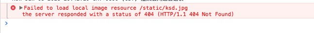
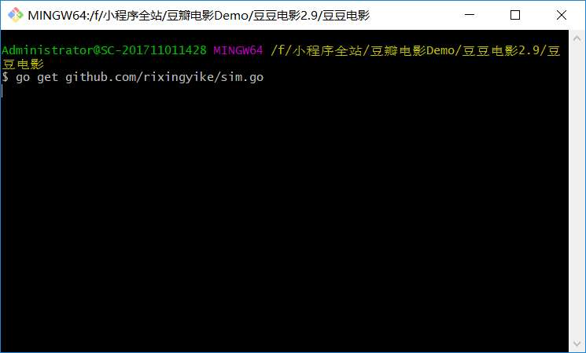
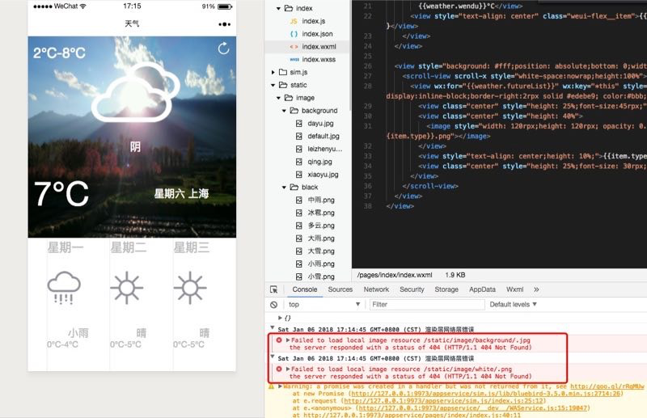
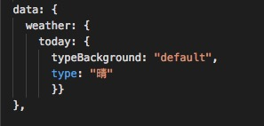
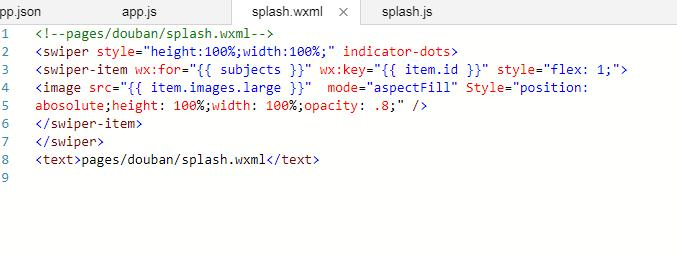
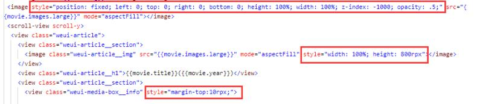

# 小程序从0到1：1月9日群问题集锦

目录

[TOC]

## 1，如体在群内提问？

可以参考一下在stackoverflow或github上提问的方法，一次把问题讲明白，用文字说明+截图的方式。目前在学习哪一章，遇到了什么问题，把运行截图贴出来。

## 2，读者：“我用书上的方法为什么没有找到调试域名”？

可能新版本不好使了，毕竟这本是一个非官方的办法。

## 3，读者：“go env 之类没问题，但是go get sim.go类库回车没反应..”

这不叫没反应。

这位读者还是没仔细读文档，get是go语言的指令，如果运行出错，它会直接提示。这种情况，可能是网络被墙了，一直在请求中。按照群公告文档1的步骤做，里面有免翻墙安装google官方类库的方法。

## 4，能不能加作者微信？

可以加微信。

## 5，读者：“ retrieveData函数放在哪个页面呢”

微信开发者工具有全局搜索功能，选择菜单“编辑”->"全局搜索"

## 6，读者：“豆豆电影项目最后只能在调试环境下运行，由于审核无法通过而无法真正上线运行，是这样嘛”

需要有备案过的服务器加域名。（读者@杜创）

## 7，“请问下，这个电子书有离线版本的吗？能不能下载下来看？”

找到了告诉我，我举报盗版。

## 8，在界面上绑定的值，如果设置默认值？

缺少默认值的错误表现

例如weather.today.type：

## 9，读者“这都是些什么基础的人啊，之前还有人模板字符串不知道，本来还以为可以交流的..”

术道有专攻，每个人的基础不一样，要尊重每一个人，求同存异。

## 10，读者“我完全是按照书上来的啊，检查了几遍了，为什么还有错？”

拼写不认真，80%的错误都是由于拼写不认真。例如，这里面的Style的首字母大写了，再如absolute写成abosolute了。写程序错一个字符都不行。

## 11，想让134横排显示怎么弄，设置什么属性？

查flex布局相关。

## 12，图片为何挤到了一起？

9.2版本的iPhone plus会出现以上问题。升级iOS固件版本，解决。

## 13，读者“style中的最后一个分号可加可不加是吗？”

对。