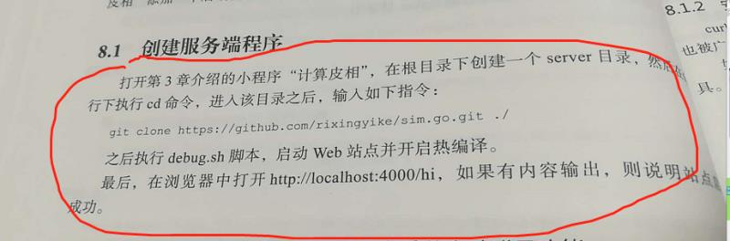
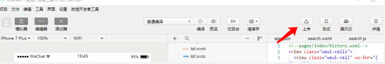
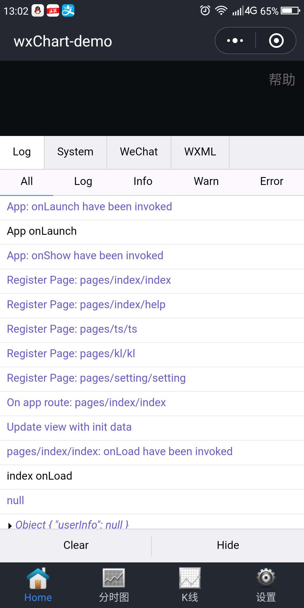
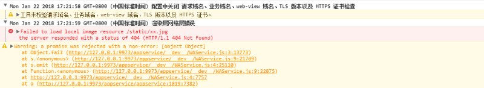
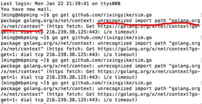
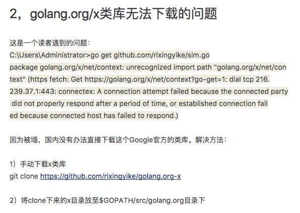

# 02 小程序从0到1：1月23日群问题集锦

## **1，打发下无聊时间，制作一个简单的小游戏，不难吧？**

a)如果没有js基础的话，不行的，我在知乎Live课（[如何从零开发一款「微信小游戏」](https://www.zhihu.com/lives/930123989723004928/)）里面贴了一个js基础教程的链接（http://www.shouce.ren/api/view/a/827），那个起码要看一下。

b)还有在我的书《小程序从0到1》里面，第15章是关于js的入门，也建议看一下。

c)这两个都看了以后呢，你把我在Live课（[如何从零开发一款「微信小游戏」](https://www.zhihu.com/lives/930123989723004928/)）里面发的那个demo，仔细研究一下，在本机上跑一跑。

## **2，微信的第三方平台是个什么样的存在？**

公众平台第三方平台是为了让公众号或小程序运营者，在面向垂直行业需求时，可以一键授权给第三方平台（并且可以同时授权给多家第三方），通过第三方平台来完成业务，开放给所有通过开发者资质认证后的开发者使用。

从业务特征上来说，第三方平台必须如图所示：

​    

## **3，这一段是做什么用的？服务端为什么要连接其它网址？**

​    

在这里，git clone是为了从github上下载服务器端示例源码，方便在此源码的基础之上修改。

## **4，第2.9.5节说在”项目“，上单击”上传“按钮，没有上传按钮啊？**

看下图的右边：

​    

新旧版本的微信开发者工具在布局上存在一些差异。

## **5，第3章 计算皮相  ，这是一个计算器，为什么叫计算皮相？皮相是什么东西？**

随便起的。

## **6，用sim.go可以给自己的数据库写类似豆瓣的API吗，我觉得最难的就是如何把数据库部署到API上？**

第8章就讲到了从Sqlite3数据中取数据，并从分页接口取出。

## **7，豆瓣API不能调用了怎么办？**

豆瓣API的网址

https://developers.douban.com/wiki/?title=movie_v2#top250

豆豆电影中主要用到的接口有——

豆瓣电影详情接口：

http://api.douban.com/v2/movie/subject/1764796

榜单：

http://api.douban.com/v2/movie/in_theaters

http://api.douban.com/v2/movie/coming_soon

http://api.douban.com/v2/movie/top250

以上接口作者亲测，都还可用。不存在豆瓣倒闭或封杀小程序调用的情况。毕竟我们很渺小。

如果单一IP调用过多，可能被关小黑屋一天。有网友做了nginx代理，提供了代理接口，可以一看：

https://github.com/zce/weapp-demo/blob/master/README.md

## **8，关于第7章接口调用的问题**

有读者完成了第七章的功课，修改了第二章的index页面，item页面的api url

1）http://localhost:4000/movie/bang/in_theaters  有数据返回

2）单部电影有数据返回，页面正常

问题是：

http://localhost:4000/movie/bang/coming_soon

http://localhost:4000/movie/bang/top250

这两个没有数据返回， index页面后两项无显示。

榜单接口coming_soon、top250与in_theaters是类似的。如果后者能访问，前二者也可能是正常的。可以在小程序中使用console.log()查看服务器端接口返回的数据。然后进一步排查问题出在哪里。

## **9，为什么同样的代码，pc正常，手机端 onload就加载不到数据呢？**

​    

这种情况，首先要检测一下接口地址，如果接口地址使用了localhost，在手机上是没有localhost的。可以将手机与电脑的服务器端放在同一个网段，然后使用类似于“192.168.x.x”这样的局域网IP代替localhost。

## **10，怎么查找调试域名，书上第6.1.1节的方法试了，不行啊？**

​    

通过修改image组件的src属性为错误的地址，故意让程序出错，以此查看调试域名的方法，现在行不通了。在新版本的微信开发者工具中已经屏蔽了，毕竟这本是一个非官方的方法。

## **11，小程序中，怎么合并这两个对象啊？**

```js
var userinfo = {avatarUrl:"1",
city:"2",
country:"China",
gender:1,
language:"zh_CN",
nickName:"3",
province:"4"}
var openid = {openId:'5',session_key:'6'}
```

用Object.assign()合并

## **12，go get github.com/rixingyike/sim.go 一直执行不成功？**

出现“unrecognized import path 'golang.org/x/net/contxt'”的错误

​    

在这篇群公告文章（/posts/2018/04.html）中讲了。

​    

要仔细阅读群公告文章，这里都是别人踩过的坑。

## **13，如何从一个小程序能跳到另一个小程序？**

使用接口：[wx.navigateToMiniProgram(OBJECT)](https://mp.weixin.qq.com/debug/wxadoc/dev/api/navigateToMiniProgram.html)