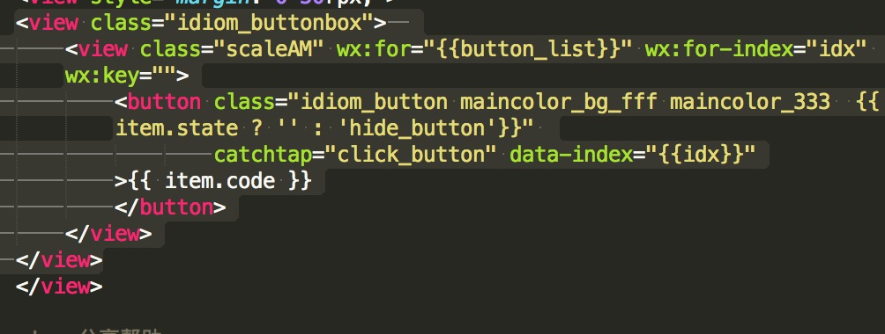
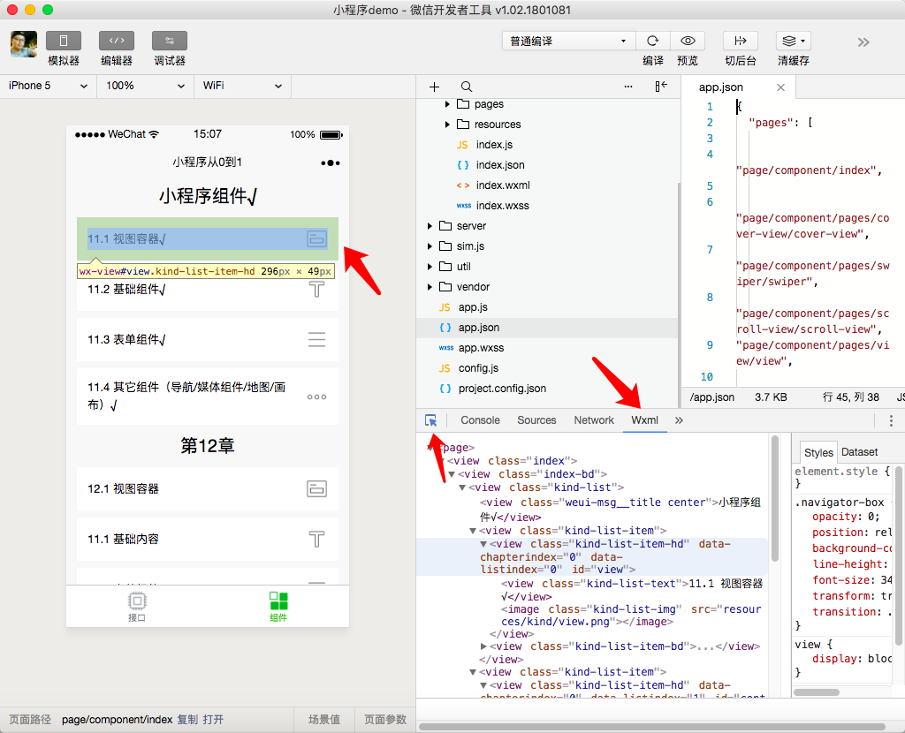
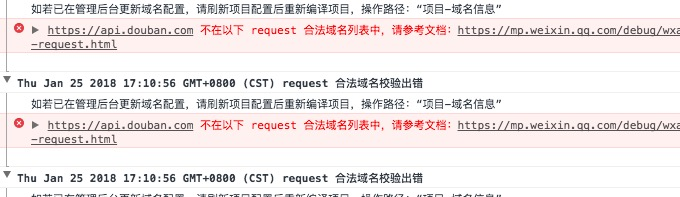
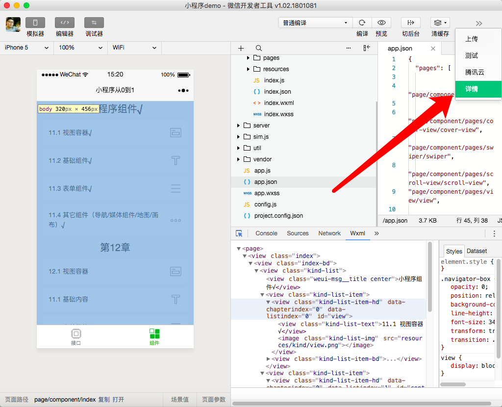
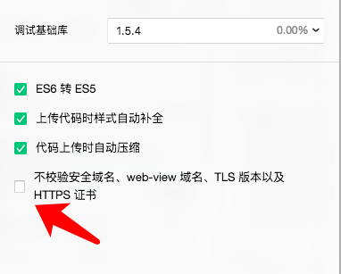
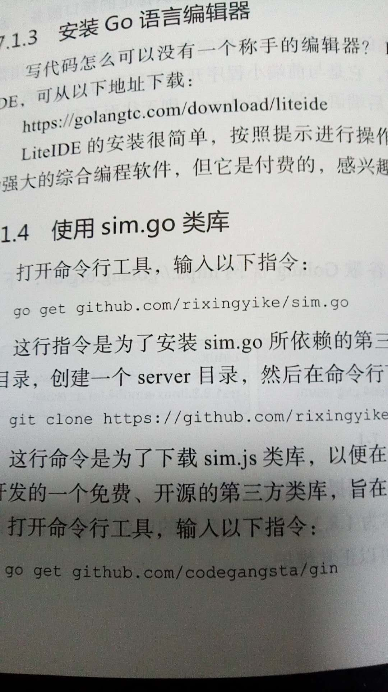
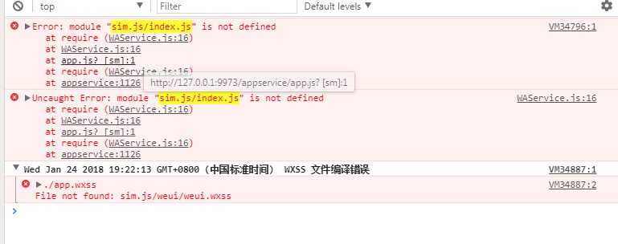
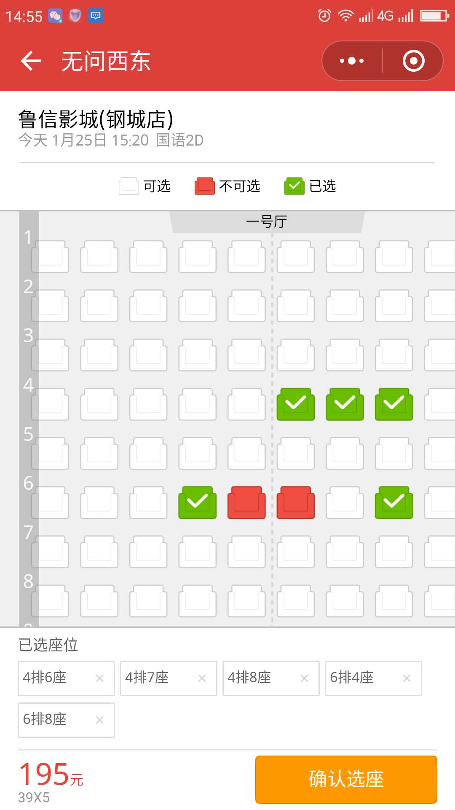
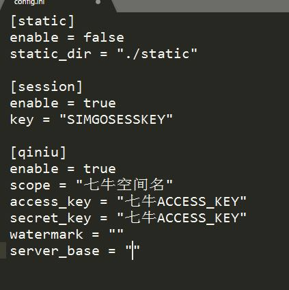
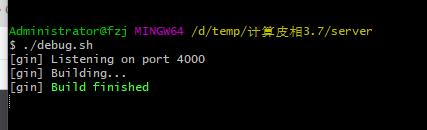

# 03 小程序从0到1：1月25日群问题集锦

## **1，大家都是在第三方平台上做的小程序吗？**

据作者观察，大家好像还是用微信开发者工具最多。

## **2，有没有朋友遇到过，for循环节点显示不出来的情况？**

​    

这种情况，可以在Wxml面板中查看button节点有没有生成，如果有，再查看样式的设置是否正确。关于Wxml面板，如下所示。需要注意的是，在小游戏版本的微信开发者工具中，是没有Wxml面板的，虽然它们的名字一样。

​    

## **3，一个帐号可以弄几个小程序啊？**

企业、政府、媒体、其他组织主体可以注册50个小程序，个体户和个人类型主体可注册5个小程序。

## **4，这个是在什么地方设置呢？**

​    

在项目“详情”中



反选“不检验安全域名”：

​    

拟增加进快速创建项目，或第一次调用接口一节中。

## **5，第7.1.4节，命令行工具是指？**

​    

在win上指命令行窗口（cmd），在mac和linux上指终端窗口。如果安装了git bash，在win上直接使用git bash就可以了。

## **6，建议群主搞个go和类库安装的详细说明，小白太多？**

书第7.1.1节，即是“安装Golang语言包”。Go语言类库的安装，十分简单，一条指令：

```
go get xx
```

后面跟类库的git网址，一般是github的项目主页地址。

## **7，我从内嵌的H5页面跳转回小程序页面，怎么跳转？**

可以考虑 wx.miniProgram.navigateBack 接口。详见：

https://mp.weixin.qq.com/debug/wxadoc/dev/component/web-view.html 

## **8，服务器空间需要买多大的？**

如果选择了ubuntu系统，服务器主机默认一般有20G系统盘，足够了，程序基本不占空间。涉及的图像、视频的存储，建议用存储云；数据存储使用关系数据库，例如mysql。

## **9，关于js“js not defined”错误？**

​    

这种错误一般是没有找到对应的文件，例如sim.js/index.js。请在资源管理器中查看一下文件是否存在，还有引入的路径有没有写错。

## **10，请问这种框是什么组件？电影选座页面**

​    

这种功能复杂的页面，都是自定义实现的。小程序自带的组件，大多数都极简单，像DataPicker已经算是复杂的组件了。

## **11，AppID不够用了**

现在练习前后端，要输入小程序 的Appid，一个手机号只能注册5个小程序，那我现在练习这个是不是就占了一个？每练习一个就占一个名额？

重复使用一个就可以了。

## **12，请问老师第7章的服务器可以直接放在我的腾讯云服务器上运行，然后我通过服务器的ip地址访问吗？**

完全可以，作者授权所有读者免费使用。上线后，可以通过IP访问。

## **13，笑林百家的图书存储，如果不用七牛空间怎么弄？**

​    

可以尝试自己写一个直接存于硬盘，或者用腾讯的云存储。但这样的话，和上面的配置就没有任何关系了，它仅适用于qiniu的云存储。

话又说回来，为啥不用呢？许式伟还没有给我广告费，推荐读者用它，仅是因它免费易用。

## **14，控制台在那里？**

微信开发者工具的console面板。同学，请注意看书，不要开小差。

## **15，浏览器访问接口没有正常输出？**

​    

这里的地址，不用加s，使用http即可。另外，在启动debug.sh脚本后，出现如下的阻塞状态，这是正常的。

​    