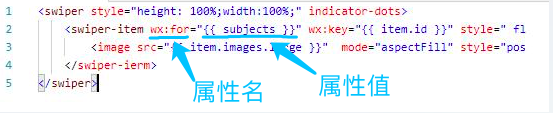
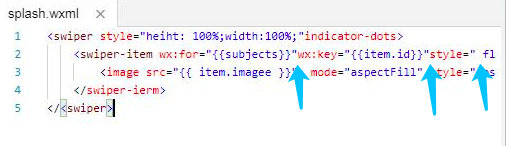
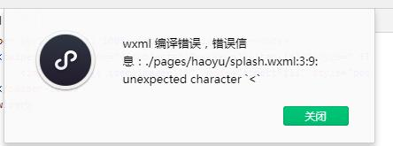
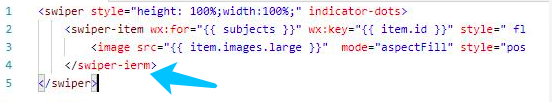
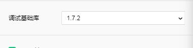

# 小程序从0到1：MXML基础语法与错误信息

## 1、理解标签与属性

在MXML标签中，尖括号都是成对出现的。像这样：

```
<..>...
```

尖括号中间是标签名，例如swiper、swiper-item、image等，这些都是标签名。

每个标签默认都有一些属性，属性名与属性值以符号“=”连接，属性值用双引号引住。如下所示：

​    

还有，属性与属性之间，要有空格。属性值开始处不需要空格。

​    

如上所示，属性名“wx:key”、“style”之前缺少空格。属性"style"的值，开始处并不需要空格。

## 2、仔细阅读错误信息

如果MXML有错误，微信开发者工具会弹出错误信息，要仔细阅读错误发生在第几行、第几个字符、错误信息是什么。例如：

​    

该错误信息讲，第3行第9个字符，出现了一个不应该出现的“<”字符。

依照错误信息，去代码检查错误，才能做到按图索骥，事半功倍。

## 3、注意单词拼写

如下所示，只因“swiper-item”错拼为“swiper-itrm”，程序编不过。

​    

拼写单词一定要细心，错一个字符都编译不过。英语基础不好的读者，尤其要注意这点。在小程序中，用作标签名的单词，都是真实的有意义的单词，如果不认识，不妨查一下词典，将拼写识断清楚。

## 4，基础库版本需要更改吗？

有读者问这样的问题，编写书上的demo，需要指定基础库的版本吗？

​    

答案是不需要。