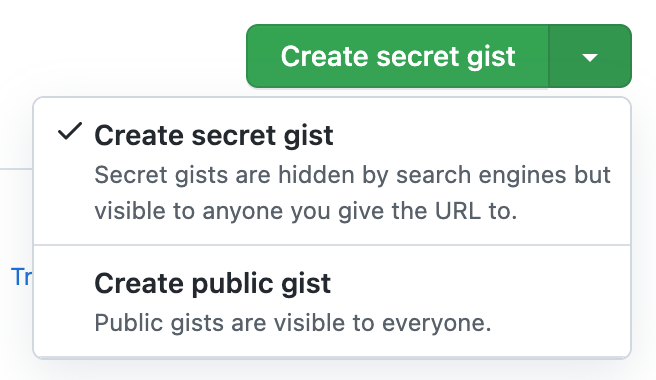
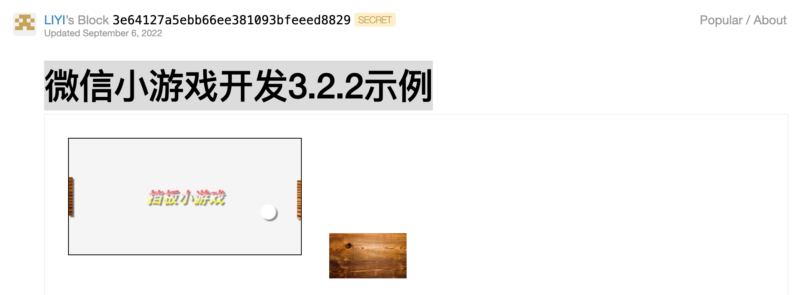

# Github Gist是什么？

[Gist](https://gist.github.com/)，中文要点，/dʒɪst/，是Github提供的一个子服务，可以在线分享比较小的代码片段，同样的代码如果用传统创建仓库的方式分享可能就显得笨重了。Gist就是一个精简版的Repository。下面是我用《微信小游戏开发》3.2.2示例代码做的实验，及实验感受。

<!--more-->

## 它分享的范围有哪些？

创建时有两个选项：



第一个选项“Create secret gist”，虽然有 secret，但也不是私密的，看到分享链接的人都可以访问。第二个选项，是一个完全公开的、搜索引擎可以抓取的链接。

基本公司团队内分享，使用第一个选项合适；撰写一个小教程，就像我这篇文章一样，适合使用第二个选项。这个选项或许还可以让我们的文章有更多的曝光量，当然这仅限于你在代码中可以留下了文章链接。

## 它有什么用法？

在线创建后便可以分享了。

### 在页面中内嵌代码

直接在 md 或 HTML 页面中，用 script 标签嵌入一个 js 地址：

```js
<script async src="https://gist.github.com/rixingyike/3e64127a5ebb66ee381093bfeeed8829.js"></script>
```

它是怎么工作的？这个很容易猜出。

js 文件链接本身即包含了足够的信息，它会先动态加载基本的类库，然后再把要加载的对象信息传递给类库，对象（我们分享的代码）加载完成之后，最后统一在页面上创建 HTML 元素并把代码渲染出来。

如果查看上述 8829.js 文件的代码，它的内容类似是这样的：

```js
document.write('<link rel="stylesheet" href="https://github.githubassets.com/assets/gist-embed-19d8e57711b3.css">')
document.write('<div id=\"gist118190366\" class=\"gist\">\n    <div class=\"gist-file\" translate=\"no\">\n...')
```

第一行是 Github 基本的CSS样式类库，第二行是与我们每一个分享的代码有关的信息。

### 分享链接

https://gist.github.com/rixingyike/3e64127a5ebb66ee381093bfeeed8829

注意，这个地址很奇妙啊，这不就是上面那个js文件的地址吗？只是少了一个js后缀。在Github的服务器端，加上后缀是被引入的js文件，不加是Gist代码的主页地址，这样的API设计不可谓不算简约。

### 提供一个 zip 下载链接

https://gist.github.com/rixingyike/3e64127a5ebb66ee381093bfeeed8829/archive/9b29a41650efa5bd9884d27ba9cb617e0291f8e1.zip

对于自己已经创建的历史 Gist，Github 都有记录，这个地址就是 Gist 地址加上自己的 Github ID，例如我的 Gists 地址是：

https://gist.github.com/rixingyike

## Gist 不能在线直接运行吗？

目前不能。

Gist 允许同时分享多个文件，我在使用时看到这个功能还很高兴，因为可以保持文件的名称和相对位置，对于前端小示例，便意味着可以在线运行。

事实上不可以。

事实上 HTML/CSS/JS 组成的静态示例，是可以实现在线运行的。

对于看到分享链接的读者来说，不仅能看到代码，还能看到运行效果。甚至其他语言，例如 Python、Go 等，借助 WebAssembly 技术，也可以实现在线查看源码与运行效果。

虽然 Gist 官方不能，但有人开发了第三方应用，可以动态加载 Gist 并呈现动态效果，例如：

https://bl.ocks.org/

使用方法也很简单，直接将上面自己的分享链接中的 gist.github.com，替换为 bl.ocks.org 即可。例如我的这个小示例微信小游戏开发 3.2.2，在线查看地址为：

https://bl.ocks.org/rixingyike/3e64127a5ebb66ee381093bfeeed8829

运行效果为：



它已然是一个「活」的 HTML 页面了。但它在这里只是一张图片，那么这个示例效果页也可以嵌入吗？

的md文件内应该是可以的，因为md支持HTML代码嘛。嵌入效果如下：

<iframe sandbox="allow-popups allow-scripts allow-forms allow-same-origin" src="https://bl.ocks.org/rixingyike/raw/3e64127a5ebb66ee381093bfeeed8829/9b29a41650efa5bd9884d27ba9cb617e0291f8e1/" marginwidth="0" marginheight="0" style="height:100px;" scrolling="no"></iframe>

嵌入结束。

没有效果！没有办法，资源是bl.ocks.org的，人家拒绝我们跨域嵌入，我们便无法通过iframe引入了。

## 其他问题

### gist.github.com 被墙无法访问的解决办法

可以用梯子，或者修改 hosts 文件，直接将 gist.github.com 指向它的 IP 地址（例如 192.30.253.118），这一招破解的是 DNS 污染。

具体指向哪里，不一定，可以在本地用 ping 指令查看一下。希望你的 ping 结果不是这样的：

0 received, 100% packet loss

### 有人把 Gist 当作一个写作平台

这件事是结合http://roughdraft.io来做的，但其实没有必要啊。Github仓库+hugo+Github Actions 就可以构建一个完美的静态博客，没有必要用结构松散的 Gist。

#### 如何看待 Github Gist 这个服务，怎样更好地利用？

就是一个阉割版的 Repository，便于在线分享内容，不局限于分享代码。正常使用就可以了，过度使用就没有必要了。

### How to create a GitHub Gist with API?

先创建 Github Token，然后在下面这个网址：

https://docs.github.com/cn/rest/gists/gists

找到需要的 REST API，进行 Gist 的 CURD 操作就可以了。

## 小结

当然了，Gist 本质上最大的功能，还是内嵌代码，且天然支持高亮，效果如下所示。


::: tip 
没有用过 Gist 或不能用 Gist，感觉像吃手把肉没有韭菜花一样，有点不完美。
:::
