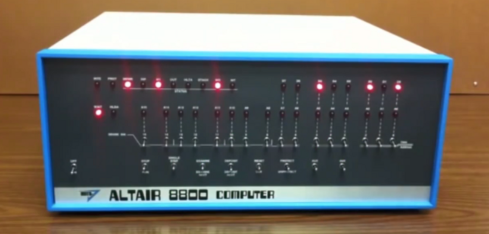
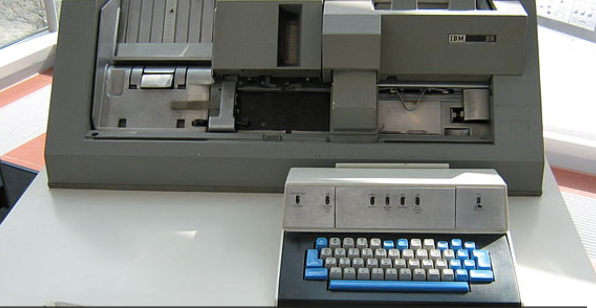
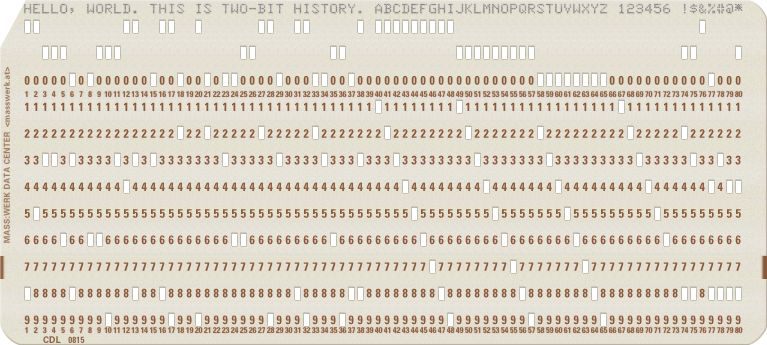
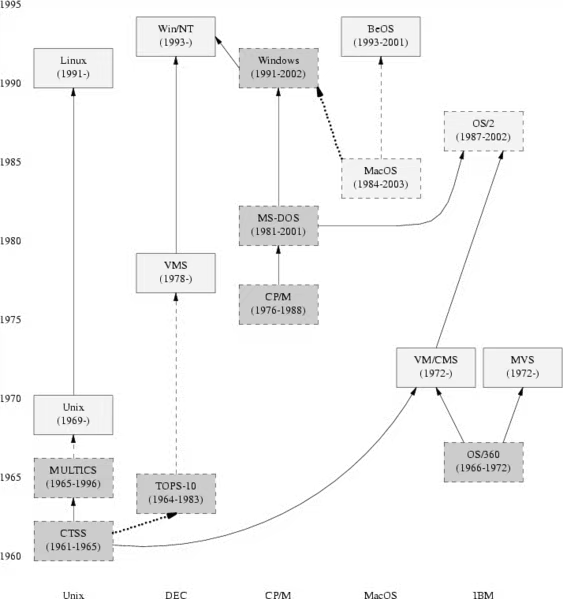
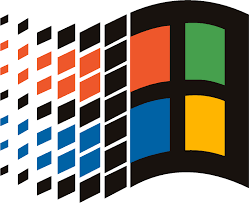

# 基尔代尔是如何错失操作系统市场的？

基尔代尔果然是一位学者企业家。他有企业家的敏锐嗅觉和欲望，但同时又保留了学者的锐意创新和儒雅。他一只脚踏在了商业领域，另一只脚踏在了学者领域，只有他这样的人，才能开发出符合市场需要的CP/M，肯·汤普逊和比尔·盖茨都不可以。

如果你是当年的基尔代尔，面对微软的商业竞争你会怎么做呢？

这个问题应该没有什么标椎答案。笔者阅读了一些相关资料，有人说基尔代尔博士是一位计算机发展史上完全被低估贡献的极客，还有人说钱是万能的，历史的小姑娘被人打扮了，比尔·盖茨在他的著作《未来之路》中刻意将卖给他QDOS（一个DR-DOS的变种）的蒂姆·帕特森捧了出来，淡化了基尔代尔在DOS系统发展史上的贡献。甚至称通过抄袭赚了7.5万美元的蒂姆·帕特森为「DOS之父」，天哪，哈哈，如果蒂姆·帕特森是DOS之父，那么基尔代尔博士在历史上又做了什么？

<!-- more -->

对此我有不同的看法。历史是一个小姑娘，谁都可以打扮，既可以往左打扮，也可以往右打扮；比尔·盖茨的书不可以全信，但借此批评比尔·盖茨的文章也未必值得全信。基尔代尔博士在DOS发展史上的贡献毋庸置疑，盖茨在《未来之路》中的叙述确实也有失大方，但我想说的是，这里面已经发生的事，有各自的缘由，这些对我们都不重要，重要的是我们从这段历史中能得到什么启示？

## 三点启示

读史使人明智，基尔代尔博士为什么没能创建一个微软？微软的商业模式在当时为什么可以如此成功？这里面至少有3点启示：

- 一，一定要开放，Unix于1969年就被开发出来了，但它却没有比7年后，1976年诞生的MS-DOS的前身——CP/M获得更多的用户市场；
- 二，一定要重视生态，IBM的OS/2 Wrap系统不比微软的MS-DOS系统做的好吗？当然不是，只因为微软先发制人，占领了市场先机，致使后来者即使再优秀也不能取而代之；
- 三，一定要有一个好的商业模式。在微软还没有起飞之前，基尔代尔博士的DR（Digital Research，数字研究所）公司在微机市场占有最大的市场份额，这种情况下为什么微软还可以发展起来？微软的商业模式既保持了生态上的开放性，在开放的同时又最大化保护了自己的利益。微软的操作系统是与硬件绑定的，厂家每卖出一个电脑，微软就会自动卖出一个系统。

## 计算机系统的进化史

为了了解微软为什么可以崛起，我们有必要先梳理一下计算机系统的发展史。

### 开关编程


1946年，为给美国陆军的弹道研究实验室（BRL）计算火炮火力表，世界上第一台图灵完备的电子通用计算机ENIAC诞生了，开始它还没有操作系统。那个时候它就是一台北京三室一厅那么大的电子计算器，计算机小姐（Computer Lady，是真正的小姐，有知识有文化）需要在ENIAC上手动拨动开关，以进行编程，就像在计算器上按键一样。


靠手动拨动开关进行编程的效率肯定低了，也容易出错。

### 第一台家用计算机阿塔尔8800

1974年面世的阿塔尔（Altair）8800，如下所示，它由美国微型仪器和遥测系统（MITS，Micro Instrumentation and Telemetry Systems）公司，基于Intel 8080微处理器实现，它是第一款取得商业成功的家用计算机。当时还在哈佛读书的比尔·盖茨与其小伙伴保罗·艾伦一起为Altair 8800设计了Altair BASIC编辑器，这款编译器后来变成了Microsoft BASIC，成为了MS-DOS系统的基础，后来又变成了Microsoft QuickBASIC，最后成为了今天依然流行的Visual Basic。Microsoft在命名上也以Micro开头，可能收了MITS的影响。包括比尔·盖茨退学创建微软，也可能与这次成功的外包经历有关。注意这个时间，1974年，比基尔代尔博士发布CP/M，还有二年时间。

> 注意：BASIC并不是比尔·盖茨设计的，最原始的BASIC语言是在1964年由约翰·克米尼和Thomas E. Kurtz设计的。



阿塔尔8800虽然是一课家用计算机，但要给他编程并不容易，要拨动面板上的开关，靠输入二进制操作码输入数据（一堆0和1），然后按「存储键」把临时值写入内存。注意，这时候计算机已经有了内存了。

待到把整个程序都写入内存后，推动开关，内存地址重设为0，按「运行」按钮，灯闪烁起来，阿塔尔就开始运行了。下一次如果要计算别的什么，重新再来一遍开关编程，阿塔尔与其说是一个电脑，不如说是一个大玩具。

### 打孔机编程

人们或许从早期可编程纺织机上获得了灵感，发明了打孔机，专门给纸卡打孔。开关只有两个状态，不是0就是1，上机前先在纸带上把要输入的0、1数据准备好，等计算机空闲了，拿纸卡往读卡器一插就可以了。用打孔机编程，不仅提高了计算机的利用效率，还减少了出错率。

IBM在1964年推出的IBM 029打孔机是当时打孔机的代表，如下所示：



IBM 029是作为IBM System/360 大型电脑的配件而发售的，用IBM 029打出一种一种打孔卡，如下所示：



将这种打孔卡插入IBM System/360，计算机就可以自动输入数据，已经不再需要波动开关了，计算机小姐们觉得太幸福了，此时离1946年ENIAC诞生已经过去了18年。

ENIAC作为第一台图灵完备的电子计算机，后来它其实也是有打孔机和读卡器的，如下所示，在房间位置的下方，放置的便是读卡器和打卡机，而上方及左右两侧都是计算模块，最多的是累加器。区别是什么？ENIAC是军用的，而IBM 026和IBM System/360是商用的。


## 编程语言的进化史

编程语言在计算机的发展中，起到了决定性的作用。如果不是编程语言作为工具可以持续创新，计算机不会发展的如此迅猛。

### 助记符和汇编语言A-0（1952）

打孔机编程有一个问题：不支持循环和跳转。如果某段机器码想要再执行一遍，计算机小姐们必须将纸带环过来，再输入一遍。

还有，在使用打孔机制作纸卡时，科学家们往往会事先把要输入的机器码内容写在纸上，这也很好理解，因为谁也不可能把成百上千张数据全部记在脑子里。而为了记述和理解方便，往往会在机器码旁边写上助记符。举个例子：

```shell
0010 1110 # LOAD A
```

这段机器码0010是操作吗，1110是数据吗，整段表示将内存中的值复制到寄存器A。行尾的LOAD A就相当于是助记符。在打卡机编程时代，计算机小姐输入的是0010 1110这样的机器码，并不是LOAD A这样有自然语义的助记符。

这时候有一个聪明的第一代计算机小姐葛丽丝·霍普（Grace Hopper）博士，她想，既然有助记符，为什么还要写机器码呢？人类通过键盘（当时早已经有打字机键盘了，打字机的出现比计算机早）向计算机输入助记符，先存在内存里（当时图灵完备的计算机也已经有内存了），然后由计算机负责将助记符翻译为机器码，翻译以后再运行，这样不比直接写和输入机器码更高效吗？


这是一个了不起的想法，葛丽丝·霍普据此实现了算术语言版本 0（Arithmetic language version 0），简称A-0，或称A语言。A语言已经是一个汇编语言了。A-0之后还出现过A-1、A-2、A-3等，或许由于理念太先进，或许因为配套设备不齐全，A语言并没有流行起来。这一年是1952年。

### FORTRAN（1957）

几年以后，IBM 在 1957 年发布了公式翻译程式语言FORTRAN，它的名字是英文Formula Translation的简写，如下所示是一个Hello World示例。

```fortran
Program main
Implicit none
write(*,*) "Hello World!"
End program main
```

FORTRAN的开发者想，既然计算机可以翻译，并且要这样做，那么为什么不做的更彻底一些呢？于是FORTRAN的语法相比A语言，更易读、易懂，它是第一门面向过程的有函数和变量支持的编程语言，FORTRAN主宰了早期的计算机编程。

FORTRAN以后，计算机编程语言开始了长足发展。

### COBOL（1960）

1959年5月，美国国防部委托葛丽丝·霍普博士制定COBOL语言标准。霍普为了A-0奔走演讲多年，在FORTRAN语言发布之后，终于得到了世人的重视。但霍普实际上并不是COBOL的编写这，当时有一个6人的编写小组，他们把自己关在一个酒店里，基于霍普已有的工作基础，两周时间完成了COBOL首版的开发。这大概是人类历史上有记载的最早的封闭式开发。

### BASIC（1964）

1964年，达特茅斯学院的两位教授约翰·克米尼和Thomas E. Kurtz，推出了BASIC语言。这个语言没有FORTRAN和COBOL强大，它主要作为教学使用。1977年主动从哈佛退学的学生比尔·盖茨，自然是可能知道和学习过这门语言的。

### B语言（1969）

大约1969，美国贝尔实验室的计算机科学家──肯·汤普森，如下所示，他想在Unix系统上开发一个Fortran编译器，后来因为在编写过程中引进了另一种编程风格，改着改着，就形成一们新语言——B语言。B语言在命名上是为了向A语言致敬，以表达谦逊之情；我们周围有些程序员不是这样，在别人某个东西的基础上搞了点东西，就命名为某+，或者某Pro、某Super，总是标榜高出别人许多。


Unix系统也是在这一年开始开发的。

### Unix系统与C语言（1969-1973）

大概在1969年至1973年间，贝尔实验室的丹尼斯·里奇与肯·汤普逊，以B语言为基础，当时他们为了移植与开发UNIX操作系统，还有玩一款游戏，无意中设计和开发出了C语言。如下所示是一个C语言版本的Hello World程序示例：

```c
#include <stdio.h>
int main(void) {
    printf("Hello, world!\n");
    return 0;
}
```

当时贝尔实验室有一台PDP-7计算机，如下所示。肯·汤普逊是一为当之无愧的计算机大佬，他在1966年写过一款名字叫Space Travel的游戏，估计是使用FORTRAN编写的。他先是为了在闲置的PDP-7上玩这款游戏，想写个高效的FORTRAN编译器，不小心发明了B语言。


后来新的编译器完成了，B语言也有了，仍然对游戏的流畅度不满意。于是，开始重写PDP-7的系统，即Unix系统，并在这个重写的过程当中，和他的同事丹尼斯·里奇一起，发明了C语言。

大神的创造力真不是盖的，没有游戏，写一个，没有趁手的编程语言，写一个，操作系统不高效，写一个。在大声眼里，语言和系统一样，都是工具，都是可以随手打造的。

Unix系统诞生的时间大概在1970年。

## 操作系统的进化

基尔代尔在现代磁盘操作系统的发展上确实功不可没，他通过DR公司在商业上赚了不少钱，这与他早期积极编写程序并尝试卖给Intel有关，他因次洞悉到了更多的前沿需求。

### 基尔代尔创造PL/M编写CP/M（1973-1974）

Unix系统诞生这么早，为什么没有发展起来呢？



原因大概有两个：

- 两位作者是实验室的研究员，对商业化运作不敢兴趣，只对写游戏、玩游戏感兴趣；
- Unix系统是封闭的，不具有开放的生态，没有快速发展的土壤。

1972年，基尔代尔博士（如下所示）偶然在华盛顿大学公告板上看到一则二手出售广告，有人以25美元的价格卖一台装备英特尔4004微处理器的微机。基尔代尔买下了它，相比300万美元的IBM 360计算机，这台微机实在太便宜了。


与肯·汤普森不同，基尔代尔对赚钱感兴趣，他与几名程序员为4004编写了一个游戏程序，他们找到英特尔的老板罗伯特·诺伊斯推销这个程序。英特尔不感兴趣，诺伊斯深信微处理器的未来在其他方面，当基尔代尔问他在什么地方是，他认真地说：“可能在钟表方面。”

不过英特尔发现基尔代尔有出色的数学程序编程能力，于是邀请他到英特尔参观，并请他担任顾问。1973年，基尔代尔应邀参观了英特尔的微机部。基尔代尔与英特尔的人很投缘，他用每周一天的休息日在这里担任顾问。基尔代尔很喜欢这个新职务，也迷上了微处理器。

不久英特尔让基尔代尔试用新出炉的8008，只用了几个月，基尔代尔就创建了计算机历史上具有革命性意义的高级结构性汇编语言PL/M（Programming Language for Microcomputers的简写，中文微机程序设计语言，1972年创建），并用该语言在1974年编写了微型计算机操作系统CP/M（Control Program for Microcomputers的简写，中文微机控制程序）。注意这里的CP/M是程序，并不是系统，因为在当时的人眼里，系统是不存在的，所谓的CP/M就是一个大程序。

基尔代尔随后开始为8080微处理器开发PL/M的不同版本，8080芯片取代了8008，并成为微型计算机革命的真正开始，后来出现了耳熟能详的80386、80486等微处理产品。

### CP/M的意义在哪里？

以往，计算机的硬件和软件是分开的，普通人即使购买了Intel 4004或8080的微处理器，也无法直接使用，微处理器必须装在一个计算机内，并且这个计算机内还要预装一个专用的计算机系统才能使用。而在当时1973年，像贝尔实验室的Unix系统、IBM的OS/360系统都是封闭的，普通人是拿不到的。基尔代尔的CP/M，就是Intel微处理器的一个软件系统，有了这个系统，任何人都可以基于Intel微处理器做定制开发。

这个时期出现了很多极客，他们喜欢自己动手DIY自己的电脑，同时期的微软联合创始人保罗·艾伦，还有苹果的联合创始人史蒂夫•沃兹尼亚克，都是这时期开始玩电脑的，包括比尔•盖茨也是。后来出现的Windows95、Windows98，其实是在DOS系统上开发的一个大程序。而DOS系统，是Disk Operating System的简写，它鼻祖就是基尔代尔的CP/M。也正因为如此，人们普遍认为基尔代尔是磁盘操作系统的鼻祖，是计算机图形用户界面（GUI，Graphical User Interface，图形用户接口）的先驱，他在计算机历史上的地位被严重低估了。而这种低估，与比尔•盖茨的小气是分不开的。

基尔代尔自己把CP/M叫做BIOS（基本内存输入输出系统），它适用于任何极客DIY电脑。BIOS作为通用部分，极客可以自己对它进行修改，以使他们的磁盘驱动可以与计算机相匹配（当时有不同的磁盘硬件）。这种设计，使得CP/M容易被人们所接受。

## DR的没落与微软的崛起

基尔代尔后期困在了自己的思想里，未能与时俱进，不然创建微软商业帝国的人可能就是他。商业有商业的规则，在商言商，经商与做人、教书还是不同的。

### 基尔代尔失败的占星机项目

虽然CP/M很牛逼，但它的发展十分奇特。当时基尔代尔一边教书，一边和朋友基于CP/M做了一个占星机的项目。他俩对占星术既无兴趣也不相信，但他们都认为这个项目的销路会不错。朋友造机器，基尔代尔编程序，两人软硬结合，很像苹果和微软开始的联合创始人组合。

他们把这种占星术既机器放在旧金山市内许多地方的杂货铺，吃着25美分的硬币，印出算命天宫图，基尔代尔觉得这台机器美得很。可是顾客却大为不满，因为机器吃进去硬币，纸就堵成一团。基尔代尔不得不承认，占星术项目在商业上完全是一个失败。

### 基尔代尔的数位研究公司（1976年）

1976年，基尔代尔离开学校，与妻子多露西一起创办了一个数字研究所（Digital Research Inc.），只看这个名字，就知道老板是一位学者企业家。公司由妻子多露西负责经营，这个公司的商业模式很简单，就是卖基尔代尔编写的CP/M系统。

1976年多露西曾怀疑公司能赚到的钱会超过1.5万美元，而事实上它赚了60万~80万美元。在开始的五六年中，公司的收益每年都翻了一番，1981年销售额达到520万美元，三年后更是达到了4460万美元。CP/M成了70年代、80年代初最有影响力的操作系统，到20世纪80年代中期，它运行在300种计算机模型上，有3000种软件支持CP/M机，CP/M成了当时的事实标准。

DR公司连续运营了十几年，为基尔代尔夫妇带来了大量财富。1974年，基尔代尔帮助创建了硅谷最富盛名的“家酿俱乐部”（Home Brew Club），他还出过基本著作，可谓已经是人生赢家。

基尔代尔与他的妻子多露西只维持了20年的婚姻。1994年7月，年仅52岁的基尔代尔在加州蒙特利的寓所头部撞地，三日后不治身亡。一个多才多艺的飞行员、大学教师、软件编程大师、作家和计算机先驱，就这样走了，但今天很多人并不知道他的存在。

### 来自IBM的机遇，微软开始崛起

1980年，IBM准备开发IMB PC系统，因为IBM与微软的比尔·盖茨有过合作，首先找到了他。但盖茨和基尔代尔的数字研究公司有个不成文的协定，那就是比尔·盖茨不能涉足操作系统领域，同时数字研究公司也不进入比尔·盖茨的程序语言范围，于是比尔·盖茨慷慨地将IBM的代表介绍给了基尔代尔。当时比尔·盖茨认为，DOS操作系统并不是未来，程序设计语言与良好的杀手级应用软件才是未来。

IBM与基尔代尔约好在一个秀丽的加州太平洋林园见面。会谈的结果很不理想，有人说这位基尔代尔博士骄傲自大，所以当IBM带着一生难遇的大生意找他的时候，他竟然驾着他的双引擎小飞机兜风去了（当时他已经通过DR赚了很多钱），只留下他的太太多露西和IBM打交道。面对IBM一大堆不泄密的限制协议，多露西很不乐意，大部分时间都在讨价还价上，双方达成的唯一协议就是要数字研究公司不泄露IBM来访这件事。生意吹了。

随后盖茨自告奋勇揽下了这笔生意。但是编写一个操作系统并不太容易，而IBM要求几个月内就完成。这时候，盖茨的合伙人保罗·艾伦发挥了作用。他找到了一位极客蒂姆·帕特森，从他手里购买了QDOS（Quick and Dirty Operating System），付了大约7.5万美元。QDOS显然是蒂姆·帕特森在DR-DOS（基尔代尔公司的产品）的基础上修改过来的。微软将QDOS改名为MS-DOS，修改一下，倒手卖给了IBM，开始了微软的飞黄腾达之路。

1981年，IBM推出第一台带有PC-DOS。基尔代尔看到后怒了：“我对和CP/M的相似感到惊讶，它们太相像了，系统功能简直一模一样。”

IBM和微软可能因此面临诉讼，但当IBM的人和基尔代尔接触以后发现，基尔代尔只是希望IBM在以后的PC电脑中采用他的下一版CP/M。IBM当然乐于从命，微软也躲过了致命一劫。

1983年底，基尔代尔的DR公司又推出了Concurrent（并发）CP/M，其优点是计算机用户可以同时做几种操作，比如在打印机打印时，可以同时写信，这在今天就是一个理所当然的功能，但在基尔代尔的发明之前，电脑是单线程的，同时只能做一件事。

新的多任务操作系统很棒，它在1984年问世时，获得了巨大的成功。但有点迟了，到了20世纪80年代末，微软的MS-DOS已经成为操作系统上的事实标准。

### 微软的商业模式

在DR和IBM已经占领大量市场份额的时候，微软还能崛起，全靠它的商业模式。微软既不像DR，只卖系统，又不像IBM和苹果，卖系统与硬件结合的整体。微软将自己的MS-DOS与微机厂商绑定起来，厂家每卖出一个电脑，微软才卖出一份系统。并且，MS-DOS只卖40美元，DR-DOS的售价几乎是它的6倍。

还有，在用户这一侧，根本感受不到微软在赚他的钱啊，在当时电脑贵40美金，少40美金，用户根本不敏感。还有，微软提供了替换WordStar、VisiCalc的Office套件，Office又不是开源的，想要使用Office，就必须购买预装有MS-DOS系统的电脑。

而另一边，基尔代尔的DR公司本来具有先天优势，却不肯适合变换自己的商业模式。基尔代尔没有学习微软的绑定销售模式，他决定不与编写WordStar、VisiCalc之类的软件公司进行一对一的直接竞争，**他认为与自己的客户竞争，有昧自己的良心，是不道德的**。

基尔代尔果然是一位学者企业家。他有企业家的敏锐嗅觉和欲望，但同时又保留了学者的锐意创新和儒雅。他一只脚踏在了商业领域，另一只脚踏在了学者领域，只有他这样的人，才能开发出符合市场需要的CP/M，而肯·汤普逊和比尔·盖茨都不可以。

## 小结

从以上Intel、IBM、微软、DR公司的故事中，你学到了什么呢？比尔·盖茨确实是一位商业奇才，他在上大学的时候，就敏锐第嗅到了PC电脑的商机，毅然退学创办了微软，幂幂之中好像命中注定一样，好像有什么东西在指引他前进。

当他需要从蒂姆·帕特森手里买下QDOS的时候，他没有犹豫。他在DR和IBM商业经验的基础上，开创了微软独特的商业模式。在Windowns 98之后，微软抛弃了MS-DOS系统架构，只保留了Windows NT架构，这个架构曾经给微软带来了非常成功的Windows 2000服务器系统，即使在中国，都卖出了许多付费拷贝。我们今天使用的Windows 7/10/11，以及Windows Server系列的系统，均是基于Windows NT。而Windows NT（Windows New Technology），源于微软与IBM合作过的OS/2系统，后来两个公司理念不和，各自开发，成就了后来的微软。Windows NT与CP/M已经彻底没有了关系。



关于Windows NT系统的更新历史，可以查看这个链接：

https://zh.m.wikipedia.org/zh/Windows_NT

2022年9月9日