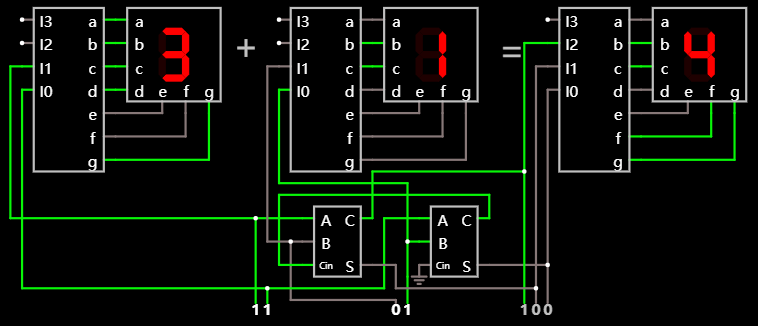
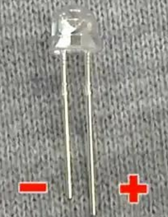
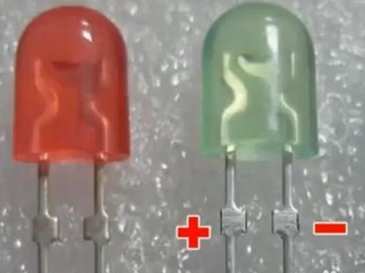

# 二极管工作原理

> 数字信号纯粹是给我们人类阅读和理解用的，在计算机的物质世界里，就是不同的具象化形态。这和我们人类的「意识」很像，人到底有没有意识？人的意识就像计算机世界的数字信号一样，其实是不存在的。当医生把死人的大脑打开的时候，和我们把磁盘打开看到的东西是一样的，什么也没有。

二极管的工作原理是什么？

还有这三个问题：

- 机器指令（整数）是如何转换成高低电平，从而被硬件识别？
- 计算机最底层的机器语言是如何变成物理电平信号输给 CPU 的呢？
- 程序里 0 和 1 是怎么转化成高低电平的？（最初的受 0 和 1 控制的高低电平如何产生的）？

这三个问题本质上是一个问题，并且，和二极管的工作原理是密不可分的。

<!-- more -->

## 什么是半导体？

首先看一个物理概念，什么是半导体？

能导电的，材料中有自由电子可以流动的，是导体，例如铜线、铝线；反之，不能导电的叫非导体，或者叫绝缘体，例如包裹在手机充电线外层的塑胶，没有这层塑胶，我们可能都无法给手机充电。

自然界的物质，除了导体、绝缘体，剩下的就是半导体。半导体源于材料的导电性质会发生变化，例如硅（Si）、锗（Ge）及砷化镓（GaAs）等，它们的原子会随着温度的升高，而出现易于移动的价电子，从而具有导电性。

半导体按物质是否纯粹还可以分为本征半导体和杂质半导体。高度提纯的硅（Si）便是本征半导体。硅具有稳定的 4 阶电子，在本征半导体中加入一些 3 阶电子物质（例如铟或铝），或 5 阶电子物质（例如磷），便变成了杂质半导体。

CPU 是计算机的核心部件，它的主要生产原料是高度提纯后的硅，这种原料在自然界并不存在，为了得到它，人类必须将海滩上的沙子一遍一遍煅烧，才能得到它。然而在得到高纯度的硅以后，还要想办法掺入一些杂质，使它变得又不纯粹了。提纯与掺杂，都是为了同一个目的：制造晶体管半导体电子元件。

晶体管包裹二极管、三极管、场效应管等多种类型，原理是类似的，可以从二极管上理解它们。那么一个二极管是怎么构成的？它的原理是什么呢？

## 二极管的构成

如下所示，一个经典的二极管从左到右由正极（导电金属）、P（Positive）型半导体材质区、PN 结、N（Negative）型半导体材质区和负极（导电金属）组成。

图 1

正极和负极都是导电金属。P 和 N 是两种杂质半导体。PN 结不是一种材质，或者说不是人为制造的材质，它是由 P、N 两种材质连在一起时，自然形成的。图示中 PN 结看起来很宽，事实上它非常窄。在二极管中同时使用 P、N 两种杂质半导体就是为了产生 PN 结。PN 结是电子计算机最原始的物质基础，没有 PN 结就没有电子计算机。

如下所示，这是现实世界中的二极管。后两个像灯泡一样，它们还可以发光，本质上它们还是二极管，只是在二极管有电流通过时可以亮起来而已。

图 2

## 二极管的工作原理是什么？

下面看二极管的工作原理。

平衡是一种美，尤其在物理世界中，物体或材质总是尽力想办法保持平衡。例如电，电是怎么产生的？本质上是电子的移动对不对。那电子为什么要移动？还不是因为一边的物质缺少电子，另一边的物质自由电子太多，从而发生了自由电子的移动。可以自由移动的电子有时也称作载流子，两边物质载流子的浓度相差越大，电压就越大，电流就越大。这是一种简单的对电的理解，稍后对我们理解二极管有帮助。

下面我们看二极管。

图 3

P 型区的材质因为人为地注入了 3 阶电子的物质（例如铟），从而拥有更有可以容纳自由电子的空穴；而 N 型区的材质因为人为地注入了 5 阶电子的物质（例如磷），从而拥有更多自由电子。但是请注意，虽然 P 型区拥有空穴，及 N 型区拥有电子，他们本身都是电中性的，他们本身并没有使用羊毛毡或玻璃棒摩擦过，它们本身是不带电的。

当它们接触到一起的时候，在它们接触的截面，发生了一些电子移动。如下所示：

图 4

右边是 N 型区，左边是 P 型区。在截面处，N 型区的电子会跑到 P 型区，从而让 P 型区截面处的物质带上负电荷，而截面处失去电子的 N 型区物质则会带上正电荷。根据电的一般定义，电场的方向总是从正电荷区域指向负电荷区域，所以在截面处，有一个从右向左的内电场。

图 5

但是，N 型区的电子为什么没有一直、全部移向 P 型区呢？这可以从两个方面理解：

1）如果全部移过去了，那么内电场的电压将达到最大，根据物理世界万物都追求平衡的道理，这种没有地方释放的电压是不可能存在的。

2）继续看上面的图 4，P 型区的正载流子浓度（红色）从左向右是降低的，相反，N 型区的负载流子浓度（蓝色）从左向右是升高的，两条线在中间，也就是 PN 结的中间，达到了平衡，或者说相等。截面处载流子达到平衡了，电子也就没有移动的必要了。

在自然状态下，PN 结达到平衡的状态下，PN 结的宽度有多少，本质上取决于 P 型区和 N 型区它们注入的杂质的原子性质及浓度。有的地方写，二极管导通的临界电压是 0.7V，为什么是 0.7V？这与注入的杂质有关，这 0.7V 的电压要克服内电场做功。

### 正向偏置和反向偏置

正向偏置和反向偏置这两个概念很容易混淆，我们只需要记住二极管在正向偏置下是导电的就可以了。如下所示，这是正向偏置的示意图。

图 6

整个电路在外电场的作用下，出现了顺时针方向的电流。电流方向与带负电的电子的运动方向是相反的，在二极管的管体内，电子在外部电场的作用下，会持续从 N 型区跑到 P 型区。此时二极管会有一些热量产生，这些热量是外电场克服内电场而做的功。

在正向偏置下，二极管中是有电流通过的，如果二极管是发光二极管，将有亮光出现。反之，在反向偏置下，如下所示，外电场方向在管体内，与内电场方向重合了，此时 PN 结变宽了，二极管处于非导通状态。

图 7

### 伏安特性曲线

如果我们考察二极管中的电流大小，在正向偏置和反向偏置中的变化，可以得出一条伏安特性曲线，如下所示。

图 8

在这条二维曲线中：

- 蓝色表示正向偏置下，正向导通的状态；
- 红色部分表示即将被导通的状态；
- 绿色为反向偏置下，反向饱和电流的状态；
- 黄色表示 PN 结被击穿的状态，电流又变得负向无穷大了。

### 什么是二极管的击穿态？

在反向偏置下，虽然内外电场的方向在管体内是相同的，但当外部电压大到一定程度后，大到中性粒子分离出价电子的程度了，这时候二极管变成了一根导线了，内部小电场丝毫起不到任何的阻滞作用了。

所以，无论是手机，还是电脑，都有一个适用的最大电压和最小电压。电压太小了带不动，太大了主板又可能被击穿，俗称「烧坏」了。超负荷做功产生大量的热，有时候甚至能闻到绝缘体烧糊的味道。

## 电信号怎么转化为数字信号？

二极管通电与不通电，其实是一个开关，是电信号。

有了二极管，就可以设计各种逻辑门电路了，例如与门电路：

图 9

它由两个二极管组成，只有 A 与 B 同时都处于导通，也就是正向偏置的状态，L 端才有输出，否则没有输出。注意上方的 R 是一个电阻，电流是不会往这边跑的。

下面这个是或门电路：

图 10

A 与 B 只要有一个输入，L 端就有输出。

还有其他的逻辑门电路，都可以基于二极管实现。基本的逻辑门电路又可以组成基本的计算模块，例如半加器、全加器等。除了加法器，还有乘法器、除法器、减法器，都可以基于逻辑门电路实现。

如下所示，这是一个两位加法器的示意图：

图 11

注意输入和输出都在下方。当输入是 11（3）和 01（1）时，输出是 100（4）。输入相同，输出必定相同。

现在，我们思考终极问题：电信号是怎么转化为数字信号的？

其实压根就没有转化，所谓的数字信号（0110 这种）只是我们人类便于自己理解所发明的一种描述。二进制和这个世界上存在的英语、汉语一样，它们只是我们人类具象化的符号而已。

以我们敲击键盘为例，当我们敲击字母 A 时，产生的 ASCII 码是 65，它的二进制是 1000001，在计算机中就是 1 个高电平+5 个低电平+1 个高电平。这个数据（1000001）如果存在 CPU 的寄存器里，就是一些电子元件的基本状态；如果存在磁带或者磁盘里，就是一些磁信号，那里有什么数字信号？

**数字信号纯粹是给我们人类阅读和理解用的，在计算机的物质世界里，就是不同的具象化形态。这和我们人类的「意识」很像，人到底有没有意识？人的意识就像计算机世界的数字信号一样，其实是不存在的。当医生把死人的大脑打开的时候，和我们把磁盘打开看到的东西是一样的，什么也没有。**

### 数字信号在计算机内是如何暂存的？

前面我们谈到的都是计算用的电子元件，例如加法器、乘法器等。计算后的结果，在计算机内是如何保存的呢？例如在 CPU 的寄存器内，是如何保存的？

这涉及到触发器元件。以 D 触发器为例，它用于存储一位（0 或 1）数据，它可以做到，无论输入电平是高电平还是低电平，它的输出值保持不变，这是它的元件特性。而触发器也需要能够存储值，它存储的值也需要能够改变，这是怎么做到的呢？

图 12

电平的状态不止有低、高两种。电平从低电平跃升到高电平，这叫上升沿；反之从高电平下降到低电平，这叫下降沿。上升沿和下降沿的时机也可以被电子元件捕捉。以 D 触发器为例，依据边缘触发时机的不同，可以分为 上升沿 D 触发器 和 下降沿 D 触发器。D 触发器可以在特定时机改变它存储的值。

### 计算机内的高低电平是怎么产生的？

是不是存在一个不停吹哨子的「人」？其实没有。计算机启动时，从指定的内存地址启动，启动以后就开始不停地执行二进制指令。系统及程序的指令，就是计算机的「心跳」，由于每台计算机执行一个基本指令所需的时间是固定的，看起来不停运行的计算机就像有节拍、有心跳一样，其实并没有。

## 相关问题

### 二极管正负极如何判定？

人类在生产的时候做了一些规定。

1）一般有色环的为负极，有白线的一端为负极。

图 13

2）对于发光二极管，引脚长的为正极，短的为负极。

图 14

3）发光二极管管体内部金属极较小的是正极，大的片状的是负极。

图 15

4）看图示，竖杠一端为阴极（负极），三角一端为阳极（正极）。三角是一个箭头，箭头指向的方向是电流的方向，在电的一般定义中，电流与正电荷的方向一致（虽然没有正电荷，移动的只有反方向的带负电的电子）。

图 16

### 什么是二极管思维？

是一个讽刺比喻。思想偏激，非黑即白，不能辩证地、客观地看待问题。看待事物的观点比较单一，自带立场，只认为与自己立场的观点是正确的，其他的都是错误的。没有独立人格和独立思维意识。

## 送一张畅学卡

最后，说一个与二极管无关的小事。中秋节的时候，极客时间送了我一些畅学卡，相当于是一个临时会员，可以免费学习上面的付费课程。还剩几张，如果对你有用，你想体验，私信我发给你。先到先得，发完为止。

图 17

没有想到，到现在还没有送完。不知道是朋友们以为没有用，还是以为早已经送完了。好在截止 2023 年 9 月前有效，一时半会不会过期。

2022 年 9 月 13 日

参考链接

- https://www.youtube.com/watch?v=WbcUw9kXEw0
- https://www.jianshu.com/p/8d5e901271a7
- https://zh.wikipedia.org/zh-sg/数字信号
- https://xiaogd.net/book/spcp/multi-bit-adder/two-bit-binary-adder.html
- http://www.highfel.com/jishu/396.html
