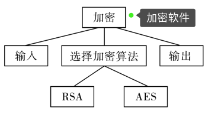

# 使用面向过程和面向对象结合的思想开发软件

两者结合起来，开发更有保障。

**什么是面向过程开发？**

面向过程开发也称结构化开发，将软件要实现的功能分解成一个个连续的流程结点，将每个节点都实现为一个函数，依次调用这些函数以完成软件功能。至于执行流程中多个函数共用的数据，则拿出来定义为共享的数据结构，实例化，在函数中使用和传递。

**什么是面向对象开发？**

面向对象开发主要指模拟人类的思维方式，将软件需求中的事物关系，通过封装、继承、多态等手法抽象为一个个具体的对象（类），在对象中包含数据和操作数据的方法，以此方式实现软件需求。对象与对象之间的通讯，主要以发送信息的方式进行。

**面向过程开发有什么缺点，为什么会产生面向对象的开发思想？**

面向过程开发很适合处理不包含多层数据结构的流式信息处理、生产流程控制等扁平式产品需求，对于内部关系复杂的软件需求，这种开发方式将捉襟见肘。举个例子，像那种定制 CSS 样式的参数设置界面，使用面向过程的思想便不易设计。20 世纪 80 年代，在图形化桌面系统诞生以后，图形化桌面软件也开始蓬勃发展，你很难想象，对于像 Excel 这样的复杂软件，如果基于面向过程的方式该如何开发。这个时候，日益复杂的软件需求，在计算机性能不断提高的时候，却被软件的开发方式束缚了，这便是计算机世界的第二次软件危机。

《人月神话》一书中描述了这样一个有关软件危机的案例：

在IBM 公司开发 OS/360 系统的时候，投入成本达到了美国曼哈顿原子弹计划的 25%，耗资达数亿美元。系统约有 4000 多个模块，100 万条指令，使用人力超过 5000 人年。即使如此，项目还是延期交付了，并且交付以后系统中仍有大量缺陷。就可以太复杂了。

随着第二次软件危机的爆发，面向对象编程逐步取代了面向过程的结构化编程。以最符合人类思维的视角抽象问题，相比以最符合机器运行特征的算法与数据结构抽象问题，前者成为了软件设计准则的第一优先级，从此面向对象的开发思想开始占据主导地位，并风靡至今。

**将面向过程与面向对象结合起来的开发思想**

虽然面向对象是后来产生的，并且解决了面向过程开发复杂软件面临的困难，但是这不是说，面向对象就没有缺点，面向过程就没有优点。

先看面向对象的缺点。具象的事物很好抽象，虚拟的事物一般难以定义，这种困难多半来源于客观事物对象的边界模糊而造成的。在分析需求并划分对象时，还存在观察客观事物角度的不同而产生的差异，以及因对象划分粒度不同而产生的差异，这些差异不仅会给团队协作开发带来难度，在后续的软件维护中，也存在阅读与理解上的困难。

再看面向过程的优点。面向过程开发，由于是针对事务流程而设计的，天生不存在角度、抽象层次及划分粒度的烦恼。线性的思考和处理问题方式，至今为很多程序员所喜欢，特别是数学出身的程序员。有些程序员甚至用面向对象的语言，写面向过程的代码。

下面我们开始步入正题，阐述两种开发思想结合起来的开发方式：

- 第一步，系统分析。用结构化思想进行系统分析，厘清软件需求中所有的事务流程，产出**数据流图**。
- 第二步，系统设计。仍然用结构化思想，依据数据流图，划分软件模块，产出**系统结构图**。在这个阶段，对于软件中可能存在的关键难点，可以拆出小需求来，用面向过程的方法迅速进行技术方案验证。如果预想的技术方案实现不了，则直接会影响系统机构图的产出。
- 第三步，面向对象软件架构与设计。在第二步的基础上，依照系统结构图，进行面向对象的软件设计，在这一步，才开始真正的面向对象开发，是开始编写代码的阶段了。
- 第四步，面向对象的编程实现。
- 第五步，测试部署与维护升级。

**两者结合开发的一个小示例**

下面看一个小示例，软件需求是这样的：输入一串数字，使用 AES 或 RSA 算法加密，然后输出加密结果。

第一步系统分析，产出数据流图。

第二步系统设计，产出系统结构图。在这一步里，确定了模块划分，其中输入、输出和选择加密方式这三个都是 UI 模块，RSA 和 AES 是算法模块。

第三步是面向对象的架构与设计，这一步要落实在项目与具体的代码上了。第四步与第五步不再赘述。

通过这种结合的软件开发方式，可以最大化发挥面向对象和面向过程开发思想的优点。前两步都是结构化面向过程的分析与设计，如果系统足够复杂，对这些前期工作都可以将需求拆开来，分给不同的开发者去调研。只有到了第三步，所有东西都已经确定了，这个时候才可以制定和施行严格的项目开发计划。

还有，经过了第二步以后，第三步在进行架构设计时，也能产出更好的系统设计。而如果没有第二步，什么都不清楚呢，直接进入第三步，则可能有重新调整架构、返工、延时等项目风险出现。
