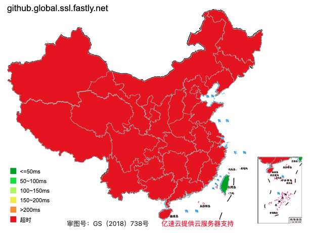

# 解决Gibhub git push超时、无法提交的问题

最近`git push`指令又不能工作了，马上测了一下IP，发现github.global.ssl.fastly.net这个域名，除了台湾宝岛那里，基本都不能访问。（注：测试地址https://ping.chinaz.com/github.global.ssl.fastly.net）



这个测试仅是一家云商服务器的结果，可能换一家云商，结果就不一样了，数据仅供参考。

那么解决Github仓库不能送拉的问题呢？

使用这个网址工具（https://ping.chinaz.com/）依次测试下面三个域名的可用IP：

- github.com
- github.global.ssl.fastly.net
- assets-cdn.github.com

得用可用IP后，修改hosts文件（例如macOS的`/etc/hosts`），强制相关域名使用指定IP：

```bash
39.102.194.95 github.com
151.101.1.194 github.global.ssl.fastly.net
185.199.108.153 assets-cdn.github.com
```

完成修改后，需要重启本机网络，指令重启方法因系统因异：

- macOS系统：`sudo ifconfig en0 down && sudo ifconfig en0 up`
- Windows系统：`ipconfig /flushdns`
- Linux系统：`/etc/init.d/networking restart`

如果不使用指令，用鼠标点击Wifi或本地网络，手动关闭、重连也可以达到同样的效果。重启后，git指令基本就可以工作了。

但是问题到这里还没有结束。

## 指令执行时都访问了哪些域名？

`git push`指令执行时，都在背后访问了哪些域名？我们怎么知道一个指令的成功执行，到底需要能够访问哪些域名地址呢？

这与具体指令要做的事情有关，在进行git操作时，github.com域名是必连的，github.global.ssl.fastly.net域名是为了处理ssl安全连接的，而assets-cdn.github.com域名是cdn加速域名，在github提交中暂时用不到。

除了分析指令本身的功能或源码之外，还可以在本地使用网络监测工具。例如netstat指令：

```
$ netstat -a | grep "github"
tcp4       0      0  192.168.31.224.50744   github.com.ssh         SYN_SENT   
```

## 有没有防墙提交工具？

有没有一个自动防墙提交的工具呢？这个工具最好可以封装成一个指令，例如github_safe_push。github自有的CLI工具指令gh并不能担负这个职责。

在网络上搜索了一下，暂时没有找到具有这样功能的工具。从理念上讲，这样的工具应该是可以实现的，使用Python代码先查询可用域名，继而进行网络设置，最后调用原生的git push指令提交代码。

## 使用国内CSDN的缓存服务

2022-12-24更新：

CSDN为国内程序员提供了一项Github缓存、加速服务

> GitHub 缓存服务是 CSDN 为开发者提供的一项代码仓库加速服务。

如果感兴趣，可以从这里了解：https://gitcode.net/gitcode/help-docs/-/wikis/docs/user/project/repo/repo-mirror