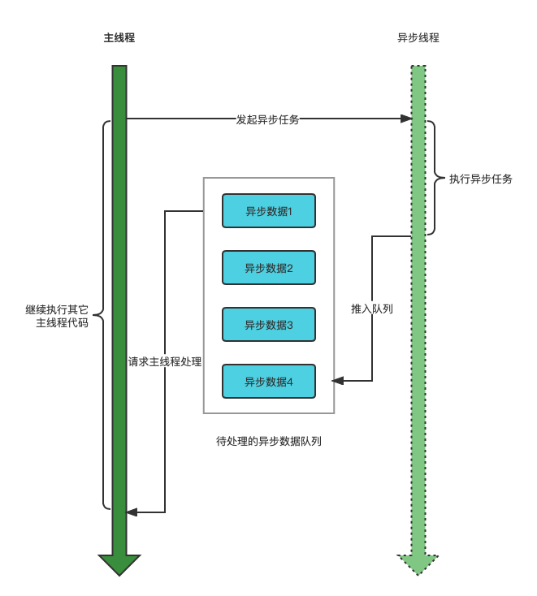

# JS如何返回异步调用的结果？

这个问题[作者](https://yishulun.com/)认为是所有从后端转向前端开发的程序员，都会遇到的第一问题。JS前端编程与后端编程最大的不同，就是它的异步机制，同时这也是它的核心机制。

为了更好地说明如何返回异步调用的结果，先看三个尝试异步调用的示例吧。

**示例一：调用一个后端接口，返回接口返回的内容**

```js
function foo() {
  var result
  $.ajax({
    url: "...",
    success: function(response) {
      result = response
    }
  });
  return result // 返回：undefined
}
```

函数foo尝试调用一个接口并返回其内容，但每次执行都只会返回undefiend。

**示例二：使用Promise的then方法，同样是调用接口然后返回内容**

```js
function foo() {
  var result
  fetch(url).then(function(response) {
    result = response
  })
  return result // 返回：undefined
}
```

与上一个示例的调用一样，也只会返回undefined。

**示例三：读取本地文件，然后返回其内容**

```js
function foo() {
  var result
  fs.readFile("path/to/file", function(err, response) {
    result = response
  })
  return result // 返回：undefined
}
```

毫无意外这个示例的调用结果也是undefined。

为什么？

因为这三个示例涉及的三个操作————ajax、fetch、readFile都是异步操作，从操作指令发出，到拿到结果，这中间有一个时间间隔。无论你的机器性能多么强劲，这个间隔也无法完全抹掉。这是由JS的主线程是单线程而决定的，JS代码执行到一定位置的时候，它不能等待，等待意味着用户界面的卡顿，这是用户不能容忍的。JS采用异步线程优化该场景，当主线程中有异步操作发起时，主线程不会阻塞，会继续向下执行；当异步操作有数据返回时，异步线程会主动通知主线程：“Hi，老大，数据来了，现在要用吗？”

“好的！马上给我。”

这样异步线程把异步代码推给主线程，异步代码才得以执行。对于上面三个示例而言，`result = response`就是它们的异步代码。

下面[作者](https://yishulun.com/)画一张辅助理解这种机制吧：



当异步线程准备好数据的时候，主线程也不是马上就能处理，只有当主线程有空闲了，并且前面没有排队等待处理的数据了，新的异步数据才能得以处理。

在了解了JS的异步机制以后，下面看前面三个示例如何正确改写。

## 回调函数：最古老的异步结果返回方式

先看示例一，使用回调函数改写：

```js
function foo(callback) {
  $.ajax({
    url: "...",
    success: function(response) {
      callback(response)
    }
  });
  // return result // 返回：undefined
}
```

在调用函数foo的时候，事先传递进来一个callback，当ajax操作取到接口数据的时候，将数据传递给callback，由callback自行处理。

这种基于回调的解决方案，虽然“巧妙”地解决了问题，但在存在多层异步回调的复杂项目中，往往由于一个操作依赖于多个异步数据而造成“回调噩梦”。

## ES2015：使用Promise对象与then方法链式调用

第二种改进的方案，不使用回调函数，而是使用ES2015中新增的Promise及其then方法，下面以示例二进行改造：

```js
function foo() {
  return new Promise(function(resolve, reject) {
    fetch(url).then(function(response) {
        resolve(response)
    })
  })
}
foo().then(function(res){
  console.log(res)
})..catch(function(err) {
  //
})
```

foo返回一个Promise对象，注意，Promise仅是一个可能承载正确数据的容器，它并不是数据。在使用它的，需要调用它的then方法才能取得数据（在有数据返回的时候）。与then同时存在的另一个有用的方法是catch，它用于捕捉异步操作可能出现的异常，处理可能的错误对加强鲁棒性至关重要，这个catch方法不容忽视。

注意：示例中的fetch方法[作者](https://yishulun.com/)没有给出具体实现，它在这里是作为一个返回Promise对象的异步操作被对待的，也因此我们看到了，在这个方法被调用后返回的对象上，也可以紧跟着调用then方法（第3行）。

但是，这种使用Promise的解决方案就完美了吗，就没有问题了吗？显然不是的。

## ES2017：使用async/await语法关键字

过多的“紧随”风格的then方法调用及catch方法调用，让代码的前后逻辑不清晰；当我们阅读这样的代码时，并不是从上向下瀑布式阅读的，而是时而上、时而下跳动着阅读的，这很不舒服。不仅阅读时不舒服，编写时也很难以用一种像后端编程那样的从上向下的简洁的逻辑组织代码。

下面开始开始使用ES2017标准中提供async/await语法关键字，对示例三进行改写：

```js
function foo() {
  return new Promise(function(resolve, reject) {
    fs.readFile("path/to/file", function(err, response) {
        resolve(response)
    })
  })
}
(async function(){
  const res = await foo().catch(console.log)
  console.log(res)
})()
```

基于async/await语法关键字的方案，是使用Promise的方案的升级版，在这个方案中也使用了Promise。第8行~第11行，这是一个IIFE（立即调用函数表达式），之所以要用一个只使用一次的临时匿名函数将第9行~第10行的代码包裹起来，是因为await必须用在一个被async关键字修饰的函数或方法中，只能直接用到顶层的文件作用域或模块作用域下。

使用这种方案的优化是，代码可以像后端编程那样从上向下写，结构可以很清晰。这也是一种被称为“异步转同步”的JS编程范式，在前端开发中已被普遍接受。

注意，“异步转同步”并没有真正改变异步代码，异步代码仍然是异步代码，它们仍然会在异步线程中先默默地执行，等有数据返回了再通知主线程处理。当我们使用这种编程模式的时候，一定不要在主线程上去await一个Promise，可以发起异步操作，让异步操作像葡萄一样挂在主线程上，但不能等待它们返回了再往下执行。

## jQuery的Deferred Object（延迟对象）

先看一段Promise+then方法风格的jQuery代码：

```js
$.ajax({
  url: "test.html",
  context: document.body
}).done(function() {
  $(this).addClass("done")
})
```

第4行，这里的done方法是jQuery自行实现的，$.ajax方法返回的是一个DeferredObject（延迟对象），这个对象上有done方法，这个方法与Promise的then类似。

jQuery成名在前，在ES2015标准诞生之前，jQuery的DeferredObject就已经被定义了。Promise本身并没有神奇的地方，它可以发挥作用，主要依赖的是在JS中，Object是引用对象，继承于Object原型的Promise也是引用对象，当异步操作发起时，只有一个“空”的Promise被创建了，但是它的引用被保持了；当数据回来的时候，数据再被“装填”进这个对象，这样通过先前持有的引用，异步代码便可以访问到对象上携带的数据。

Promise的胜利，更多是编程思想上的胜利，Promise的成功，也是编程思想上的成功。**所有一种语言中编程思想上的成功，在其他语言中都可以被学习和借鉴。**事实上在后端编程中，这种伪装成同步代码风格的异步编程思想也极其普遍，它们拥有一个共同的名字，叫协程。

## 小结

在JS中处理异步调用的结果，最佳实践就是“异步转同步”：使用Promise + async/await语法关键字。在这里async总是与await成对出现，一个async函数总是返回一个Promise，一个await关键字总是在尝试“解开”一个Promise，结局要么等到有价值的数据，要么异步出现异步，什么也没有等到。为了避免出现异常，影响主线程的正常运行，一般要用catch规避异常。


