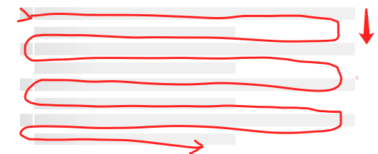
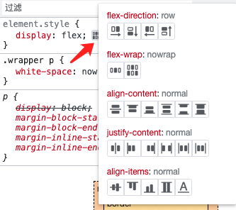

# 34 如何不移除`<p>`标签而将段落连接起来？

这是一个很经典的CSS布局问题，新人彻底理解了这个问题，HTML网页布局思想便已掌握了七七八八了。

## 问题

先看一段HTML代码：

```html
<!DOCTYPE html>
<html>
<body>
<h1>这是一个标题</h1>
	<div class="wrapper">
    <p>这是一个段落</p>
    <p>这是一个段落</p>
    <p>这是一个段落</p>
  </div>
</body>
</html>
```

因为p标签默认是块级元素，宽度默认会占满父容器的100%，所以这个代码默认展现出来的样式是这样的：

::: normal-demo
```html
<!DOCTYPE html>
<html>
<body>
<h1>这是一个标题</h1>
	<div class="wrapper">
    <p>这是一个段落</p>
    <p>这是一个段落</p>
    <p>这是一个段落</p>
  </div>
</body>
</html>
```
:::

问题是这样的，如何将三行文本“这是一个段落”合并到一行，从左向右排行显示，且不用移除`<p>`标签？

最简单的解决方案只需要加一行CSS新式代码：

```CSS
.wrapper p {
  display: inline;
}
```

运行效果如下所示：

::: normal-demo
```html
<!DOCTYPE html>
<html>
<body>
  <style>
  .wrapper p {
    display: inline;
  }
  </style>
  <h1>这是一个标题</h1>
  <div class="wrapper">
    <p>这是一个段落</p>
    <p>这是一个段落</p>
    <p>这是一个段落</p>
  </div>
</body>
</html>
```
:::

## 为什么简单加一个`inline`样式就可以解决问题？

早期网页为了从向至下流式展示内容，根据需要将标签元素默认分为了两类：

- 块级元素
- 行内元素

块级元素默认占据父容器的100%宽度，同时可以有高度，在不指定高度的时候，高度由子元素堆积决定，例如div、p、h1~h6等标签，凡是默认在网页中占据全部页面宽度的元素，都是块级元素。

而行内元素用于在一行内从左向右展示小内容，行内元素默认只有宽度，没有高度，并且它们的宽度也是由它们本身的内容所决定的，例如a、br、b、em、img、sub、sup、strong等标签，凡是默认不占据100%父容器宽度的元素，都可以视为行内元素。如果想给行内元素指定高度，需要可以父容器上给行元素设置line-height样式。

这两类元素的作用，就是合起来展示一个从上至下依次展示，每行从左至右依次排列的流布局，如下所示。



回头看我们的示例，p标签默认是块级标签，它在渲染时要占满页面容器的100%宽度，所以默认效果三行文本“这是一个段落”是从上向下依次排列的。

当我们通过类选择器+标签选择器，修改了所有p标签的display样式后，即将display样式设置为inline，这时候这个页面内的所有p标签已经不是块级元素了，都变成了行内元素。

HTML元素是什么块级元素，还是行内元素，本质上是由它们携带的默认的CSS样式决定的，也就是由display等于block或inline决定的，等于block就是块级元素，等于inline就是行内元素。因为CSS可以控制一切HTML元素的样式，事实上我们甚至可以将任何一个HTML元素修改为其他元素————当然如果真修改的话，这里还涉及元素属性的问题，在这里我们只谈样式。HTML元素默认携带的样式是由其名称决定的，所有元素的默认样式都是可以通过CSS代码修改的。

当给p标签设置了display样式为inline以后，这时候p标签的行为与span标签类似了，于是三行文本“这是一个段落”便是从左向右，在一行内展示了，如果一行展示不了，内容还会自动换行，就像其他行内元素所表示出来的行为那样。

## 由inline-block决定的行内块级元素

随着网页布局复杂度的提升，后来又出现了inline-block样式值，我们可以修改示例，看一看将display修改为inline-block之后的效果，如下所示。

::: normal-demo
```html
<!DOCTYPE html>
<html>
<body>
  <style>
  .wrapper p {
    display: inline-block;
  }
  </style>
  <h1>这是一个标题</h1>
  <div class="wrapper">
    <p>这是一个段落</p>
    <p>这是一个段落</p>
    <p>这是一个段落</p>
  </div>
</body>
</html>
```
:::

效果与修改为inline是相似的，在这个示例中看不出什么差别。事实上inline-blcok代表行内的块级元素，这样的元素既可以在一行之内从左向右自动依次排列，又可以拥有自己的高度，又可以作为一个局部的小容器，再容纳其他子元素。

inline-blcok样式的出现，代表CSS在网页布局方面已经没有什么能力短板了，只有网页设计师想不到的，没有CSS实现的布局。

## flex布局

但CSS的网页布局能力发展到这里并没有停止，后来为了更好了处理父容器与子元素的组合样式，flex布局被发明了。flex能够实现的效果，用以往的CSS也可以实现，但用flex布局的方法实现，代码会更简洁、逻辑会更加清晰、页面的扩展性也更好。

仍然拿上面的示例改造，如果不设置display为inline或inline-block，使用flex布局怎么达到同样的效果呢？也是只添加一行CSS代码就足够了，如下所示。

```html
<!DOCTYPE html>
<html>
<body>
  <style>
  .wrapper {
    display: flex;
  }
  </style>
  <h1>这是一个标题</h1>
  <div class="wrapper">
    <p>这是一个段落</p>
    <p>这是一个段落</p>
    <p>这是一个段落</p>
  </div>
</body>
</html>
```

运行效果如下所示：

::: normal-demo
```html
<!DOCTYPE html>
<html>
<body>
  <style>
  .wrapper {
    display: flex;
  }
  </style>
  <h1>这是一个标题</h1>
  <div class="wrapper">
    <p>这是一个段落</p>
    <p>这是一个段落</p>
    <p>这是一个段落</p>
  </div>
</body>
</html>
```
:::

效果是一样的。

将display设置为flex就代表了启用flex布局。因为默认情况下flex-direction等于row，子元素会像行内元素那样从左向右排行，所以只写一行display等于flex样式代码就可以了。

flex布局能力很强大，它不仅可以处理从左向右的横向布局，还可以处理从上向下的纵向布局，两个方向的布局使用的是同一套样式语义。很多人都觉得这套语义记了又忘，实在很难记住，即使是富有经验的网页设计师在许久不手写CSS代码之后，也需要借助工具才可以将样式代码写对。针对开发者的这个痛点，新版本的Chrome浏览器现在提供了这样的一个flex布局辅助设计功能，如下所示，当我们给元素添加了display等于flex的样式代码后，后面会出现一个功能按钮，点击它，会展开一个flex布局互动小面板。点击这个面板上具体的排行项，相应的样式代码即会自动生成。



不用再记那些难记的样式名称了，有需要的时候调出这个flex布局互动小面板，点一点，所有布局代码都能搞定了。

## 小结

在网页布局思想上，还出现过一种全页面都使用绝对值的布局思想，这种布局思想只适用于Web管理后台或工具Web等开发场景，对于面向C端用户的场景是不适用的。HTML网页的根本设计哲学是流式布局————整体上从上向下、行内从左向右的流式布局，这种布局可以让HTML内容可以一边加载一边渲染展示，是一种很好的设计哲学，不要放弃这种哲学。

flex布局本质上继承了流式布局的思想，它与流式布局并不冲突，只是丰富了CSS在父容器子元素组合关系布局上的能力。在网页设计中，现在普遍优先使用flex布局，用最简单的CSS代码达到设计的需求。
