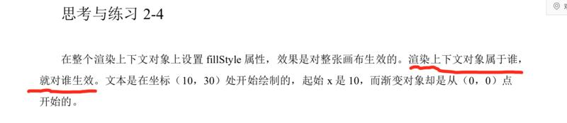

# 02《微信小游戏开发》勘误列表（随时更新）

由于水平有限，时间仓促，书中难免有遗漏、错愕之处，恳求读者朋友斧正。如有发现，可以给我发邮件9830131@qq.com，或加我的微信（9830131）告诉我。

下面是2023年2月&3月版本1已经发现的勘误列表。

## 前端篇

### P55

如下所示，`0+"10"`结果是"010"，并不是数值10，红框内应改为：

> 使用加号与一个数字拼接：+ "10"，这种方式最简单直接，其实本质上也是隐式转换。


该处由@**MuninnC**指出，感谢勘误。

### P262

第一处，第4行、第5行，两行注释应改为：

```
4.let d = {num: 100} // 变量d存在于栈中，{mum: 100}作为对象存在于堆内存中
5.let e = [100, 200] // 变量e存在于栈中，[100, 200]作为对象存在于堆内存中
```

第二处，划线部分应改为：

其中c、b、a位于栈内存，我们是直接操作的；而e、d保存的是引用地址......


### P480

划线部分应改为：渲染上下文对象属于哪个画布，就对哪个画布生效。 



## 后端篇

无