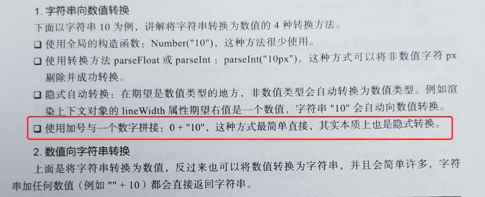
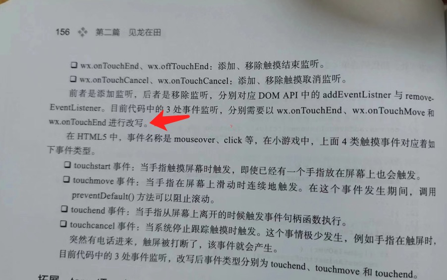
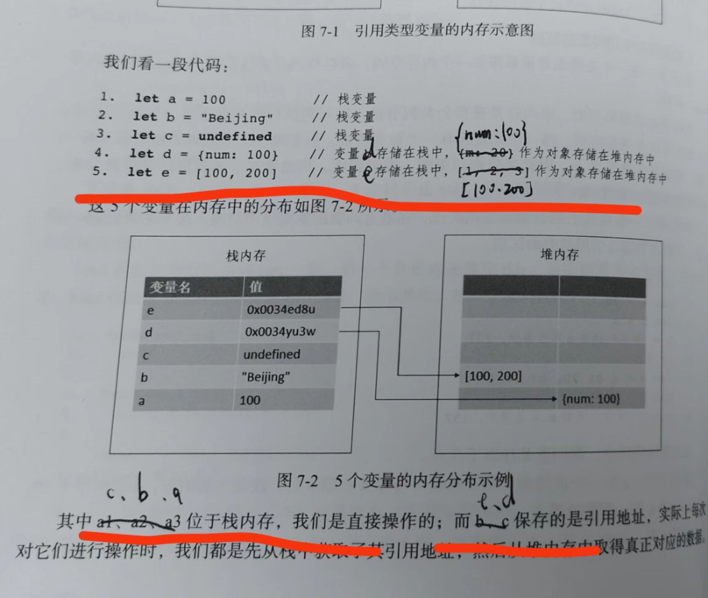
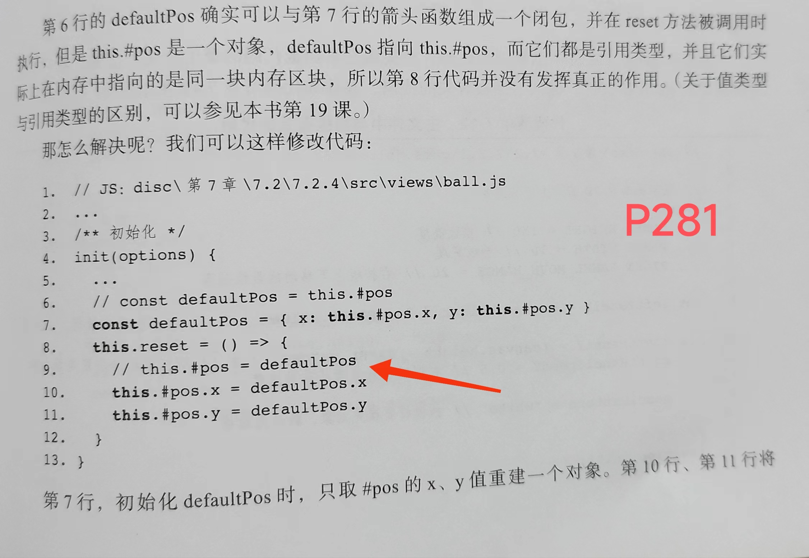
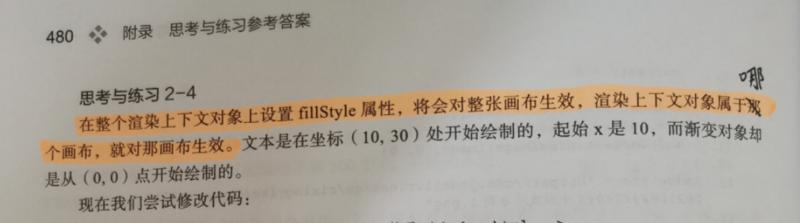
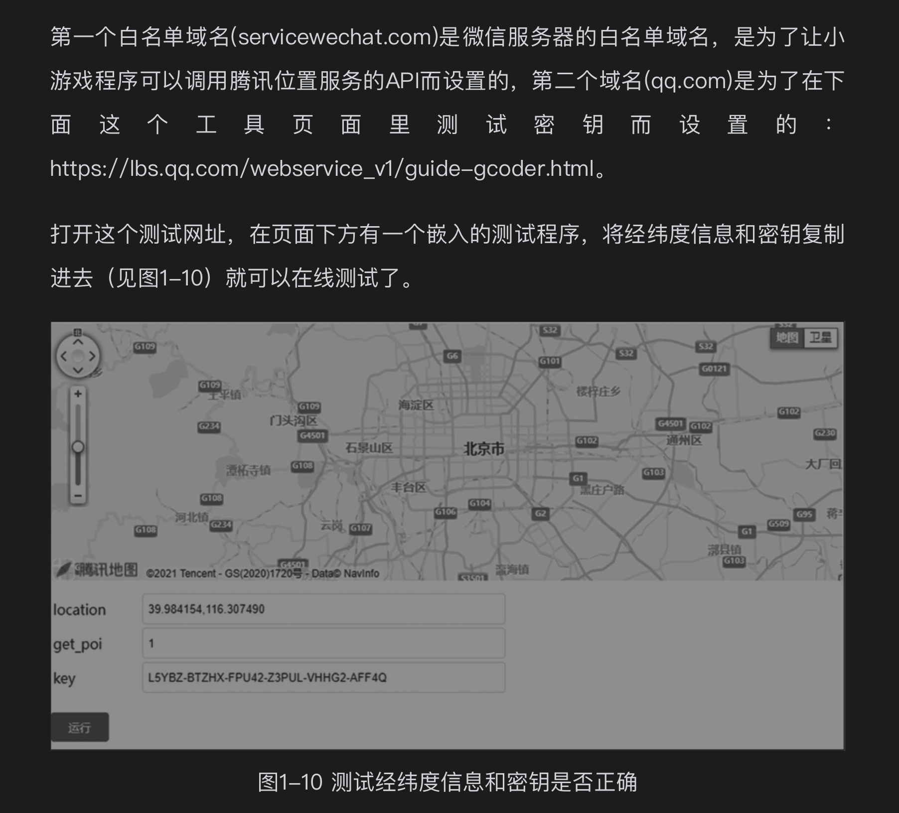
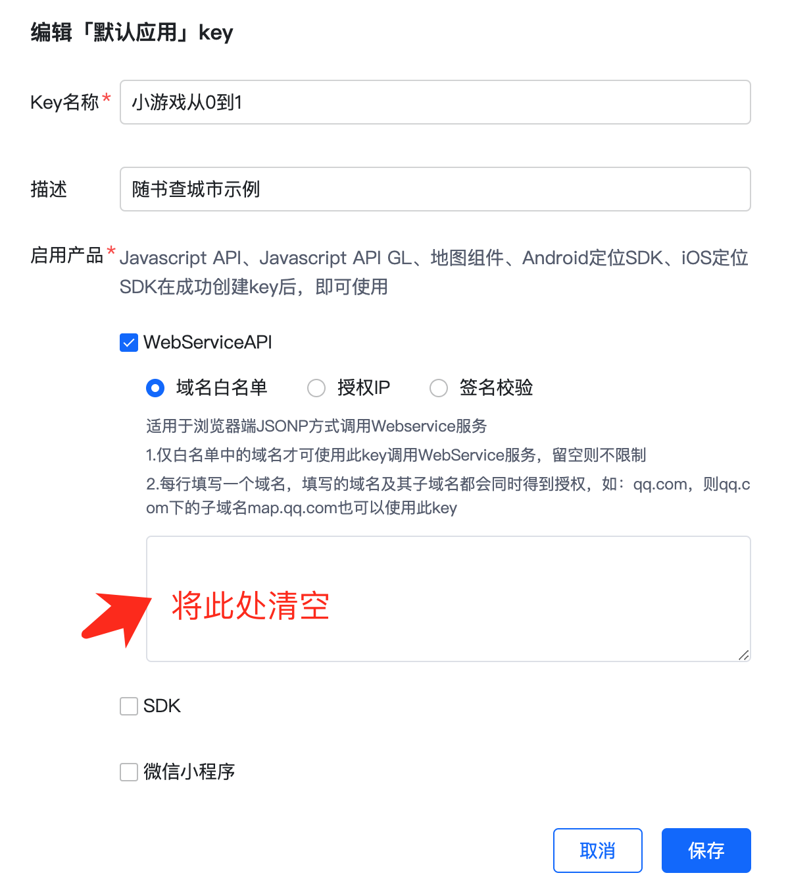

# 《微信小游戏开发》勘误与增补列表

由于水平有限，时间仓促，书中难免有遗漏、错愕之处，恳求读者朋友斧正。如有发现，可以给我发邮件9830131@qq.com，或加我的微信（9830131）告诉我。

下面是2023年2月&3月版本1已经发现的勘误列表。

## 前端篇

### P17


有读者找不到，在箭头处可以添加一句：具体见后端篇第16课拓展部分。

### P55

如下所示，`0+"10"`结果是"010"，并不是数值10，红框内应改为：

> 使用加号与一个数字拼接：+ "10"，这种方式最简单直接，其实本质上也是隐式转换。



该处由@**MuninnC**指出，感谢勘误。

### P156(增补)



在箭头所示的地方（“..进行改写。”）添加这样一段话：

> ..进行改写。注意这里的3处事件，指代码清单4-2中的click、mousemove、click三个事件，分别将以touchEnd、touchMove和touchEnd事件改写。

### P262

第一处，第4行、第5行，两行注释应改为：

```
4.let d = {num: 100} // 变量d存在于栈中，{mum: 100}作为对象存在于堆内存中
5.let e = [100, 200] // 变量e存在于栈中，[100, 200]作为对象存在于堆内存中
```

第二处，划线部分应改为：

其中c、b、a位于栈内存，我们是直接操作的；而e、d保存的是引用地址......



### P281



这里在“第7行...”这一段的后面，可能需要加一段解释内容。内容如下：

注意第9行这里的代码，让#pos指向defaultPos，为什么也没用？原因是这样的：如果使用第9行、而不是第10～11行的代码，在第一次执行reset时，会把defaultPos这个引用对象赋值给#pos，之后小球在运动过程中，更新的都是#pos——同时也是defaultPos对象，也就是说，defaultPos这个默认值对象被“污染”了，从第二次调用reset开始，它再也不能作为默认值对象被使用了——它里面的x、y值已经不是默认值，而是小球运动最后停止时的位置。这是一处因为引用对象而产生的“陷阱”，JS中引用对象在赋值时不会产生拷贝，可能会因此产生许多问题，这里是一个很好的示例。

### P480

划线部分应改为：渲染上下文对象属于哪个画布，就对哪个画布生效。



## 后端篇

### 3.1 关于lbs域名白名单的设置

大概在书上如下图1-10这个位置：



书上提到的一个位于这里（https://lbs.qq.com/service/webService/webServiceGuide/webServiceGcoder）的在线测试工具，现在有了修改，不再可以直接填写key，所以原书上的测试方法需要修改一下。

目前在测试开发阶段最简便的设置白名单的方式，是将白名单列表留空：



留空代表不限制调用来源。

留空以后，可以使用下面两个方法测试API Key的可用性：

- 1，直接在浏览器中访问：https://apis.map.qq.com/ws/geocoder/v1?location=28.7033487,115.8660847&key=L5YBZ-BTZHX-FPU42-Z3PUL-VHHG2-AFF4Q&get_poi=1

- 2，在终端中访问：curl "https://apis.map.qq.com/ws/geocoder/v1?location=28.7033487,115.8660847&key=L5YBZ-BTZHX-FPU42-Z3PUL-VHHG2-AFF4Q&get_poi=1"

注意将key替换成自己的key。

如果不这样设置，或按原方法设置，可能会遇到这样的一个错误：

```
"message": "请求来源未被授权，解决方法见：https://lbs.qq.com/faq/serverFaq/webServiceKey。此次请求无来源信息"
```

这个错误可能出现在Web请求或curl请求中，没有来源信息也属于来源未被授权的情况之一。

由于腾讯LBS官方SDK及文档在以后可能存在变化，在设置白名单时，最好当时查看在开发者工具网络面板中出现的域名，并将其设置在腾讯LBS管理后台的白名单中。被设置的域名可能继续是servicewechat.com，也可能是其它域名。

京东购买链接：[https://item.jd.com/10070363837259.html](https://item.jd.com/10070363837259.html)
