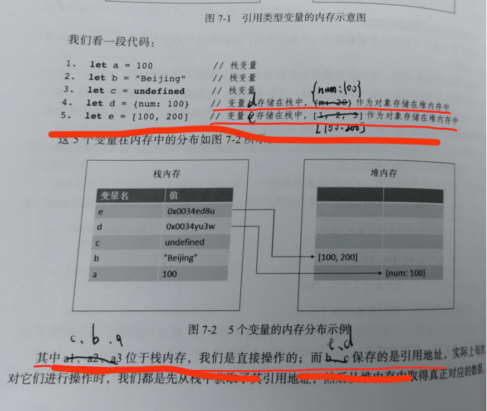
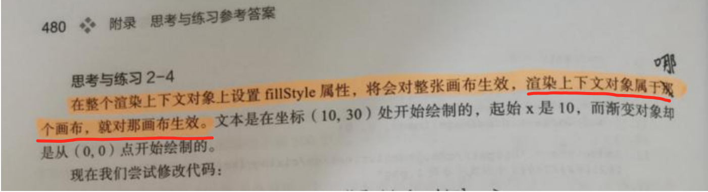
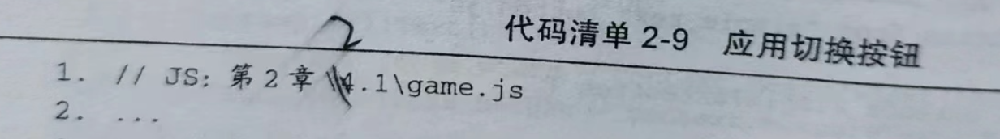
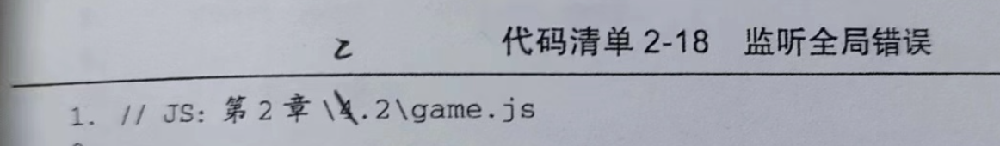
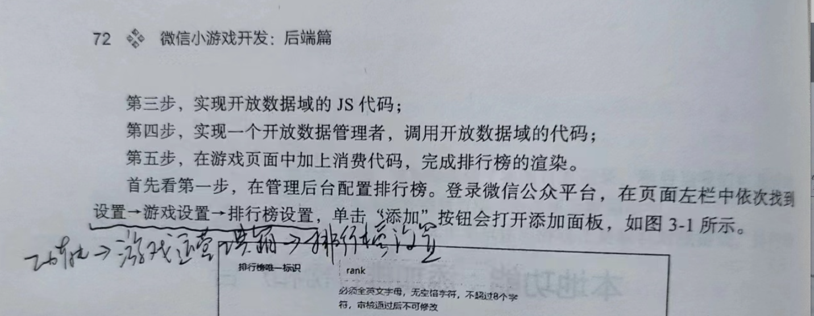
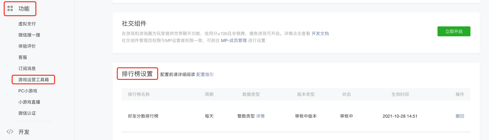
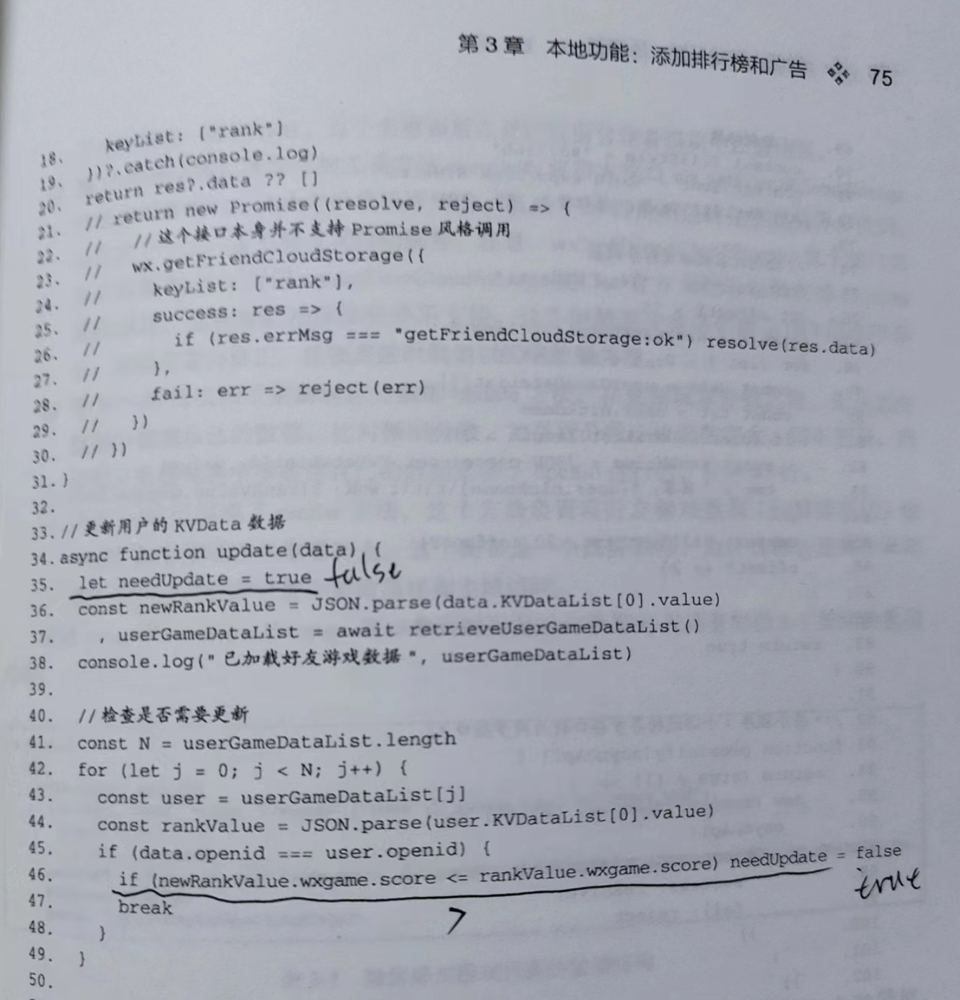
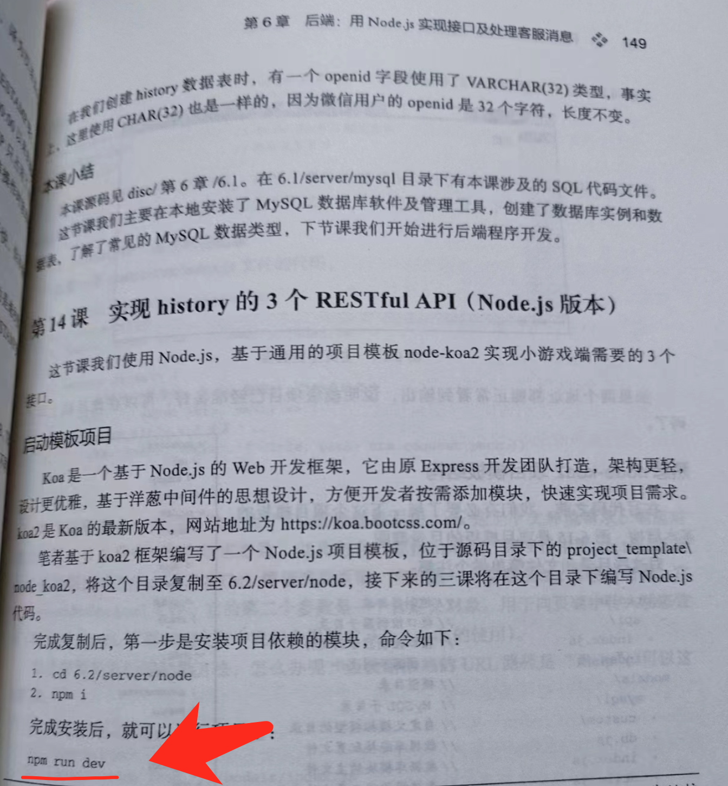

# 《微信小游戏开发》勘误与增补列表

由于水平有限，时间仓促，书中难免有遗漏、错愕之处，恳求读者朋友斧正。如有发现，可以给我发邮件9830131@qq.com，或加我的微信（9830131）告诉我。

下面是2023年2月&3月版本1已经发现的勘误列表。

## 前端篇

### P17


有读者找不到对应内容，在箭头处、句号前面可以添加一句：第16课拓展部分。

### P55

如下所示，`0+"10"`结果是`"010"`，并不是数值10；如果想将数字字符串转化为数字，直接在前面加符号“+”，不需要数字 0。截图红框内应改为：

> 使用加号与一个数字拼接：+ "10"，这种方式最简单直接，其实本质上也是隐式转换。


该处由@**MuninnC**指出，感谢勘误。

### P156(增补)


在箭头所示的地方（..进行改写。）、句号后面，添加这样一句话：

> 注意这里的3处事件，指代码清单4-2中的click、mousemove、click三个事件，分别将以touchEnd、touchMove和touchEnd事件改写。

### P262

第一处，第4行、第5行，两行注释应改为：

```
4.let d = {num: 100} // 变量d存在于栈中，{mum: 100}作为对象存在于堆内存中
5.let e = [100, 200] // 变量e存在于栈中，[100, 200]作为对象存在于堆内存中
```

第二处，划线部分应改为：

其中c、b、a位于栈内存，我们是直接操作的；而e、d保存的是引用地址......



### P281


因为有读者对这里理解有疑问，在“第7行...”这一句的后面，需要加一段解释内容。内容如下：

第9行，为什么让#pos指向defaultPos也没用？因为第一次执行reset时，会把引用对象defaultPos赋值给#pos，之后小球在运动过程中更新的都是#pos。也就是说，默认值对象defaultPos被“污染”了，从第二次调用reset开始，它不能再作为默认值对象被使用了，因为它里面的x、y值不是默认值了。

### P480

红色划线部分应改为：...渲染上下文对象属于哪个画布，就对哪个画布生效。



## 后端篇

### P22，3课1小节 使用wx.getFuzzyLocation代替

也在3.1小节，与上面的问题是相关的。由于微信官方对地理位置权限的加强管理，这里有较多变化，具体见：[如何在微信小游戏/小游戏中获取地理位置信息？](https://yishulun.com/posts/2023/52.html)

这里有代码清单1-12、1-14、1-15都涉及修改。


### P27，关于LBS域名白名单的设置

在书上27页，如下图1-10这个位置：


书上提到的一个位于这里（https://lbs.qq.com/service/webService/webServiceGuide/webServiceGcoder）的在线测试工具，现在有了修改，不再可以直接填写key，所以原书上的测试方法需要修改一下。

目前在测试开发阶段最简便的设置白名单的方式，是将白名单列表留空：


留空代表不限制调用来源。

留空以后，可以使用下面两个方法测试API Key的可用性：

- 1，直接在浏览器中访问：https://apis.map.qq.com/ws/geocoder/v1?location=28.7033487,115.8660847&key=L5YBZ-BTZHX-FPU42-Z3PUL-VHHG2-AFF4Q&get_poi=1

- 2，在终端中访问：curl "https://apis.map.qq.com/ws/geocoder/v1?location=28.7033487,115.8660847&key=L5YBZ-BTZHX-FPU42-Z3PUL-VHHG2-AFF4Q&get_poi=1"

注意将key替换成自己的key。

如果不这样设置，或按原方法设置，可能会遇到这样的一个错误：

```
"message": "请求来源未被授权，解决方法见：https://lbs.qq.com/faq/serverFaq/webServiceKey。此次请求无来源信息"
```

这个错误可能出现在Web请求或curl请求中，没有来源信息也属于来源未被授权的情况之一。

由于腾讯LBS官方SDK及文档在以后可能存在变化，在设置白名单时，最好当时查看在开发者工具网络面板中出现的域名，并将其设置在腾讯LBS管理后台的白名单中。被设置的域名可能继续是servicewechat.com，也可能是其它域名。


### P32、P33，4课1小节 在线资源地址替换

由于原在线存储桶可能存在到期，禁止访问等问题，对于下面的在线资源地址：

> https://cloud-1252822131.cos.ap-beijing.myqcloud.com/images/bg.png
> https://cloud-1252822131.cos.ap-beijing.myqcloud.com/fonts/webfont.ttf

可以将前面的cloud-1252822131.cos.ap-beijing.myqcloud.com替换为yishulun.com/wegame_ap，例如第一个地址替换后是：

> https://yishulun.com/wegame_ap/images/bg.png

如果原地址可用当用，不可用时，可换用替换后的地址。


### P44 2.1文件路径标注

在第 2 章第 4 课中，代码清单中的路径“JS:第2章\4.1\game.js”都应该是“JS:第2章\2.1\game.js”




### P57 修改gameTopLayer.init

在代码清单 2-14 中，应该添加对gameTopLayer.init方法调用的改动：

```js
init() {
	...
  // gameTopLayer.init()
  gameTopLayer.init({ game: this })
  ...
}
```

前面P53 页只走到了gameTopLayer.init()，这一节应该是有添加gameTopLayer.init({ game: this })这一发动的，但是 在P57 页的代码清单2-17 中没有体现。


### P59 2.2文件路径标注

同上一条，第2章第5课中，代码清单中的路径“JS:第2章\4.2\game.js”都应该是“JS:第2章\2.2\game.js”




### P72（排行榜设置位置）

原游戏礼包配置、游戏圈功能、活动运营配置、基础运营素材和排行榜设置已迁移到“游戏运营工具箱”，目前在：功能→游戏运营工具箱→排行榜设置。

图示划线部分应修改为：功能→游戏运营工具箱→排行榜设置。



位置：



京东购买链接：[https://item.jd.com/10070363837259.html](https://item.jd.com/10070363837259.html)

### P75（needUpdate修改默认值）

如果排行榜没有完成配置，可能会引发一个画布的渲染效果，这是由排行榜拉取不到数据引起的，在排行榜正确设置以后，可以恢复。

另外，为了增加代码的鲁棒性，可以修改 open_data/index.js 文件中的下列划线代码：



原来此函数中，needUpdate默认为 true，现修改为 false，并且只在新分数（newRankValue.wxgame.score）大于旧分数（rankValue.wxgame.score）时，才变成true。

修改后，即使排行榜没有准备好，代码也能避免报错。

### P149 处理 npm i 安装类库的证书错误



在 P149 页时，执行 npm i 或 npm run dev 时，可能会遇到这样的错误：

```shell
npm ERR! code CERT_HAS_EXPIRED
npm ERR! errno CERT_HAS_EXPIRED
npm ERR! request to https://registry.npm.taobao.org/ylru/download/ylru-1.2.1.tgz failed, reason: certificate has expired
```

这个错误缘于社区类库更新规则的更改，及淘宝仓库网站证书的过期。


npm不再支持自签名证书，而淘宝仓库网站恰好又使用了自定义证书。当我们使用 npm i 安装某些类库时，例如类库地址为 https://registry.npm.taobao.org/ylru/download/ylru-1.2.1.tgz，此时npm无法验证来源，抛出了 CERT_HAS_EXPIRED 错误。

解决办法：

关闭 SSL 验证

```
npm config set strict-ssl false
```

修改软件源，例如将软件源地址改回官网：

```
npm config set registry https://registry.npmjs.org/
```
这个更改的副作用是，更新或安装类库时需要梯子，如果有梯子则无妨。


