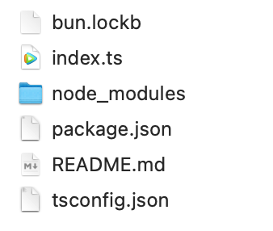
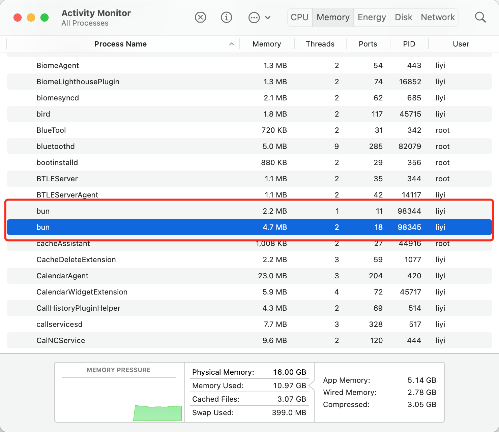
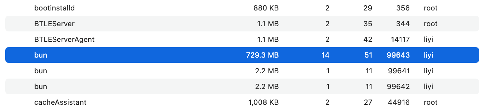
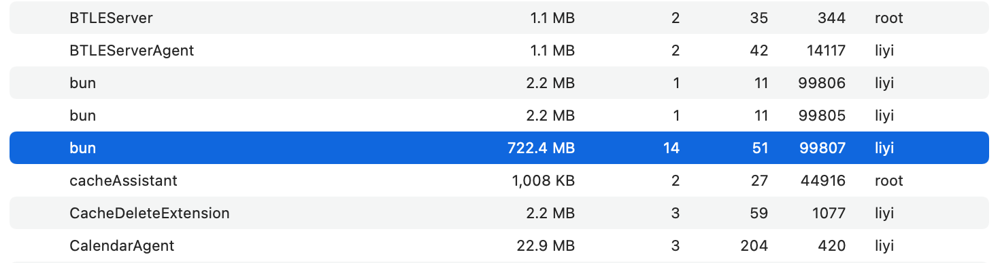
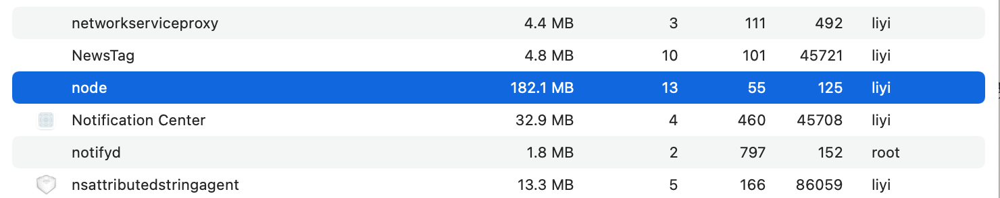

# Bun 介绍：bun 到底会吃掉多少内存？为何一个不大的博客程序就能吃掉700+MB内存?（二）

接着[上一篇](https://yishulun.com/posts/2023/05.html)关于包管理工具演进的介绍，下面开始介绍 Bun 相比于传统技术栈框架及工具，具体有哪些优势。

## 初始化

bun 的初始化简单直接，使用下列指令会直接将当前目录初始化为一个 bun 项目工程：

```bash
bun init -y
```

参数-y 代表静默，不需要提问，所有初始化产生的副任用产品都在当前目录下，所有配置在完成后都可以在文件中修改。init 指令会产生 lock 文件、package.json 文件、tsconfig.json 配置文件等。bun 默认使用 TS 作为开发语言。



## 运行指令，空间换时间

目录初始化以后会产生一个 index.ts 文件，内容极其简单：

```ts
console.log("Hello via Bun!");
```

以监听方式运行它：

```bash
bun --watch run index.ts
```

监听方式大家都懂，当我们修改源码后，bun 会监测到文件的改动并自动运行代码。这是运行单个文件，也可以在 package.json 中添加小脚本：

```bash
"scripts": {
   "dev": "bun --watch run index.ts"
 },
```

添加后，通过 bun dev 运行，运行指令的效果是等同的。

bun 有一个参数--smol，官方文档说如果加上这个参数，可以少占用内存。这让我怀疑 bun 在各方面之所以速度表现优秀，在于它大量采用了“空间换时间”的优化策略，它在运行之后，内存占用必定很多。

于是，我通过活动监测器查看 bun 的内存占用：



注意，这里有两个 bun，这是使用 watch 启动的特征，一个是守护进程，一个是真正的应用进程。上面那个 PID 为 98344 的应该是守护进程，而下面那个 PID 为 98345 的进程应该是应用进程。

我分别添加--smol 参数与不添加参数，做两次测试，发现内存变化寥寥无几。看来使用 smol 参数与否，并没有明显影响内存占用啊。

也可能是当前这个只打印一行“hello world”的程序太简单了，下面我换一个稍微复杂的博客程序进行测试，首次是一般模式：



占用了约 730MB 内存了，好家伙，快到一个 G 的内存了。

然后看启用了 smol 模式的内存占用：



占用了约 722MB 内存！我不能说 smol 这个参数没有作用，毕竟同样的项目是少了几 MB 的。但减少的实在太少了。

注意，在测试的时候，前后两次使用的指令是这样的：

```bash
bun run --watch --bun vitepress dev src
bun run --smol --watch --bun vitepress dev src
```

两次的指令都加上了--bun 参数，这个参数代表使用 bun 作为 JS 语言的运行时，而非环境中默认的 Node.js。

下面，我们回到 vitepress 的普通运行模式，不再使用 bun 这个运行时，使用 Node.js，指令是这样的：

```bash
bun run --watch vitepress dev src
```

或者直接使用旧脚本：

```bash
vitepress dev src
```

这是在使用 Node.js 作为 JS 的运行时，它的内存占用一下就降下来了：



只有 182MB！

从 730MB 降到了 182MB，**说明 bun 为了提高运行效率，确实很有可能狠狠地采用了“空间换时间”的策略**。这个世界能量是守恒的，在一个地方占优了，必然在另一个地方会有所损耗，这是肯定的。为什么别的运行时都没有 smol 参数，bun 为什么专门搞一个 smol 参数？它大概也预感到了它需要这个东西。

## 使用 JSX 语法

下面试用 jsx 功能，首先安装类库：

```bash
bun install react react-dom
```

然后分别创建两个文件：

```jsx
// message.tsx
export default function Message(props: {text: string}) {
  return (
    <body>
      <h1 style={{color: 'red'}}>{props.text}</h1>
    </body>
  );
}
// index.tsx
import Message from "./message";
console.log(<Message text="Hello world!" />);
```

接着运行测试指令：

```bash
bun run index.tsx
```

返回：

> <Message text="Hello world!" />

没有问题。

在同一个项目中，可以写 ts 代码，也可以写 jsx 代码，并且不需要额外的配置。bun 靠文件的后缀名决定要启用什么样的加载器，**当我们在文件内使用 jsx 语法时，文件后缀就必须写成 tsx 或 jsx**。

除此之外，react 与 react-dom 还是要安装的，bun 只是替代了网络基础软件层次的 Node.js，它并没有替代业务软件层次的框架，诸如 Vue、React、Vite 等类库，如果在项目中用到它们了，首先还是需要使用 bun install 指令安装的。

这一篇就说到这里，主要介绍了 bun 在运行时会占用大量内存，以及如何使用 jsx 语法，下一篇继续介绍 bun。
