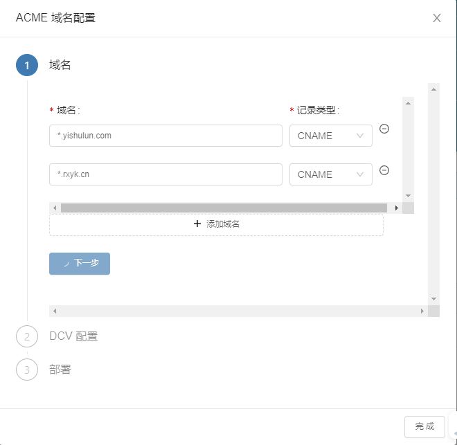
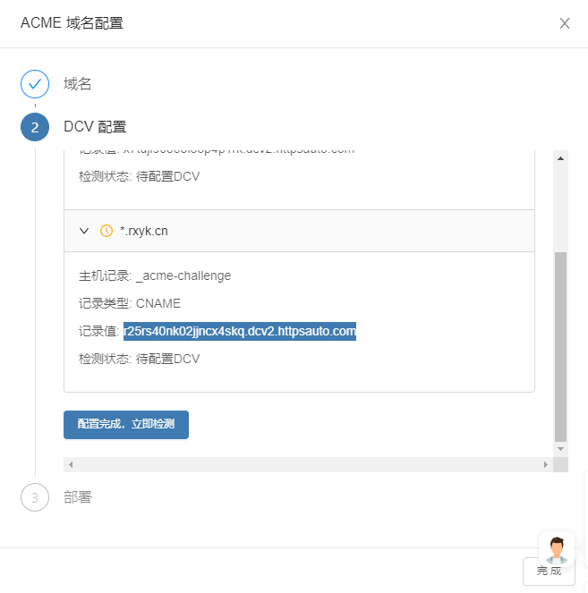

# 使用 acme.sh & freessl.cn 申请免费 SSL 证书及自动续期

域名地址基于 https 协议访问需要 SSL 证书，大多数情况下是一个.cer、一个.key 文件，在服务器端部署 web 站点的时候，在编写 Apache 或 nginx 配置文件时，需要提供这两个文件。

freessl.cn 是一个可以让我们免费申请 SSL 证书的地方。但是免费证书都有一定的时效，如果证书过期了而我们忘记了重新申请并重新在服务器上部署 SSL 证书，便会影响网站的正常运行。

于是有人开发了一个 acme.sh 工具，这个东西看起来像个域名，其实是一个实现了 ACME 协议的脚本工具。所谓的 ACME 协议，简单理解就是：可以验证域名所有权，在线自动申请一个 SSL 证书并下载到本地。acme.sh 脚本工具在本地创建一个定时任务，定时检查证书是否过期，如果发现要过期了，就自己申请一个，把本地的旧证书替换掉。

这确实是一个自动化的好工具！

怎么使用 acme.sh 呢？在哪里使用它呢？

首先，要明确一点，acme.sh 这个工具是一个 unix shell 环境工具，它是被设计出来在 macOS 或 Linux 上运行的，在 Windows 下并不合用。

在 macOS 上，安装这个工具：

```bash
curl https://get.acme.sh | sh -s email=9830131@qq.com
```

安装以后，脚本工具会放置在~/.acme.sh 目录下。在终端访问 acme.sh，如果访问不了，而还需要设置一个指令别名：

```bash
alias acme.sh=~/.acme.sh/acme.sh
```

接着，在https://freessl.cn/网站上申请自动续期的带有通配符的多域名证书。

填写域名：



域名填写完成后，便是域名所有权验证：



这一步是通过在域名设置面板中添加 CNAME 记录完成验证的。

紧接着，域名验证完成以后，网站会给出两段脚本：

```bash
acme.sh --issue -d '*.yishulun.com' -d '*.rxyk.cn'  --dns dns_dp --server https://acme.freessl.cn/v2/DV90/directory/i33ey2k462**** --debug
```

注意这个 server 地址是机密的，acme.sh 每次都是靠它与 freessl.cn 的服务器端进行沟通的。

最后，成功执行上面的执行——如果有问题，就将域名分开执行，或重试，我们会发现在~/.acme.sh 目录下会有对应的证书文件。

当证书过期时，我们只需要手动执行这行脚本，本地证书便会更新。当然我们也可以将这行脚本加入到自动任务的序列中，定时检查与更新证书。

只需要申请一次，就可以覆盖所有二级域名的证书。这些证书文件我们可以上传到服务器指定的目录下，为多个站点共享使用，这确实省去了证书申请、配置的麻烦。加上自动任务在服务器上自动执行，基本 SSL 证书的事情只需要设置一次就不需要再操心了。
