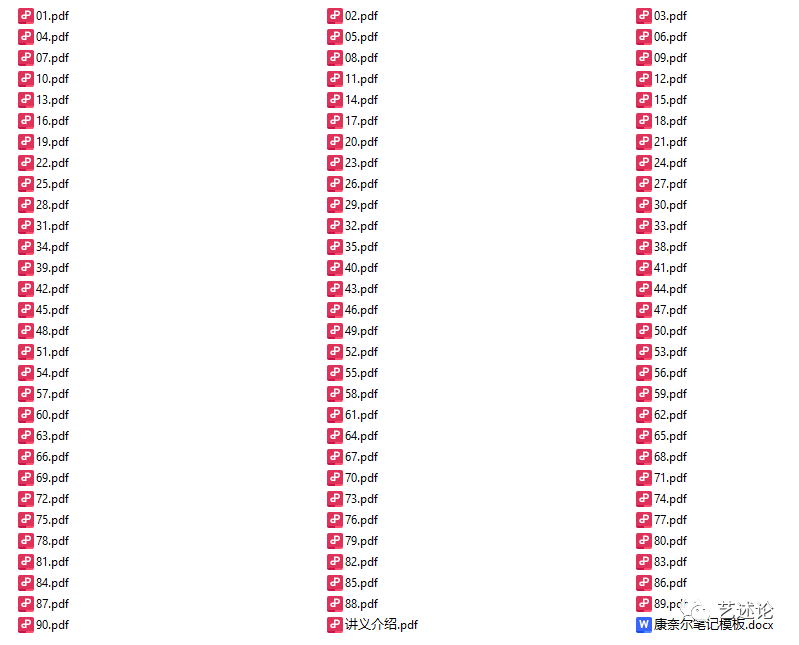
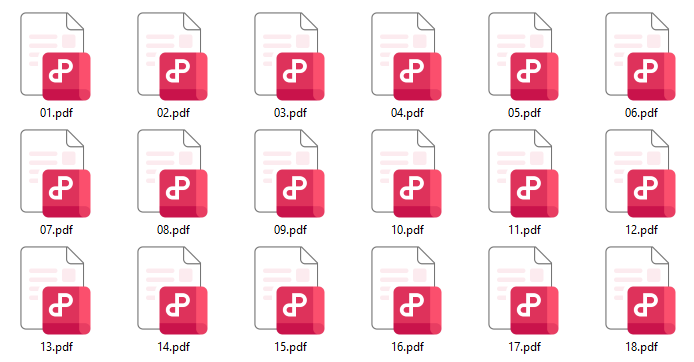
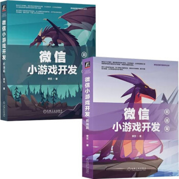
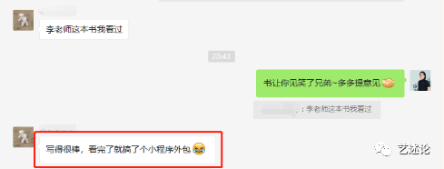
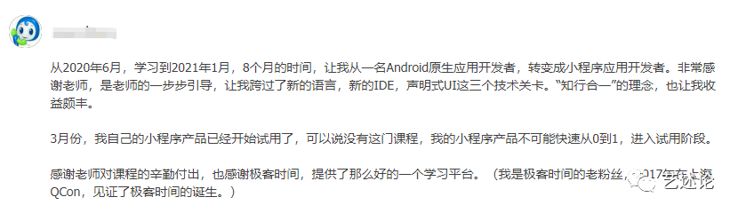
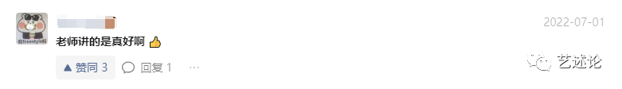
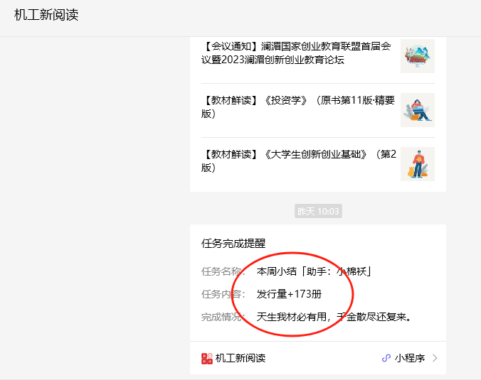
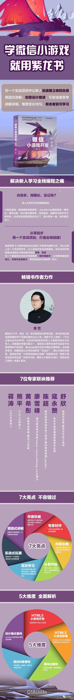

# 读二胖《编程路上那些让我效率倍增的方法》，谈新人如何学习编程，只要方法对了人人都可以成为黑客高手

我在知乎上发现了这篇好文，有 3 万多人点赞，作者是逆袭的二胖，文章地址在此，欢迎翻阅：

https://zhuanlan.zhihu.com/p/34418394

正如作者的名字所暗示的那样，二胖是一名大一调剂到计算机专业的学生，主要通过自学的方式，在毕业后拿到了 10 多个 offer，如愿进入了理想的大厂工作，真正完成了属于他的逆袭。

文中很多观点与我多年坚持的教学观点暗合，我读了之后也是拍手叫好。下面我结合二胖的原文，谈一下新人如何快速学习编程语言。以下内容当真是肺腑真言，读此一篇，即能真正明白到底该如何学习编程。

## 1，编程主要靠自学

二胖：

> 我个人是一名计算机专业的学生，很多人可能会认为我是在课堂上学到的编程，其实不是这样。
>
> 我认为科班出身和非科班出身的学生最大的区别在于**科班出身的学生知道去学什么**，知道每一门课程是干什么的；还有一些必须完成的作业、小项目，促使他们去做一些实际的编码练习，除此之外，真的全靠自学。

计算机专业科班出身，甚至是硕士、博士出身，并不代表他一定编程学得好。编程是一门手艺，需要在实践中锤炼。正如作者所说，科班出身并不比非科班占据任何优势，仅是知道该学什么而已。

对于“该学习什么”，这叫技术路线，对于使用不同技术栈的人这个路线还有所不同，这样的路线在网上都能找到，所以科班出身其实并不真的占据什么优势。

但知道该学什么其实用途并不太大，因为无论是哪个技术栈要学习的内容实在太多了，关键是怎么学，怎么高效、有效地学。

## 2，选择从哪一门编程语言下手？

二胖：

> 可能困扰编程新手最多的一个问题是【我应该学什么编程语言】或者【我需要学习哪些课程才能做出一个 web、一个 app】，很多人一直纠结这个问题，陷入了东学一点、西看一点的死循环，到头来啥也没学好，这会很浪费时间。
>
> 刚上大一的时候，我也很想知道应该选择什么编程语言。我问了很多人，网上各种查资料，但所能得到的答案都很片面，多数对这个问题答非所问，总是回答说“某某编程语言难”，“某某编程语言性能好”。**其实作为初学者，我们对计算机体系都不了解，就不要过多地去纠结性能，或者难易等因素**，原因我等下再说。
>
> 如果你有明确的方向，那么很好选择。**如果你想做算法、机器学习方向，那么 python 是最好的选择。如果你想做 web 开发，java、php 等都可以。如果想做一些更底层的工作，那么就可以选 c。**当然这是建立在你有明确方向的基础上。可是，很多人都没怎么接触过计算机行业，特别是和我一样刚入学就被调剂到计算机专业的人。对这些同学来说，各个编程语言就只是个名字，除了叫法不一样，你根本不知道它们有什么差别。所以索性不要纠结了，我替你选一个吧。

这个问题没有标准答案，与学习者期待将来从事的工作有关。依据我个人经历及编程教学经验，新人选择一门“所见即所得”的编程语言更容易入门，重点不是选择 C、C++，还是 Java、Python、Go，而是选择一门可以持续带给你正面反馈、即时反馈的技术。

**我个人认为，选择 JS，从编写小游戏入手，是最快的入门途径。**

编程语言均是相通的，等你会了一门语言之后，以此为据点再向其它语言拓展会容易很多。语言背后暗含的计算机基础、网络协议、面向对象、开发规范等这些内容，都是相似的，从任何一门你感兴趣并能坚持下去的语言开始学习都可以。

真正优秀的程序员从来都不是只会一门语言，如果你真的有志于此，你早晚会学几门编程语言，因此先学哪个后学哪个其实也并不是特别重要。

我坚持让初学者从小游戏开发学习编程，从 JS 开始入手，主要有两个考量：

1，玩游戏与制作游戏是人的天性，C 语言与 Unix 系统正是大神 Ken Thompson 和 Dennis Ritchie 在实验室里捣鼓《太空旅行》游戏时发明出来的；

2，JS 这门语言不用手动管理内存，单线程，语法极其简单，还拥有所有语言都向往和暗自学习的异步编程范式，没有比它更适合新人学习的编程语言了。

我在《微信小游戏开发》这套书中，为什么选择 JS，为什么选择小游戏，原因即在于此。此外，微信小程序生态有数亿的生态用户，市场太大了，用户在哪里就去哪里开发应用，从这个开发的黄金法则考虑，选择微信小游戏而不是选择其它小游戏是不是也好理解了。

## 3，学习编程，我需要学习哪些课程？

二胖：

> 我认为我们学习一项技能的时候，应该采取的是**项目驱动式学习**，即需要用到什么东西时不会了再去学，而不是先填鸭式的都填进脑子，并且在学习的过程中我们还不知道它这是干嘛用的，等之后用到了，甚至不记得自己学过，反而查资料才会想起：哦，原来我之前学的 xx 科目是这个用处啊，可是我当时并没有好好学。很多时候学生时间的浪费可能还是要怪老师、怪学校，他们一开始没给我们做好充分的课程介绍。所以，在经过比较多的编程和项目实践后，我认为一个比较好的学习方式是，**改良版的项目驱动学习法**。即：
>
> 学习一段时间，做个小项目，将做项目遇到的问题记下来，针对性地学习相关知识，然后再实践，再学一段时间理论，让知识成网状发射状地变大。当然，**项目驱动式学习有一个弊端，就是每次学习的知识都是项目所需要的，很零碎、不成体系**，所以需要改良，即在采取项目驱动学习法的时候每天抽一段时间去完整地读一本书，或者一个相关问题的完整介绍，这样就很容易把一些知识成体系地串起来。这样一段时间下来，慢慢的，你就知道我们为什么要学那么多科目，学这些科目能干什么。

二胖说的项目驱动式学习，有个老外教育家很早以前就给它起了一个专有名词：PBL（Project Based Learning），翻译成中文就是**项目驱动式学习**。这个方法很有名气，国内北京九渡河小学搞素质教育用的也是 PBL 大法，在网上有介绍，很成功也很有名，感兴趣的朋友可以搜索看看。

PBL 是一种理论+实践相结合的学习方法，如果仅是学习理论，会觉得枯燥无以为继，很难坚持；如果仅是实践，又陷于末端细节了，正如作者二胖所说，很零碎、不成体系。

那怎么办呢？

答案就是使用 PBL 项目驱动式学习大法。其实在国内软件公司，一直都有这种模式，只是大家没有注意往这个名字上想。公司里软件项目组流行的**师傅 1v1 带徒弟**做项目的方式，就是 PBL 方法，在做项目的过程中，师傅一边给徒弟派任务让徒弟练习技能，一边为其答疑解惑、夯实理论根基。

我在《微信小游戏开发》这套书中，采用的就是这种师傅带徒弟、PBL 实战教学法。整套书练习的是一个项目——不是很多个项目是一个项目，很多教程或图书里面列举的示例很散，这套书不是，为了减少学习者的心智认知负担，整套书只有一个实战项目，这个项目就像公司里面的实际项目一样，它是从一点一滴慢慢进化、慢慢完善的，系统化的理论知识是在项目进化的过程中不断渗透进去的。

读这套书，就像旁边有一个师傅，在耳提面命手把手教你如何开发项目一样，你不仅在学习编程技能，还在实践中不知不觉学习了必要的计算机基础、网络协议、数据库、设计模式、面向对象、编程规范等等相关的理论内容。

> 注：《微信小游戏开发》是以微信小游戏开发为技术栈，系统化讲解全栈开发的一套书，并且是在 PBL 案例实战中讲解的。

## 4，学习编程要不要制定一个计划？

二胖：

> 我认为不只是编程需要制定计划，其他任何的学习和工作都需要制定计划。我从 13 年上大学就开始定期给自己制定计划，这个习惯也一直坚持到了现在，受益匪浅。

当然要有一个可行的计划，凡事预则立，不预则废嘛。为了方便学习者制订计划，我将《微信小游戏开发》这套书的全部内容划分成了 90 课，按部就班，一步学习一课就好了，稳扎稳打，步步为营。

## 5，学习编程要不要记笔记？

二胖：

> 笔记是必须要做的，并且记笔记是一个长期的过程。在学习的过程中，我们一直都在追求一种最高效的学习方法，比如，同一个班的同学，他用他的学习方法考上了清华，而你用同样的方法就不行，为什么？因为他的方法对他自己而言是定制化的，可能且大概率不适合你，比如他的笔记你不一定能看懂，因为他可能设计了一套属于自己的符号。而就编程而言，很多同学说善用搜索引擎，是对的，可是搜索引擎搜出来的是别人的答案。你照搬过来，也许可以用，但是你没有记住，这些知识并不属于你，之后你可能还会遇到同样的问题，又要再搜索一遍，可能很难找到之前的那个答案了。但是记笔记就不一样，记笔记是定制化的，对你自己定制，你可以用自己最爽的表达方式来描述一个问题，是自己写给自己看的东西，看了几遍之后就能非常迅速和容易地理解。之后遇到相同的问题可以快速地通过找笔记解决。

全世界公认最快的学习方法是费曼学习法，即把学到的内容及时用自己的方式和语言输出一遍。形式多种多种，可以是文字、语音，或者视频。

为了方便学习者做笔记，我为学习者专门在书外又编写了一套自学讲义，一共是 90 个 PDF，正好一课对应一个。在学习的时候，你可以以此讲义为基础，独立编写自己的学习心得，以加深理解和记忆。

## 6，多久能学会编程？

二胖：

> 其实这个问题是没有答案的，如果只是想做出一个小应用，2 个月足矣，而就我个人而言，我认为学习编程不是学习一种编程语言，而是学习一个生态，一个计算机系统，所以无止境。

没错，现在学习任何一门技术，学习的都是整个生态。《微信小游戏开发》其实是以讲解整个微信小游戏开发生态为主线的，它并不是单单讲解 JS 的，它里面除了 JS，其实还有 SQL、Node.js、Go 等语言。

## 7，我应该选择什么资料，看什么书？

二胖：

> 其实这个问题也是很多编程新手容易困惑的问题。网络上拥有我们一辈子都看不完的教程和资料，所以现在应该不会存在找不着视频教程、找不着书看的问题。而问题就是我们不知道看什么视频、看什么书。从开始学编程到现在，我也买了上百本书，而真正适合自己的好书并不多。而视频教程的问题就更严重了，东看一点、西看一点，知识很难组织成网络。所以**学习编程的过程中，我们遇到的最大的问题是：当我们遇到问题的时候，在大量资料面前，我们不知道选择什么资料去学习。**即使我们使用项目驱动式学习的方法找到了我们的方向，但是同一个路径下，也有很多资料。前文列举的项目驱动式学习的图中，我们是自上而下的去发现问题，然后再解决问题。**如果能有人帮我们组织好学习路径，然后自下而上地去学习，那么效率可能会提高很多。**

我在编写《微信小游戏开发》这套书之前，我没有读到过二胖这篇文章；我是在书已经出版以后，看到了这篇文章。二胖谈论的这个问题，其实是编程初学者遇到的经典问题。

我编写这套书，就是想为初学者组织好一条像登泰山一样的路径，带领初学者自下而上一步一步地学习。可能由于我水平有限，加上时间仓促等其他原因，我未必达到了我心目中的理想目标，但我确实是这样去做的。包括我的其它在线课程，其实也都是有意在贯彻 PBL 实战教学思想。

戳此前往[京东下单《微信小游戏开发》套装](https://item.jd.com/10070363837259.html)👈

——朴素的分割线——

好了，关于二胖的文章就写这么多吧，二胖的原文更精彩，阅读原文你可能更有感触，有时间建议阅读一下。

下面我谈一下初学者基于我这套书怎么学习，有两种方式：

1，把书买回去，把讲义下载到本地，按课，一步一步学习即可。在京东、当当商城均有销售链接。

2，报名我特意推出的 1v1 师徒培训班。

## 1v1 师徒培训班

师徒培训班是 1v1 辅导，交流的主要方式是邮件+微信，主要的内容除了全套书的内容，另外再加上一个你自己喜欢的、钟意的项目实战。我会额外带着你，把你自己的这个项目给做出来。

什么意思？

具体来讲，就是不仅教你学会微信小游戏开发这门生态技术，还带着你做了一个“项目外包”。与一般的项目外包不同点在于，你是主角，是主要的开发者，我提供指导；这样在项目完成后，你可以继续自己修改和改善项目。换言之，教的是三点水的“渔”。

形式是 1v1 的，这和公司里面老人带新人的方式还有什么区别呢？

1v1 师徒培训班是收费的，且价格对某些人来说可能会有一些小贵。不过想一想，你做一个外包项目需要多少钱？何况外包那种形式是一次性成果，你自己并没有学会任何修改它的技能？

1v1 师徒培训班随报随学，只限 60 名，名额报完不再收，这也是为了保证效果。还有，培训结束以后，师徒关系仍然是存续的，你在自修过程中有什么技术问题仍然可以随时找我讨论。

如果你对 1v1 师徒培训班感兴趣，[戳此添加我的微信报名](https://mp.weixin.qq.com/s?__biz=MzAwODIzMzU3Mw==&mid=2651750551&idx=1&sn=4552e3895fd3e3585c9a4ba6004a30a3&chksm=808bd79db7fc5e8bc31d88a2d986336ecaaae9db210daa081eb1463bcee80235cdff03be6900#rd)[**👈**](http://mp.weixin.qq.com/s?__biz=MzAwODIzMzU3Mw==&mid=2651750551&idx=1&sn=4552e3895fd3e3585c9a4ba6004a30a3&chksm=808bd79db7fc5e8bc31d88a2d986336ecaaae9db210daa081eb1463bcee80235cdff03be6900&scene=21#wechat_redirect)，发送暗号 1v1。

## 读者评价

戳此前往[京东下单《微信小游戏开发》套装](https://item.jd.com/10070363837259.html)👈
[戳此添加作者微信👈](http://mp.weixin.qq.com/s?__biz=MzAwODIzMzU3Mw==&mid=2651750551&idx=1&sn=4552e3895fd3e3585c9a4ba6004a30a3&chksm=808bd79db7fc5e8bc31d88a2d986336ecaaae9db210daa081eb1463bcee80235cdff03be6900&scene=21#wechat_redirect)，发送暗号 1v1，马上报名私教培训班

## 大佬评价

李艺的这本书将带领更多的新开发者敲开理想世界的大门。来吧朋友，这里有一个更酷的新世界在等着你一起构建。

——黄希形 前端开发专家、腾讯T4专家

微软的比尔·盖茨，特斯拉的马斯克，宇节跳动的张一鸣，小米的雷军，他们都是程序员。现在正在进人人人都是程序员的时代，优秀程序员的成长路径是什么呢?边实践、边学习才是最好的程序员成长路径。以下围棋为例，学习围棋最重要的是实有对手、有输赢、才会有学习围棋知识的动力。编程也是一样，要想成为编程高手，只有出自己的项目作品，有了用户反馈才会有最大的成长动力。

编写游戏是无数优秀程序员入行的第一步。很高兴看到李艺这本书的出版，它会带着写出自己的微信小游戏。让朋友玩自己开发的游戏，这是多好的兴趣驱动和正反馈啊!相这本书的读者里会涌现出一批优秀的程序员。

——蒋涛 CSDN 创始人

李艺是51CTO的忠实用户和专家，拥有近20年的软件研发经验，这本书是他长期从事编程教育的经验总结。本书最大的创新在于，用一个PBL实战案例，将需要讲解的知识点和读者需要练习的技能点全部串联了起来，并且是遭照人的学习规律，按从易到难的顺序逐一安排的。整本书就像从山脚伸向山顶的石阶，相信新人朋友跟着书中节奏学习，一定会大有长进。

——熊平 51CTO创始人

本书最大的特点是循序渐进，从几行代码开始，逐步深入，最终实现一个完整的微信小游戏项目，特别适合新手入门。同时作者用自已丰富的实战经验，细致地帮助初学者在遇到问题时定位并解决问题，使初学者能快速建立一套较完善的思维方式和工作流程。对想学习前端小游戏开发的新手来说，这本书就像一个经验丰富的老程序员在身边手把手带着你做项目，让你学完之后真的有很大收获。

——廖雪峰，著名技术专家(www.liaoxuefeng.com博主)

本书运用 PBL 实战教学思想来引导读者学习微信小游戏项目的开发。不同于其他的编程入门书籍，李艺编写的这本书富有创意且趣味性十足。在内容方面，不仅章节设计非常巧妙合理、知识脉络清晰，还通过丰富的代码案例与图示让读者更加直观地理解小游戏开发的基础和进阶知识，非常值得一读!

——陈超，腾讯高级前端开发工程师、腾讯课堂前端Leader

本书不仅介绍了小游戏开发的基础知识，也展示了开发过程中常见问题的解决思路，并通过引入设计模式、模块化重构程序的高级知识，让读者不会仅停留在小游戏开发的技巧中，而是上升到软件开发的终极方法。这种学习方式和思维方法能让读者举一反三，在以后的学习和工作中持续受益，从而设计与开发出可维护和可扩展的程序。

——寇永赞，新东方教育集团前端技术经理

本书是一本介绍微信小游戏开发的图书，不仅适合前端开发者，也适合对小游戏开发感兴趣的读者。阅读本书可以很好地掌握微信小游戏开发的相关知识，学完后即可独立开发出一款完整的微信小游戏。在学习的过程中，不仅能快速产出学习成果，看到小游戏的成型界面，还能学到许多基础知识，便于查漏补缺。这是一本不可多得的好书，值得推荐!

——舒欣，微信开发者/腾讯云开发工程师

戳此前往[京东下单《微信小游戏开发》套装](https://item.jd.com/10070363837259.html)👈
[戳此添加作者微信👈](http://mp.weixin.qq.com/s?__biz=MzAwODIzMzU3Mw==&mid=2651750551&idx=1&sn=4552e3895fd3e3585c9a4ba6004a30a3&chksm=808bd79db7fc5e8bc31d88a2d986336ecaaae9db210daa081eb1463bcee80235cdff03be6900&scene=21#wechat_redirect)，发送暗号 1v1，马上报名私教培训班

## 销量稳定增长

《微信小游戏开发》上架后销量一直稳定增长，2023年十一刚过，周销竟然达到了173。照此销量预估，一年销量可达约9000册。

## 《微信小游戏开发》海报

附一张出版社为这套书精心制作的海报，它很漂亮不是吗？同时也言简意骇，把本套书的亮点及要解决的痛点都表达清楚了。

戳此前往[京东下单《微信小游戏开发》套装](https://item.jd.com/10070363837259.html)👈
[戳此添加作者微信👈](http://mp.weixin.qq.com/s?__biz=MzAwODIzMzU3Mw==&mid=2651750551&idx=1&sn=4552e3895fd3e3585c9a4ba6004a30a3&chksm=808bd79db7fc5e8bc31d88a2d986336ecaaae9db210daa081eb1463bcee80235cdff03be6900&scene=21#wechat_redirect)，发送暗号 1v1，马上报名私教培训班

## 《微信小游戏开发》套装目录

**微信小游戏开发：前端篇**

第一篇　潜龙勿用

第1章　创建小游戏项目　　2

第1课　创建项目　　2

了解小游戏的双线程运行机制　　2

注册开发者账号　　4

安装微信开发者工具　　5

创建第一个小游戏项目　　6

项目测试：本地预览与手机预览　　7

基于文件监听实现自动预览　　8

了解小游戏示例项目的项目结构　　11

小游戏如何调试代码　　13

拓展：如何安装、配置 Node.js和babel-node　　17

了解面向对象编程有关的基本概念　　18

本课小结　　20

第2课　微信小游戏是如何运行的　　21

创建画布　　21

拓展：如何给变量命名　　22

如何绘制矩形　　23

拓展：如何理解小游戏的全局变量及作用域　　24

如何清空画布　　25

如何绘制网络图片　　25

如何在小游戏中实现动画　　28

如何实现人机交互　　29

拓展：如何理解局部变量　　30

拓展：了解微信小游戏的API风格　　31

本课小结　　32

第二篇　见龙在田

第2章　编写一个简单的HTML5

小游戏：打造游戏界面　　34

第3课　绘制游戏标题　　35

安装与配置Visual Studio Code　　35

学习使用HTML标记，开始绘制游戏标题　　36

拓展：如何使用const 关键字　　39

拓展：如何给代码添加注释　　40

如何改变字体、字号和颜色　　40

拓展：在font-family中要使用中文字体的英文名称　　42

如何给文本添加文本样式　　42

如何在绘制文本中使用渐变色　　44

如何让文本居中绘制　　46

拓展：为什么要在代码中使用常量　　48

本课小结　　48

第4课　绘制挡板　　48

如何在画布上绘制直线　　48

拓展：JS的8个基本数据类型，如何进行类型判断　　50

给画布添加一个浅色背景　　53

如何加厚挡板　　54

拓展：JS中的数值类型、布尔类型是如何进行类型转换的　　55

如何给挡板添加圆角、阴影效果　　56

使用路径填充和矩形绘制挡板　　58

如何使用颜色渐变对象和图像填充材质绘制挡板　　60

拓展：什么是区块作用域　　65

拓展：了解数字类型，警惕0.1 + 0.2不等于0.3　　66

拓展：如何批量声明变量、常量　　67

本课小结　　67

第5课　绘制小球　　68

如何使用弧线绘制圆形　　 68

如何使用arc方法直接绘制圆形　　70

本课小结　　71

第6课　绘制分界线　　71

分别通过lineTo和渐变色绘制分界线　　71

拓展：CSS 颜色值有哪些格式　　73

使用函数绘制间隔效果　　75

拓展：如何定义和使用函数　　77

使用循环绘制分界线　　81

拓展：使用比较运算符、if控制语句和算术运算符　　84

拓展：JS的5种循环控制语句　　86

将函数当作变量使用　　87

拓展：如何理解JS的作用域链与闭包　　90

拓展：如何使用集合对象 Map 与 Set　　92

本课小结　　95

第3章　编写一个简单的HTML5小游戏：完成交互功能　　96

第7课　实现动画：让小球动起来　　96

使用定时器实现动画　　96

拓展：如何理解JS的异步执行

机制　　98

拓展：了解13种复合赋值运算符　　99

完成动画的关键：清屏　　99

如何实现小球与屏幕的碰撞检测　　103

拓展：复习使用if else if 语句　　105

使用 requestAnimationFrame改进动画流畅度　　106

本课小结　　108

第8课　监听用户事件：让挡板动起来　　108

绘制左挡板　　108

使右挡板可以上下自主移动　　110

改用函数绘制挡板　　111

监听用户输入，使用鼠标（或触摸）

事件操控左挡板　　112

实现挡板与球的碰撞检测　　114

拓展：如何使用逻辑运算符　　115

统计分数　　116

拓展：复习批量声明变量，可以将逗号放在前面　　117

在游戏结束时添加反馈　　118

拓展：加号与模板字符串　　120

本课小结　　121

第9课　实现游戏的重启功能　　122

绘制重新开始游戏的文本提示　　122

理解HTML5的事件模型，监听单击事件实现重启功能　　123

拓展：如何使用removeEventListener　　127

本课小结　　128

第10课　控制游戏音效：添加单击

音效和背景音乐　　128

如何使用JS代码播放声音　　132

给项目添加背景音乐　　133

使用图片材质绘制背景音乐按钮　　134

使用离屏画布绘制背景音乐按钮　　136

使用drawImage绘制背景音乐按钮　　138

监听背景音乐按钮的单击事件　　139

拓展：如何使用条件运算符　　140

本课小结　　141

第4章　移植及优化　　142

第11课　移植准备工作　　143

创建代码片段与改写项目　　143

拓展：在小游戏中如何获取屏幕尺寸　　144

拓展：关于代码自动提示　　146

本课小结　　146

第12课　移植音频和事件　　146

处理getElementById is not a function错误　　146

播放音频：处理Audio is not defined错误　　148

处理Audio错误：canPlayType is not a function　　150

处理currentTime错误：currentTime  是只读属性　　151

挡板绘制：处理Image is not defined 错误　　152

拓展：复习条件运算符和短路评估表达式　　153

准备移植事件监听，认识小游戏的触摸事件　　154

拓展：targetTouches、touches和changedTouches的区别　　156

改写click事件与mousemove事件　　157

拓展：关于小游戏的运行环境　　161

本课小结　　161

第13课　移植文本与图像　　161

处理标题文本不显示的问题　　162

拓展：实现渐变、阴影效果的替代方案　　167

解决左挡板移动到底部不显示的问题　　167

使背景音乐循环播放　　168

优化分数文本、挡板、小球与背景音乐按钮的参数　　170

拓展：如何在测试时静音　　173

本课小结　　173

第5章　移植后对小游戏进行平台功能优化　　174

第14课　绘制微信用户头像　　174

小游戏有哪些授权范围　　174

不能直接查询“用户信息”的授权情况　　175

使用 UserInfoButton　　 176

拓展：为什么要使用全等运算符而不是等号运算符　　180

绘制用户头像　　181

拓展：学习使用箭头函数及判定 this 对象　　182

主动销毁按钮　　194

控制头像大小，让左挡板默认展示　　195

主动查询用户授权　　196

拓展：如何在测试中清理缓存　　200

本课小结　　200

第15课　添加游戏反馈　　201

添加Toast提示　　201

在提示窗口中自定义icon　　202

使用模态弹窗　　204

拓展：游戏渲染的帧率可以修改吗　　206

本课小结　　207

第16课　添加超时限制　　208

限制游戏30s结束　　208

拓展：复习定时器的使用　　209

让游戏支持重启　　215

及时清除定时器　　216

本课小结　　217

第三篇　龙战于野

第6章　模块化重构一：准备重构　　220

第17课　梳理游戏逻辑　　221

在小游戏中如何使用全局变量　　221

拓展：作用域与使用let关键字实现批量变量声明　　222

整理代码，将变量与常量放在文件顶部　　223

梳理游戏逻辑，明确6个周期函数　　227

添加start函数　　228

添加end函数　　228

添加init函数　　230

添加loop函数　　232

及时移除事件监听　　234

本课小结　　236

第18课　JS如何创建对象及如何实现模块化　　236

使用原型继承对象　　237

使用构造函数创建对象　　238

拓展：理解__proto__与prototype属性　　239

拓展：如何理解原型及原型链　　242

基于原型链实现万能的类型检测方法instanceOf　　244

使用class关键字创建类对象　　245

使用CommonJS规范　　246

使用ES Module规范　　247

拓展：对比CommonJS规范和ES Module规范的差异　　248

本课小结　　251

第7章　模块化重构二：重构背景音乐、小球和挡板　　252

第19课　创建背景音乐模块　　252

开始创建背景音乐模块　　252

拓展：重新认识class和函数调用中的this　　258

拓展：认清JS的内存管理　　261

拓展：了解代码的优化评判标准　　263

改进复用性和易用性：将数据参数化，设置参数的默认值　　263

改进封装性：将内部成员私有化　　266

优化图片渲染：由多次加载改为加载一次　　268

改进封装性：添加getter　　269

对易用性的改进：直接导出单例　　271

本课小结　　272

第20课　创建小球模块　　272

开始创建小球模块　　272

使用跨文件常量　　274

拓展：使用defineProperty将变量改为常量　　275

创建Ball类　　276

本课小结　　282

第21课　创建挡板模块　　282

开始创建Panel类　　282

使用继承实现左、右挡板　　291

拓展：复习JS实现继承的方式　　297

拓展：复习类型检测操作符

typeof与instanceof的不同　　300

本课小结　　301

第8章　模块化重构三：重构记分板、

背景、页面和游戏对象　　303

第22课　创建记分板模块　　303

实现两个记分板类　　303

拓展：复习ES Module的导出与导入　　312

使用工具方法drawText　　313

隐藏分数变量　　314

本课小结　　316

第23课　创建游戏背景对象和游戏对象　　316

创建背景对象　　317

为创建游戏对象做准备　　320

让音频管理者接管单击音效　　321

实现游戏对象Game类　　323

拓展：复习使用bind改变this对象　　331

本课小结　　332

第24课　创建页面对象　　332

创建游戏结束页面　　333

创建游戏主页对象　　338

本课小结　　347

第25课　重构游戏对象　　347

一个文件只定义一个类　　347

为Game类添加#currentPage变量　　352

解决30s超时限制不起作用的问题　　356

移除#gameIsOver变量　　359

本课小结　　359

第9章　面向对象重构一：重构游戏对象等　　361

第26课　设计模式重构一：单例模式、观察者模式和组合模式　　362

将Game类改写为单例模式　　362

在Game类上应用观察者模式　　364

使用组合模式改写用户记分板模块　　370

本课小结　　381

第27课　设计模式重构二：模板方法

模式、职责链模式和简单工厂模式　　381

在页面对象中启用模板方法模式　　382

使用职责链模式改写单击音效实现　　386

使用简单工厂模式改写turnToPage方法　　391

本课小结　　396

第10章　面向对象重构二：页面对象和分界线的绘制　　397

第28课　设计模式重构三：工厂方法

模式和抽象工厂模式　　397

使用工厂方法模式创建Page页面对象　　397

使用抽象工厂模式封装页面对象的创建过程　　400

本课小结　　403

第29课　设计模式重构四：建造者模式、命令模式和原型模式　　403

使用建造者模式构建页面对象　　404

拓展：如何理解建造者模式、抽象工厂模式与模板方法模式　　408

使用命令模式绘制分界线　　408

使用原型模式复制对象　　412

拓展：JS如何实现浅复制与深复制　　416

本课小结　　419

第30课　设计模式重构五：复合命令模式、迭代器模式和享元模式　　419

使用复合命令模式重构GameOverPage　　419

使用迭代器模式改造复合命令实现　　426

使用享元模式改写分界线绘制　　432

本课小结　　438

第11章　面向对象重构三：重构音频管理等　　439

第31课　设计模式重构六：适配器模式、桥接模式和装饰模式　　439

使用适配器模式改造音频管理者　　439

使用桥接模式重构碰撞检测　　447

使用装饰模式重构挡板的渲染方式　　462

本课小结　　467

第32课　设计模式重构七：访问者模式和策略模式　　467

使用访问者模式优化碰撞检测　　467

使用策略模式扩展右挡板的移动算法　　471

拓展：关于25个设计模式的补充说明　　474

本课小结　　476

附录　思考与练习参考答案　　477

**微信小游戏开发：后端篇**

目　录　Contents

序一

序二

前言

第1章　本地功能：本地存储与LBS定位1

第1课　读写本地缓存1

创建数据服务单例，实现本地数据读取2

拓展：使用Storage面板管理本地缓存数据4

面向Promise编程：异步转同步5

如何清除本地缓存12

本课小结13

第2课　使用FileSystemManager读写本地文件13

读写本地文件，实现数据服务模块14

面向Promise编程：避免使用try catch17

本课小结20

第3课　使用腾讯位置服务显示用户城市20

使用腾讯位置服务21

拓展：小心隐藏字符错误27

解决回调函数简写引发的错误28

使用异步转同步技巧重写LBSManager29

本课小结30

第2章　本地功能：优化游戏体验与性能31

第4课　优化游戏体验：添加背景图片和顶级UI层31

添加适配不同机型的背景图片31

使用有限字符的自定义字体35

在左挡板失误时振动37

监听并处理背景音乐的意外暂停39

使用一个暂停按钮，控制游戏的暂停与恢复41

解决游戏暂停后定时器不暂停的问题47

添加游戏顶级UI层，实现退出功能51

本课小结58

第5课　优化游戏性能：监听全局错误，记录错误日志59

监听全局错误，使用外观模式记录错误日志59

允许打开设置页面，用户自己管理授权66

拓展：关于小游戏UI层结构的说明68

主动垃圾回收68

拓展：如何控制屏幕亮度69

本课小结70

第3章　本地功能：添加排行榜和广告71

第6课　添加好友排行榜，为社交营销助力71

实现一个游戏内玩家排行榜71

实现好友中心玩家排行榜82

开启游戏圈：从小游戏中进入游戏圈83

开启客服会话：在小游戏中打开客服窗口86

开启用户意见反馈通道87

添加防沉迷机制88

本课小结91

第7课　添加广告92

添加Banner广告92

添加视频激励式广告93

本课小结94

第4章　云开发：创建与使用云函数96

第8课　创建第一个云函数97

配置云开发98

开通云环境99

在云数据库中创建集合101

认识云函数102

创建云函数103

本课小结105

第9课　调试和调用云函数106

云端测试106

本地调试109

调用云函数111

本课小结112

第5章　云开发：使用云数据库113

第10课　在小游戏端直接操作云数据库113

在小游戏中初始化云环境113

直接操作云数据库集合114

拓展：了解云数据库中的字段类型118

本课小结120

第11课　用两种方式实现分页查询120

使用分页查询方法121

使用聚合查询方法123

使用循环的方式清空小数据集合126

拓展：为查询字段添加索引，提升执行效率127

拓展：了解集合的权限控制128

本课小结129

第12课　用户如何操作自己创建的数据：查询与更新129

查询用户自己添加的历史数据130

在调试区测试云函数133

使用原子操作，更新用户自己创建的数据133

拓展：关于数据库操作符和数据库聚合操作符136

拓展：使用云文件ID137

本课小结138

第6章　后端：用Node.js实现接及处理客服消息139

第13课　准备MySQL数据库141

安装MySQL数据库与数据库管理工具141

创建数据库实例142

创建数据表history143

拓展：了解常用的MySQL数据类型146

本课小结149

第14课　实现history的3个RESTful API（Node.js版本）149

启动模板项目149

熟悉node-koa2项目模板结构150

拓展：了解RESTful API设计规范160

实现history的3个接口（Node.js版本）162

拓展：学习9种HTTP请求方法166

本课小结167

第15课　在小游戏端调用Node.js接口167

实现后台接口管理者模块，调用history的3个接口167

扩展新方法getOpenid，注意保持新旧代码的兼容性171

小游戏与小程序接口不一定一致174

使用外观模式实现统一的存储服务管理者178

本课小结181

第16课　在服务器端接收和处理客服消息（Node.js版本）181

使用内网穿透工具frp181

在小游戏后台启用与配置消息推送187

实现消息推送接口（Node.js版本）188

拓展：如何使用Linux指令查杀、重启程序192

拓展：如何在Windows系统上运行Linux指令193

本课小结196

第7章　后端：用Node.js和实现管理后台197

第17课　实现导航与登录功能（Node.js版本）197

创建数据表account198

拓展：互联网鉴权方式简介199

实现登录200

添加历史记录页面211

个人开发者使用小微商户实现支付215

本课小结227

第18课　使用Go语言实现后端程序228

使用go_iris项目模板228

实现history的3个接口230

使用curl测试接口235

接收和处理客服消息237

实现登录功能240

实现历史记录页面，分角色权限渲染功能247

拓展：如何让Go语言下载模块快一些250

本课小结250

*此外，为了更好帮助初学者学习，作者还准备了《微信小游戏开发：番外篇》，在公号“艺述论”回复10000即可看到。以下是番外篇的目录。*

*
*

**微信小游戏开发：后端篇**

***
***

目录

前言：学编程就像登山.................16

一，学习编程的 5 个阶段.....16

二，学习应该自上而下，还是自下而上........ 17

三，微信小游戏是编程入门项目的最佳选择 18

四，如何开始学习.................19

1，本书主要优势...........19

2，本书主要内容...........20

3，本书主要读者...........20

4，如何学习本书...........20

5，如何获取更多资源...21

五，勘误与支持.....................21

六，致谢..........21

第一篇 潜龙勿用（前端补充篇）23

第 1 章 认识计算机世界................23

第 1 课 计算机是如何计算 1+1=2 的？...........24

1 在浏览器中进行算式实验..................... 25

2 开始与浏览器对话，浏览器没有计算能力........ 26

3 问询 CPU，从 CPU 的视角解释加法器..............30

4 计算机实现加减乘除及呈现文字影像的原理.... 33

本课小结..34

第 2 课 计算机是如何实现可编程能力的？... 34

1 我是一个 Bug，开始是一条虫子..........34

2 我是一个机器，从开关开始进化......... 36

3 我是一个 CPU，是电子计算机的神经中枢....... 40

4 我是一个编译器，是一名人类与计算机之间的翻译官....42

本课小结..44

第 3 课 编程语言长什么样子？44

1 我是 C 语言，人类为了玩游戏而发明了我........45

2 我是一个变量，计算机靠我增加了“智能” .........48

3 我是一个语句，是组成代码的基本单位............ 50

第 4 页

4 我是逻辑控制语句，有三种结构......... 51

5 我是一个代码区块，拥有独立作用域. 54

6 我是一个函数，是实现代码复用的基本单位.... 55

7 我是一个类，具有封装、继承、多态三个面向对象特征56

本课小结..59

思考与练习参考答案.....59

第 4 课 什么是数据结构与算法？................... 61

1 数据结构一：栈..........61

2 数据结构二：队列......64

3 数据结构三：优先队列.. 67

4 数据结构四：链表......71

5 什么是算法和冒泡排序？..................... 76

6 什么是架构和架构师？.. 78

本课小结..79

思考与练习参考答案.....79

第 5 课 什么是类、面向对象和设计模式？... 81

1 基本特征一：封装......81

2 基本特征二：继承......83

3 基本特征三：多态......84

4 6 个基本原则...............86

5 什么是设计模式？......88

本课小结..89

思考与练习参考答案.....89

第 6 课 什么是 JavaScript、HTML 和 CSS？. 91

1 什么是 ES6？..............91

2 JavaScript 语言有哪些特点？................92

3 如何使用 Console 面板调试代码？...... 95

4 什么是 HTML？......... 97

5 什么是 CSS？..............99

6 什么是 JS 的宿主环境？......................100

7 什么是 HTML5？..... 101

8 什么是画布（Canvas）？....................101

第 5 页

本课小结102

思考与练习参考答案...102

第二篇 亢龙有悔...103

第 2 章 面向对象和设计模式实例讲解................. 106

第 7 课 面向对象的 6 个基本原则..................108

1 从“白马非马”看抽象与具象................109

2 SOLLID：面向对象的 6 个基本原则. 109

3 最重要的基本原则：开放-封闭原则.. 114

4 了解 MVC 及响应式框架.................... 117

5 设计模式的本质是什么？....................119

6 设计模式的时代演进性 120

本课小结121

思考与练习参考答案...121

第 8 课 创建型模式一：单例模式和工厂三枝花........ 123

1 单例模式（Singleton Pattern）............123

2 工厂模式（Factory Pattern）简介.......125

3 简单工厂（Simple Factory）模式.......126

4 工厂方法（Factory Method）模式......128

5 抽象工厂（Abstract Factory）模式.....130

6 工厂三枝花彼此之间有什么不同？... 133

7 抽象工厂模式与桥接模式有什么不同？.......... 133

本课小结134

第 9 课 创建型模式二：建造者模式和原型模式........ 134

1 建造者（Builder）模式 134

2 建造者模式与抽象工厂模式有什么不同？...... 139

3 原型（Prototype）模式.139

本课小结143

第 10 课 行为型模式一：迭代器模式和观察者模式.. 144

1 迭代器（Iterator）模式.144

2 内、外迭代器............144

3 使用标准迭代器........146

4 如何迭代 Object? ...... 152

第 6 页

5 集中扩展 Object.prototype ................... 154

6 如何实现一个通用迭代器？............... 155

7 观察者（Observer）模式.....................158

本课小结160

第 11 课 行为型模式二：模板方法模式、命令模式和状态模式............ 161

1 模板方法（ Template Method）模式.. 161

2 建造者模式与模板方法模式有什么不同？...... 165

3 命令（Command）模式165

4 使用命令模式实现撤消功能............... 168

5 状态（State）模式....171

6 状态模式与简单工厂模式有什么不同？.......... 175

本课小结175

第 12 课 行为型模式三：策略模式、职责链模式和中介者模式............ 175

1 使用策略（Strategy）模式抽离算法..176

2 建造者模式与策略模式有什么不同？.............. 178

3 使用职责链（Chain of Responsibility）模式.... 179

4 职责链模式和策略模式有什么不同？.............. 182

5 使用中介者（Mediator）模式.............182

6 中介者模式与观察者模式有什么异同？.......... 189

本课小结189

思考与练习参考答案...189

第 13 课 行为型模式四：访问者模式、解释器模式和备忘录模式........190

1 使用访问者（Visitor）模式.................190

2 使用解释器（Interpreter）模式.......... 197

3 使用备忘录（Memento）模式............ 199

4 备忘录模式配合命令模式使用........... 202

5 状态模式与备忘录模式、策略模式的对比...... 206

本课小结207

第 14 课 结构型模式一：组合模式和外观模式.......... 207

1 使用组合（Composite）模式.............. 208

2 了解浏览器差异，使用外观（Facade）模式...214

3 使用外观模式改写示例 39 .................. 221

第 7 页

本课小结225

第 15 课 结构型模式二：代理模式和适配器模式...... 226

1 使用代理（Proxy）模式加快页面加载.............226

2 使用 ES6 的 Proxy 实现对象管控....... 232

3 代理模式与外观模式有什么区别？... 236

4 使用适配器（Adapter）模式...............237

本课小结240

第 16 课 结构型模式三：装饰模式、桥接模式和享元模式...... 240

1 使用装饰（Decorator）模式............... 240

2 装饰模式与组合模式有什么异同？... 247

3 装饰模式与代理模式有什么区别？... 248

4 装饰模式与适配器模式、外观模式的区别？.. 248

5 使用桥接（Bridge）模式.....................248

6 桥接模式与代理模式、适配器模式有什么区别？.......... 253

7 使用享元（Flyweight）模式............... 254

本课小结257

思考与练习参考答案...258

第 3 章 JS 语法实例讲解.............259

第 17 课 JS 语法基础一：基本数据类型和变量、常量............. 260

1 JS 语言的基本特点和编译原理...........260

2 如何编写与测试 JS 代码？..................262

3 字面量、注释与标识符 262

4 基本数据类型和声明关键字............... 264

5 标识符提升................276

本课小结278

第 18 课 JS 语法基础二：操作符和逻辑控制语句..... 278

1 四则运算操作符及逻辑运算符........... 278

2 可选链操作符（?.）.283

3 空值合并操作符（??）.284

4 逻辑控制语句之 if 语句 285

5 四种简单的 for 循环.286

6 入口控制循环和出口控制循环........... 289

第 8 页

本课小结290

思考与练习参考答案...290

第 19 课 面向对象语法一：对象和数组....... 290

1 对象属性名称简写....291

2 方法名称简写............291

3 计算属性....................292

4 Symbol 属性.............. 292

5 扩展运算符................293

6 将 Object 用作字典...293

7 数组的基本操作........294

8 使用扩展运算符展开数组元素........... 294

9 快速清空数组............294

10 如何删除数组中的元素？................. 295

11 如何在指定位置添加数组元素？..... 296

12 数组归并（reduce）操作...................296

本课小结297

思考与练习参考答案...297

第 20 课 面向对象语法二：函数、类与作用域.......... 299

1 函数的定义................299

2 函数调用与立即调用（IIFE）............ 301

3 使用 apply、call 间接调用函数...........303

4 递归函数....................306

5 正确理解函数中的 this 关键字............307

6 闭包.....307

7 对象的创建与继承....312

8 模块化开发................315

9 JS 的 6 种作用域.......319

10 作用域的嵌套与遮蔽.. 321

11 原型继承与属性屏蔽...322

本课小结325

思考与练习参考答案...325

第 21 课 JS 实用技巧一：操作符、扩展运算符和短路评估等技巧....... 327

第 9 页

1 使条件运算符（?:）简化 if 逻辑........327

2 使用逻辑或运算符（||）简化变量赋值.............328

3 使用扩展运算符（…）操作数组....... 328

4 使用双按位非运算符（~~）向下取整..............330

5 在 if 条件中使用布尔值自动转换.......330

6 使用 for in 和 for of 遍历数组..............331

7 使用短路评估简写 if 语句................... 332

8 使用 try catch 捕捉异常.332

本课小结333

思考与练习参考答案...333

第 22 课 JS 实用技巧二：对象与函数等相关技巧..... 334

1 变量声明技巧............335

2 对象属性名称简写....336

3 箭头函数实用技巧....336

4 函数参数的定义技巧337

5 使用 find 方法实现复杂查找...............339

6 字符串使用技巧........340

7 使用科学记数法........341

本课小结341

思考与练习参考答案...343

第 4 章 Go 语言一：运算符和基本数据类型........344

第 23 课 迈出 Go 语言编程第一步.................344

安装 Go 语言开发包....344

配置 Go 语言编辑器....350 一个 Go 语言程序的基本结构................352

Go 语言基本标记.........353

基本数据类型及字面量... 357

复合数据类型...............359

全局变量与形参...........372

零值与类型推断...........374

包............377

第 10 页

注释........378

本课小结379

第 24 课 6 类运算符............ 379

算术运算符...................380

关系运算符...................381

逻辑运算符...................384

位运算符386

赋值运算符...................388

指针运算符...................390

运算符的优先级...........391

本课小结392

第 25 课 基本数据类型........393

6 类数据类型................393

数字类型395

字符串类型...................398

零值........401

类型推断403

本课小结404

第 5 章 Go 语言二：变量、逻辑控制与函数........405

第 26 课 变量、常量与作用域.405

变量........405

作用域....410

常量........415

本课小结422

第 27 课 4 种逻辑控制语句.422

if 语句.....423

if 的便捷语句................424

for 循环语句.................425

无限循环426

循环控制关键字：break、continue 和 goto.......427

第 11 页

switch 语句...................429

使用 select 语句进行通道读写...............435

本课小结438

第 28 课 函数.438

函数的定义与调用.......438

函数返回值...................440

函数的参数...................443

函数的 3 种特殊用法...446

使用 defer 在函数退出前执行代码........449

本课小结450

第 29 课 递归函数与闭包....450

使用递归函数实现阶乘... 450

斐波那契数列...............452

闭包........453

本课小结455

第 6 章 Go 语言三：复合数据类型.456

第 30 课 数组.456 一维数组456

多维数组460

向函数传递数组...........462

本课小结463

第 31 课 切片.463

定义切片464

切片的零值...................466

切片初始化...................467

使用 append 和 copy 函数操作切片.....468

切片和数组有什么区别... 469

本课小结470

第 32 课 字典.471

声明字典471

第 12 页

初始化字典...................471

如何访问字典成员.......473

使用 delete 删除字典成员...................... 474

使用泛型解决 Go 语言类型宽泛的问题.............. 476

使用 range 遍历集合数据478

本课小结481

第 33 课 结构体与接口........481

认识结构体...................481

定义结构体...................482

声明结构体变量...........482

在结构体上定义方法...484

了解 Go 语言的自动解引用、取引用机制.......... 485

访问结构体成员...........487

结构体指针...................488

将结构体指针作为函数参数传递.......... 488

定义接口490

以接口作为变量类型...490

空接口....492

本课小结495

第 34 课 指针与错误............495

认识指针496

4 种常见的指针操作....497

空指针....498

指针数组499

使用非安全指针操作数据...................... 501

了解 unsafe 包的 3 个指针函数和 Go 语言的 3 类指针..... 505

将指针作为函数参数...506

错误........507

本课小结509

第 7 章 基础编码规范讲解..........512

第 13 页

第 35 课 一般性编码规范....513

1 文件与目录的命名约定 513

2 类内成员的出场顺序516

3 优先使用绝对路径导入模块............... 517

4 关于 Git 仓库的使用规范.................... 518

5 常用的 Git 操作指令 522

6 文件内容的编码约定526

7 开发中常见的单词缩写及惯用词....... 529

8 本课小结....................536

第 36 课 JS 基础编码规范...536

1 标识符命名规范........537

2 关于方法与函数的定义 539

3 关于数组、对象与模块的定义........... 542

4 关于操作符的使用....544

5 关于流程控制语句....547

6 关于“不要使用”的规范.549

本课小结553

第 37 课 JS 代码格式化规范....553

1 将左花括号放在行尾554

2 不乱用小括号............554

3 数组和对象的初始化554

4 函数参数换行............556

5 参数中有匿名函数....557

6 善用空行....................557

7 使用三元运算符的表达式换行........... 558

8 字符串.558

9 可见性（私有域、保护域和公开域）.............. 558

10 枚举...559

本课小结559

思考与练习参考答案...560

第 38 课 JSDoc 注释规范.... 560

1 什么是 JSDoc？........ 561

2 常用的 JSDoc 标记562

3 不常用的 JSDoc 标记 570

4 文件注释 571

5 类注释 571

6 方法与函数的注释 572

7 属性注释 572

8 类型转换的注释 573

9 参数、属性的可空与可选 573

10 使用缩进 573

11 使用 HTML 格式化描述文本 574

12 注释中的 JS 类型 574

本课小结 575

第 39 课 JS 编码补充注意事项 575

1 关于 getter 和 setter 的命名 575

2 用常量命名深路径 576

3 延迟初始化 576

4 明确作用域 576

5 使用布尔字面量简化条件表达式 576

6 使用数组的 join 方法拼接字符串 577

7 最终的编码规范 578

本课小结 578

第 40 课 CSS 编写规范 578

1 普遍使用连字符命名法 580

2 关于 ID 和样式类的命名 580

3 元素选择器自右向左，从具体向宽泛定义 581

4 简写 CSS 样式 582

5 关于 0 的省略 583

6 使用十六进制或 rgb 颜色值 583

7 在样式名称中使用前缀 583

8 处理浏览器兼容性 584

本课小结 584

第 41 课 CSS 代码格式化规范 584

1 顺序 585

2 缩进 585

3 分号 586

4 空格 586

5 换行 586

6 引号 587

7 注释 587

本课小结 588

第 42 课 HTML 基本编码规范 588

1 使用符合人类自然语义的标签 589

2 默认使用小写字母 589

3 缩进与空格 590

4 标签闭合 590

5 引号 591

6 使用自定义属性 591

7 文档类型 592

8 字符集与注释 592

9 省略链接中的网络协议部分 592

10 使用 TODO 592

11 结构与表现分离 593

本课小结 593

第 43 课 HTML 语义使用规范 593

1 结构性元素 593

2 页面头部元素 594

3 文本元素 594

4 媒体元素 595

5 列表元素 596

6 表单元素 596

7 页面模板 596

本课小结597

戳此前往[京东下单《微信小游戏开发》套装](https://item.jd.com/10070363837259.html)👈
[戳此添加作者微信👈](http://mp.weixin.qq.com/s?__biz=MzAwODIzMzU3Mw==&mid=2651750551&idx=1&sn=4552e3895fd3e3585c9a4ba6004a30a3&chksm=808bd79db7fc5e8bc31d88a2d986336ecaaae9db210daa081eb1463bcee80235cdff03be6900&scene=21#wechat_redirect)，发送暗号 1v1，马上报名私教培训班

## PBL 实战教学思想介绍

我基于该思想进行计算机课程教学、在线课程视频录制及计算机图书写作。以下内容是我在极客时间四周年记念册上撰写的几段话，是我目前对 PBL 实战教学思想最好的注解。

> 今天是国庆节，我想向所有读者和所有师友分享一个道理，一个我认为像阳光、空气和水一样朴实无华，但却一直被布道者忽视的道理。
>
> 
>
> 我是一个砌石阶的人，并且今后可能会一直砌下去。今天我在写书稿时，看着复杂的代码，我突然确定：我所撰写的技术图书对读者来说是有价值的。这价值就在于整本书都在写一个 PBL实战案例，从最开始的三行代码，到最终的上万行代码。
>
> 
>
> 如果要求学习者直接以结果代码为母板进行练习，这是不友好的，甚至是耍流氓的。但如果是从前面代码的基础之上，一步一步修改过来，就没有什么困难了。
>
> 
>
> 学编程就像登山，只要一步一个台阶，没有人学不会!学不会只有两种情况，就是台阶设计得不合理，或者根本没有台阶。
>
> 
>
> 会当凌绝顶，一览众山小。泰山虽高，有 1545 米，6331 个台阶，但只要一个阶一个台阶走上去，终可以到达山顶。但倘若有人有台阶不走，或者有人不让他走而让他从荒山野岭中攀爬，那么即便累死也爬不上去。
>
> 
>
> 写技术书和写小说在某个点上是一样的，这个点是：向读者一点一点展现一个未知的世界。对于写小说的人，这一点是毋庸置疑的，如果他不这样写，就没有人读他的小说；但对于教材的编写者，或布道者来说，却极少有人意识到这一点，或者有人愿意俯身考虑这一点。
>
> 
>
> 技术布道的书、专栏等内容，或许真的可以像小说一样有趣，至少不会像说明书那样枯燥。我希望有一天，可以按照登山砌石阶的思想，改写计算机基础入门教材，让编程学习不再枯燥，甚至像阅读小说一样有趣!

这就是 PBL 实战教学思想，是我写书、录课一贯坚持的原则。
