# 篆刻简易刀法总结，包括刻印面与刻边款的刀

> 印分朱白，皆是刻一道沟。刀分西种，冲与切，无论是哪一种，皆是刻沟之上边沿。

印主要分朱文印、白文印，这一点大家都清楚，即使不是刻字的人也明白这一点。但不论朱文、白文，其实只是我们作为观众的感观不同，对篆刻者，在刻字时，都是在印面上刻上一道道沟，是这些凸凹不平的沟壑表现出了我们看到的朱文与白文。

## 始终刻上边沿的简易刀法

一般常说篆刻有三法：篆法、章法与刀法。

篆法就是字的写法，篆刻一般是以秦汉的篆书入印的，并不是今天常用的简体字或繁体字。章法是印面上字的排列与布局。刀法是三者中最重要的，但也不外乎冲、切两种。

细说一下刀法吧。最简单的刻法，无论是冲与切，都是在笔画————也就是那印面上一道道沟的上边沿刻。

具体来讲，先说白文印。如下图所示，白色的部分是要从印面上刻掉的，箭头是冲切奏刀的方向，一圈逆时针走下来，这个笔画就完成了。

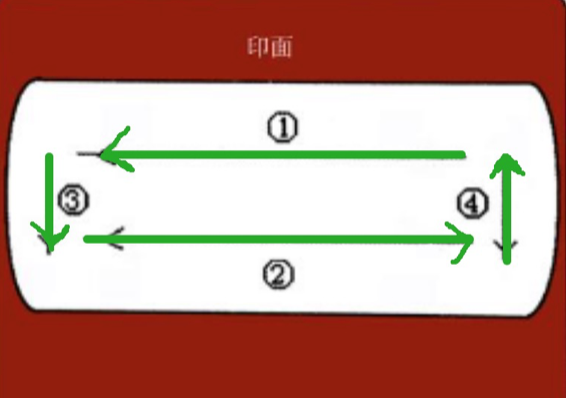

朱文刻法类似，也是一直刻上边沿。如下图所示，中间的红色部分是要保留在印面上的，围绕着这个笔画顺时针走一圈，笔画也就完成了。

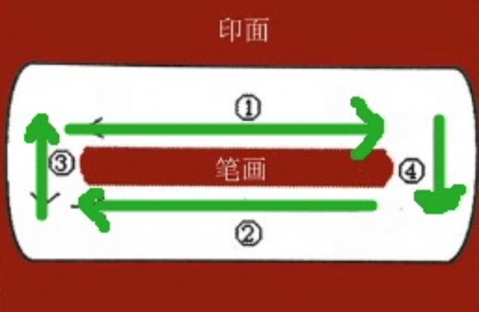

上面的上边沿刻法，不分冲与切————无论冲刀与切刀，都是沿沟画的上边沿刻制。且在冲刀时，始终使用的是刻刀的内刀角。

这里出现了三个概念：冲、切、内刀角，可能有读者不明白，下面分别解释一下。

## 冲刀、切刀、内外刀角的概念

如下图所示，左侧即是冲刀。由于图是二维的，没有办法展示立体；如果是视频，我们应该同时能看到，刻刀着印的点是刻刀的内刀角。

右侧是切刀。切刀也是内刀角先着印面，然后用力向前压。

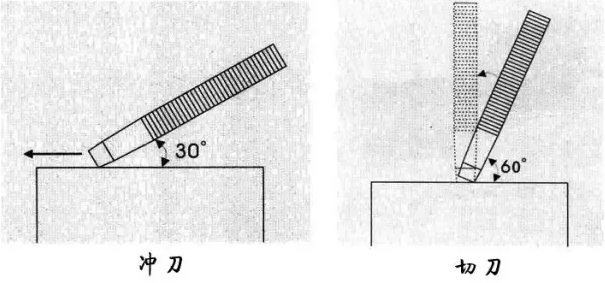

下面再解释内、外刀角。

对于刻刀，无论是右手持刀，还是左手持刀，一般情况下都是在胸前平放、倾斜的状态，刻刀的两个刀角有一个是离我们身体近的，另一个是稍远的。近的便是内刀角，远的便是外刀角。

在简刀刀法中，在刻印的时候，我们可以始终使用内刀角刻印。

## 锥画沙、屋漏痕之毛边效果

下面说一下毛边效果是怎么产生的。

这种效果在齐白石大师的白文印，或吴昌硕大师的朱文印里都经常能看到。基本上是一种一边齐、一边毛的感觉。

这种效果，如果是白文印，可以用冲或切的方式达到。冲的时候，毛边是在靠近身体的一侧产生的。切不容易出毛边，需要切的时候力量稍大一些，同时也需要章料的配合，软的章料不容易出效果，青田等质地较脆的章料容易出毛边效果。

有时候为了让毛边笔画粗一些，还可以双切，或者先冲后切，组合起来，笔画看起来就粗了。

上面说的始终在沟的上边沿刻笔画，是一种最简单、最方便记忆的方法，但并不是唯一的方法。在大师眼里，是没有什么规距的，上边沿、下边沿都是可以刻的。

例如，如下图所示，在来楚生的这枚印上，箭头所示那种笔画被侵蚀的“锥画沙、屋漏痕”朱文效果，是反边来，沿沟的下边沿刻制的。在吴昌硕的很多朱文印里，时常也能看到这种效果。

非独上边沿、下边沿的规定可以打破，内外边角的规定也可以打破。还是那句话，在大师眼里，着实是没有什么规矩的。

我们始终使用内边角刻印，是在刻印面时的一般规定，在刻边款时，有时候便需要使用外边角了。

## 如何刻边款？

边款的刻制，刀法并不算复杂，在冲与切的总刀法基础之上，只要练会基本的点、横、撇、竖、捺、转折、浮鹅钩，所有的字都会刻了。

下面分别看这几种基本的笔画如何刻制。

### 1）边款笔画点的刻制

分两种，如下图所示，左侧是内刀角向上冲，右侧是外刀角向上冲。两种都可以，具体在实践中用哪种，取决于篆法、章法的需要，以及篆刻者的心意。

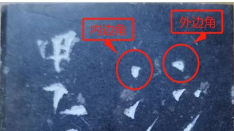

### 2）横的刻制

可能你已经发现了，边款笔画的刻制方向总是与我们在纸面上书写的方向是相反的，至少是不同的。

上面讲的点，我们在纸上书写时，一般是自上向下，但在边刻款时，点画却是自上向上冲的。

横与点类似。横在纸面上书写时是从左向右，在刻边款时，却是自右向左，并且是使用外边角自右向左切刻的。

短横，切一下即可；长横，切一下可能不够，便自右向左边切、边移动、边按压，大要两三下就能刻出一个较长的笔画。当然这也取决于用的刻画是多少毫米的，10 毫米的刻刀全切，切一下不但够，而且可能还多了。

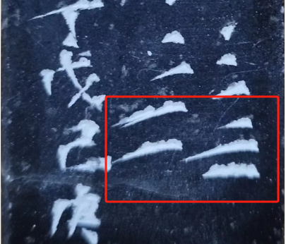

### 3）撇的刻制

在边款中，撇有两种，第一种其实是提，有短的、有长的。刻的时候，是内刀角入印，从左下向右上方向切压。

第二种，是一种是自左下向右上冲，也是使用内边角。这种切法，在下面的横折笔画中也能看到。

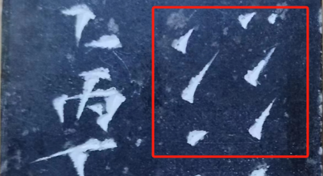

### 4）竖（与竖钩）的刻制

竖的刻制就相对简单了，内刀角入印，从下向上推，推到尽头，顺时针拧一下。

如果是竖钩，刻完上一步，在底部末端以内刀角入印，从右下向左上挤一下。或者把印顺时针稍转一下，以右刀角入印，从左下向右上————或者说自右向左挤一下。

挤的这一步，是为了刻画出钩。边款笔画为了突出金石味，笔画没有连笔的，有转折的笔画也是通过点、线最基本的笔画组合而成的。

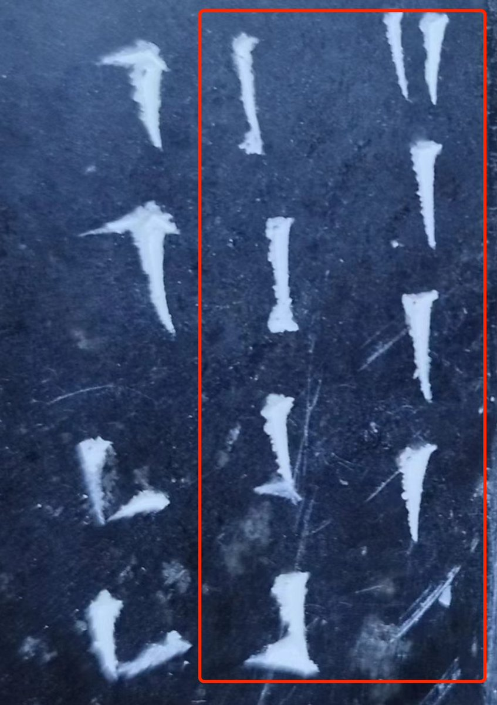

### 5）捺的刻画

捺不一定是捺，在表现形式上也可能只是一个点。逆时针转动一下石头，以外刀角入印，可以切一个简单的点，也可以切一个长长的横当点。

如果需要长笔画的尖，在完成上一步以后，可以用内刀角入印，向上挤出一个点，补的是这个笔画的尖。

边款刻画，对于点，有内刀角、外刀角的点，其中又以内刀角用的居多。对于横，只有外刀角的横，没有内刀角的横，即使充当捺的横，也是外刀角。

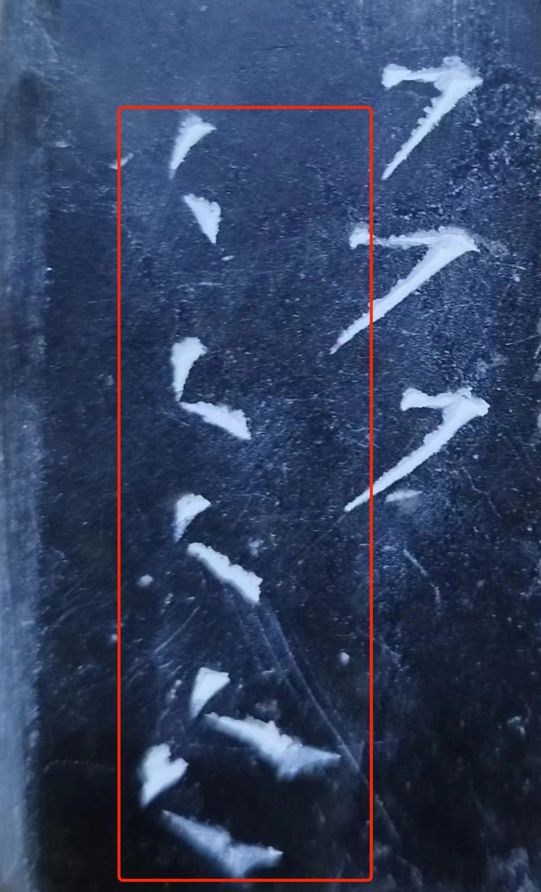

### 6）横折的刻制（一）

这是最复杂、最丰富的边款笔画了。大体上有左折、右折两种形式。

先看左折，先刻一横、再向左折。刻横时，是外刀角入印，从右向左切，在末端处，为了实现一个魏碑笔画起笔向上翻转的效果，还可以以内刀角入印，向左上方挤出，添加一个顿笔的起始效果。

横刻完后，第二步是刻撇，与单独的长撇类似，以内刀角入印，从左下向右上冲，冲到横的末端，顺时针拧一下，将两个笔画接起来。

关于拧字诀，你可能也发现了，一般都是内刀角顺时针拧，外刀角逆时针拧。对吗？不全是，内刀角是顺时针拧，但外刀角只有在向上挤点的时候向上挤一下，使点画加粗，并没有显著地拧；还有，在刻横的时候，也是从来不拧的。

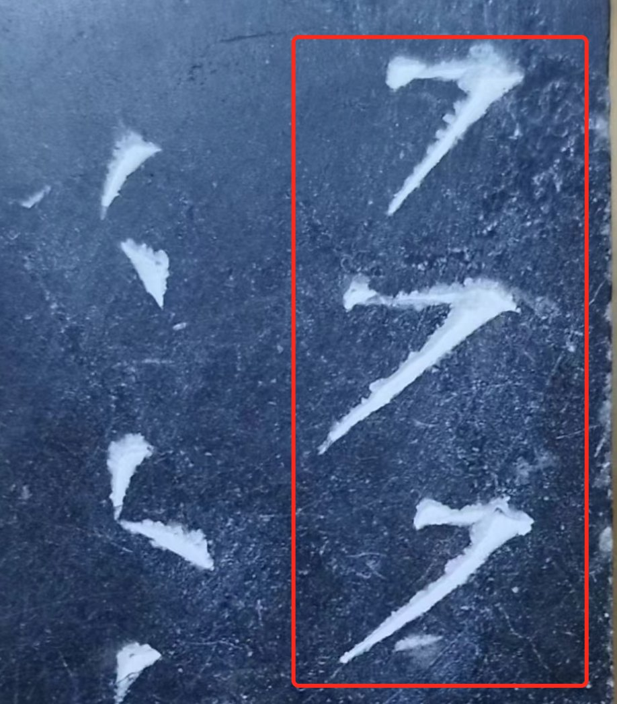

### 7）横折的刻制（二）

接一来看右折，先竖刻一画，再向右折。

竖的刻制与前面的竖一样，内刀角入印，自下向上冲。竖刻完后，顺时针转一下印面，再以外刀角入印，从右向左切出一个横，充当右横折的第二笔。

最后一步，如果需要，以外刀角入印，向上挤出一个小小的钩来。如果需要长一点的钩，也可以内刀角入印，竖着切出一个钩来。一般不要长钩，在边款中，长钩并不比钝钝的小短钩有感觉。

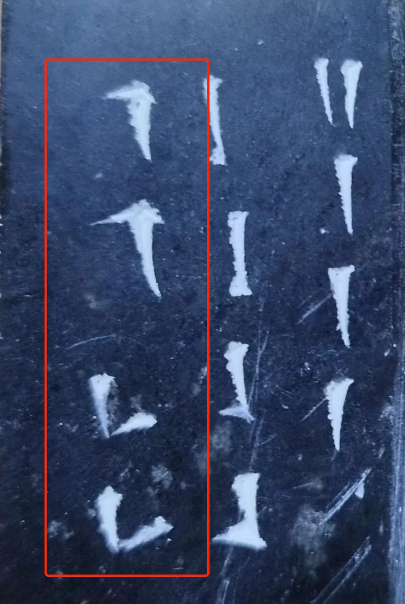

### 8）浮鹅钩

这个笔画也是由三部分组成，先是内刀角入印，从下向上冲出一条竖，冲到末端挤一下。

这条竖在向上冲的时候，可以自左向右微微转出一个弧度来。

然后是第二部分，外刀角入印，自右向左横切，切出一横，短一些、长一些都可以，看需要。与第一部分接不接得上也没有关系，有时候似连非连更有意境。

最后一步，外刀角入印，在第二部分笔画的开端处，挤出一个向上的小钩来。

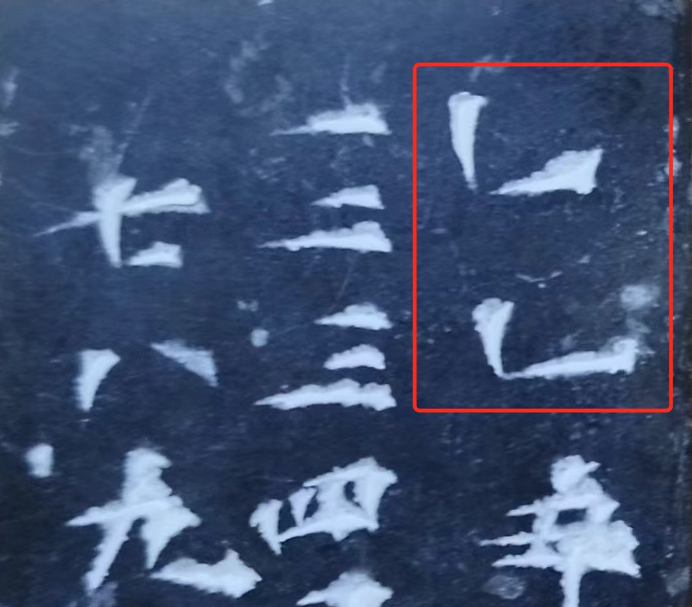

## 回顾

最后回顾一下。

刻印面重篆法、章法，刻边款重刀法。相信你也发现了，刻边款的刀法比刻印面复杂一些。

刻印面，一般情况下，始终是内刀角入印，在沟的上边沿或冲或切。方向不对，就转一下印面。转印面很重要，刻一枚印会经常转动印面。

刻边款，主要是用简单的点、线笔画组合笔画。奏刀方向在大多数情况下，与纸上行笔的方向都是相反的。用笔写字时，横是自左向右，奏刀刻边款却是自右向左。类似的还有，竖是自下向上冲，撇也是。

刻边款，整体上重小字、大笔画，用小钩、大断连，这样刻出来才比较有意境。当然，在刻之前，字的篆法、章法也很重要。刻边款不用篆书，有时候也称写法，说篆法。

以上便是简易的金石味篆刻法。刀法与要实现的效果是相关的，如果我们要实现简洁、快意的金石效果，无论是印面还是边款，用上面的简易篆刻刀法便可以了。

如果我们想实现婉转的细朱文，或者在刻边款时使用草书，刻出连笔效果，使用上面的简易篆刻刀法便不合适了。刀法本质上也是为篆法服务的。

## 现场演示补充

附南华大学陈书墩老师的篆刻教学示范：

<iframe width="560" height="315" src="https://www.youtube.com/embed/QHtUJr_yDds?si=iESD70TefvPN5mWG" title="YouTube video player" frameborder="0" allow="accelerometer; autoplay; clipboard-write; encrypted-media; gyroscope; picture-in-picture; web-share" allowfullscreen></iframe>

陈老师刻的是白文印，使用蝉翼纸+陈墨转印上石，演示了冲刀、切刀的基本技法。