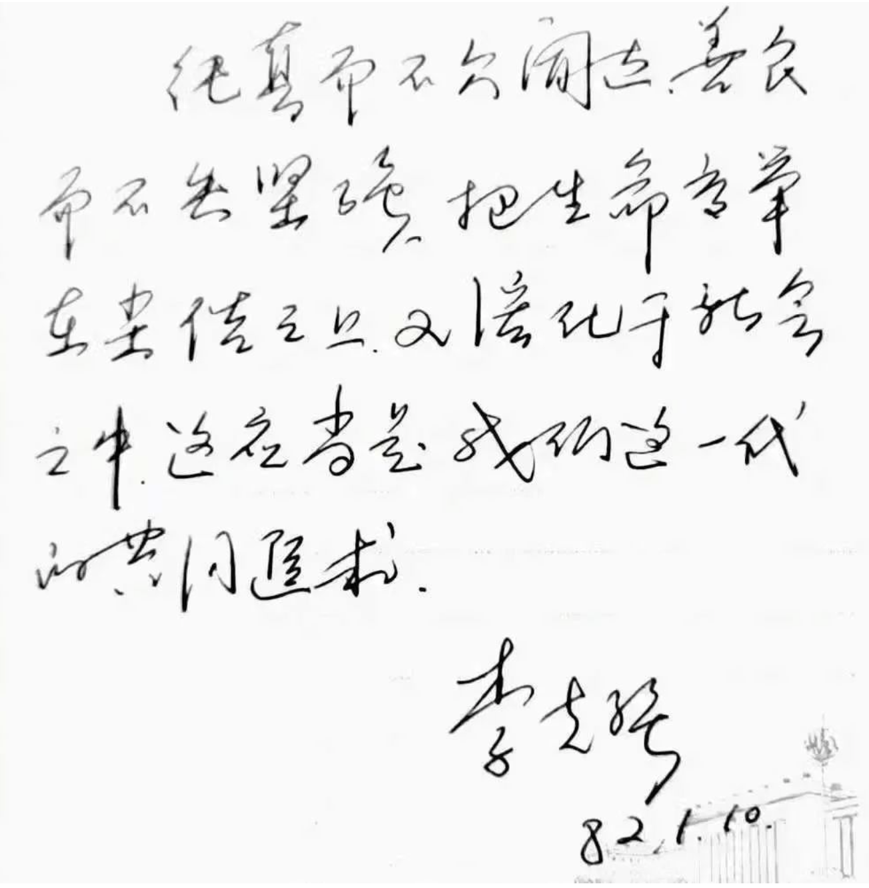
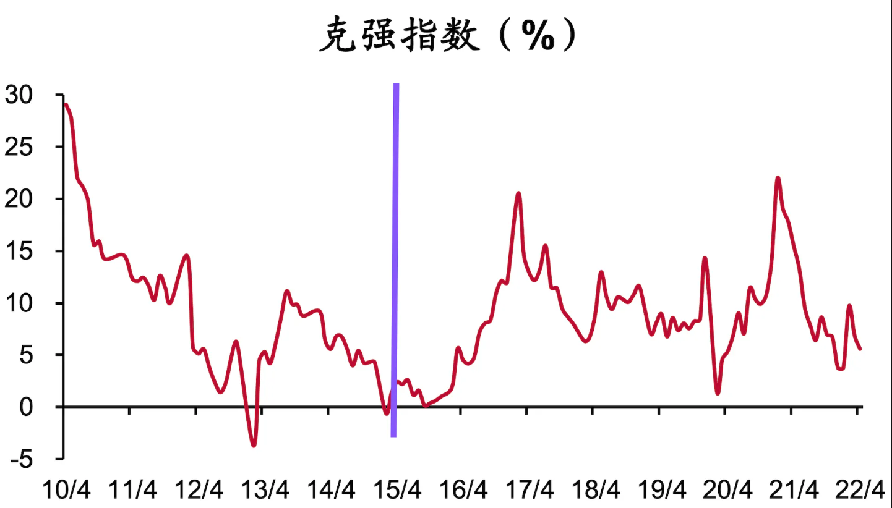
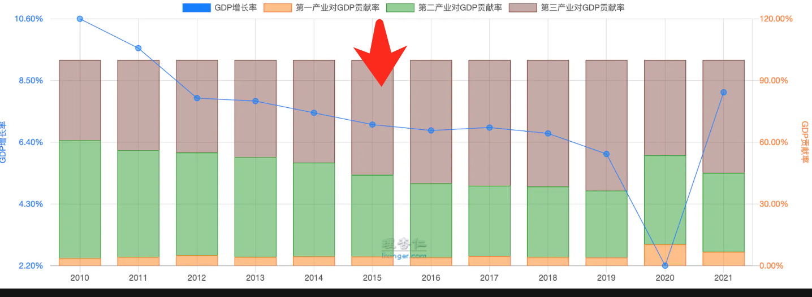

# 他的生平，及什么是克强经济学与克强指数等

> 他对自己提出的理想政策并非不知有哪些推进困难，他可是一向被称作经济政策的务实主义者，就像他在给他的大学同学写的临别赠言那样，既仰望星空，又脚踏实地。
>
> 注：以下内容均来源于公开资料。前面是生平介绍，后面是关于克强经济学等概念的介绍。

2015 年 3 月 5 日，十二届全国人大三次会议在北京开幕。他在政府工作报告中坦言，政府工作还存在不足，有些政策措施落实不到位，“少数政府机关工作人员乱作为，一些腐败问题触目惊心。”国务院总理他 5 日在作政府工作报告时说，“**有的为官不为，在其位不谋其政，该办的事不办。我们要直面问题，安不忘危，治不忘乱，勇于担当，不辱使命，不负人民重托。**”

## 他的生平

他在安徽合肥出生并长大，早年曾是安徽凤阳县大庙公社东陵大队的下乡插队知识青年，担任过生产队的党支部书记。1970 年代末高考制度恢复后，考入北京大学法律系学习，毕业后留在校团委工作，并在不久之后进入中国共青团中央系统任职，后于 1993 年出任共青团中央书记处第一书记。

1997 年后，陆续在河南、辽宁两省担任党政主要领导职务。2007 年 10 月，在中共十七届一中全会上跃级当选为中央政治局常委，为当时政治局常委会中的最年轻成员。2008 年 3 月，当选为排名第一的国务院副总理，兼任党组副书记。

2012 年 11 月及 2017 年 10 月相继在中共十八届一中全会、中共十九届一中全会上连任中央政治局常委。2013 年 3 月，在十二届全国人大一次会议上当选为国务院总理，并于 2018 年 3 月的十三届全国人大一次会议上获得连任，至 2023 年 3 月卸任。

## 大学毕业时给同学的赠言书法

以下内容是他在大学毕业时写给同学的赠言：纯真而不欠闻达，善良而不失坚强，把生命高举在尘俗之上，又溶化于社会之中，这应当是我们这一代的共同追求。

现在喜欢玩手机、电脑的少年学生，有几人写得出这样的钢笔书法。恐怕一直使用签字笔，一直没有用过钢笔的人都大有人在。

## 英语很好

他是 1977 年中国恢复高考后第一批北京大学法律系的学生，在北大上学期间，师从厉以宁等学者，曾任北大学生会常代会会长，毕业后在职获得北大经济学博士学位。

他 22 岁走进北大校门，对于他这代基础教育断档的人，英语基础都很糟糕，有的同学怕麻烦申请了免修，但他非常勤奋，做了个小本，正面是一个英语单词，反面是中文解释，苦记硬背。“**走在路上在背，上食堂吃饭排队时在背，外出坐公共汽车等车时也在背。**”

他的英语水平很快提升，大三以后能使用流利的英语与外国人交流，可以翻译英文原版的法律文献，曾翻译《法律的正当程序》等书。

1980 年 5 月，同学何勤华在一则日记中写道：“克强同学真不简单，他翻译的《英国宪法资料》已被全国人大常委会法制委员会录用，共 1 万多字。”

## 他的论文著作

- 《农村工业化：结构转换中的选择》

他的硕士论文是在肖灼基教授指导下完成的《农村工业化：结构转换中的选择》，分析说中国农村工业化的兴起与发展，使中国走上了独特的工业化道路，促成国民经济呈现出崭新的局面。

该论文并收入与他的博士导师厉以宁教授以及孟晓苏、李源潮合著的《走向繁荣的战略选择》（经济日报出版社 1991 年初版，2013 年再版）书中作为第七章。

- 《论我国经济的三元结构》

他攻读博士学位在《中国社会科学》1991 年第 3 期发表《论我国经济的三元结构》，论文中认为，中国传统经济中二元结构的特点, 决定了中国不能走从传统农业社会直接转变为现代工业社会的发展道路, 而必须经历一个农业部门、农村工业部门与城市工业部门并存的三元结构时期。

该论文获得中国经济学最高奖项——孙冶方经济科学奖（第七届-1996 年-论文奖）。厉以宁教授认为论文经得起考验。

## 主政河南关心底层疾苦

1998 年 6 月，他离开北京转任河南省省长，开始了在河南为期 7 年的工作，期间河南省的经济总量跃居至全国第 5 位，居中西部省份之首。基于河南省城镇化落后，导致产业结构升级缓慢，现代农业发展困难重重的现实，2002 年 12 月 24 日，**他在河南提出加快工业化、城镇化、推进农业现代化**，从而把更多的富余劳动力从土地上解放出来。2003 年 3 月他提出“中原崛起”概念，在他的领导和推动下，协调发展大中小城市、规划建设郑东新区、谋划中原城市群、振兴小城镇等一系列举措相继展开。

二十世纪九十年代至二十一世纪初年时任河南主要官员推动的“血浆经济”对部分河南人民造成重大伤害，致使艾滋病疫情泛滥，后来他担任中共河南省委书记兼河南省人大常委会主任，组织力量开展了中国首次省级艾滋病情普查，组织省直部门对口帮扶重灾村，并确立了患者“四有一不”的权益机制，使疫情蔓延得以遏制。

下面开始解释相关概念。

## 什么是克强经济学？

“克强经济学”是外资机构巴克莱资本公司于公元 2013 年 6 月底提出的概念，予以指称他为中国制定的经济增长计划。

## 重要的是一个取向

巴克莱所提的“克强经济学”仅系一个初步的概念，是经济思路和经济政策的取向，并不是一个完整的经济政策体系。“克强经济学”概念核心包含三个主要的构成部分，也被解读为“克强经济学”的三大支柱。

这三部分核心内容概括如下：

一、政府不推出刺激经济的政策，而是通过逐步缩减国家主导的投资行为；

二、去杠杆化，以大幅削减债务，降低借贷与产出比；

三、推行经济结构改革，以短痛换取长期的可持续发展。

## 克强经济学的提出背景

经历了 21 世纪头 10 年的高速发展，中国经济的发展遇到了一个坎。外界普遍认为，中国经济面临巨大的下行压力，而压力的来源包括**投资与出口导向的增长模式不可持续、劳动力的人口红利接近枯竭，以及产业结构长期落后**等。改革已进入深水区，要想继续发展，必须实行新的改革措施，以转变经济增长方式，保持经济长期增长的活力。

## 如何理解“刺激经济的政策”？

不出台刺激措施，也是指一般情况下政府不会出台刺激措施，政府在利益集团的压力下要能“顶得起”、“扛得住”，但当经济雪崩式下滑时，或者市场情绪极度悲观时，政府当然不会放手不管。以前段时间银行间钱荒的而言，央行确实是一反常态地放言不会随便向市场注入流动性。但当股市重挫，人心惶惶时，央行又出来温和表态，稳定市场信心。

又比如投资，在任何经济体，投资永远都是拉动经济增长的重要一环，新型城镇化其实也是刺激投资的政策。但重要的是，克强经济学更加重视投资的方向和投资的效率。**城镇化绝不是大城市基础上的“床上叠床”、“屋上架屋”，而是发展小城镇和小城市，放开户籍管制，让农民也享受到市民待遇和社会公共服务。**改革收入分配制度，提高老百姓收入水平。这种投资，就和重视民生以及促进消费紧密联系在一起，是思路完全不同的城镇化。

## 如何理解“推行经济结构改革”，加强改革开放？

以上海自贸区为例，可以说，上海自贸区是他经济学的试验田。上海自贸区初期的侧重点主要是在政府权力收缩、投资领域放宽、贸易便利化方面。上海自贸区改革的重点和要在于以下几点：

1、开放外资更进一步进入服务贸易领域（原来主要是制造贸易）；

2、减少对外资合同章程审批，改为备案制，为全国推广做准备；

3、提高通关便利化，缩减区内海关查验；

4、实行负面清单，减少细化行业管制；

5、创新航运中心产品，力推上海成为全球航运中心。

与克强经济学密切相关的一个词汇是克强指数。

## 什么是克强指数？

这个名词起始于 2010 年。

克强指数即他指数，是以中华人民共和国国务院总理他命名的衡量经济发展状况的指标。 最早由英国政经杂志《经济学人》于 2010 年提出，源于他在 2007 年任职中共辽宁省委书记时，向当时来访的美国驻华大使雷德解释，用于分析当地经济状况的数据。

注：截图来源https://sc.macromicro.me/charts/5751/zhong-guo-tie-lu-huo-yun-liang

克强指数包括耗电量、铁路货运量和银行贷款发放量三个指标组成，分别占比重 40%、25%及 35%。基数学计算公式为：

克强指数与中华人民共和国公布的国内生产总值（GDP）走势总体一致，但上下波动方面，克强指数表现会更剧烈，更能反映中国经济状况。

《经济学人》也认为，克强指数比中国官方的 GDP 数字更能真实的反映中国经济的现实状况。有学者分析，克强指数更能精确地反映中国经济现状，比如耗电量可以准确反映中国地区工业生产活跃度以及工厂开工率；铁路货运量能反映经济运行现状，以及经济运行效率，因为铁路是中国货运的最大载体。此外中国间接融资占社会融资总量高达 80%以上（2002 年至 2013 年平均值为 87.8%），银行贷款又占间接融资的核心，贷款发放量可以反映市场对当前经济的信心，也可用于预判未来经济风险。

## 15 年之后失灵的克强指数与新克强指数

克强指数一度受到了花旗银行等国内外大型投资机构的认可，但是，有人说，现在好像不怎么行了。我们先来看看近十多年的克强指数走势。

再来看国内生产总值的走势图，里面我们加上了第一、二、三产业对 GDP 的贡献率，这对下文分析克强指数的失灵有些帮助。

从克强指数和 GDP 增速这两张走势图，可以看出，以 2015 年为分界点，2015 年之前克强指数可以反映 GDP 的走势，期间克强指数下降，GDP 增速也出现了持续的下降。

但是在 2015 年之后，克强指数“似乎”有些失灵了，2015 年之后克强指数出现了反弹，但是 GDP 增速在经过长期的高速增长之后，开始变得缓慢，甚至在疫情期间，GDP 增速一度转负。

藉此，有人猜测，克强指数已经失灵了。

在 2015 年末，克强总理为《经济学人》年刊撰文《中国经济的蓝图》中提出了衡量中国经济新的三个指标，分别是**就业、居民收入和生态环境的改善**，这也被称为“新克强指数”。

十年前二十年前，那个时候一心就是想把 GDP 搞上去。现在发生了变化，GDP 要搞但是要高质量的搞，我们从一二三产业的变化就能看出来经济结构在发生变化，发达的经济体往往是伴随着第三产业占比的不断扩大。

## 外界对克强经济学三项政策的质疑

十年前就有人指出，克强经济学三个部分的期望在一定时期内是没法彻底贯彻实行的，主要理由如下。

1）不出台刺激措施的愿望可能是一厢情愿。对本国经济的刺激推进，本来就是政府的职责。尤其在中国现有发展阶段，政府的政策走向利益攸关，政府的激励措施当然是必要的，也是市场欢迎的内容。问题的关键是采用什么样的刺激办法，采取多大的规模？激励的对象是什么？代价有多大？但经济一放缓，利益群体受损，就业压力带来的社会稳定问题便会成为最为有力的道理，迫使国家主导的投资行为和财政刺激及货币政策出台。

2）去杠杆化？在不改变现有经济政治资源安排和发展模式的格局下，去杠杆化无疑是自相矛盾的提法。地方政府的竞争，某种程度提供了中国经济快速增长的动力。在现有的官员激励制度下，各级政府当然责无旁贷地、史无前例地、急遽大规模地进行城市化建设和改造。而金融体系没有坐失历史机遇，义无反顾地推动配合。当前过度杠杆化的主要原因是地方政府与国有控制的金融体系以及财政货币政策的捆绑。这个模式的杠杆作用，在一定区间里保证了过去十年的经济成就。

3）结构改革并非现在才提，早在朱镕基时代之前就已经开始，只是过去十年延迟了。而结构改革的重点不应该只是部门的撤并，不只是审批职能的下放和放宽。着眼点应该有个理论高度，那就是如何限制政府权力，促使公权力的实施沿着高效、廉洁的道路转向。这不是断腕断臂或者甩开膀子就能实现，而是必须触及“灵魂深处”。

**他对自己提出的理想政策并非不知有哪些推进困难，他可是一向被称作经济政策的务实主义者，就像他在给他的大学同学写的临别赠言那样，既仰望星空，又脚踏实地。**

**参考资料**

- https://baike.baidu.com/item/克强指数/1532682
- https://mirror.xyz/0x0372f8D07092D7154F65D09A0319a5fE147E3AD4/AFWf0IKxWggmHOuQaQPD6frEWczjZyBgCD5uGq2zx9s
- https://cn.nytimes.com/business/20130719/cc19liconomics/
- https://cn.chinadaily.com.cn/2015lianghui/2015-03/06/content_19738874.htm
- https://zh.wikipedia.org/zh-hans/%E6%9D%8E%E5%85%8B%E5%BC%BA
- http://www.ce.cn/xwzx/gnsz/szyw/201303/16/t20130316_24204477_1.shtml
