# 篆刻刻刀如何选择？不要选择哪些刻刀？

篆刻刻刀都是平刃刀，没有选择尖角或斜角的，因为篆刻是用 90 度的刀角刻印的，并不是用刀尖刻印的。

在了解如何选择刻刀之前，我们需要先细致看一下篆刻的分类。明确了以下这些分类，及不同分类的优缺点，才能彻底明白如何选择。

## 依平刃宽度划分类别

刻刀从平刃的宽度分，常用的有 10mm、8mm、6mm、4mm，一般都是偶数毫米长度，也有奇数的，但奇数刃宽的刻刀很少见。更大的有 12mm，更小的还有 3mm，再小的就没有了。

章料的印面大小一般有 3cm、2.5cm、2cm，一般都是使用 1/2 印面尺寸或更小的刻刀进行刻制。小刻刀可以刻制大印面，但大刻刀刻小印面总是捉刀见肘的。

一般 3cm 的大印面，用 12mm、10mm 的刻刀都可以；2.5cm 的印面，使用 10mm、8mm 的刻刀；2cm 的印面，就只能使用 6mm、4mm 的刻刀了。

至于 1.5cm 或 1cm 印面属于小印章，奏刀行刻不是很方便，就只能使用 4mm、3mm 的刻刀了。特别在刻制“力透纸背、大开大合、畅快淋漓”风格的白文印时，用小印面便不合适。章料石头的质地是颗粒均匀的，受力后出现毛边效果的颗粒大小基本也是一定的，印面太小的印章很难充分把想要表现的毛边效果表现出来。

## 以刀刃材质划分类别

从篆刻刻刀的材质来划分，又可以划分为锰钢、白钢、钨钢、纳米合金，它们的硬度也是按此次序依次长高的。锰钢刻刀从名字上看，它好像很硬，其实不然，它只是方便加工成型；一般只有初学者或刻木质印章的篆刻者，才建议选用锰钢刻刀。

白钢刻刀硬度在 6 左右，遇到材质不好或有砂粒的章料，很有可能崩刃；好在白钢这种材料很容易磨制，白钢刻刀崩刃后，稍微在 800 目的金刚磨盘上推磨一下，就又可以使用了。（注：后面有磨制方法。）

钨钢刻刀是刻制白文大印——尤其是刻制齐派单刀风格印章的首选，它的质地相对较硬，大概在 7 左右，一般的章料都能轻易驾驭。这种刻刀在出厂开刃后，基本不需要磨制，可以一直使用。

纳米刻刀的硬度大约在 8 以上，这种刻刀更没有必要磨刃了，一是因为它比较硬，很少能有章料能把它的刀刃崩坏；二是它之所以硬，就是因为表面涂了一层特制的材料，你把这个涂层磨掉了，它就变成普通的合金刻刀了。纳米刻刀很少见到有宽刃的，一般只有 6mm、4mm 这样的小尺寸。

## 以开刃角度划分类别

前面无论是以宽度划分，还是以刀刃材质划分，对刻刀来讲，都不是最重要的。

对于篆刻者来讲，最重要的是刻刀开刃的角度，并且，不同风格的篆刻者，都喜欢选择特定的角度。**近现代以来，随着制钢工艺的提升与章料矿石开采的便利，刻刀的开刃角度越来越小，多位大师都喜欢使用小角度的刻刀。**

以角度划分，刻刀开刃角度主要有：40 度、30 度、22 或 23 度。下面一一介绍。

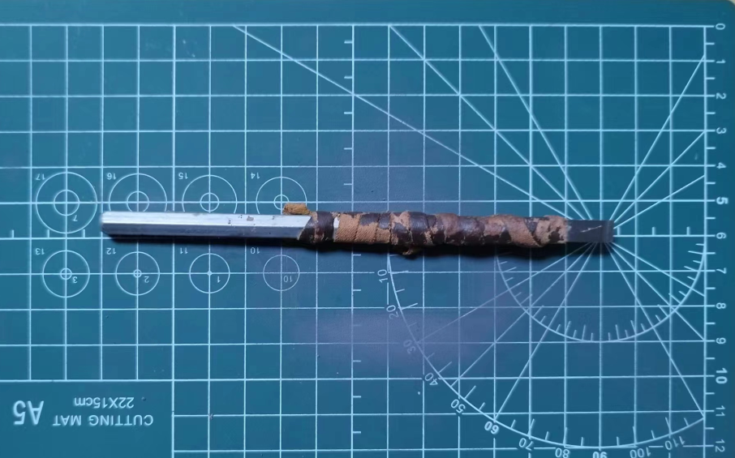

这是一种很常见，也是某宝上最常见的钨钢合金刻刀，杆身长约16cm。

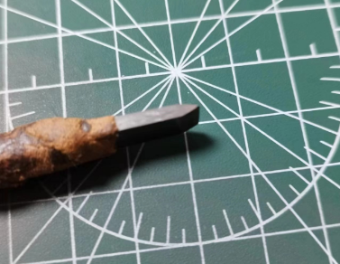

开刃角度是 40 度，刃角看起来是钝钝的感觉。

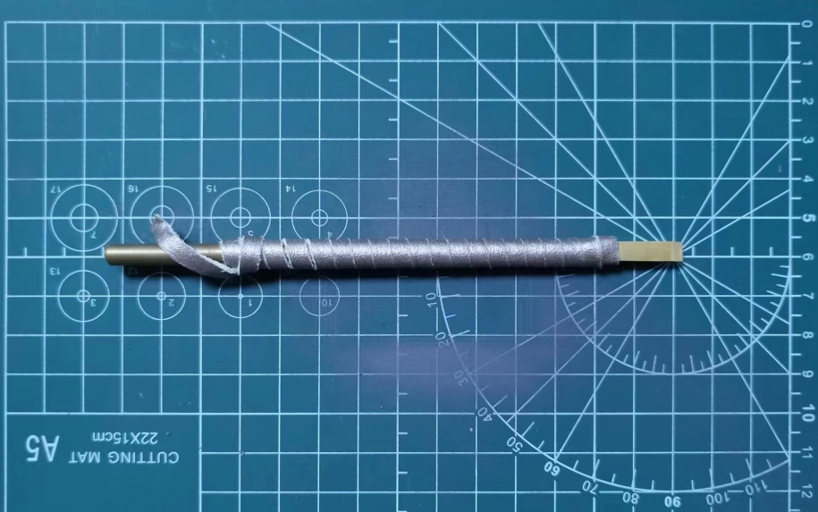

这是纳米刻刀。

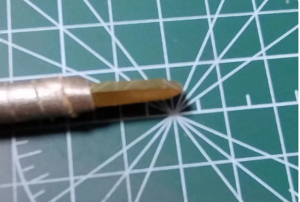

它的开刃角度也是 40 度。

关于开刃角度，如果不确定多少，可以用中学生用的量角器量一下，虽然量得不精确，但大概也能量出是多少度。

这是西泠印社出品的一套双坡度钨钢合金刻刀，上面那把是 6mm 的，下面那把是 8mm 的。这套刻刀初看无敌，可惜做工不太精细，刃开的也不是很光滑，顶端方杆也不圆润，十分硌手。价格也略高。

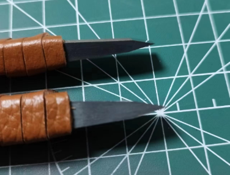

它们的开刃角度是 30 度。这种刻刀是双坡度，我们能看到它的刀刃坡度分了前后两级，我们说的开刃角度是与与刀刃最近的那个角度。这种 30 度刃角的双坡度刻刀，其实是优于单坡度 30 度刃角的刻刀的。

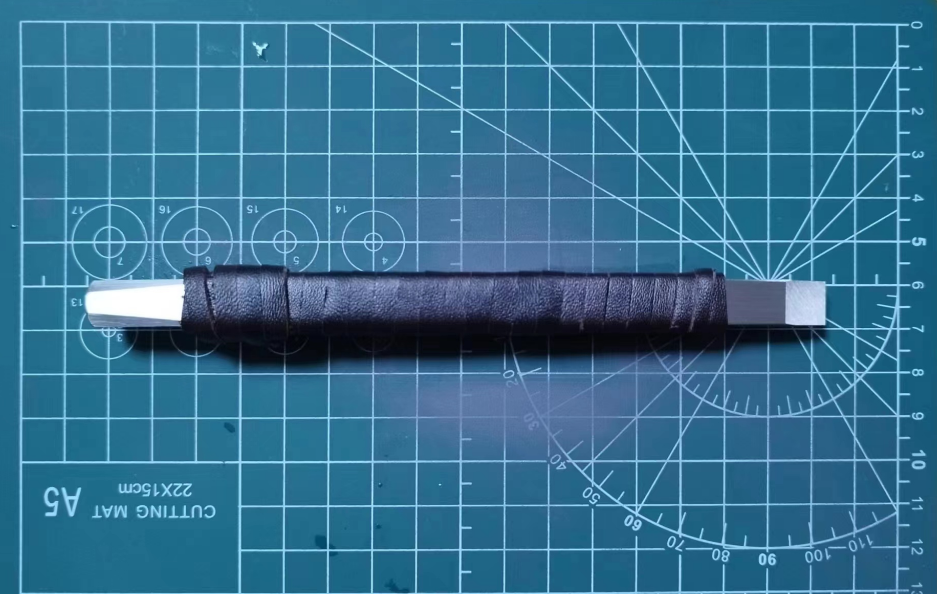

这是双坡度白钢刻刀，刃宽 10mm。

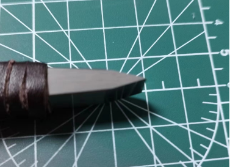

它的开刃角度也是 30 度，但价格比钨钢材质的便宜。

上面这把不是刻刀！它本是光杆的，被探长绕上了一层绒绳。

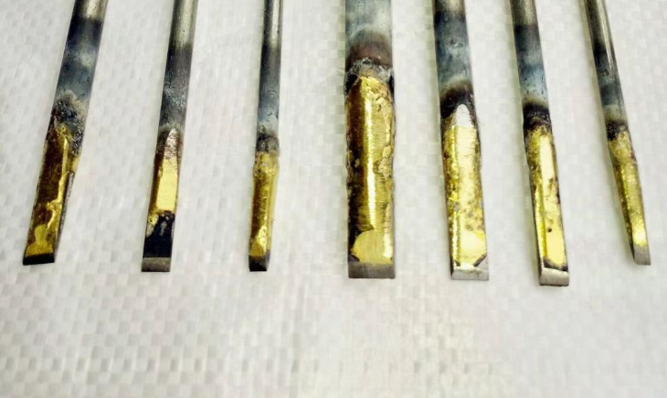

上面这些，它们是开山凿碑的钢钎！黄色部分是黄铜，上面的钎杆是白钢，下面的刀刃材质是钨钢。因为钨钢贵，白钢相对便宜，所以中间临近钎头的部分使用黄铜焊接了一下。这种钢钎杆身长达 21cm，而普通的篆刻刀杆身通常只有 16cm。

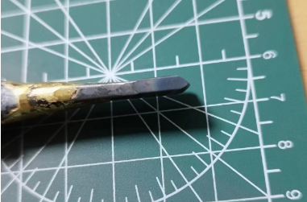

由于它是凿石碑的，它的开刃角度竟然有 50 度。只有开刃角度大，在凿石碑的时候才不容易崩刃。这种钢钎是不合适直接刻印的。

有人给探长寄了几把钎子，我把其中 8mm 的一把用金刚磨盘开了刃，如下所示，猜猜它的角度是多少？

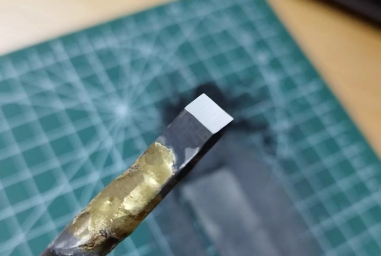

23 度！刚刚好！

然后我还给它缠了一层牛皮绳·：

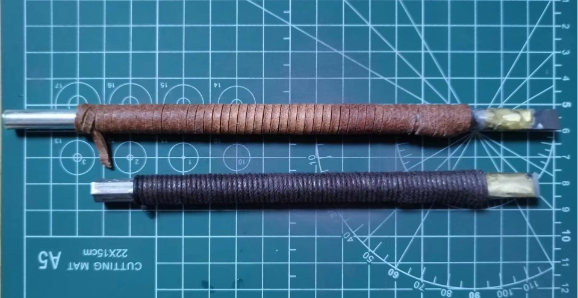

如图所示，上面那杆是 8mm 的钨钢钎，杆身 21cm 长。下面那把是仿制的昊昌硕 10mm 大刻刀，但仿制的不像，因为开刃角度竟然达到了 40 度。

以前西泠印社自己有售一套三把的昊昌硕钨钢合金篆刻刀，包含 10mm、8mm、6mm 三个刃宽尺寸，开刃角度只有 22 度，现在不卖了，原因不明。

现在市场上出现了仿制的西泠印社昊昌硕钨钢合金篆刻刀，其它方面都仿得像，包括收纳盒和焊接的黄色烂铜都极像，但可惜开刃角度太大了，竟然有 40 度，这一点不像。吴昌硕用的刻刀，是不可能这么钝的。

## 吴昌硕与齐白石选择的刻刀

在考虑如何选刻刀之前，我们先看一下近代大师们是怎么选择的。我们首选吴昌硕和齐白石两位大师。

吴昌硕自称缶翁，是近代集书画印大成于一身的大师，他早年穷苦，选用的刻刀并不是刻刀，而是自己使用钢钎磨制的刻刀，后来使用的是经匠人特制的缶翁刻刀。为了同时方便刻制涩刀的朱文印及斑驳的白文印，吴昌硕大师将刻刀的角度磨得非常薄，大概只有 22 度。

在昊昌硕的时代，他选用的钢钎是白钢，现代冶金工艺进步了，有了更硬的钨钢，西泠印社曾经推出的吴昌硕防制刻刀，使用的便是上面白钢下面钨钢中间用黄铜焊接的合金刻刀，角度也特意磨成了 22 度，杆长 20cm 左右，是极大还原了现保存于上海吴昌硕纪念馆的两把刻刀及日本篆刻家小林斗庵收藏的一把刻刀，共三把。可惜现在不售了，否则大约300块的售价也是值得购买的。

另一位大师齐白石，中年学习治印，32 岁开始用修脚刀刻第一枚印章。修脚刀能有多大的角度？我们可以想象，薄刃锋利，刀刃角度甚至都不大于 20 度，大概只有 15 度左右。

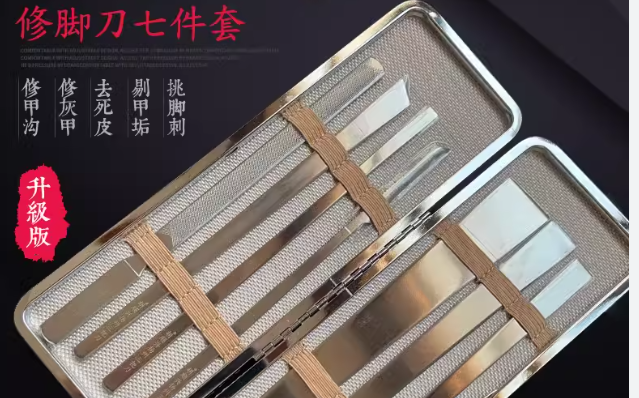

齐白石大师在治印时擅用单刀冲刻，这种刀法要求刻刀的刀刃绝不能厚，厚了便很难冲刻时爽利，也很难崩出毛边效果。

## 我们如何选择刻刀？

如何选择篆刻刀是篆刻者自己的自由，每个人爱好不同，选择也不一样。

喜欢刻细朱文花鸟篆的朋友，一般会选 6mm 的钨钢或纳米合金刻刀。喜欢刻 2.5cm 以上大印面的朋友，章料选上等轻脆的青田或老挝石，一般选 10mm 的白刚刻刀。

下面探长说一下自己的选择，以及对初学篆刻者的选择建议。

初学者两把刻刀就足够了：

1）一把 8mm 或 10mm 的大刀，用于刻白文印；

2）另一把 6mm 或 4mm 的钨钢小刀，用于刻细朱文印。并不是大刀刻不了朱文印，大刀也可以刻，只是锋利的小刀在处理细朱文笔画时更能得心应手。

开刃角度要选择 22 度或 23 度。如果角度达不到要求，可以自己用金刚磨盘磨制。（注：后面会介绍磨制方法。）

刻刀杆身长度优先选择 20cm 左右，杆身长，刻刀更重，奏刀时更稳。

材质优先选择钨钢合金，或白钢。

如果在网上购买现成的篆刻刀，怎么选择呢？

第一种选择是西泠印社的白钢特制篆刻刀。

包括 8mm、6mm 两把，刃角 30 度，稍微磨一下就可以达到 22 度，不磨也可以使用。价格在 120 左右。

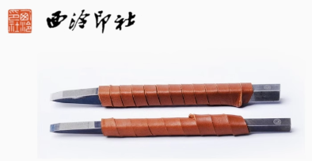

第二种选择是铜杆钨钢篆刻刀套装。

有多家店铺可以选择，包括 10mm、8mm、6mm 三把，刃角 30 度。价格在 200 左右。

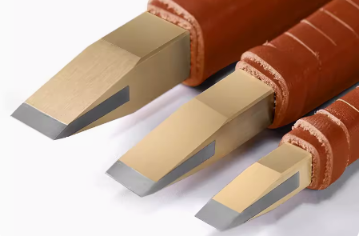

这是现代篆刻大师韩天衡喜用的双坡度刻刀，杆身是纯铜的，不会生锈，刀刃是在铜杆上嵌入的钨钢材质。如果角度不满足满足，也可以磨制，并且铜的材质相比钨钢会更容易磨制一些。

第三种选择是某宝上匠人自制的白钢或钨钢刻刀。

例如下面这款 6mm、刃度 22 度的双坡度白钢刻刀，长度 16cm 左右，价格仅 30 左右，已经相当实惠了，还是包邮的。

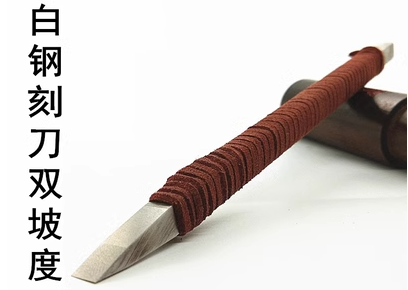

匠人自制由于没有品牌溢价，价格上都比大店铺便宜。

下面这种刃角仅 10 度的平头 10mm 宽刀，价格仅 40 左右。

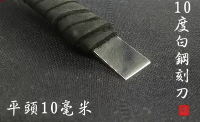

下面是 8mm 的薄刃刻刀，价格与 10mm 的差不多。

## 不要选择什么样的刻刀？

下面说一下哪些篆刻刀不要选择。

首先，圆头刻刀不要选择！

刻刀治印用的是刀角，圆角刻刀没有刀角怎么刻印？

刃面不平的不要选择！

刻刀如果需要磨制，不平的或有弧度的刃面并不方便固定角度。此处，从加重刻刀刀身的稳定性考虑，也不合适在刀头上减少重量。

不要迷信套装型号齐全！

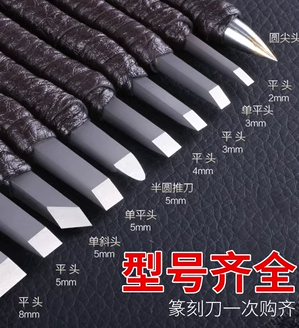

篆刻刀只需要双平头、双面对称的刻刀，什么单平头、单斜头、圆尖头统统不需要。型号再全也没有用，上架这种商品的一看就是不懂篆刻的商家，买家也只能是不懂篆刻的初学者。

太软材质的，兼具木刻功能的刻刀，尤其是木柄刻刀不要选择！

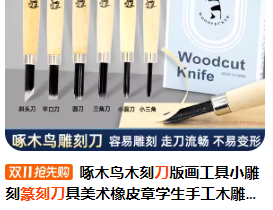

锰钢材质的刻刀是软质刻刀，一般也不要选择。至少选择白钢，优先选择钨钢材质的。

进口的、价格太贵的不要买！

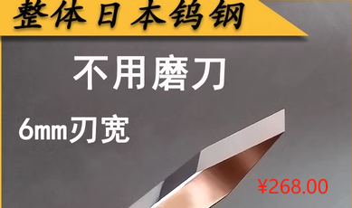

刻刀材质无非就是那几种，基本的白钢材质就能满足需求，国外的月亮并不比国内的更圆。在选择时，关键是刃角与刻刀的舒服度、顺手度，加个“进口”二字就多付上百块没有必要。

太贵的手工锻打刻刀，也没有必要购买！

这类刻刀，完全可以购买 14 块钱的钨钢钎子，外加 5 块钱的金刚磨盘和两个小时的时间，自己磨制一把缶翁遗响仿制刻刀。

## 如何自己磨制刻刀？

在磨制之前，首先明确一下工具，你需要一个金刚磨盘，和一个刻刀定角器。

为什么一定要使用金刚磨盘？

因为刻刀太硬了，特别是钨钢材质的，你用油石磨吧，磨一天也磨不下多少，最后还可能把刻刀磨坏了，因为石头太软了。

金刚磨盘是表面附着了一层金刚石沙粒的磨盘，表面硬度并不比钨钢差，一个金刚磨盘可以重复使用很久。

另外，除了金刚磨盘，还需要一个定角器。如下所示，这就是一个定角器。

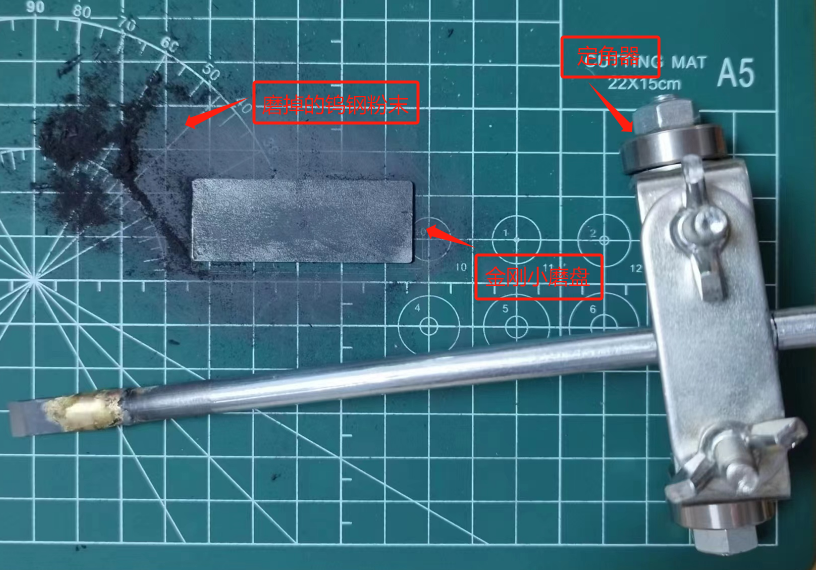

定角器将刻刀固定在支架上，两边是两个可以自由滑动的轮子。在磨制的时候，向下压，前后平推，这样磨完以后，才容易保证两面的刃面是平整对称的。对于没有开刃的刻刀，或者钎子，如果没有定角器，根本是没有办法磨制的。

在购买刻刀的时候，如果有方杆的，就不要选择圆杆的。为什么？圆杆不是更不易硌手吗？

圆杆在磨制的时候不方便固定角度，如果是方杆，上面方向则很容易确定。至于硌手，根本不是问题，刀杆缠一段牛皮绳就可以了。

## 回顾

最后回顾一下。

究竟如何选择刻刀呢？如果你有时间，有金刚磨盘，有定角器，大概以成本 50 块，外加半天的时间，就可以得到三把分别是 10mm、8mm、6mm 的一套钨钢刻刀，刃角开 22 度、杆身长 20cm 左右。再花 10 块钱，买一些牛皮绳子缠一下，就更完美了。

如果你没有时间或者不想麻烦，直接在某宝上选择刃宽 6mm、刃角 22 度的白刚刻刀就可以，大概 30 块搞定。6mm 宽的刻刀，刻大白文勉强也可以，刻朱文也可以，甚至有自媒体博主说，他只用 6mm 的刻刀治印，可见这样一把尺寸的刻刀也是可以满足一般需足的。
