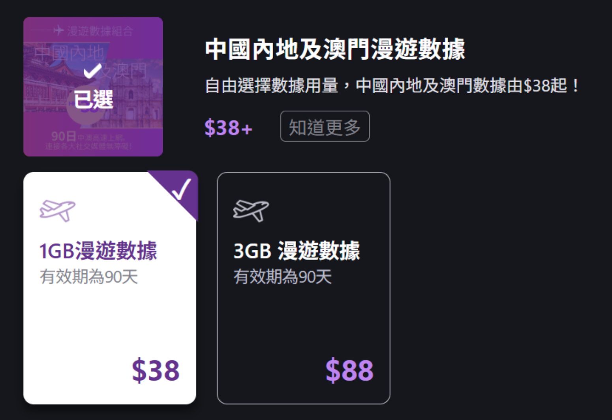
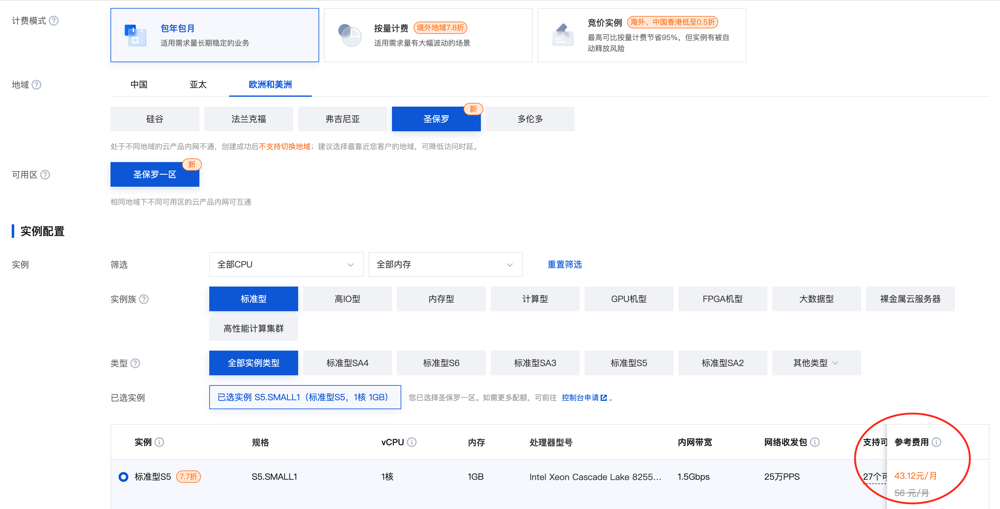
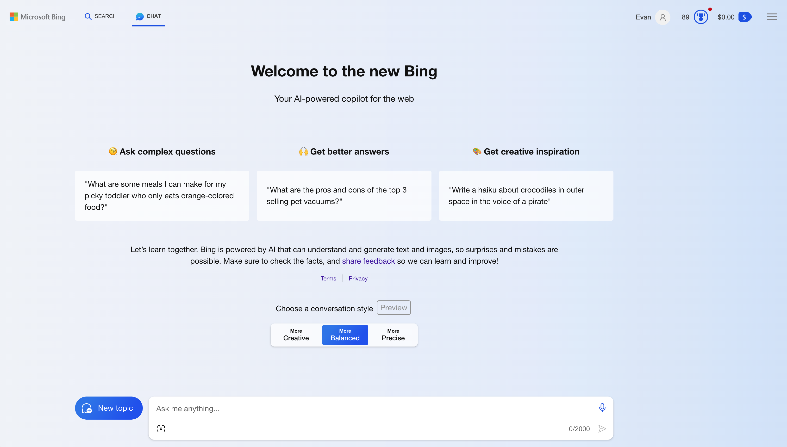
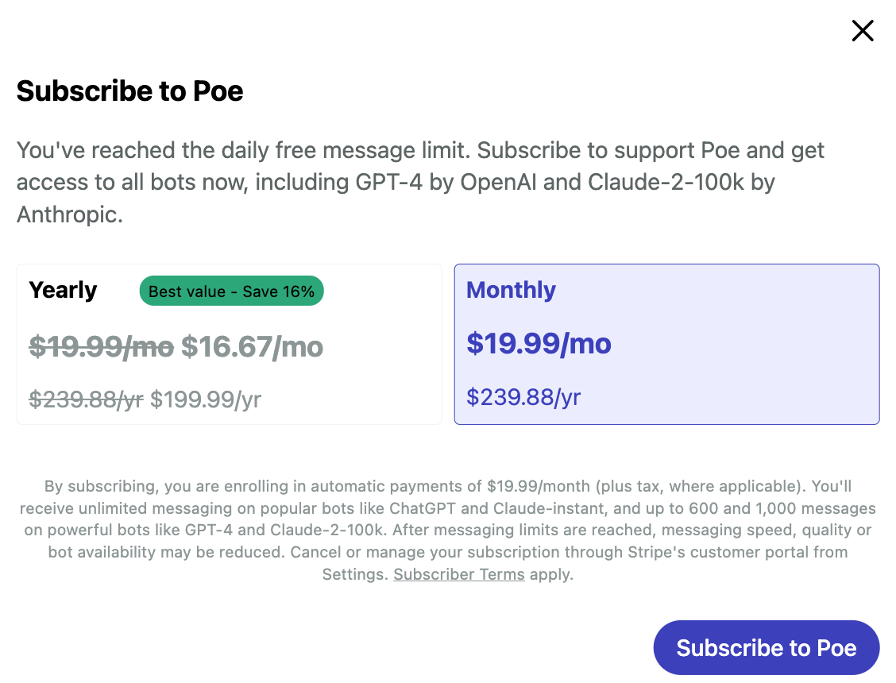

# 我们如何使用 ChatGPT？

你好，今天聊一下如何使用 ChatGPT。

ChatGPT 很强大，且 ChatGPT 3.5 版本是公开与免费的，但并不是所有地方都可以使用它。有些地方甚至抵制使用。

2023 年 3 月 31 日，意大利个人数据保护局（Garante per la ProtezionedeiDatiPersonali）发表声明，宣布禁止意大利人使用 ChatGPT，同时限制 OpenAI 收集和处理意大利用户信息。意大利由此成为了第一个官方禁用 ChatGPT 的国家。

意大利作出这一项决定，主要理由是 ChatGPT 存在数据泄露、隐私窃取等安全隐患，目前 ChatGPT 的发展尚不成熟，出于对人民的善意保护，所以将 ChatGPT 禁止了。

大陆目前没有明确的法律规定禁止人们使用 ChatGPT。2023 年 2 月发布的《生成式人工智能服务管理办法（征求意见稿）》，只是限定了使用 ChatGPT 向他人提供人工智能服务的条件，主要有以下三条：

- 体现社会主义核心价值观；
- 不得发布违反法律法规、有害于社会秩序、危害国家安全、损害公共利益的信息；
- 不得利用生成式人工智能生成虚假信息、误导公众。

ChatGPT 是允许使用的。只是ChatGPT 在大陆，如果使用者直接访问它的官网（https://chat.openai.com），网站是打不开的。

怎么办？难道我们求学向道的心就此被阻止了吗？

显然不会，否则探长在这里也没有写这个专栏的意义了。在大陆，不仅有办法访问和使用 ChatGPT 3.5 版本，就是需要付费的 GPT-4 也是可以使用的。

## 如何注册 ChatGPT？

首先，我们需要解决网络访问的问题。

对这个问题，有人第一时间想到使用梯子。探长想说，不要使用梯子，墙内擅自使用梯子突破防火墙属于不规范甚至违法行为。

有人说，可以使用某类袋装 wifi 移动上网设备。此类设备并不是没有使用梯子，而是设备内隐含了梯子，这种行为也是不规范的。还有人推荐购买香港的 SIM 卡，在大陆漫游使用，但办理费用及 3GB 贵达 88 美金的漫游费用并不低，且办理流程麻烦，所以也不推荐。

最简单、最便宜的方式，同时也是合法的方式，是在腾讯云等云厂商平台上购买一台海外云主机。以腾讯云为例，一个美区包月云主机不到 50 元，并且流量不封顶。

购买云主机以后，使用微软远程桌面登录软件（Microsoft Remote Desktop Manager），既可以在 PC 电脑上登录云主机，也可以在手机上登录与使用。关于这个软件的相关教程，在网上都有，一搜便知，或者直接问 AI，它也能告诉你使用方法。

登录云主机以后，网络通了，接下来注册就简单了。

可以先注册一个 Gmail，然后用 Gmail 打开 ChatGPT 网站（https://chat.openai.com）进行注册与登录。由于服务器在境外美区，网站都是可以直接访问的。你相当于是入侵到美国境内上网，ChatGPT对美国人民没有任何限制，注册与登录、使用都是自由的，你在美国操作也是自由的。

## 购买 GPT-4 月租服务

接下来再说一下 GPT-4 的付费购买。

GPT-4 的功能相比 ChatGPT 3.5 强太多了，但它是付费服务，每月需要支付 20 美元。不过这个费用是物超所值的。

那么，怎么购买呢？

由于 OpenAI 并没有将 ChatGPT 开放给中国大陆及香港地区，所以，即使我们想把这 20 美金付给人家，人家都不肯收。

这也是有办法解决的，我们求学问道的心是不可能就此被阻止的。

有人说，可以使用美区的苹果 Apple Store 帐号绑定美区的信用卡或 PayPal，在手机上支付。首先美区信用卡一般人不会有，其实 PayPal 帐号注册以后也要绑卡才能消费，没有合适的 MasterCard、Visa 或 American Express 信用卡也不行。这种方式比较麻烦，一般人不推荐。

还有人建议先办理一张香港汇丰的 HSBC 银行卡，或新加坡的 OCBC 银行卡，等卡办好以后再进行绑卡支付。这条道路是能走通的，但是资金成本和时间成本也不低，并非优选方式。

甚至还有人推荐在网上购买临时的手机号验证码及办理境外 Depay 或 vvacard 虚拟卡服务，这也是一种渠道，但如果没有经验，英文不通，一会是比特币，一会又是波场，很容易把自己搞疲惫。

我们就是想花钱购买一个 ChatGPT 的月租服务，然后使用它进行科学研究与学习，怎么搞这么复杂呢？

探长推荐的方式是使用礼品卡。直接在国内某宝上购买美区的礼品卡，然后登陆苹果官网给自己的美区帐号充值，接着打开苹果手机上的 ChatGPT App，选择为 GPT-4 付费升级，App 会自动选择手机上的礼品卡余额进行支付，整个过程不需要绑卡。

就是这么简单！在手机上购买月租成功以后，在 Web 上仍然可以使用。对部分读者唯一可能有困难的地方是，需要一部苹果手机，这不是什么难事，可以问朋友或同事临时借用一下。

对于使用礼品卡充值或使用信用卡充值的读者，探长额外有一个小提醒。在美区的 App Stoe 帐号设置中，有一个关于地区的选择，建议选择美国五大免税洲之一，这个免税洲是：俄勒冈（Oregon）、阿拉斯加（Alaska）、特拉华（Delaware）、蒙大拿（Montana）和新罕布什尔（New Hampshire）。

如果你选择了其它地区，在付款时苹果公司会收取一款消费税；如果你的礼品卡购买的储值金额恰好是 20 美金，那么你在支付时将因消费税而遭遇余额不足的尴尬。

## 在 Bing 上使用 GPT-4

除了在 OpenAI 官网使用 ChatGPT，还有其它方式使用 ChatGPT，甚至是收费的 GPT-4。

第一个推荐的免费平台是微软的 New Bing，直接访问这个微软网址（https://www.bing.com/new），注册一个微软帐号然后登录，然后就可以使用免费的GPT-4服务了，并且天然有搜索功能加持。

原来微软限制用户只能在自家的 Edge 浏览器上使用 New Bing，现在条件放宽了，在 Chrome 浏览器上也可以登录和使用。在 Bing 搜索中使用 GPT-4 是免费的，虽然微软对每个用户限定了每轮对话只能使用 20 次，每天总共限定使用 200 次，但这对于不常使用 AI 的用户来讲，已经足够用了。

用户还可以在手机上下载微软的 Skype 或 Bing App，在这两款 App 上也可以免费使用 GPT-4，**并且没有次数限制**。

微软作为 OpenAI 的大股东，曾在 2019 年 12 月向 OpenAI 投资了 10 亿美金，并且用自家的 Azure 云计算服务集群为 OpenAI 提供磅礴的算力，微软与 OpenAI 是合作关系，在 OpenAI 的火爆崛起中，微软被视为是传统搜索企业中最大的赢家。微软是率先在自家搜索引擎平台上免费提供 GPT-4 服务的，这一举措大大提升了 Bing 在搜索市场中的份额。

用户在微软与竞争对手的角逐过程中得到了充分的实惠，特别在 2023 年 3 月 22 日谷歌推出了 Google Bard 以后，微软更是加大了免费力度。2023 年 3 月 26 日微软宣布在 Bing App 上提供免费的 GPT-4 功能，且没有次数限制。

也就是说，用户只要下载承载了必应搜索功能的 Bing App，就可以免费使用 GPT-4 服务了。

## 在 poe 上使用 ChatGPT

poe（https://poe.com/）是一个AI集合平台，它把常见的AI都集合在了它自己的平台之上，以一个低廉的总包价格——大约 20 美金，让用户一站使用多款著名的AI工具，例如GPT-4、Claude2、Midjourney等。

**使用 poe 的好处是，在大陆它你可以直接访问与使用它，没有什么限制。**你不需要梯子，也不需要购买云主机。在 poe 上，ChatGPT 3.5 版本是免费的，只有你想使用更为强大的 GPT-4 时，才需要付费。

## 使用 Claude

Claude（https://claude.ai）是与ChatGPT几乎齐名的另一款大语言模型AI，我们不得不提。它有两个版本，一个是默认的免费版本，另一个是收费的 Pro 版本，它的收费标准仍然是每月 20 美元。

Claude 对大陆是访问+注册同时开放的，没有任何限制；并且，它的收费限制与 ChatGPT 还不同，ChatGPT 的免费版本是低级的 3.5 版本，功能不比付费的 GPT-4 强大，而 Claude 无论是免费版本，还是收费版本，都是强大的最新的 Claude2 版本，它只是在使用次数和每日字节吞吐量上做了限制，功能是一样的。

这一点 Claude 与微软最初的 New Bing 的 Web 版本很像，只是限制使用次数，并不对自家可以提供的强大功力有所隐藏。

在 Claude 的网站上，平台对 Pro 版本的收费做了这样的解释：

> 像 Claude2 这样强大的模型，需要消耗大量强大的计算机算力，尤其是在响应大型附件和长时间对话的时候。我们设置免费版本的使用限制，以及对 Pro 版本收费，是为了确保 Claude2 可以被更多人免费试用。

这一理由非常正当，探长由衷赞同。

看到这里，有人可能有疑问，既然 ChatGPT 在 AI 大语言模型领域处于领先地位，我们只使用最先进的 GPT-4 就可以了，为什么这里还要介绍 Claude 呢？

Anthropic 是 Claude 的开发商，它是由一群来自 Google Brain、OpenAI 和 DeepMind 的人工智能工程师联合创立的。其中 Dario Amodei 是 Claude 的开发负责人，他是 OpenAI 的前研究副总裁，在他 2021 年 12 月从 OpenAI 离开时，OpenAI 在大语言模型 AI 上已经取得了突破性的进展，但是他的开发理念与上司发生了冲突，他不得不离开。

Dario Amodei 认为，人工智能安全是人工智能发展的关键，OpenAI 应该更加重视人工智能安全方面的研究和开发。然而，OpenAI 的首席执行官 Sam Altman 认为，OpenAI 应该把重点放在人工智能技术的开发上——至少当时应该如此，至于人工智能安全方面的研究，只能以后由其他组织来承担。

Dario Amodei 和他的一些同事一起离开了 OpenAI，创立了 Anthropic 公司，并在 2022 年 12 月对外发布了 Claude。Claude 并不比 ChatGPT 差，因为打造它的核心人员，与 ChatGPT 是同一班人马。

在实践中我们也发现，OpenAI 的 ChatGPT，即使是 GPT-4 版本，**在处理小说故事创作等创意工作时，总是急于完成工作而让输出结果的结尾显得仓促草率**，这让文字结果的结尾看起来不甚完美甚至糟糕，有一种甘蔗啃到了末梢突然不甜的感觉。而 Claude，尤其是 Claude2，擅长处理大文本、长问题，尤其在创意故事生成这类问题上，它的表现明显优于 GPT-4。

但我们并不能说 GPT-4 就比 Claude2 弱，就因此要放弃 GPT-4 而改用 Claude2，这也是不合适的。事实上 GPT-4 的 Data Analytics 功能非常强大，**它用生成现实世界中可以真实运行的代码这一形式，规避或减轻了大语言模型 AI 的一个共同缺点————对不甚了解的问题一本正经地胡说八道**。

出于同一班人马之手的两个强大 AI，它们只是在优化方向上有所不同，属于各有所长，我们各取所长即可，不必厚此薄彼。

读到这里，你有没有发现我为什么要特意介绍 poe ，虽然它只是一个 AI 集合，并不是一个独立而强大的AI？因为对于 Claude2 Pro 和 GPT-4，分别购买需要 40 美元，在 poe 上购买，20 美qqqq

## 回顾

最后回顾一下。

我们有如下 4 种方式直接使用出色的大语言模型 AI 服务：

- 一，使用 GPT-4，网站是https://chat.openai.com，使用礼品卡充值付费；
- 二，在 New Bing 或 Bing App 上使用免费的 GPT-4；
- 三，在 AI 集合平台 poe 上使用 GPT-4 或 Claude2，网站是https://poe.com；
- 四，使用 Claude2，网站是https://claude.ai。

**参考链接**

- https://support.anthropic.com/en/articles/8324991-about-claude-pro-usage
