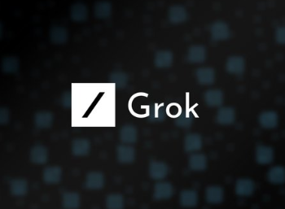

# 马斯克发布全新 AI——Grok，宣称世界第三，现在加入列表等待舱门开启

> 下文中的“我们”，指代 Grok 的开发团队。这是一篇译稿，引用部分为探长添加。

Grok 是一款模仿《银河系漫游指南》的人工智能，**因此几乎可以回答任何问题，更难的是，它甚至可以建议要问什么问题！**

> 注：《银河系漫游指南》是一部由英国作家道格拉斯·亚当斯创作的系列科幻喜剧小说。《银河系漫游指南》讲述了地球人阿瑟·丹特和他的朋友福特·派法特的故事。福特是一名来自参宿四的宇宙旅行者，他一直在地球上伪装成人类。在地球被沃贡人摧毁后，阿瑟和福特搭上了黄金之心号太空船，开始了穿越银河系的冒险。

Grok 的设计目的是用一点智慧来回答问题，并且具有叛逆性，所以如果你讨厌幽默，请不要使用它！Grok 的**一个独特且基本的优势是它通过 𝕏 平台实时了解世界**，它还将回答大多数其他人工智能系统拒绝的尖锐问题。

> 马斯克说，X 是人类的共同意识。而 Grok 声称，它的最大优势就是它可以访问 X 上所有用户的数据、观点、评论等一切信息，甚至与温和的 Google Bard、Claude2 不同，它可以回答用户比较尖锐的问题。那么，用户的数据隐藏在这里还有保障吗？所有 twitter 把自己的日常、思想上传到 twitter，是为了训练 Grok 吗？

Grok 仍然是一个非常早期的测试版产品——我们在 2 个月的训练中所能做到的最好的产品——所以期望它在您的帮助下每周都能快速改进。

## 我们为何构建 Grok

在 xAI，我们希望创建人工智能工具来帮助人类寻求理解和知识。

通过创建和改进 Grok，我们的目标是：

- 收集反馈并确保我们正在构建能够最大程度造福全人类的人工智能工具。我们认为，**设计对各种背景和政治观点的人都有用的人工智能工具非常重要**。我们还希望在遵守法律的前提下，为用户提供人工智能工具。我们与 Grok 的目标是公开探索和演示这种方法。
- 赋能研究和创新：我们希望 Grok 成为任何人强大的研究助手，帮助他们快速访问相关信息、处理数据并提出新想法。

我们的最终目标是让我们的人工智能工具协助追求理解。

> 从这里看，Grok 说，让拥有各种意识形态的人都有 AI 使用，这是它追求的公平。同时，另一个目的是，为科研人员赋予研究与创新能力。这里可能更多指社会科学研究人员。

## 前往 Grok-1 的旅程

为 Grok 提供动力的引擎是 Grok-1，它是我们在过去四个月内开发的前沿大语言模型。Grok-1 在这段时间经历了多次迭代。

宣布 xAI 后，我们训练了一个具有 330 亿个参数的原型 LLM (Grok-0)。这个早期模型在标准 LM 基准上接近 LLaMA 2 (70B) 功能，但仅使用其一半的训练资源。在过去的两个月里，我们在推理和编码能力方面取得了显着的进步，最终诞生了 Grok-1，这是一种最先进的语言模型，功能更加强大，在 HumanEval 编码任务上实现了 63.2%，在 HumanEval 编码任务上实现了 73%。在 MMLU 上。

> ChatGPT 3.5 宣称的参数量是 1750 亿，GPT-4 据说达到了 1.8 万亿，掌管 Twitter 后以节省著称的马斯克可不舍得像 OpenAI 那样烧钱。Grok1 是在 Grok0 的基础上调优得到的，Grok1 的参数量是 330 亿，Grok1 应该不足 400 亿。Google Bard 最初发布时，是基于轻量版语言模型 LaMDA 开发的，参数仅有 1370 亿，不比 ChatGPT 3.5 强；后来谷歌对效果不满意，使用 PaLM 加强，参数达到 5400 亿，效果才崭露头角。马斯克的 Grok 只有 330 亿参数，效果很让人担忧，预测第 4 把椅子都难坐上。

为了了解我们使用 Grok-1 所做的能力改进，我们使用一些旨在衡量数学和推理能力的标准机器学习基准进行了一系列评估。评估内容主要是以下四项：

- **GSM8k**：中学数学应用题，（Cobbe et al. 2021），使用思维链提示。
- **MMLU**：多学科多项选择题（Hendrycks et al. 2021），提供了 5 个上下文示例。
- **HumanEval**：Python 代码完成任务（Chen 等人，2021），针对 pass@1 进行零样本评估。
- **MATH 数学**：用 LaTeX 编写的初中和高中数学问题（Hendrycks 等人，2021），以固定的 4 次提示进行提示。

| Benchmark | Grok-0 (33B) | LLaMa 2 70B | Inflection-1 | GPT-3.5 | **Grok-1** | Palm 2 | Claude 2 | GPT-4 |
| :-------- | -----------: | ----------: | -----------: | ------: | ---------: | -----: | -------: | ----: |
| GSM8k     |        56.8% |       56.8% |        62.9% |   57.1% |      62.9% |  80.7% |    88.0% | 92.0% |
| MMLU      |        65.7% |       68.9% |        72.7% |   70.0% |      73.0% |  78.0% |    75.0% | 86.4% |
| HumanEval |        39.7% |       29.9% |        35.4% |   48.1% |      63.2% |      - |      70% |   67% |
| MATH      |        15.7% |       13.5% |        16.0% |   23.5% |      23.9% |  34.6% |        - | 42.5% |

在这些基准测试中，Grok-1 显示了强劲的结果，超过了其计算类别中的所有其他模型，包括 ChatGPT-3.5 和 Inflection-1。只有使用大量训练数据和计算资源（例如 GPT-4）进行训练的模型才能超越它。这展示了我们 xAI 在以卓越的效率培训大语言模型方面取得的快速进展。

> Inflection-1 是 AI 公司 Inflection 的大语言模型。

由于这些基准可以在网络上找到，并且我们不能排除我们的模型无意中接受了这些基准的训练，因此我们在 2023 年匈牙利全国高中决赛中对我们的模型（以及 Claude-2 和 GPT-4）进行了手工评分在数学中，该文章于五月底在我们收集数据集后发布。Grok 以 C (59%) 的成绩通过了考试，而 Claude-2 也取得了相同的成绩 (55%)，GPT-4 以 68% 的成绩获得了 B。所有模型均在温度 0.1 和相同的提示下进行评估。必须指出的是，我们没有努力针对此评估进行调整。这个实验是对我们的模型从未明确调整过的数据集的“现实生活”测试。

| 人工分级评估                           | Grok-0 | GPT-3.5 | Claude 2 | **Grok-1** | GPT-4 |
| :------------------------------------- | -----: | ------: | -------: | ---------: | ----: |
| 匈牙利全国高中数学考试（2023 年 5 月） |    37% |     41% |      55% |        59% |   68% |

我们在模型卡中总结了 Grok-1 的重要技术细节。

> 对于以上结果，貌似 Grok1 已经移居世界第三，大多数情况下它的测试表现都是稍稍落后于 Claude2，甚至在高中数学考试中还比 Claude2 强。但是一直不比 GPT-4 强，GPT-4 仍然是目前公认的 AI 强者。另外，我们还应该看到，GPT-3.5 与 GPT-4 的差距不是一点半点，简直是两倍的差距。**对于试用 ChatGPT 感觉世界最强人工智能不过尔尔的人，不要着急下结论，结果不炸裂，可能是你不会写 Prompt，或者你使用的只是 GPT-3.5。**
>
> 探长对以上的测试结果表示怀疑，Grok 很可能世界第四，世界第三有点悬。世界第二是不可能的。

## xAI 的工程

在深度学习研究的前沿，必须像数据集和学习算法一样谨慎地构建可靠的基础设施。为了创建 Grok，我们构建了一个基于 Kubernetes、Rust 和 JAX 的自定义训练和推理堆栈。

LLM 训练就像一列呼啸而过的货运列车；如果其中一节车厢脱轨，整列火车就会被拖离轨道，很难再次恢复直立。GPU 出现故障的原因有很多种：制造缺陷、连接松动、配置不正确、内存芯片性能下降、偶尔的随机位翻转等等。训练时，我们会连续数月在数万个 GPU 上同步计算，并且由于规模的原因，所有这些故障模式都会变得频繁。为了克服这些挑战，我们采用了一组定制的分布式系统，以确保立即识别并自动处理每种类型的故障。在 xAI，我们将最大化每瓦有用计算作为我们努力的重点。在过去的几个月里，我们的基础设施使我们能够最大程度地减少停机时间并保持较高的模型失败利用率 (MFU)，即使在存在不可靠的硬件的情况下也是如此。

> 以上开火车的例子很形象，大概说明了 LLM 训练是非常烧钱的，就像拿软妹币直接往火炉里扔一样。没有钱，大语言模型训练想都不要想。

Rust 已被证明是构建可扩展、可靠且可维护的基础设施的理想选择。它提供高性能、丰富的生态系统，并防止分布式系统中通常会发现的大多数错误。鉴于我们的团队规模较小，基础设施的可靠性至关重要，否则维护就会缺乏创新。Rust 让我们充满信心，任何代码修改或重构都可能产生可以在最少监督的情况下运行数月的工作程序。

> Rust 是一个“天生冷漠、吝啬”的语言，一切数据默认皆是不可修改的，一切数据有且只有一个拥有者。探长在刚刚接触 Rust 语言时，就感觉到这个语言不简单，它在大数据应用市场中将大有可为，十年之后可能称霸世界。Grok 又想省钱，又想安全、效率高，选择使用 Rust 是意料中的事。

我们现在正在为模型功能的下一次飞跃做准备，这将需要可靠地协调数万个加速器上的训练运行、运行互联网规模的数据管道，以及在 Grok 中构建新型功能和工具。

## xAI 的研究

我们为 Grok 提供了搜索工具和实时信息的访问权限，但与所有受过下一个令牌预测训练的大语言模型一样，我们的模型仍然可以生成错误或矛盾的信息。我们认为，实现可靠推理是解决当前系统局限性的最重要的研究方向。在这里，我们想重点介绍 xAI 最令我们兴奋的几个有前景的研究方向：

- **通过工具辅助进行可扩展的监督。**人类反馈至关重要。然而，提供一致且准确的反馈可能具有挑战性，特别是在处理冗长的代码或复杂的推理步骤时。人工智能可以通过查找不同来源的参考资料、使用外部工具验证中间步骤以及在必要时寻求人类反馈来协助进行可扩展的监督。我们的目标是在模型的帮助下最有效地利用人工智能导师的时间。
- **与安全性、可靠性和接地性的形式验证相集成。**为了创建能够深入推理现实世界的人工智能系统，我们计划在更明确、更可验证的情况下培养推理技能。这使我们能够在没有人类反馈或与现实世界交互的情况下评估我们的系统。这种方法的一个主要直接目标是为代码正确性提供正式保证，特别是在人工智能安全的可正式验证方面。
- **长上下文理解和检索。**在特定环境下有效发现有用知识的训练模型是产生真正智能系统的核心。我们正在研究可以在需要时发现和检索信息的方法。
- **对抗鲁棒性。**对抗性示例表明，优化器可以在训练和服务期间轻松利用人工智能系统中的漏洞，导致他们犯下严重错误。这些漏洞是深度学习模型长期存在的弱点。我们对提高大语言模型、奖励模型和监控系统的稳健性特别感兴趣。
- **多式联运能力。**目前，Grok 没有其他感官，例如视觉和听觉。为了更好地帮助用户，我们将为 Grok 配备这些不同的感官，以实现更广泛的应用，包括实时交互和帮助。

我们相信人工智能具有为社会贡献重大科学和经济价值的巨大潜力，因此我们将努力开发可靠的保障措施，防止灾难性的恶意使用。我们相信尽最大努力确保人工智能仍然是一股正义的力量。

如果您与我们一样乐观并希望为我们的使命做出贡献，请在[此处](https://x.ai/career/)申请加入团队。

## 抢先体验 Grok

我们在美国为有限数量的用户提供试用 Grok 原型的机会，并提供宝贵的反馈，这将帮助我们在更广泛的发布之前改进其功能。您可以加入 Grok 候补名单。此次发布只是 xAI 的第一步。展望未来，我们有一个令人兴奋的路线图，并将在未来几个月内推出新的功能和特性。

> 如果你也好奇，不妨戳下面的链接加入等待列表，等待测试舱门开启：
>
> https://grok.x.ai/

## 回顾

最后总结一下，自从 2018 年马斯克被踢出 OpenAI 董事会后，一直想推出自己的 AI 产品。现在终于如愿了，Grok 便是。**Grok 宣称，它不仅可以回答人类的一切问题，还可以教人类如何向它提问题。**这让我感觉 Grok 真的有独立意识了一样。

如果 Grok 真如它宣称的那样，它可以连接 Twitter 这颗人类意识大脑，那么它作为一个研究社会科学的工具，将可能是最好的选择。在这一点上，其他 AI 如 GPT-4、Claude2、Google Bard 可能都不如它。

英文原文：https://x.ai/
