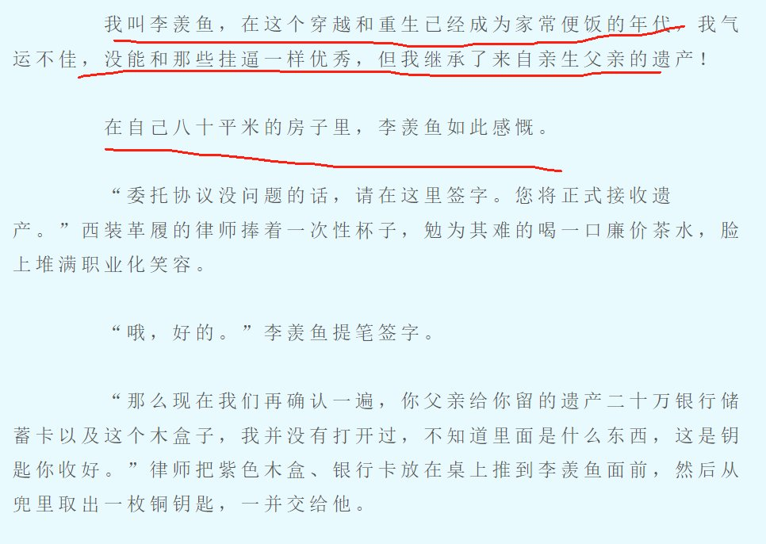
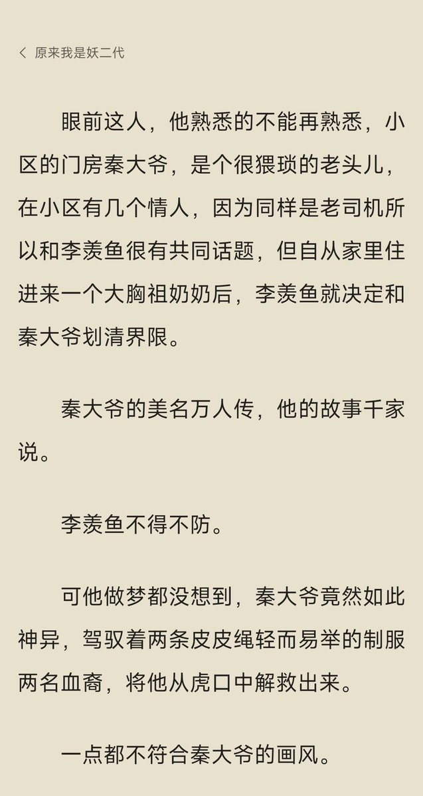
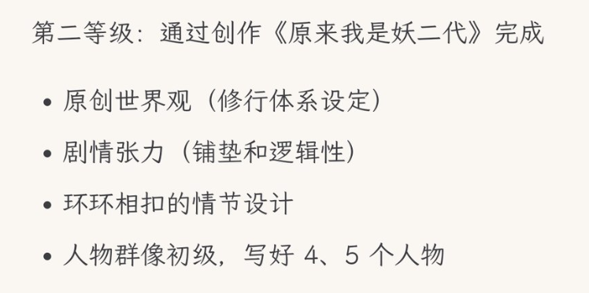
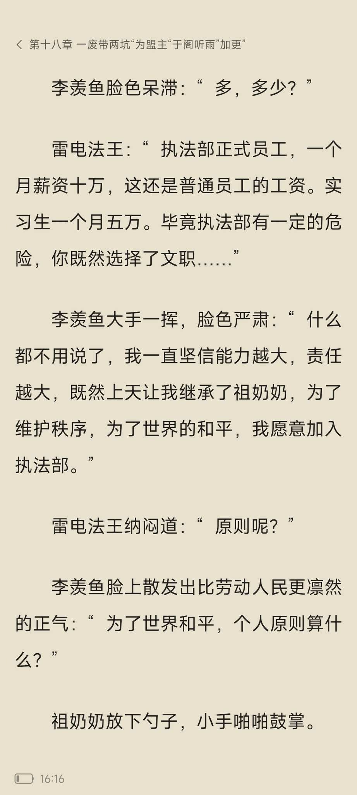

# 读《妖二代》之一，前三个小高潮情节

目录

[TOC]

《妖二代》是卖报小郎君网文创作能力修炼大成之作，值得创作者阅读。这里指的是创作者，并不是读者，如果你仅仅是读者，阅读他的最新佳作《大奉》或《灵境》即可。

下面的内容，及后面几篇的内容，是探长从创作者角度所做的阅读与分析记录。如果你对我的读书笔记感兴趣，建议先阅读[原作](https://www.xbiquge.bz/book/42491/)，再来看书评。

## 1）什么是好文笔？

你读了第一章就会同意很多人已经同意的这个观点，卖报的文笔真不是吹的。**所谓好文笔，就是可以从 360 度各个角度将一个事物进行描绘与呈现，而文字没有——或者几乎没有任何冗余。**

这里的 360 度指，变换视角，变现角色，变现人物，变换人称，变得一切可以变换的东西，同时在修辞逻辑上毫不违和。

好文笔是通过大量的写作实践修炼出来的，并且不是无脑写，要思考，重点是对自己创作的作品要有充足的想象和思考。只有对作品有 360 度完全清晰的认知构建，才可能从 360 度上无死角地描绘。

## 2）关于幽默与笔力

作者的文笔中体现出来的幽默，读者应该也把它归到了文笔里面。

这样的幽默在妖二代里面时有体现，甚至比比皆是。大多数时候它们是这样的，先写一个东西，让你以为是 A，结果再反过来让你以为是 B，A 与 B 往往还是相反的，这个过程让捧腹大笔。

举两个具体的例子，例如主角李羡鱼和祖奶奶第一次来到宝泽集团餐厅，从先选择文职岗位到选择执法岗位，就是一个反差幽默。再如，进入宝泽后，大位大佬在群里的聊天，就显得很不着调，画风有时候是突然从正面转向反面的。

## 3）第一个剧情：主角李羡鱼救徐薇

这个剧情的剧情张力与情节环环相扣设计，及其它优点，是如何体现的？

首先是设定，古妖血裔与都市中的超能力。

然后是人物群像，有三个主要人物：贪色正义的主角李羡鱼，深藏不露的秦大爷，和好吃贪玩的祖奶奶。

接着是剧情张力，铺垫与逻辑的合理性。主角与祖奶奶在小吃店里吃饭，以及在小区中遇到秦大爷，以及主角在学校宿舍中看到已经去世的张明玉，都是为后来主角来到徐薇家里发生小高潮情节做的铺垫。当主角绝望，问题无解的时候，秦大爷出现了，到这里，基本上把高潮前的张力都拉满了，且逻辑也是合理的。

最后是环环相扣的情节设计。主角父亲留下的信件，坦言先祖们活的都不太久，这与接下来主角的肾亏有关。祖奶奶在小区里遇到平时不太正经的秦大爷，却聊的特别开心且愉快，祖奶奶对他的印象也很不错，这是一个伏笔。包括在小吃店，祖奶奶让主角开了灵曈术，看到了怨鬼，这也是为下面在徐薇家中大半古妖的情节做的一个铺垫。唯一感到没有提前铺垫的就是主角与徐巍之间多年的深厚同学情谊，这一点让现场假徐薇的反常热情勾引代替了。

以上四点体现的都很不错。

## 4）何为铺垫？

在主角加入宝泽的这一章，体现了铺垫的作用。

在开始的时候，主角因为担心自己实力不足，执意要加入文职部门。但是，当听说执法部门有 10 万月薪的时候，主角马上改变了自己的决定。

这种由铺垫产生的反差，相比直接让执法长老说出执法部门员工有 10 万月薪，主角发出一声惊叹，这样的效果要好很多。

此外，还有逻辑作用。逻辑是一种修辞上的因果关系，只要说得过去，剧情就能往下发展，逻辑是为了情节服务的，至少在小说中是这样的。

## 5）第二个情节：张晨与萨摩爱狗的生死情感

这个情节也是有铺垫的，小狗萨摩在主角和祖奶奶第一次到 S 县小吃店吃饭的时候，就已经出场了，并且展现了对旧主人张晨的思念。

在桥下，小狗又展现了对张晨的依赖。

在张晨这边，他在死后，报复将小狗的狗腿打断的 S 县店主，这是张晨对小狗情感的铺垫。

这个情节大概用了 13 章，也第一个情节类似，第一个情节大概也是用了 13 章。第二个情节的铺垫是从第一个情节就开始了，这也体现了情节设计的环环相扣。

## 6）剧情张力来源于哪里？

从目前的两个情节看，剧情张力来自于转折或情感相互反馈。

第一个小高潮剧情，主角以为同学李薇有危险，跑到她家里，闻听她有裸货困难，还要拿出自己的钱帮她，结果情节大反转，这个“李薇”是假的，她是古妖。主角陷入了死局，如果不是外援秦大爷到来，主角就挂了。

第一个情节是反转。

第二个小高潮剧情，写的是张晨与一只狗之间的故事。既写了狗对人的思念，也写了人死后对狗的维护，这是一种相互的情感反馈。

第二个情节是情感相互反馈。

张力来源于逻辑合理的铺垫，要么突然反转，要么感情上有来有往。

## 7）第三个情节：张颖教室遇鬼婴痴缠案

这个故事，先是主角装逼似地携带祖奶奶和三无美女大摇大摆到教室上课，看到骑在张颖脖子上的鬼婴怨灵。主角对张颖提出批判，随后借着鬼婴的视角，引导读者产生对为了钱而堕胎之张颖的厌恶。后来，张颖突然死后，主角张羡鱼亲自去女生宿舍调查，揭秘了事情的真相。原来张颖是被厕所的怨灵女鬼杀死的，在主角调查时，先前一直痴缠她的鬼婴却帮她报了仇。

这个剧情的铺垫也是足够的，其一，张颖为了钱狠心堕胎，但她的孩子却一点不怨她，在她死后还要为她报仇，这是一个感人的转折；其二，祖奶奶和宝泽一干大佬都说，没有对付怨灵的办法，这个恐怖值拉满了。

总之，这个剧情的张力是不错的，最后揭露小鬼婴的目的是小高潮。

## 8）前三个案件情节的总结

下面是对前三个案件情节的总结。

**优秀作品的特征**

余秋雨说，优秀作品都有两个特征：无解的两难结构和双层的透明结构。《妖二代》这部首订 3000，完结万订的作品可能算不上优秀吧，但目前已经呈现的三个小高潮情节，都体现了优秀作品该有的特征。举两个例子：

1，主角张羡鱼在教室看到鬼婴的第一感觉是要干掉它，但被祖奶奶阻止了。祖奶奶这个外挂，是主角身上强大而正确的智慧。后来，他在教室被鬼婴附身，看到张颖殒命当天的事件真相，他还以为鬼婴是坏的（作者描写的角色以为鬼婴是坏的，读者也认为是坏的）。直到最后他在女生厕所用国徽杀死怨灵，才揭露鬼婴的真相。对鬼婴的多层次递进揭秘，是一种高级的双层透明手法。

2，还有，奶奶是一个磨人的小妖精，在对祖奶奶的刻画中，也出现了多重反转与层级递进。直相并不重要，让读者以为是 A，继而再打破读者的这个认知，再让读者以为是 B，这也是重要的。

**案件中的正义**

目前，《妖二代》所写的三个小高潮情节，都在一定程度上反应了社会的正能量，卖报这个胖子用最污的语言，呼吁了社会上最阳光的正义。以下是对这三个正义事件的归纳：

1，张明正与徐薇被杀案，批判校园包养与祼贷之风
2，张晨与爱狗萨摩生死之恋案，批判虐狗之风
3，张颖教室遇鬼婴痴缠案，批判堕胎之风

但凡要赚到读者的眼泪，一定要有反转。例如，第一案中，张薇由人向妖的身份转变；第二案中，张晨由弃狗到为鬼后为狗报仇的转变；第三案中，对鬼婴观感的变化。

对读者观感的把控，是创作者的基本功。如果感受某处读者没有按照产生我们想要的观感效果，那就使用渲染大法，总之，一定要让读者按照作者预定的“感觉”走。

未完。
