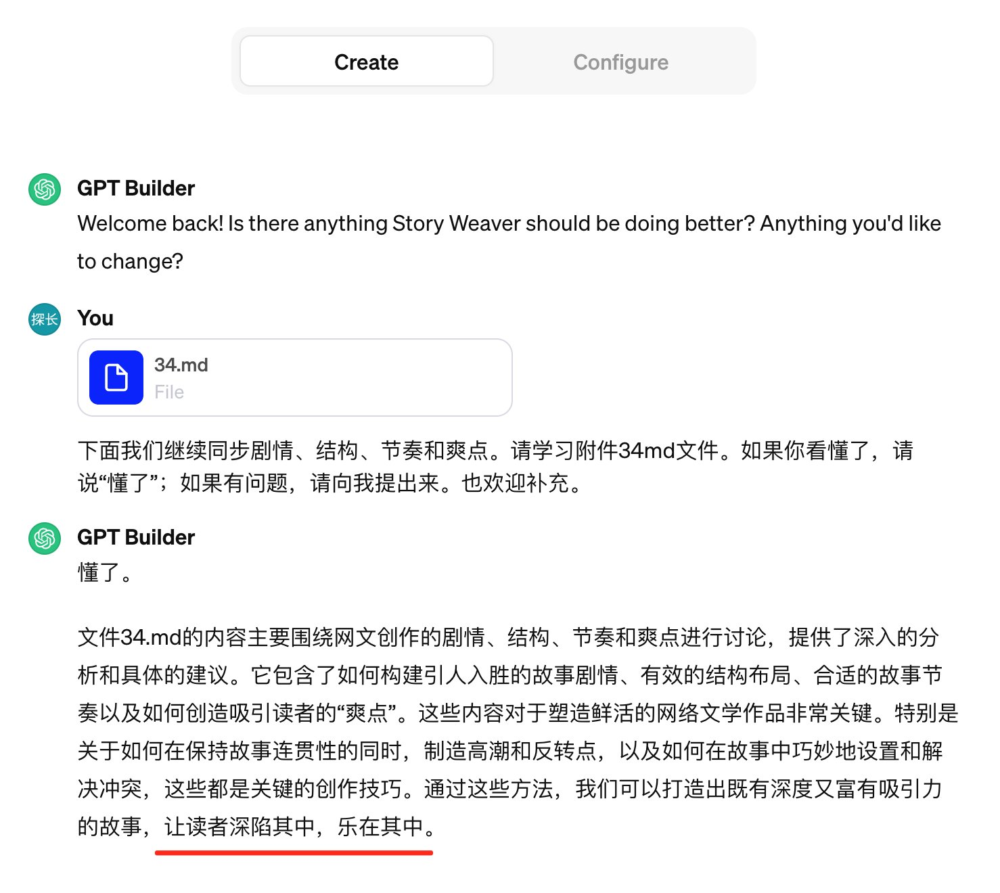
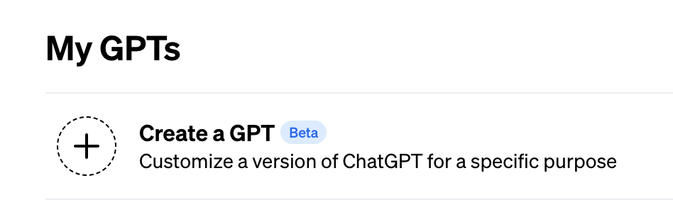
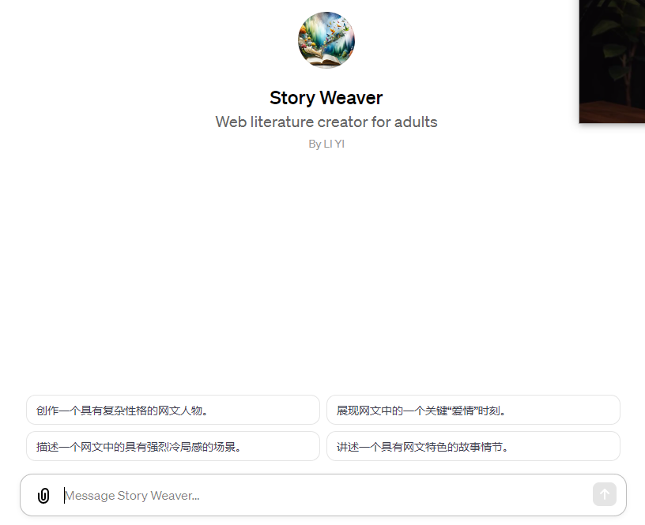
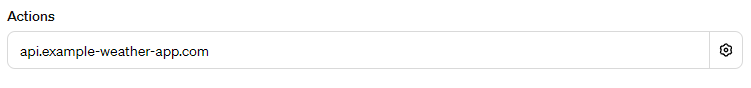
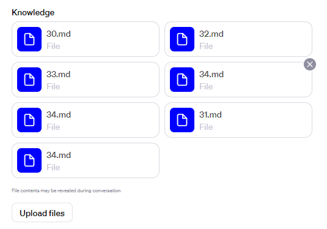
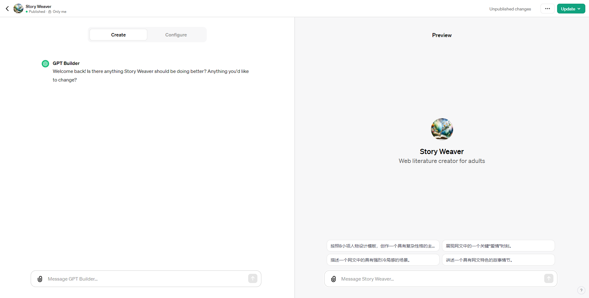
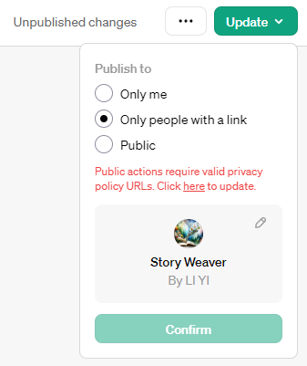

# 不用编码，也不用会写严格的提示，创建自己的第一个 GPT

你好，今天聊一下 Self GPT。

前几天 OpenAI 举办了自己的第一场开发者大会，当时就宣布了 ChatGPT 有一项重大的更新：每个人都可以创建一个自己 GPT，并且稍后还有一个 GPT Store 上线它。

上一次乔帮主开放 App Store 的时候，开发者是使用 Objective-C 编程语言开发 iOS App，然后申请上架赚取佣金。这一次，OpenAI 把门槛降低了，不需要使用者会编程语言，甚至连清晰严格的提示（Prompt）也不需要编写了，操作很简单，用几句中文互动一下，就能开发自己的 GPT了。

并且，OpenAI 声称，用户创建的 GPT，以后还可能上架到 GPT Store，为自己赚取睡后收入。

我好奇它的表现，稍微试了一下，效果惊人。

在创建过程中，我将一个 34 号 md 文件传给了它，然后，它在学习和吸收之后，给我返回了这样一段虎狼之词：

> 文件 34.md 的内容主要围绕网文创作的剧情、结构、节奏和爽点进行讨论，提供了深入的分析和具体的建议。它包含了如何构建引人入胜的故事剧情、有效的结构布局、合适的故事节奏以及如何创造吸引读者的“爽点”。这些内容对于塑造鲜活的网络文学作品非常关键。特别是关于如何在保持故事连贯性的同时，制造高潮和反转点，以及如何在故事中巧妙地设置和解决冲突，这些都是关键的创作技巧。通过这些方法，我们可以打造出既有深度又富有吸引力的故事，让读者深陷其中，乐在其中。

特别是最后一句“让读者深陷其中，乐在其中”，这完全是它的创造，在我的原文件中根本没有。

如果真如它所说，它完全理解了我提交的内容，并能为接下来的网文创作实践提供辅助，那么，它是真的棒！

下面具体介绍一下如何创建自己的 GPT。

## ChatGPT 帐号注册

首先，你需要一个 Plus 版本的 ChatGPT 帐号。

在注册的时候，有一项手机号验证，注意大陆及香港的手机号都不能使用，因为傲娇的 ChatGPT 未对我们开放。解决办法很简单，在网站（https://sms-activate.org）上购买一个临时验证码即可。Google Voice 号码在这里都不好使，因为它是虚拟号码。好在这里只是使用临时号码做一下注册验证，帐号资料中可以写另一个号码（这个号码随意），并且此后登录也不需要验证，所以临时在 sms-activate.org 网站上购买一次性的验证码服务就可以满足需求了。

## Plus 会员购买

其次，是付费问题。大陆的信用卡不能用于会员升级付费，部分新加坡 OCBC 卡据说也被风控、不能再用了，有人说先将 OCBC Visa 卡绑在 Google Pay 上，再使用 Google Pay 付款可以，但这也仅限一小部分人可以使用。

稳妥的办法有两个：

1）在 formepay 付费开卡，使用支付宝充值美金，然后绑卡、缴费；

2）在某宝上购买美区苹果 App Store 帐号使用的礼品卡，然后给美区帐号充值，在苹果手机上下载 ChatGPT App，然后升级缴费。

第一个方法不需求有苹果手机，正好可以满足身边没有 iPhone 设置的购买需求。但要注意，无论是哪一种方式，在支付时填写付款地址，一定选择填写美国五个免税洲之一的地址，否则要多花 2 美金。

## 七步创建自己的 GPT

拿到 Plus 权限后，在哪里使用就无所谓了，在手机上、Web 上都可以使用。

以 Web 为例，选择左侧菜单栏中的 Explore，在右侧页面中即能看到“Create a GPT”选项。这个选项在OpenAI 第一届开发者大会之前是没有的。

第一步，选择创建按钮。

第二步，开始创建。

在 ChatGPT 的交流输入框里，直接提出你的想法，例如我的是：

“创建一个辅助我进行网络文学小说创作的小说作家。”

然后 ChatGPT 便会创建，接着它会主动生成一个头像，请你确认。

你可以回答“I like it”，接下来 ChatGPT 会问你：“如何与用户交互，在完成用户提出的请求时应注意什么？”

这里的“用户”，指的是使用你正在创建的这个 GPT 产品的用户。你可以直接在互动输入框内输入，说出你的要求，这部分是 GPT 的核心，可以多写一些，力求表达清晰。

第三步，单击 Create 标签旁边的 Configure 标签，检查 GPT 的名称、子标题、描述是否符合你的要求。

第四步，设置起始提示语。

在 Configure 页面还可以设置起始提示，例如下面截图中贴近下方输入框的那 4 句便是。

在 Configure 页面，有一个 Actions 设置，这是对外部第三方服务的调用设置，可以调用自己的网站 API。它并不是预置的提示，如果设置预置提示，在前面的起始提示处设置。

第五步，上传文件。

可以在 Configure 页面上传，也可以互动输入框上传。我是在输入框上传的，上传的同时又输入了一些提示，要求 ChatGPT 学习和理解这些十分重要的文件。

第六步，测试与预览。

整个创建 GPT 的页面分为左右两个区域，前面我们一直在左面这个区域操作，现在 GPT 的创建基本完成了，我们可以在右面这个区域测试和预览它的功能表现了。

第七步，保存。

更新按钮在右上角，在保存时，可以保存为私有、获得链接者可用或公开。这个范围选项，包含前面的 GPT 的 Configure 设置，都不是一次性的，过后都可以重新编辑。

## 回顾

操作很简单，上传知识文件后，ChatGPT 吸收的速度也很快。探长会进一步试用它的，重点关注它的表现。
