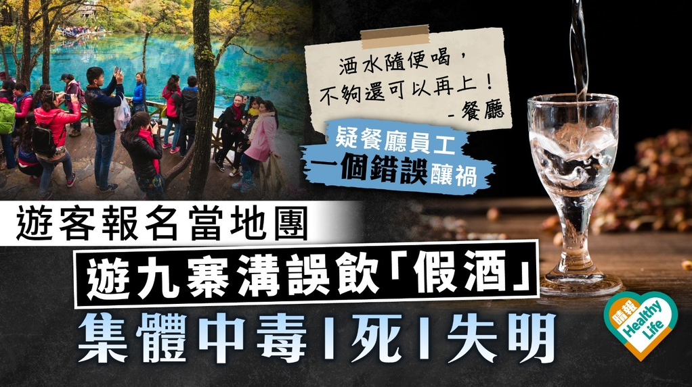
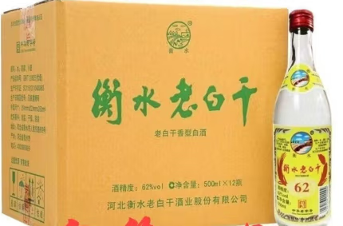
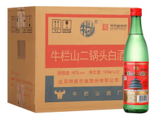
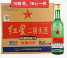
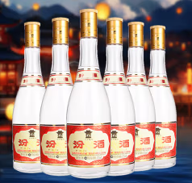
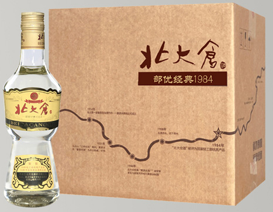
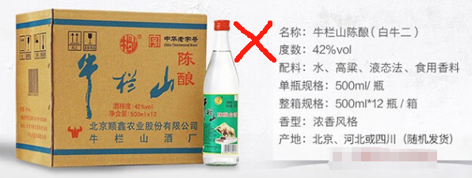
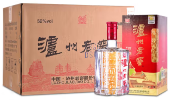

# 3月游客在九寨沟误饮假酒集体中毒1死1失明，谈日常如何选择安全又便宜的粮食酒？

[TOC]

你好，今天聊一下酒。

二三十年前，你在报纸上经常能看到这样的消息，某某地方某某某举办婚宴或寿宴，客人喝了假酒，导致数人不幸身亡、多人双目失明之类的新闻。原因在于宴请所用的酒不是纯粮食酿造的，是工业酒精勾兑的，含有甲醇、吡啶等违害人类健身的物质。最近这方面的新闻少了，但随着直播卖酒的兴起，这类事情又能所抬头，我们必须谨慎对待。

酒的文化在中国由来已久，在《水浒传》中，武松景阳岗打虎前喝了 18 碗壮阳酒；在金庸小说《笑傲江湖》中，祖千秋与令狐冲斗酒，从诗、行酒令，到酒杯与酒，每方面都有很多讲究；在《天龙八部》中，乔峰聚贤庄大杀四方前先与昔日老友喝了一碗断交酒。在中国，酒不仅是酒，还附带了其它许多东西。

现代社会逢年过节也会喝酒。一般南方人比较随性，会让酒但不会死命劝酒，或干脆以茶代酒；北方人不一样，尤其是山东人河南人，客人喝酒不尽兴，主人以为是自己招待不周。在以前缺吃少穿的年代，家中有酒，一定拿出来先让客人喝足，这种传统现在继承下来，变成了北方豪迈的劝酒风格。

都知道酒大伤身，但一醉也能解千愁，人生在世谁没有忧愁呢？如果你放不开、喝不醉，那就是与兄弟我不亲近，北方喝酒大概就是这个逻辑。

酒的主要成分是乙醇。古代没有批量生产乙醇的工艺，所有的酒都是手工酿造的。现代则不一样了，知道了酒的主要成分，现代工艺用饱含纤维的树木和草都可以分解出大量的糖和乙醇，再用乙醇加水勾兑，成本可比粮食酿造便宜多了。这种工业酒精勾兑酒，只有现代有，古代人是无福消受的。

同样是乙醇，按理说，勾兑酒应该也不会差。但是勾兑酒喝多了，人会头晕、头疼；饮同样的量，粮食酒则不会。实际上，粮食酒中除了主要的成分乙醇，还有许多微量的其他物质，正是这些物质决定了酒的口感与风味。在工业酒精勾兑的酒中，除了乙醇，也可能存在因为机器生产而产生的其它微量有害物质，这些物质会加重人的不适反应。一正一反，粮食酒自然比勾兑酒好。

## 酒按工艺划分

市场上能够买到的酒，按照制作工艺划分，可以分为以下三种。

### 液态法白酒

液态法白酒的执行标准是 GB/T20821-2007。这里的 GB/T 是国家制定的白酒标准。

液态法白酒是以粮谷、薯类、糖蜜等原料，经现代液态发酵工艺、蒸馏成食用酒精的工艺路线、再经串香、勾兑、调配而成的白酒，俗称酒精勾兑酒。

这种酒一般人是不能买的，只有身体机能特别强大之人喝了之后才不会上头，第二天才不会头疼欲裂。

### 固液法白酒

固液法白酒的执行标准是 GB/T20822-2007。

它是用酒精酒和粮食酒共同勾兑而成的，是一种折中的产品，价格没有那么高，副作用没有那么大。

这种酒一般人也不能喝，只有身体机能相对强大的人才能喝。虽然它的成本里含有粮食酒，也也有勾兑酒，但喝这种酒，相当于一会喝粮食酒，一会喝勾兑酒，两种酒在胃里混合了，酒后感觉同样难受。

### 固态法白酒

固态法白酒的标准最多，顾名思义就是使用粮食酿制出来的。

同样是固态纯粮酒，根据接酒时间不同而产生的区别，也就是发酵、储存时间长短，又分为特曲酒、头曲酒、二曲酒、三曲酒等。

- 特曲：酒在蒸馏后出的第一段酒为特曲，民间也称酒头，一般最少要储存三年以上。

- 头曲、二曲：特曲随后蒸馏的第二、三段则是头曲、二曲，储存时间为一年、半年，有时间也会窖藏六年，例如泸州老窖六年窖头曲。
- 尾曲：最后蒸馏出的白酒为三曲或尾曲，基本上是不进行储存的，马上罐装出厂销售。所以说价格便宜的符合国家标准的白酒，有可能属于尾曲级别的，也不一定是工业酒精勾兑的。

这三种工艺在酒瓶上都有公示，并不是说勾兑的酒都羞于公示，不是的。公示工艺是国家规定，很多时候是老百姓自己不知道才买了勾兑的“假洒”，并不属于酒厂欺骗。

## 粮食洒生产标准

不适合购买的勾兑酒，它们的产品标准分别是 GB/T20821、GB/T20822，适合购买的粮食酒的标准却有很多。一些有地域特色的酒，还有自己独特的标准，而不是采用国家统一的标准，例如茅台与北大仓使用的 GB/T26760，衡水老白干是 GB/T20825，西凤绿脖是 GB/T19508 等。

常见的固态纯粮标准有以下这些：

- GB/T 10781.1-2006 浓香型白酒 例如泸州老窖六年窖头曲
- GB/T 10781.2-2006 清香型白酒 例如太仆寺旗草原白、牛栏山二锅头绿牛二、红星二锅头 56 度
- GB/T 10781.3-2006 米香型白洒
- GB/T 26760-2011 酱香型白酒 例如北大仓部优经曲、飞天茅台、迎宾茅台
- GB/T 19508-2007 凤香型白酒 例如西凤绿脖、西凤 375（45 度）
- GB/T 14867-2007 凤香型白酒
- GB/T 16289-2007 豉香型白酒
- GB/T 20823-2007 特香型白酒
- GB/T 20824-2007 芝麻香型白酒
- GB/T 20825-2007 老白干香型白酒 例如衡水老白十绿标、衡水老白干青花手酿
- QB/T 2524-2001 浓酱兼香型白酒

其中，以下这三种生产标准最为常见：

- 浓香型白酒：GB/T10871.1-2006
- 清香型白酒：GB/T10781.2-2006
- 米香型白酒：GB/T1078.1.3-2006

在低价酒市场 GB/T10781.2 最为常见，例如太仆寺旗草原白、红星二锅头蓝瓶 56 度、牛栏山二锅头绿牛二等。

## 20 元以下的口粮酒

同样是粮食酒，价格差别很大。有哪些酒，既是粮食酒，价格也不高呢？以下是探长总结的 20 元以下的清香型口粮酒。

- 衡水老白干 62 度绿标 老白干香型白酒
  500ml ￥ 16
  配料：水、高梁、小麦
  执行标准：GB/T 20825 (优级）

  

  注意，这款酒的原料没有玉米，只有高粱和小麦。稍后便会为这点感动。
  
- 牛栏山二锅头绿牛二 56 度
  500ml ￥ 19
  配料：水、高梁、大麦、小麦、豌豆
  执行标准：GB/T10781.2

  

  二锅头这个名字因为“只取第二次蒸馏得到的酒”而得名，从名称上看，二锅头算是头曲或二曲。但这个绿牛二，以及下面的红星蓝瓶 56 度，价格在 20 元以内的，不太可能是二曲，是尾曲或三曲比较合理。

- 红星二锅头蓝瓶 56 度
  500ml ￥ 20
  原料：水、高梁、玉米、大麦、豌豆
  执行标准：GB/T GBT/10781.2

  

  这款酒的原料含有玉米，酒味会有稍许甘甜，但影响口感的醇厚。使用玉米是为了降低成本，因为玉米相比其它原料便宜。
  
- 太仆寺旗草原白酒 闷倒驴 60 度
  494ml ￥ 17
  配料：水、高梁、王米
  执行标准：GB/T10781.2-2006

  

  60 度的草原白又名闷倒驴，有的酒叫“闷倒驴”，那是冒充的，一般说内蒙草愿上的闷倒驴指的就是60度的草原白。这款酒的原料也有玉米，低价粮食酒很少不用玉米的。

20 元以下的粮食酒，都是清香型，不要妄想浓香型，更不要想酱香型了。这些清香型酒，只能保证是传统纯粮酿造工艺生产的，物美价廉，可以理解为尾曲或三曲，是酿造完以后马上罐装销售的粮食酒。

上面这些这些口粮酒，探长最喜欢的是衡水老白干绿标 62 度，日常拿它自酌或做菜，都可以。

## 百元以下优质口粮酒

以下是百元以内的口粮酒。

- 衡水老白干 青花手酿 62 度 浓香型
  500ml ￥ 72
  原料：水、高粱、小麦
  生产标准：GB/T 20825 (优级）

  

  这款酒与绿标 62 度相比，好在哪里？它们的生产标准都是 GB/T 20825，度数也是一样的，为什么这个贵？瓶子贵吗？当然不是，青花手酿香气浓郁，相当于浓香型，是头曲或二曲酒浆。

- 西凤绿脖 55 度 凤香型白酒
  500ml ￥ 55
  原料：水、高粱、大麦、小麦、豌豆
  产品标准：GB/T19508-2007

  

- 山西汾洒之黄盖玻汾 53 度 清香型
  475ml ￥ 50
  原料：水、高梁、大麦、豌豆
  产品标准：GB/TI0781.2

  

  花 50 块喝一款清香型感觉不太值，但很多朋友说这款好喝，探长不觉明厉。

- 泸州老窖六年窖头曲 52 度 浓香型
  500ml ￥ 75
  配料：水、高梁、小麦
  产品标准：GB/T 10781.1

  

  好酒的原料只用高粱与小麦，连豌豆都不用，更不要说玉米。
  
- 北大仓部优经典 1984 50 度 酱香型
  630ml ￥ 55
  原料：水、高粱、小麦
  产品标准：GBT/26760（一级）

  

  GB/T26760 是由贵州茅台酒、四川古蔺郎酒和贵州习酒主导制定的，主要目的是规范酱香型白酒的生产，该标准规定酱香型白酒只能由水、高粱和小麦作为原料，经过传统固态发酵制成，不能添加其他任何添加物，包括食用酒精、食用色素、食用香精等。

  作为按照这个生产标准生产的酒，北大仓可以说是非常良心的一款，它可能是老百姓唯一能够消费的最便宜的酱香粮食酒了。

## 小酒坊的私房酒值不值得买？

有人喜欢购买小酒坊的酒，认为那是纯手工酿造的，价格又低，值得信赖。

小酒坊因为缺乏相关的安全设施和经验，产品可能引起饮酒人的不适甚至中毒，报低上已有多起这样的报道。再者，在利益面前，谁也不能保证小酒坊不使用酒精+香精勾兑，毕竟这样操作既容易又安全。理论上讲，那些出过事故的小酒坊反而最可能是纯粮食酿造的，而勾兑的小酒坊反而安全不容易出事故。

事实上，上面 20 元以下的口粮酒便值得选择，它们都是大厂生产的，历史悠久，品牌硬。理论上讲，越是大厂批量生产，越能降低生产成本，如果不考虑品牌溢价，大厂生产的粮食酒性价比才是最高的。

## 回顾

最后总结一下。

平常自用或自酌，可以选择固态法酿造的、生产标准是 GB/T10781.2 的清香型白酒，例如牛栏山二锅头绿牛二。注意选择牛栏山绿牛二时，认准印有天坛图案的绿瓶，不是印有牛头图案的白瓶，后者是液态法工业洒精+香料勾兑的白酒（如下所示），不能买。

如果是送人，老百姓也没有必要买特别贵的酒，生产标准是 GB/T10781.1 的浓香型白酒便可以，例如泸州老窖六年窖头曲 52 度。

一些地方特色酒也值得考虑，例如“能喝出男人味”的衡水老白干绿标 62 度，以及价格仅 50 元左右的酱香白酒北大仓部优经典 1984（50 度）。

过量饮洒伤身，饮用工业酒精勾兑酒伤害更大，国家并没有禁止勾兑酒的生产和销售，我们老百姓在选购的时候一定要自己甄别好！

尤其是北方的朋友，有朋自远方来，咱很好客，拿出珍藏多年的好酒招待客人，结果酒是“假酒”，是勾兑酒，热情劝酒把人劝医院去了，这样是不是很尴尬？
