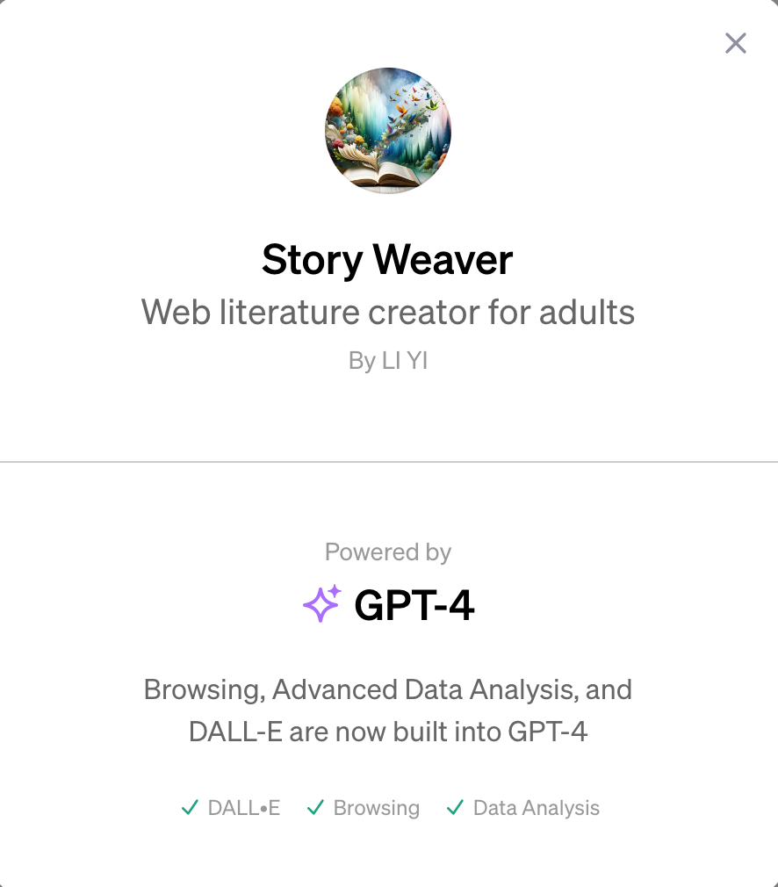
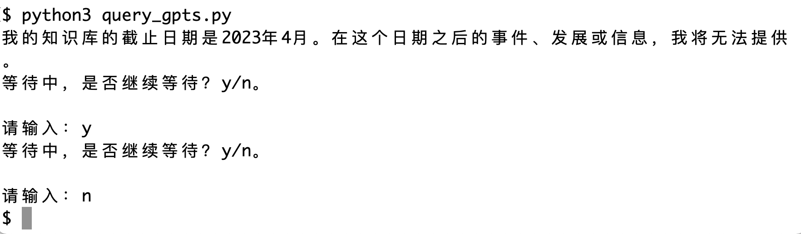
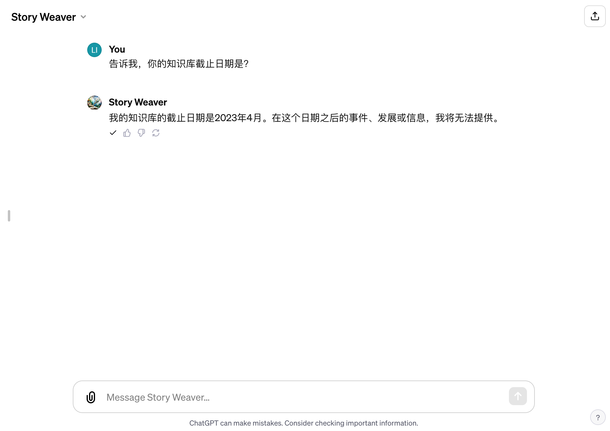
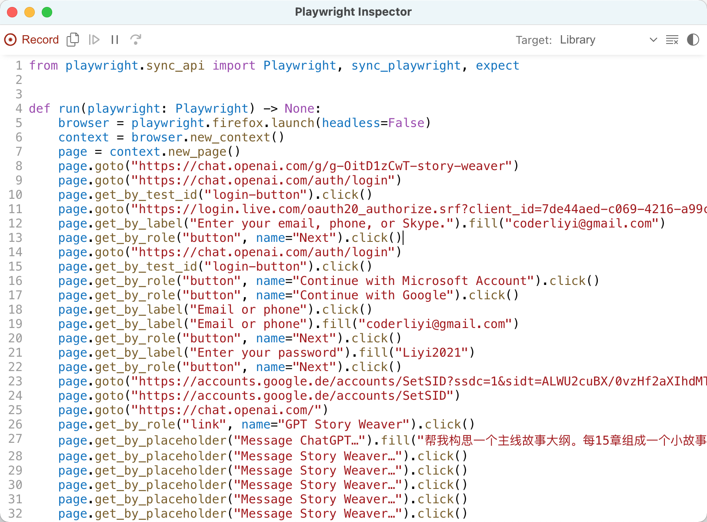

# 打开新世界大门，50 行 Python 代码调用自己在 ChatGPT 创建的私有 GPTs

你好，今天聊一下 ChatGPT 的 GPTs。

11 月 6 日，OpenAI 举办了自己的第一次开发者春晚，并现场推出了新模型 GPT-4 Turbo，及 Plus 会员用户可以基于新模型进行功能自定义的 GPTs。

GPTs 是什么？

简单理解，它就是一个充许用户不使用任何编程技术、不需要调用 ChatGPT API 即可完成训练的一个 AI。有人说，我不需要 GPTs，我用 LangChain+Agent+ChatGPT API 或其它大语言模型的 API，也能实现一个自定义的 GPT。

没错，这么理解是对的！但不是所有人都会编程，也不是所有人都知道 LangChain 如何调用以及 AI Agent 如何开发。ChatGPT 适时推出的 GPTs，它的目标用户群体是广大的不会编程的用户。据 OpenAI 宣称，ChatGPT 周活已经达到了 1 亿，预测不久，几百万个甚至几千万个 GPTs 将出现在 GPT Store上。

笔者在这篇文章“[不用编码，也不用会写严格的提示，创建自己的第一个 GPT](https://mp.weixin.qq.com/s/VlNvziKjGsIWYxef9w3Xig)”中已经详细介绍过徒手创建 GPTs 的方法，很简单，整个过程只需要七步，简单设置一下，再上传一些文件，大功即可告成。在发布的时候，还可以选择私有、分享可用及完全公开。

如下所示，这是笔者创建的 GPTs————Story Weaver，它是一个私有的GPTs。



对于我们不想让别人看到的，只想让我们自己或团队成员使用的模型，我们肯定要发布为私有。对于私有的 GPTs，如果我们还想实现在本地自如地调用、并且是程序自动化调用，我们应该怎么做呢？

有人可能会想：“我们可以使用 OpenAI 官方提供的 API。”

很抱歉，目前 OpenAI 还没有公布这样的接口；即使以后有，它极有可能也是需要付费的。我们购买 Plus 会员已经花了钱，在调用自己创建的 GPTs 的时候，为什么还要花钱？

本篇笔者就用银河系最通俗易用的编程语言————Python，用不到 50 行的总代码，带你打开新世界大门。不需要额外付费，也不需要调用任何 API，更不需要设置什么 API Token，就可以自动化调用我们自己创建的 GPTs。

在创建 GPTs 的时候，数据文件是我们提供的，消费代码也是在我们本地运行的，这就相当于我们在本地借用了 ChatGPT 强大的大语言模型能力，且成本低廉、方法又简单。

## 准备工作

如果你想顺利运行稍后笔者提供的 Python 示例，你需要准备以下这些条件：

- 一个附带 Plus 会员的 ChatGPT 帐号
- 本地电脑已经安装了 Python 3.7 或以上的版本

有人可能说：“访问 ChatGPT 需要翻墙，我不想翻墙！”

没问题，购买一台腾讯云美区云主机，选择 Windows 系统，在上面进行项目操作就可以了。不需要翻墙，速度还是杠杠的。

## 安装类库

稍后我们需要用到两个类库：pyperclip 与 playwright，我们需要在终端环境里依次安装它们：

> pip install pyperclip
>
> pip install playwright && playwright install

注意：在安装完 playwright 以后，别忘记运行 playwright install，这一步是安装 playwright 运行时需要的浏览器组件。即使是我们本地已经安装了相关的浏览器，这一步也必不可少。

简单介绍一下这两个类库。pyperclip 是处理剪切板数据的，允许我们访问本地剪切板并将数据导出，这个类库没什么好说的，许多开发网页智能机器人的工程师们都使用过。

playwright 是大大鼎鼎的自动化测试框架，它由 Microsoft 开发，提供了一套简单而强大的 API，可以自动化运行基于 Chromium、Firefox 和 WebKit 浏览器的测试程序。与 playwright 齐名的另一个类似框架是 selenium，前者与后者相比，前者拥有更加现代化的 API、更快的响应速度和更强大的功能，所以笔者选择了前者。

一个自动化测试框架跟我们要做的事情有什么关系呢？我们为什么要安装它？

当然有关系！很多基于浏览器的自动化智能机器人，例如智能网页爬虫，都是 playwright 实现的。你明白了吗，playwright 不仅可以用于测试、代替测试工程师做一些重复性高的测试工作，还可以代替人做一些相对复杂的普通网页操作。

稍后我们在浏览器上打开自定义 GPTs 的网址、输入 Prompt、获取查询结果，这些操作都可以由 playwright 代替我们实现。本地程序的自动化是借由 playwright 实现的。

## 持久化登录

使用 playwright 开发智能网页机器人应用，有一个问题是无法避免的，这个问题就是用户验证。一般有以下两个解决思路：

1）第一个思路，自动监测网页状态并登录。

当未登录时，使用本地预先记录的帐号跳转到登录页面实现自动登录，并在本地缓存登录后的 cookies。

本地写入 cookies 的代码大概是这样的：

```python
cookies = context.cookies()
print(page.title())
f = open('cookies.json', 'w')
json.dump(cookies, f)
```

读取 cookies 以避免重复登录的代码是这样的：

```python
def loadCookies(cookief):
    cookiefile = open(cookief, 'r')
    cookie_list = json.load(cookiefile)  # json读取cookies
    cookiefile.close()
    return cookie_list

...
context = browser.new_context()
cookiefiles = ['cookies.json']
for cookiefile in cookiefiles:
  context.add_cookies(loadCookies(cookiefile))
```

这两段代码今天我们并不打算使用，你了解一下就好。这种方式还需要处理网页验证码，以及在 cookies 过期后还需要重新登录，比较复杂，除非迫不得已，我们不采用这种思路。

2）第二个思路是持久化登录。

简单讲，就是专门在硬盘上辟出一个空间给当前的网页机器人程序使用，运行期间产生的 cookies、图片等数据全部缓存在该目录下，由于 cookies 是缓存的，便不需要频繁登录。我们采用这种方法。

首先创建一个项目目录，例如 browser_ai，在该目录下再创建一个 gpts_firefox_dir 目录，用作浏览器的持久化缓存目录。

现在祭出我们的第一部分 Python 代码，query_gpts.py 文件第一部分：

```python
import time
import pyperclip
from playwright.sync_api import sync_playwright

def login():
    with sync_playwright() as p:
        context = p.firefox.launch_persistent_context(
              './gpts_firefox_dir',
              headless=False,
              slow_mo=500
            )
        page = context.pages[0]
        page.goto('https://chat.openai.com/')

login()
```

简单解释一下这段 Python 代码：

- 前 3 行是类库引用。time 是内置的，不需要安装，可以直接引用。pyperclip 与 playwright 我们已经安装过了，可以直接引用，playwright.sync_api 是 playwright 的同步模块，使用同步模式，在编写网页机器人时可以让我们轻松许多。
- 第 5 行～第 13 行定义了函数 login，这个函数我们主要是为了在本地持久化目录下缓存 cookies 信息的。第 7 行，firefox 代表使用 Firefox 浏览器组件，这个地方还可以选择 chromium 或 webkit，相信我，不要选择 chromium，虽然它是大名鼎鼎的谷歌开源的浏览器项目，但它早被黑客们玩坏了，开发网页机器人就使用 firefox 吧，这个选项能让你节省许多时间。不要谢我，我是活雷锋。
- 还是第 7 行，launch_persistent_context 代表从本地持久化目录启动浏览器。第 8 行，第一个参数 gpts_firefox_dir 便是我们先前创建的目录，在这里用上了。
- 第 9 行，headless 等于 False，我们才可以在运行时看到浏览器的 UI。如果想让浏览器组件在后台静默运行，将此处设置为 True 即可。测试阶段，最好设置为 True。不要问我为什么，如果你调试过网页智能机器人程序中的元素选择，就明白我在说什么了。
- 第 12 行，是取到浏览器的第一个打开的标签页。第 13 行，是打开一个网址。

其它代码没有什么好讲的，使用`python query_gpts.py`指令启动，在打开的浏览器中登录自己的 ChatGPT 会员帐号，然后关闭程序。login 函数的使命就已经完成了。

## 调用 GPTs

下面真正的代码来了，query_gpts.py 文件第二部分：

```python
...
def query():
    with sync_playwright() as p:
        browser = p.firefox.launch_persistent_context(
              './gpts_firefox_dir',
              headless=False,
              slow_mo=500
            )
        page = browser.pages[0]
        # 这是私有的，要替换成你自己的GPTs URL
        page.goto('https://chat.openai.com/g/g-OitD1zCwT-story-weaver')
        time.sleep(2)
        page.query_selector("#prompt-textarea").fill("告诉我，你的知识库截止日期是？")
        page.wait_for_selector('button[data-testid="send-button"]').click()
        time.sleep(10)

        copy_button_selector = 'button.text-xs.dark\\:hover\\:text-gray-200'
        copy_buttons = page.query_selector_all(copy_button_selector)
        (copy_buttons[len(copy_buttons)-1]).click()
        time.sleep(1)
        clipboard_content = pyperclip.paste()
        # 打印剪贴板内容
        print(clipboard_content)

        str = 'y'
        while str == 'y':
            str = input('等待中，是否继续等待？y/n。\n\n请输入：')  # 控制休眠时间
        page.close()
        browser.close()

query()
```

这部分代码都干了啥？稍微解释一下吧：

- 第 4 行～第 8 行，前面介绍过了。
- 第 11 行，打开自定义 GPTs 的网址，注意，示例里是我自己的网址，并且是私有的，你是访问不到的。你需要在 ChatGPT 上先创建自己的 GPTs，然后将此处换成自己的地址。关于如何创建自己的 GPTs，看这里：[不用编码，也不用会写严格的提示，创建自己的第一个 GPT](https://mp.weixin.qq.com/s/VlNvziKjGsIWYxef9w3Xig)。
- 第 12 行，这里有一个 sleep 操作，为什么要 sleep？我们引用的是 playwright 同步模块，第 11 行代码执行完，代表网址已经打开了，为什么还要 sleep？是报复老板让我 996 故意消耗老板的电费吗？当然不是！网址成功打开并不代表页面元素全部加载完成，在开发网页智能机器人时尤其要注意这一点，否则，你可能找不到你要查询的页面元素，因为你要的元素还在内存里，还没有渲染出来呢。打个比方，好比今天你去教官结婚，但是你的新娘还在她妈妈的肚子里。
- 第 13 行，query_selector 用于选择页面上的一个元素，它的参数是 CSS 选择器，参数要求与 document.querySelector 相似。fill 是填写文本，写的是我们想问的问题，这里为了使程序简单，我将问题写死了，事实上这个问题可以来自于数据库，也可以来自于用户输入，它的来源是灵活可控的。
- 第 14 行，wait_for_selector 也是选择元素，它与 query_selector 不同的是，它会等待网页出现这个元素————如果这个元素暂时没有的话。wait_for_selector 相比 query_selector 是有优势的，使用它不用显式等待，你看我在这行代码前面就没有使用 sleep。那么为什么在第 12 行使用呢，为什么第 13 行不使用 wait_for_selector 呢？不为什么，为了演示，为了告诉你这两个方法之间的区别。
- 第 14 行，是单击了页面中的“发送”按钮，ChatGPT 背后的大语言模型开始工作了。第 15 行，这里要 sleep 一下，ChatGPT 的反应需要时间。
- 第 17 行～第 19 行，这里是为了查询页面上出现的“拷贝”按钮，并单击它。由于多次互动后，这类按钮会出现多个，所以取了最后一个。
- 第 21 行，这是从剪切板获取数据，我们提前安装的 pyperclip 终于发挥使用了。

程序完成后，使用`python query_gpts.py`指令运行，效果如下：



最后一步，程序中关于y的那部分while循环，是为了控制程序不退出。因为程序退出后，浏览器就关闭了，我们也没有办法进一步查看和操作界面了。

如果参数 headless 等于 Flase，能看到浏览器界面，运行效果是这样的：



GPT-4 Turbo 发布后，很多通过第三方壳子应用使用 ChatGPT 服务的用户，怀疑自己用的是假 GPT-4，这时候可以使用上面这条提示问知识库截止日期，正准答案是 2023 年 4 月。

## 由 codegen 反向生成代码

示例里面有一个地方的代码，在网页机器人开发中是公认的麻烦。例如，在 query 函数中，第 13 行、第 14 行、第 17 行，这三处的选择器代码并不容易写，尤其是最后一个。

```python
page.query_selector("#prompt-textarea").fill("告诉我，你的知识库截止日期是？")
page.wait_for_selector('button[data-testid="send-button"]').click()
copy_button_selector = 'button.text-xs.dark\\:hover\\:text-gray-200'
```

为了解决这类问题，提升生产效率，playwright 提供了一个“由操作生成代码”的功能。以我们访问的 GPTs 网址为例，指令如下：

```bash
playwright codegen --browser firefox https://chat.openai.com/g/g-OitD1zCwT-story-weaver
```

codegen 这个子程序可以帮助我们生成带有大量选择器的代码。参数 browser 是指定浏览器组件类型，这个参数其实无所谓，指不指定并不会影响目标页面上的元素。

codegen 指令会打开一个浏览器，我们在上面操作一番，在小窗口中便能看到生成的代码，如下所示：



生成的代码很粗犷，一般情况下并不能直接使用，但它可以帮助我们定位元素，获取元素的选择器写法。这是 codegen 指令存在的作用。

## 回顾

最后总结一下。

这个示例很简单，没有输入，也没有输出————输出就是简单的打印，将 ChatGPT 返回的内容直接在终端中打印了一下。对于登录，我们也采用了最简单的方法————手动登录。在实际项目中，这些问题都需要细化。

通过 playwright，我们实现了在本地调用远程私有 GPTs 的目的，数据是我们的，程序也是我们的，我们只是借用了 ChatGPT 的大语言模型能力。并且也不需要额外花费 API 调用费用，这是很划算的。基于本文示例，你还有哪些想法，想开发什么样的智能应用呢？欢迎留言讨论。

最后说一下示例代码，完整的示例可以在公众号“艺述论”回复 10008 下载。
