# ChatGPT的底层工作原理

ChatGPT 能够自动生成一些读起来像人类写的文字的东西，而且常常出乎意料。它是如何做到的？

ChatGPT 从根本上说总是试图对它目前得到的任何文本进行 “合理的延续”，这里的 “合理” 是指 “在看到人们在数十亿个网页上所写的东西之后，人们可能会期望某人写出什么”。严格上讲，它并不是在思考。

## 基于已有内容延伸，得到一个候选列表

因此，假设我们已经得到了 “人工智能最好的是它能去做 ……” 的文本（“The best thing about AI is its ability to”）。想象一下，扫描数十亿页的人类书写的文本（例如在网络上和数字化书籍中），并找到这个文本的所有实例 —— 然后看到什么词在接下来的时间里出现了多少。

ChatGPT 有效地做了类似的事情，除了（正如我将解释的）它不看字面文本；**它寻找在某种意义上 “意义匹配” 的东西**。但最终的结果是，它产生了一个可能出现在后面的词的排序列表，以及 “概率”。

值得注意的是，当 ChatGPT 做一些事情，比如写一篇文章时，它所做的基本上只是反复询问 “鉴于到目前为止的文本，下一个词应该是什么？” —— 而且每次都增加一个词。（更准确地说，正如我将解释的那样，它在添加一个 “标记”，这可能只是一个词的一部分，这就是为什么它有时可以 “编造新词”）。

## 利用温度选择一个反续

**在每一步，它得到一个带有概率的单词列表。**但是，它究竟应该选择哪一个来添加到它正在写的文章（或其他什么）中呢？人们可能认为它应该是 “排名最高” 的词（即被分配到最高 “概率” 的那个）。

但是，这时就会有一点巫术开始悄悄出现。因为出于某种原因 —— 也许有一天我们会有一个科学式的理解 —— 如果我们总是挑选排名最高的词，我们通常会得到一篇非常 “平淡” 的文章，似乎从来没有 “显示出任何创造力”（甚至有时一字不差地重复）。但是，如果有时（随机的）我们挑选排名较低的词，我们会得到一篇 “更有趣” 的文章。

**这里有随机性的事实意味着，假如我们多次使用同一个提示，我们也很可能每次都得到不同的文章。**而且，为了与巫术的想法保持一致，有一个特定的所谓 “温度” 参数（temperature parameter），它决定了以什么样的频率使用排名较低的词，而对于论文的生成，事实证明，0.8 的 “温度” 似乎是最好的。（值得强调的是，这里没有使用任何 “理论”；这只是一个在实践中被发现可行的问题）。例如，“温度” 的概念之所以存在，是因为恰好使用了统计物理学中熟悉的指数分布，但没有 “物理” 联系 —— 至少到目前为止我们如此认为。）

在这种情况下（“零温度”），很快就会出现相当混乱和重复的情况。

如果不总是挑选 “顶级” 词，而是有时随机挑选 “非顶级” 词（“随机性” 对应 “温度” 为 0.8）呢？人们又可以建立起看起来较为合理的文本。而每次这样做，都会有不同的随机选择，文本也会不同。

## 如何基于概率生成内容？

ChatGPT 总是根据概率来选择下一个词。但是这些概率从何而来？让我们从一个更简单的问题开始。让我们考虑一次生成一个字母（而不是单词）的英语文本。那么，我们怎样才能算出每个字母的概率呢？

我们可以做的一个非常简单的事情就是取一个英语文本的样本，然后计算不同字母在其中出现的频率。因此，举例来说，这是计算维基百科上关于猫的文章中的字母：

而这对狗的文章，也有同样的作用：

统计每个字母在文章中出现的次数。两者统计的结果差不多，但第三个字母不同，“o” 在 “dogs” 文章中无疑更常见，因为毕竟它出现在 “dog” 这个词本身中，出现第二个统计结果，o占了第三位。

但现在让我们假设我们处理的是整个单词，而不是字母。英语中大约有 40,000 个合理的常用词。通过查看大型英语文本语料库（比如几百万本书，总共有几千亿个单词），我们可以得到每个单词的常见程度的估计。利用这一点，我们可以开始生成 “句子”，其中每个词都是独立随机抽取的，其出现的概率与语料库中的相同。下面是我们得到的一个样本：

显然，这是一派胡言。

那么，我们如何才能做得更好呢？就像对待字母一样，我们可以开始考虑的不仅仅是单个词的概率，还有成对的或更长的词的 n-grams 的概率。在成对的情况下，以下是我们得到的 5 个例子，所有情况都是从 “cat” 这个词开始的：

它变得稍微 “看起来很合理” 了。我们可以想象，如果我们能够使用足够长的 n-grams，我们基本上会 “得到一个 ChatGPT” —— 在这个意义上，我们会得到一些东西，以 “正确的总体论文概率” 生成论文长度的单词序列。

**但问题是：没有足够的英文文本可以推导出这些概率。**

> 什么是n-grams？
>
> n-grams 是指文本中连续出现的 n 个语词。n 可以是任意数字，例如 unigram 表示单词，bigram 表示两个连续的单词，trigram 表示三个连续的单词，依此类推。
>
> n-grams 可以用来描述语言的统计特性。例如，我们可以使用 unigram 来计算某个单词出现的频率，使用 bigram 来计算两个连续单词的组合出现的频率，使用 trigram 来计算三个连续单词的组合出现的频率。
>
> n-grams 可以用于各种自然语言处理任务，例如：
>
> 拼写纠错：可以使用 bigram 来判断两个单词是否可以连续出现。例如，如果 "is" 和 "were" 的 bigram 频率很高，那么我们可以认为 "is" 后面跟着 "were" 是比较合理的。
> 句子生成：可以使用 n-grams 来生成新的句子。例如，如果我们知道 "The cat sat on the mat" 的 bigram 频率很高，那么我们可以认为 "The cat" 后面跟着 "sat" 是比较合理的。
> 机器翻译：可以使用 n-grams 来计算两个语言之间句子的相似性。例如，如果两个句子的 bigram 重合度很高，那么我们可以认为这两个句子是相似的。
> n-grams 是一种简单但有效的语言模型，在自然语言处理领域有着广泛的应用。

在网络的抓取中，可能有几千亿个单词；在已经数字化的书籍中，可能有另外几千亿个单词。但是有了 4 万个常用词，即使是可能的 2-grams 的数量也已经是 16 亿了，可能的 3-grams 的数量是 60 万亿。

所以我们没有办法从现有的文本中估计出所有这些的概率。而当我们计算 20 个字的 “文章片段” 时，可能性的数量比宇宙中的粒子数量还要多。

那么我们能做什么呢？最大的想法是建立一个模型，让模型估计序列出现的概率。**而 ChatGPT 的核心正是一个所谓的 “大型语言模型”（LLM），它的建立可以很好地估计这些概率。**

## **什么是模型？**

假设你想知道（就像伽利略在 15 世纪末所做的那样），从比萨塔的每一层落下的炮弹要多长时间才能落地。那么，你可以在每一种情况下测量它，并将结果制成表格。或者你可以做理论科学的精髓：建立一个模型，给出某种计算答案的程序，而不是仅仅测量和记住每个案例。

让我们想象一下，我们有数据，说明炮弹从不同楼层落下需要多长时间。

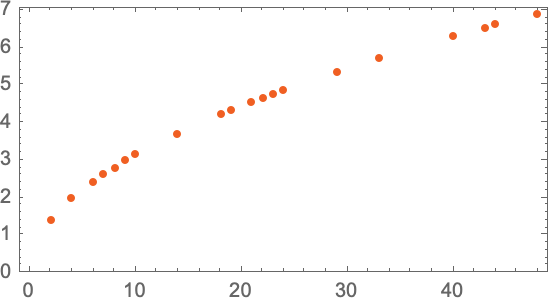

我们如何计算出它从一个我们没有明确数据的楼层落下需要多长时间？在这种特殊情况下，我们可以用已知的物理学定律来计算。但是，如果说我们所得到的只是数据，而我们不知道有什么基本定律在支配它。那么我们可以做一个数学上的猜测，比如说，也许我们应该用一条直线作为模型。

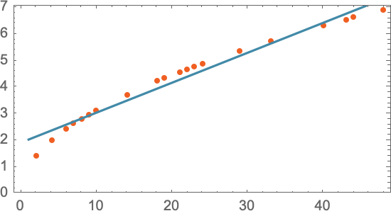

我们可以选择不同的直线。但这是平均来说最接近我们所给的数据的一条。而根据这条直线，我们可以估算出任何楼层的下降时间。

我们怎么知道要在这里尝试使用一条直线呢？在某种程度上我们不知道。这只是数学上简单的东西，而我们已经习惯了这样的事实：我们测量的很多数据都被数学上简单的东西很好地拟合了。我们可以尝试一些数学上更复杂的东西 —— 比如说 a + bx + cx2，然后在这种情况下，我们做得更好：

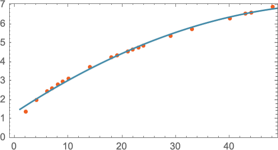

不过，事情可能会出大问题。比如这里是我们用 a + b/c + x sin(x) 最多也就做成：

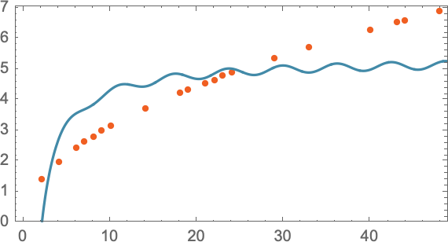

在这里，y=a + bx + cx2及y=a + b/c + x sin(x)就是我们所说的模型，它们满足一个输入对应一个输出，并且涵盖几乎无穷尽的输入/输出对。

值得理解的是，从来没有一个 “无模型的模型”。你使用的任何模型都有一些特定的基础结构，然后有一组 “你可以转动的旋钮”——即你可以设置的参数来适应你的数据。而在 ChatGPT 的案例中，使用了很多这样的 “旋钮” —— 实际上，有 1750 亿个。

## 人类的识别模型是如何建立的

在我们谈论语言之前，让我们先谈谈另一项类似人类的任务：识别图像。而作为一个简单的例子，让我们考虑数字的图像（是的，这是一个经典的机器学习例子）：

我们可以做的一件事是为每个数字获取一堆样本图像：

然后，为了找出我们输入的图像是否对应于某个特定的数字，我们只需与我们拥有的样本进行明确的逐像素比较。但作为人类，我们似乎可以做得更好 —— 因为我们仍然可以识别数字，即使它们是手写的，并且有各种各样的修改和扭曲。

当我们为上面的数字数据建立一个模型时，我们能够取一个给定的数字值 x，然后为特定的 a 和 b 计算 a + bx。

因此，如果我们把这里的每个像素的灰度值当作某个变量 xi，是否有一些所有这些变量的函数，在评估时告诉我们这个图像是什么数字？事实证明，有可能构建这样一个函数。不足为奇的是，这并不特别简单。一个典型的例子可能涉及 50 万次数学运算。

但最终的结果是，如果我们把一幅图像的像素值集合输入这个函数，就会得出一个数字，指定我们的图像是哪个数字。稍后，我们将讨论如何构建这样一个函数，以及神经网络的概念。但现在让我们把这个函数当作黑匣子，我们输入例如手写数字的图像（作为像素值的阵列），然后我们得到这些数字对应的数字：

但这里到底发生了什么？比方说，我们逐步模糊一个数字。有一段时间，我们的函数仍然 “识别” 它，在这里是一个 “2”。但很快它就 “失去” 了，并开始给出 “错误” 的结果：

但为什么我们说这是一个 “错误” 的结果呢？在这种情况下，我们知道我们通过模糊一个 “2” 得到所有的图像。但是，如果我们的目标是制作一个人类识别图像的模型，那么真正要问的问题是，如果遇到这些模糊的图像，在不知道其来源的情况下，人类会做什么。

如果我们从我们的功能中得到的结果通常与人类会说的话一致，我们就有一个 “好的模型”。而非微不足道的科学事实是，对于像这样的图像识别任务，我们现在基本上知道如何构建这样的函数。

我们能 “从数学上证明” 它们的作用吗？嗯，不能。因为要做到这一点，我们必须有一个关于我们人类正在做什么的数学理论。以 “2” 图像为例，改变几个像素。我们可以想象，只有几个像素 “不合适”，我们还是应该认为这个图像是 “2”。但这应该到什么程度呢？这是一个关于人类视觉感知的问题。而且，是的，对于蜜蜂或章鱼来说，答案无疑是不同的 —— 对于假定的外星人来说，则可能是完全不同的。

对于一个人类的新生儿来说，他/她学会识别现实生活中的事物，也是一个逐渐建立模型的过程。任何一个普通人都可以在几秒内甚至更短的时间内，识别出他/她的朋友，但TA说不出为什么，这很正常。

## **神经网路是如何工作的？**

好吧，那么我们用于图像识别等任务的典型模型究竟是如何工作的呢？**目前最流行、最成功的方法是使用神经网络。**在 20 世纪 40 年代，神经网络的发明形式与今天的使用非常接近，它可以被认为是大脑似乎工作方式的简单理想化。

在人类的大脑中，有大约 1000 亿个神经元（神经细胞），每个神经元都能产生电脉冲，每秒可能有一千次。这些神经元在一个复杂的网络中连接起来，每个神经元都有树状的分支，允许它将电信号传递给可能有成千上万的其他神经元。

**粗略估计，任何给定的神经元是否在某一时刻产生电脉冲，取决于它从其他神经元那里收到的脉冲 —— 不同的连接有不同的 “权重” 贡献。**

当我们 “看到一个图像” 时，所发生的事情是，当图像的光子落在眼睛后面的（“光感受器”）细胞上时，它们在神经细胞中产生电信号。这些神经细胞与其他神经细胞相连，最终信号通过一整层的神经元。而正是在这个过程中，我们 “识别” 了图像，最终 “形成了一个想法”，即我们 “看到了一个 2”（也许最后会做一些事情，如大声说 “2” 这个词）。

上一节中的 “黑盒子” 函数是这样一个神经网络的 “数学化” 版本。它刚好有 11 层（虽然只有 4 个 “核心层”）。

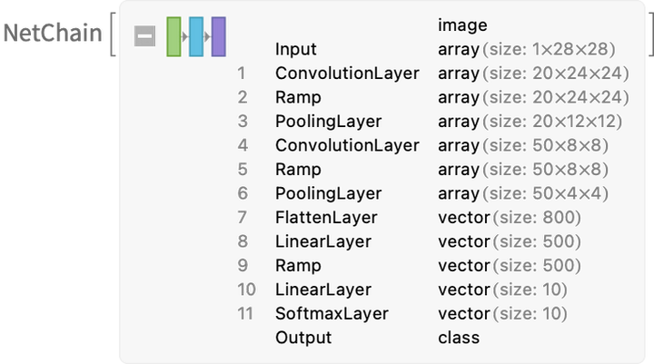

这个神经网并没有什么特别的 “理论推导”；它只是在 1998 年作为一项工程而构建的东西，并且被发现是有效的。（当然，这与我们描述我们的大脑是通过生物进化过程产生的没有什么不同）。

好吧，但是像这样的神经网络是如何 “识别事物” 的？关键在于吸引器的概念。想象一下，我们有 1 和 2 的手写图像：

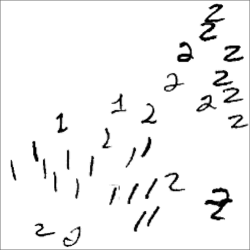

我们希望所有的 1 都 “被吸引到一个地方”，而所有的 2 都 “被吸引到另一个地方”。或者，换一种方式，如果一个图像在某种程度上 “更接近于 1”，而不是 2，我们希望它最终出现在 “1 的地方”，反之亦然。

作为一个直接的类比，我们假设在平面上有某些位置，用点表示（在现实生活中，它们可能是咖啡店的位置）。那么我们可以想象，从平面上的任何一点开始，我们总是想在最近的点结束（即我们总是去最近的咖啡店）。我们可以通过将平面划分为由理想化的 “分水岭” 分隔的区域（“吸引盆地”）来表示这一点：

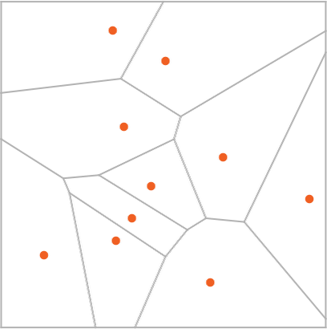

我们可以认为这是在执行一种 “识别任务”，我们不是在做类似于识别给定图像 “看起来最像” 的数字的事情 —— 而是很直接地看到给定点最接近哪个点。（我们在这里展示的 “Voronoi 图” 设置是在二维欧几里得空间中分离点；数字识别任务可以被认为是在做非常类似的事情 —— 但却是在一个由每张图像中所有像素的灰度等级形成的 784 维空间中。）

那么，我们如何使一个神经网络 “完成一个识别任务”？让我们考虑这个非常简单的案例：

我们的目标是获取一个对应于 {x,y} 位置的 “输入”，然后将其 “识别” 为它最接近的三个点中的任何一个。或者，换句话说，我们希望神经网络能够计算出一个类似于 {x,y} 的函数：

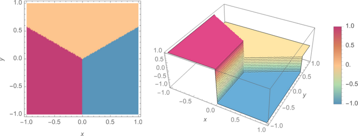

那么，我们如何用神经网络做到这一点呢？归根结底，神经网是一个理想化的 “神经元” 的连接集合 —— 通常按层排列 —— 一个简单的例子是：

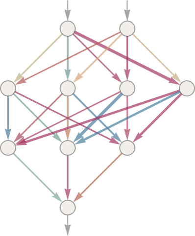

每个 “神经元” 都被有效地设置为评估一个简单的数字函数。为了 “使用” 这个网络，我们只需在顶部输入数字（如我们的坐标 x 和 y），然后让每一层的神经元 “评估它们的功能”，并通过网络向前输入结果 —— 最终在底部产生最终的结果。

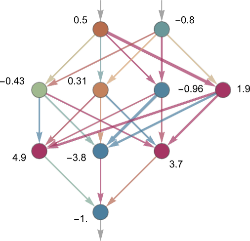

在传统的（受生物启发的）设置中，每个神经元实际上都有一组来自上一层神经元的 “传入连接”，每个连接都被赋予一定的 “权重”（可以是一个正数或负数）。一个给定的神经元的值是通过将 “前一个神经元” 的值乘以其相应的权重来确定的，然后将这些值相加并乘以一个常数，最后应用一个 “阈值”（或 “激活”）函数。

在数学术语中，如果一个神经元有输入 x = {x1, x2 …… }，那么我们计算 f[w.x + b]，其中权重 w 和常数 b 通常为网络中的每个神经元选择不同；函数 f 通常是相同的。

计算 w.x + b 只是一个矩阵乘法和加法的问题。激活函数 “f 引入了非线性（并最终导致了非线性行为）。通常使用各种激活函数；这里我们只使用 Ramp（或 ReLU）：

对于我们希望神经网络执行的每一项任务（或者说，对于我们希望它评估的每一个整体函数），我们将有不同的权重选择。（正如我们稍后要讨论的那样，这些权重通常是通过使用机器学习从我们想要的输出实例中 “训练” 神经网络来确定的）。

最终，每个神经网络都对应于一些整体的数学函数 —— 尽管它可能写得很乱。对于上面的例子，它就是：

ChatGPT 的神经网络也只是对应于这样的一个数学函数 —— 但实际上有数十亿个术语。

但让我们回到单个神经元上。下面是一个有两个输入（代表坐标 x 和 y）的神经元在选择不同的权重和常数（以及 Ramp 作为激活函数）后可以计算的函数的一些例子：

但是，上面那个更大的网络是怎么回事？嗯，这是它的计算结果：

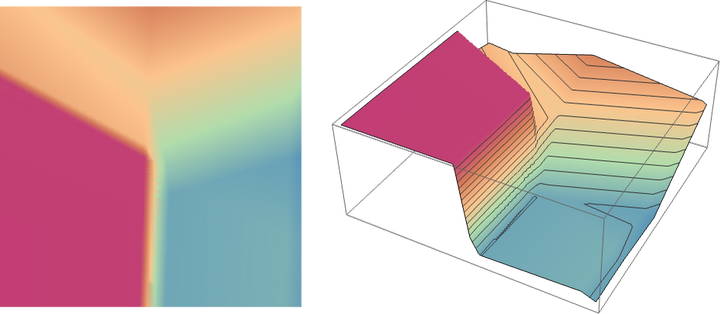

这不是很 “正确”，但它接近于我们上面展示的 “最近点” 函数。

让我们看看其他一些神经网络的情况。在每一种情况下，正如我们稍后所解释的，我们都在使用机器学习来寻找最佳的权重选择。然后，我们在这里展示带有这些权重的神经网络的计算结果：

**更大的网络通常能更好地逼近我们的目标函数。而在 “每个吸引子盆地的中间”，我们通常会得到我们想要的答案。**但在边界 —— 神经网络 “很难下定决心” 的地方 —— 情况可能会更加混乱。

在这个简单的数学风格的 “识别任务” 中，“正确答案” 是什么很清楚。但在识别手写数字的问题上，就不那么清楚了。如果有人把 “2” 写得很糟糕，看起来像 “7”，等等，怎么办？不过，我们还是可以问，神经网络是如何区分数字的 —— 这就给出了一个指示：

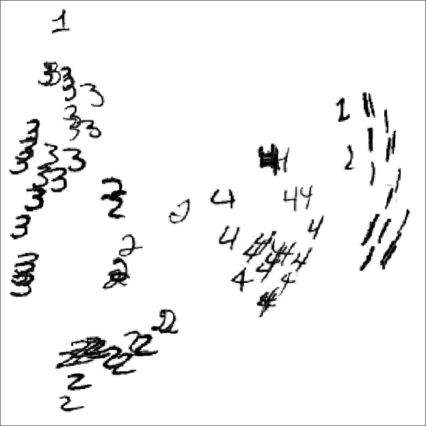

我们能 “从数学上” 说说网络是如何区分的吗？并非如此。它只是在 “做神经网络所做的事” 而已。但事实证明，这通常似乎与我们人类所作的区分相当吻合。

让我们举一个更复杂的例子。比方说，我们有猫和狗的图像。我们有一个神经网络，它被训练来区分它们。下面是它在一些例子中可能做的事情：

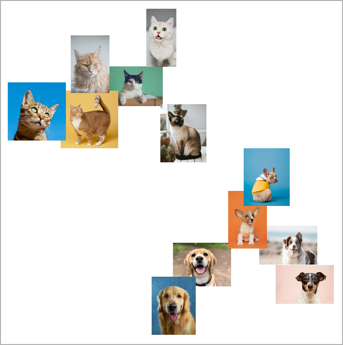

现在，“正确答案” 是什么就更不清楚了。穿着猫衣的狗怎么办？等等。无论给它什么输入，神经网络都会产生一个答案。而且，事实证明，这样做的方式与人类可能做的事情是合理一致的。

正如我在上面所说的，这不是一个我们可以 “从第一原理推导” 的事实。它只是根据经验被发现是真的，至少在某些领域是这样。但这是神经网络有用的一个关键原因：它们以某种方式捕捉了 “类似人类” 的做事方式。

给自己看一张猫的照片，然后问 “为什么那是一只猫？”。也许你会开始说 “嗯，我看到它的尖耳朵，等等”。但要解释你是如何认出这张图片是一只猫的，并不是很容易。只是你的大脑不知怎么想出来的。但是对于大脑来说，没有办法（至少现在还没有）“进入” 它的内部，看看它是如何想出来的。

那么对于一个（人工）神经网来说呢？好吧，当你展示一张猫的图片时，可以直接看到每个 “神经元” 的作用。但是，即使要获得一个基本的可视化，通常也是非常困难的。

在我们用于解决上述 “最近点” 问题的最终网络中，有 17 个神经元。在用于识别手写数字的网络中，有 2190 个。而在我们用来识别猫和狗的网络中，有 60,650 个。

通常情况下，要将相当于 60,650 个维度的空间可视化是相当困难的。但由于这是一个为处理图像而设置的网络，它的许多神经元层被组织成阵列，就像它所看的像素阵列一样。

如果我们采取一个典型的猫图像：

那么我们就可以用一组衍生图像来表示第一层神经元的状态 —— 其中许多图像我们可以很容易地解释为 “没有背景的猫” 或 “猫的轮廓” 等：

到了第十层，就更难解释发生了什么：

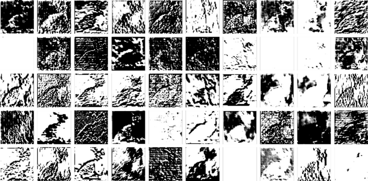

但总的来说，我们可以说神经网络正在 “挑选出某些特征”（也许尖尖的耳朵也在其中），并利用这些特征来确定图像是什么。但这些特征是我们有名字的，比如 “尖耳朵”？大多数情况下不是。

我们的大脑在使用类似的特征吗？大多数情况下我们不知道。但值得注意的是，像我们在这里展示的神经网络的前几层似乎可以挑出图像的某些方面（如物体的边缘），这些方面似乎与我们知道的由大脑中第一层视觉处理挑出的特征相似。

但是，假设我们想要一个神经网络的 “猫识别理论”。我们可以说 “看，这个特定的网络做到了” —— 这立即给了我们一些关于 “问题有多难” 的感觉（例如，可能需要多少个神经元或层）。

但至少到现在为止，我们还没有办法对网络正在做的事情进行 “叙述性描述”。**也许这是因为它在计算上确实是不可简化的，而且除了明确地追踪每一个步骤之外，没有一般的方法可以找到它在做什么。**也可能只是因为我们还没有 “弄清科学”，还没有确定 “自然法则”，使我们能够总结出正在发生的事情。

当我们谈论用 ChatGPT 生成语言时，我们会遇到同样的问题。而且同样不清楚是否有办法 “总结它在做什么”。但是语言的丰富性和细节（以及我们在这方面的经验）可能会让我们比图像走得更远。

参考

- https://zhuanlan.zhihu.com/p/631347310
