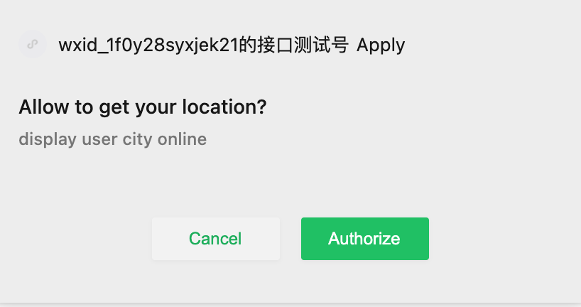
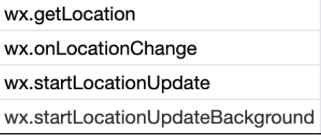
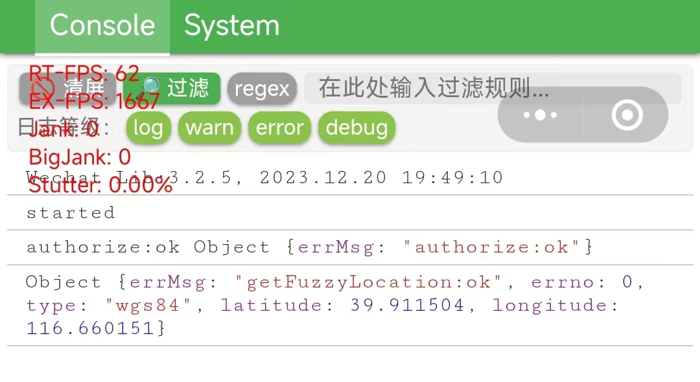
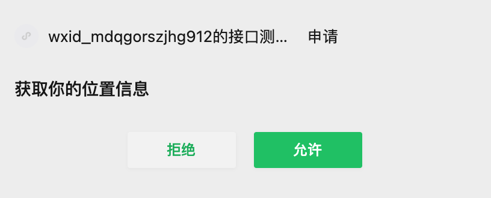

# 如何在微信小游戏/小游戏中获取地理位置信息？

今天从整体上说一下小游戏/小程序中地理位置的获取。

小游戏和小程序的运行环境本质上是一类环境，只是两者在对微信接口的调用限制上，在某些方面不一样。例如在地理位置获取上，小程序有十来个接口，但小游戏只有两个，在小游戏中的运行环境中，其它接口应该也是存在的，只是被微信隐藏或屏蔽了。早期，只要两边都使用相同的设置和调用方式，接口便能调通，例如wx.getLocation便是。

后来，由于越来越多的开发商对wx.getLocation这个实时接口开始滥用，这造成了一个很严重的问题：用户手机设备上的电量被大量消耗，手机出现卡顿现象，在低端Android设备上尤其明显。于是微信开始整顿，限制开发者对地理位置服务（LBS）接口的调用。要调用该类接口，开发者必须明确说明用来干什么，提交申请，审核通过后才能被允许使用。（大概2022年6月出过一份公开声明，参见https://developers.weixin.qq.com/community/develop/doc/000a02f2c5026891650e7f40351c01）

现在使用地理位置接口，有以下三点需要考虑：

1，在配置文件app.json（小程序）或game.json（小游戏）中，添加对scope权限的使用说明，例如：

```json
"permission": {
  "scope.userFuzzyLocation": {
  	"desc": "display user city online"
  }
},
```

这是对scope.userFuzzyLocation权限的使用说明，代码模糊的地理位置。它的旧的精确地理的权限名称是scope.userLocation。

这里的desc是展示给用户看的，

当小程序或小游戏第一次请求获得相应授权时，用户会看到一个授权弹窗：



desc是在这里展示给用户看的，向用户说明该开发商获取他的地理地位做什么用途。这是一个君子声明，事实上开发者获取之后做什么，用户根本不知道。

配置文件中的permission配置，只是为了设置一个将要展示给用户的一个理由，并不是说在这里设置了以后，开发者就获得了调用相关接口（例如scope.userLocation范围下的wx.getLocation接口）的权限，不是的。或者说，原来是这样，现在微信团队加强了管理，不再是的。

2，在配置文件中添加一个requiredPrivateInfos配置节点，使用哪个接口，就把对应接口的名字填上。例如：

```json
"requiredPrivateInfos": [
	"getFuzzyLocation"
]
```

我们准备调用wx.getFuzzyLocation接口，所以把它写在这里。这个配置原来是不需要的，后来出于对用户个人私密信息的加强保护，在scope权限配置指向不明确的情况下，又添加这个配置。例如scope.userLocation范围下，有以下三个接口：



仅是配置scope，微信不知道开发者要调用哪个接口，于是就有这个配置节点。

3，有了前面两步并不意味着可以获取地理位置信息了，在获取该信息之前，需要申请。

在小程序中，需要在“小程序管理后台 -「开发」-「开发管理」-「接口设置」” 中完成权限申请。在小游戏中，目前不需要这个申请页面。所以，对于小游戏，

wx.getLocation接口的权限被官方默认收回了。官方建议使用wx.getFuzzyLocation代替对wx.getLocation的使用，在开发者工具中我们也可以看到，wx.getLocation被划了删除线，它已经被建议舍弃了。这个改变是从 2022 年 7 月 14 日起生效的。旧的应用不受影响，新的应用按新的规矩办。

在《微信小游戏开发》后端篇中，有一个LBSManager，它需要一些修改，在修改后是这样的：

```js
import QQMapJSSDK from "../libs/qqmap-wx-jssdk.min.js";
import {promisify} from "../utils.js"

const QQ_LBS_KEY = "L5YBZ-BTZHX-FPU42-Z3PUL-VHHG2-*****";

class LBSManager {
    get city(){
        return this.#city;
    }
    #city = "unknown";
    #qqmapsdk = new QQMapJSSDK({ key: QQ_LBS_KEY });

    init(options) {
        if (!!this.initialized) return; this.initialized = true;
        wx.getSetting({
            success: (res) => {
                const authSetting = res.authSetting;
                console.log(authSetting);
                if (!authSetting["scope.userLocation"]) {
                    wx.authorize({
                        scope: "scope.userLocation",
                        success: res => {
                            this.#updateCity();
                        },
                        fail: err => {
                            console.log(err);
                        }
                    })
                }
                else {
                    this.#updateCity();
                }
            }
        })
    }
    #updateCity() {
        console.log("start to get city");
        wx.getLocation({
            type: "gcj02",
            altitude: false,
            success: res => {
                this.#qqmapsdk.reverseGeocoder({
                    location: {
                        latitude: res.latitude,
                        longitude:res.longitude
                    },
                    success: res => {
                        console.log(res);
                        this.#city = res.result.address_component.city;
                    },
                    fail: err => {
                       
                        console.log(err);
                    }
                })
            },
            fail: res => {
                console.log("getLocation fail");
                console.log(res);
            }
        })
    }
}
class SyncLBSManager {
    get city() {
        return this.city;
    }
    #city = "unknown";
    #qqmapsdk = new QQMapJSSDK({
        key: QQ_LBS_KEY
    });
    async init(options) {
        const res = await wx.getSetting();
        if (!res.authSetting["scope.userFuzzyLocation"]) {
            await wx.authorize({ scope: "scope.userFuzzyLocation" }).catch(console.log);
        }
        this.#updateCity();
    }
    async #updateCity() {
        const res = await promisify(wx.getFuzzyLocation)({
            type: "gcj02",
            altitude: false
        }).catch(console.log);
        const lbsRes = await promisify(this.#qqmapsdk.reverseGeocoder.
            bind(this.#qqmapsdk))({
                location: `${res.latitude},${res.longitude}`
            }).catch(console.log);
        this.#city = lbsRes.result.address_component.city;
    }
}
export default new SyncLBSManager();
```

配置文件game.json也需要一些个性，修改后是：

```js
{
  "deviceOrientation": "portrait",
  "permission": {
    "scope.userFuzzyLocation": {
      "desc": "display user city online"
    }
  },
  "requiredPrivateInfos": [
    "getFuzzyLocation"
  ]
}
```


在进行地理位置功能开发的时候，可能会遇到下面这些问题：

1，在手机上测试

电脑有时候虽然也能获取当前所在的地理位置，但开发者工具作为一个测试开发环境，它没有实现这方面的功能。如果在电脑上测试，会遇到这样的问题：

> {errMsg: "getFuzzyLocation:fail 开发者工具暂时不支持此 API 调试，请使用真机进行开发"}

解决办法：在手机设备上测试或调试。



在手机设备上调用wx.getFuzzyLocation成功，会返回getFuzzyLocation:ok。

2，wx.getFuzzyLocation不是有效函数

基础库版本号过低，在项目设置中选择1.7以上的版本号。

3，看不到授权窗口

正常情况下，用户第一次打开应用，会看到一个弹窗：



如果没有这个弹窗，可能因为没有使用接口wx.authorize进行提前授权。在测试开发时，可以通过在开发者工具中清除所有缓存，让这个弹窗再次出现。

4，访问被拒绝

错误信息：

> getLocation:fail:access denied

解决办法：使用wx.authorize重新拉取授权，或在小程序管理后台提交地理位置权限申请。

5，不被充许

错误信息：

> errMsg: "getLocation:fail no permission"

解决办法：完成上面三步中的前两步，申请并获得权限允可，同时告知用户接口用意。

大概就是以上这些，有问题欢迎再提出来～
