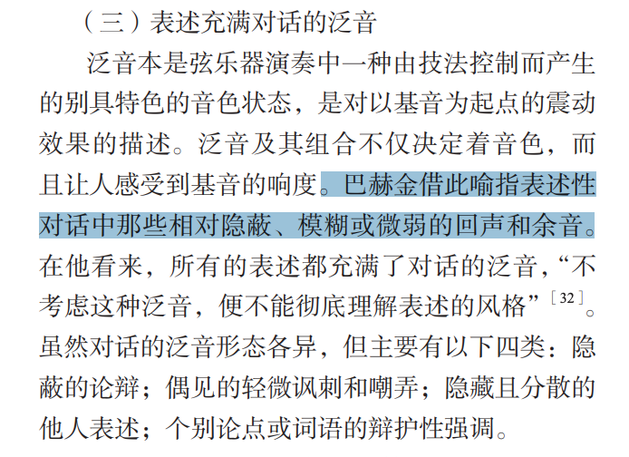

# 如何写好人物对话？

目录

[TOC]

## 故意添加语气词、人物动作、人物神情的描写

不好的示例：

```
张三说：“我觉得你杀不了我。”
李四道：“不，我觉得我杀得了你。”
```

修改后：

```
“哦，就凭你？”
张三冷冷一笑，眉宇间便透出几分不屑来：“你觉得，你杀得了我？”
“那就不妨试试！”
李四一声狂吼，踏步向前，手中剑……
```

这个方法的核心，就是加入对于人物的语气词、动作和神情描写，以及调整人物和对话的位置。

什么是语气词？

例如冷冷一笑、一声狂吼。

什么是动作？

例如踏步向前。

什么是神情描写？

例如眉宇间透出几分不屑等。

### 动作、神情、语气从哪里来？

下面说一个相关的问题：我们写对话，要注意多写动作、神情和语气，那么怎么写，这些概念从哪里来？

一个偷懒的法子就是从影视中的人物上来，从老戏骨身上来。老戏骨演什么像什么，为什么？因为他们把角色演活了。

比如陈道明，演过皇帝形象，观察他在剧中表演的言行举止，小细节写到位了，语气写到位了，台词自然而然对味了。例如：

```
皇帝来回走动，久久不发一言……慢慢将眼神抬起，指着百官道：
“朕一看到你们就痛心疾首，那百姓都尸横遍野，你们好端端在这站着，如何有得脸面？”
```

演员为什么这样演，与他理解的角色性格有关，他认为应该这样演。

写作亦是如此，动作、神情、语气都要围绕角色的性格展开。

下面是一个深谙对话写作技巧的高手，他运用技巧写了一段教人这些技巧的对话：

## 大师安于用“说”与“道”，有时候用用也无妨

“写网文如何避免 xx 说，和 xx 道呢？”

面对题主的疑问，我表示嗤之以鼻：“你干嘛避免，金庸古龙王小波，莫言鲁迅，哪个不是能‘说’会‘道’的？”

### 将发言的角色放在中间

“可是……”题主面露难色，“现在的人看得都烦了呀！”

### 不超过 10 个字的两人简单直白对话，什么也不加

“那好办！”

“咋办？”

“直接像咱们现在这样，只写对话内容，不写人物不就完事儿了？”

## 多角色对话，加上称谓

题主瞪大眼睛，眉头拧了起来，眼睛里透着揾怒：“你说得倒是简单，可我又不是只写夫妻二人的枕边话，咋就能一直保持两个人呢？”

我微微叹气，又摇了摇头。

“你叹气作甚？”

“悟性太低。”

“啥？你……”

我打断了他：“你瞅瞅下边这段话。”

我清了清嗓子，给题主举例：

“悟空，前方有个女子。”

“师父，那是妖精！”

“大师兄啊，你整天就知道妖精妖精的，这回该是看走眼了吧？”

“诶，二师兄，大师兄什么时候出过错儿，还是小心为妙。”

“呆子，你是不信任俺老孙？”

“师父，大师兄他又凶我……”

“悟空，不得胡闹。”

“哎呀，大师兄，二师兄，你们就少说两句吧。”

看完例子，题主若有所思：“你的意思是……加上人称？”

## 塑造角色独特的气质（个性、语言风格）

“不错，除了人称之外，还需要塑造出一种‘角色感’，即在一个团队里扮演怎样的‘角色’，这样就算是去掉人称，也足够令人分辨。比如‘刺头’是悟空，跟悟空斗嘴的一定是八戒，劝架的一定是沙僧，有威严的一定是唐三藏，你只需要再一开始表现出一个角色，其他人在团队里的定位就能帮助读者脑补出角色的身份。”

“那……总感觉好麻烦的样子。”

“写书本来就是麻烦的一件事，如果你每个角色的性格和形象塑造得够好，就不会出现这样的问题了。”

说到这里，我想了想，觉得要说服题主还不太足够，于是开启了长篇大论：

每个人说话的用词风格不要一个模子。

比如王胖子是个大老粗的人，他就会说:“那龟孙子敢在俺面前叫唤，俺非扒了他的皮不可！”

隔壁老王是个长者:“那厮一身蛮夷之气，须得教他知道厉害！”

你以为我说的是说话风格？

非也！

王胖子是粗人，他看到的是“叫唤”，直观的就是“叫唤”这一动作；而长者比较睿智，他就会把“叫唤”转化成“蛮夷之气”，形容的是他对“叫唤”的感觉，而不是“叫唤”这一动作。

这才是两者的区别，是重点。

如果你想明白了这一点，并且秉承一个人物一种说话风格的特点，就算是人物众多，读者也能仅凭对白判断出说话的角色。

“哦……也就是说，在塑造人物的时候就给每一个人物设定不同的语言风格，对吧？”

“学到了？还不赶紧去实践！你真以为像前边那样把对白接在动词或者动词+名词后面是长久之计啊？写久了读者还是会腻味，所以提升自己人物塑造的能力，才能让小说更加细腻！”

## 一句话分两部分，第一部分结尾用什么标点？

合在一起的情况下该用什么标点，在分别的时候也用该标点。例如：

```
“那你可得好好记清楚了。”
“嗯嗯，”我急忙打开自己的小本本，翻开空白的一页，“我会记清楚的，你说吧。”
```

“嗯嗯”的后面，用的是逗号。

## 话说一半，剩余部分用其它代替，或让读者猜

原版

```
金莲说道：“你若有心，吃我这半盏儿残酒。”
武松说道：“嫂嫂休要恁地不识羞耻！”
```

泛音版

```
“你若有心？”金莲轻捏半盏儿残酒，擎到男人唇前。
“嫂嫂休要！”武松猛地背过身。
```

第二个版本只说了一半。

这里提到了泛音，这是从音乐中借来的概念。

**什么是对话中的泛音？**

指的是正常表述性对话中那些相对隐蔽、模糊或微弱的回声和余音。总之，不是主要的、显式的，而是隐蔽的。



## 重音：只留重点（重音），其余删掉

重点版

```
“吃了它。”金莲轻捏半盏儿残酒，擎到男人唇前。
“不识羞耻！”武松猛地背过身。
```

这个好！网文小说喜欢这种语言风格。

## 重复单句

> 重复的时候，动作也是同步的。为了写作上的方便，将重复的话语叠放在一起了。

泛音基础上的重复版

```
“你若有心，若有心......？”金莲轻捏半盏儿残酒，擎到男人唇前。
“嫂嫂休要.......休要！”武松猛地背过身。
```

在重音基础上的重复版

```
“吃了它，吃了它。”金莲轻捏半盏儿残酒，擎到男人唇前。
“不识羞耻，不识羞耻！”武松猛地背过身。
```

## 切换角色，话先行

切换角色时，让角色先说话，用话语带动对人物神态、语气、动作、心理的描写。

举例：

```
“不冷?"
金莲用拇指食指使劲儿捏了一下武松的肩胛。
武松不吭声，低着头用铁箸拨弄火盆里的木炭。
"你不会，"金莲劈手便夺过铁箸，"我来!"
她用眼角余光偷偷掠过武松的胸膛，咽了一下口水。
武松感觉坐在冰窖里，嗓子却燥热，像吞了一团火焰。
金莲瞥了一眼佛塔似的身躯，扔下铁箸，扭身斟了盏酒。
她用力抿了一口，辛辣像蛇，从喉咙直游到头顶。
"你若有心?"
金莲轻捏半盏儿残酒，擎到男人唇前。
"不识羞耻!"
武松猛地背过身，
"哎呀……"金莲笑得花枝乱颤，"玩笑，玩笑，莫当真，莫当真。"
说着，一滴泪从眼中坠下，她举手不经意擦掉。
```

如果切换角色时，角色没有说话怎么办？

没说话，就说他“没吭声、没搭话、没说话、没理睬”等，都是可以的，例如上面第二句中“武松不吭声”。也可以不说说话的事，直接写反应，例如第五句。

## 少用“道”，只用“说”

有时候没有那么多的动作、语气、神态去写，写的多了，反而重复，让读者生厌。这种情况下就简单用“说”，但不用“道”或“说道”。

海明威的《老人与海》一向被认为是对话简洁有力的典范，看一段它的对话：

```
他们俩从小船停泊的地方爬上岸时，孩子对他说，"我又能陪你出海了，我家挣到了一点儿钱。"
老人教会了这孩子捕鱼，孩子爱他。
"不，"老人说。"你遇上了一条交好运的船，跟他们待下去吧。"
"不过你该记得，你有一回八十七天钓不到一条鱼，跟着有三个礼拜，我们每天都逮住了大鱼。"
"我记得，"老人说。“我知道你不是因为没把握才离开我的。"
"是爸爸叫我走的。我是孩子，不能不听从他。"
"我明白，"老人说。"这是理该如此的。"
"他没多大的信心。"
"是啊，"老人说。"可是我们有。可不是吗?"
"对，"孩子说。"我请你到露台饭店去喝杯啤酒，然后一起把打鱼的家什带回去。"
"那敢情好，"老人说。"都是打鱼人嘛。"
```

作者用了大量的角色中间放置法。但作者没有过多地用语气、神态、动作去水文。


## 对话内容长，怎么办？

这里有一个截短的示例：

```
'大人，大人，不好啦!那群死老头又来了。"
“嗯?不是给过他们每人一吊钱了嘛，还想怎样?"
许大人面有愠色。
"大人，他们说昨个儿给的钱不够，还要一吊。还说....还说.
“还说什么?"
“还说大人今个儿不发钱，以后生出的孩子木有小JJ。"
"岂有此理，老子和他们拼了!"
许大人暴跳如雷，啪的一声将手中的玉盏摔碎，随即抽出侍卫腰间的朴刀冲出门外，。
```

第 4 行，这个角色发说的话，被人为截断了，这是一种处理手段。

更多的方式是另外一种：分段。将长的对话分成几段，每一段都使用独立的引号，段与段之间并没有其它的东西连接。分段，也是一种暂停，在故事文本转变为语音后，分段的地方是有一个小停顿的。


## 回顾

对话要有味道，关键还在于情节与人物。

情节设计得精彩，小说中的人物根本来不及坐在那里聊天，真正好的角色发言，能给读者留下深刻的印象。例如《海贼王》开篇中，香克斯对山贼说：“你欺负我没有关系，但不能欺负我的朋友！”这句话就不是简单的对话中的一部分，它同时也是情节的转折，也是角色香克斯的形象刻画。

在于人物，指的是先将人物的性格设计好，人物说什么话，都是性格决定的。

重点与重复是一对好技巧。有时间、节奏慢，就重复一下；其它情况就简单呈现重点，其余删除。当对话中只留重点内容时，作者就必须通过添加角色动作、神情、语气词，帮助读者理解内容。

涉及多个角色的场景，在切换角色时，先写 TA 说的话。

如果一个人物说的独立很长，这是不合理的。要别人打断他，向他提出问题。或者让他停下来喝口茶，润润嗓子。

参考

- https://www.zhihu.com/question/345921656/answer/949640221
- https://www.zhihu.com/question/345921656/answer/825255601
- http://wxpl.ajcass.org/Admin/UploadFile/Issue/r3b4bfvy.pdf
- https://www.zhihu.com/question/20355902/answer/778907564
