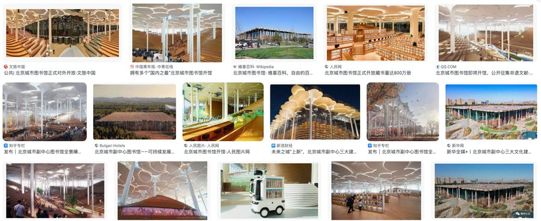
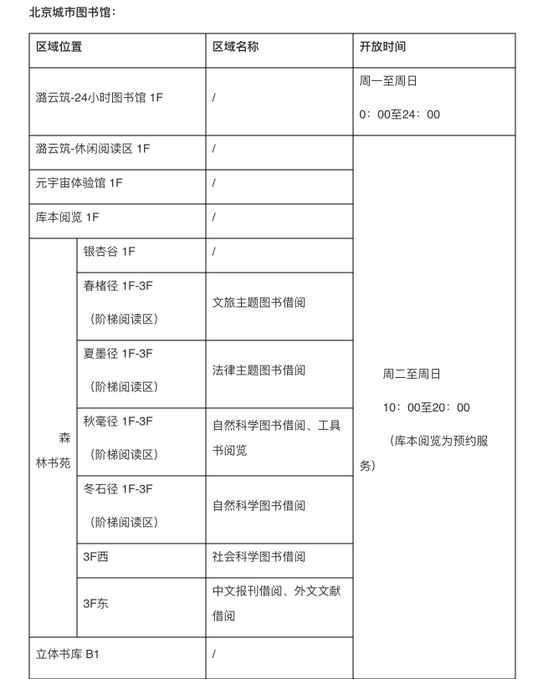
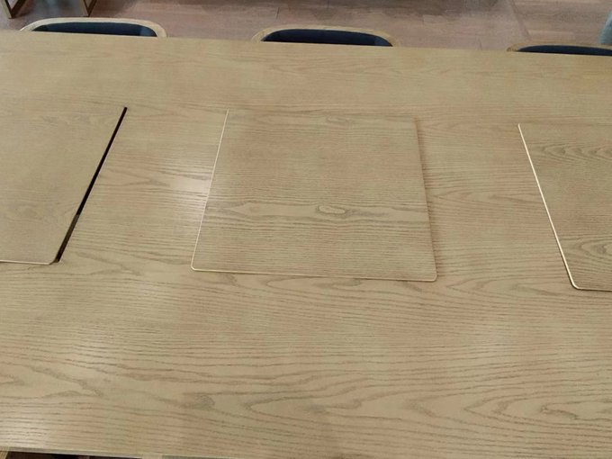
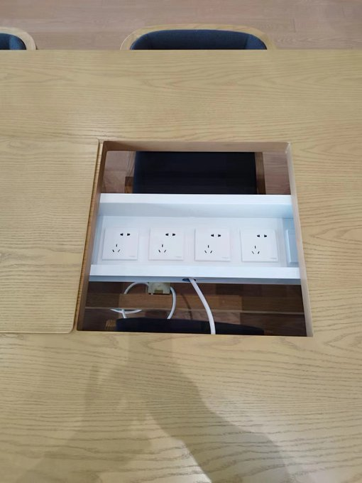
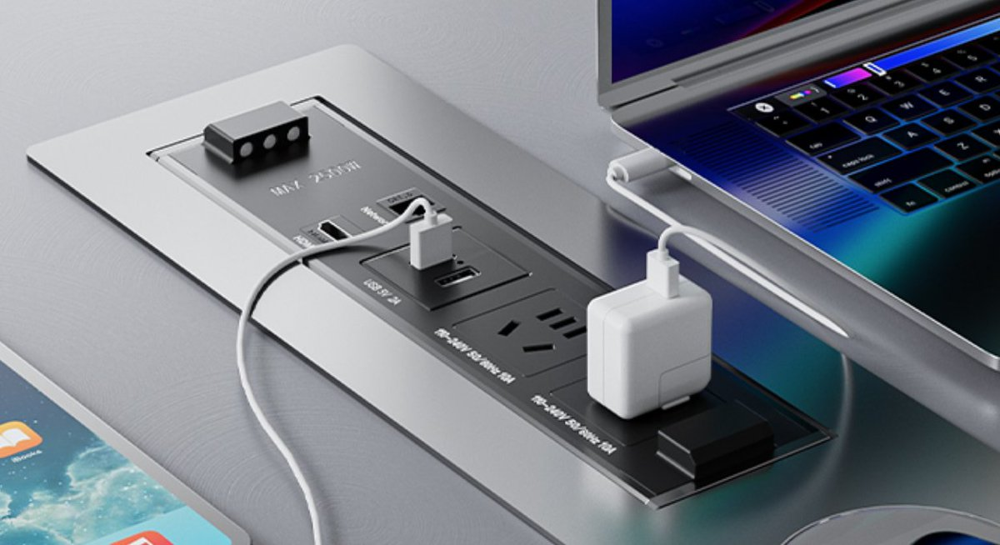
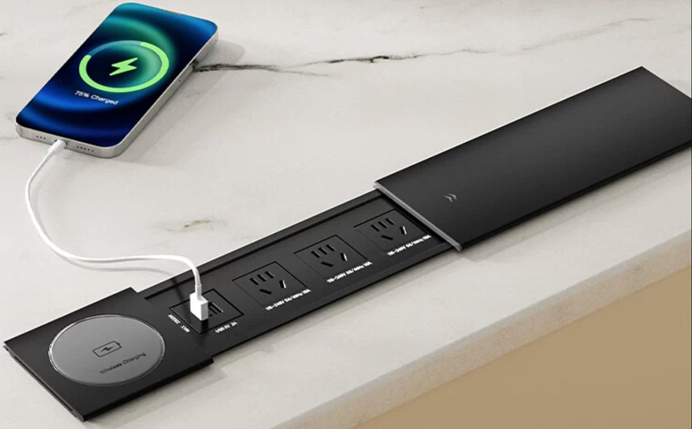
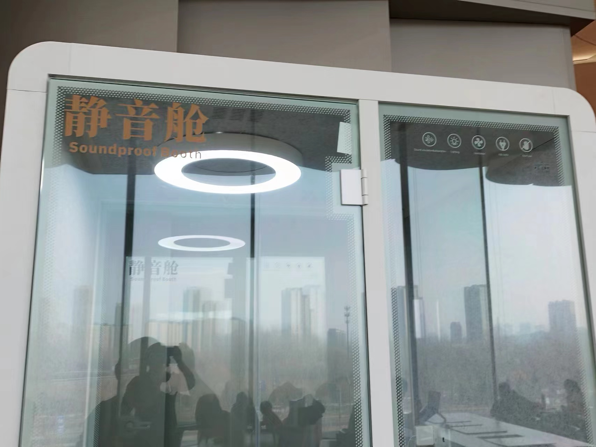
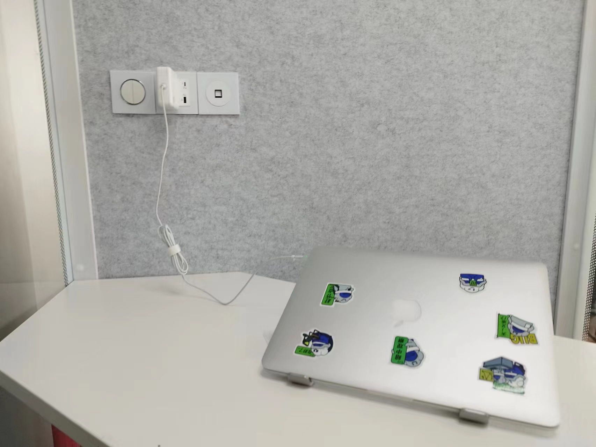

# 体验北京城市图书馆，看到桌子的脑残设计，我不禁骂了一句：傻逼！

目录

[TOC]

位于通州区六环外的北京城市图书馆建成了，号称是吉尼斯单体面积第一的公共图书馆，7x24 小时对外开放。

单体第一与 7x24 小时开放，牛逼！看到这两个介绍，是不是就想去体验一下？

## 失真的7x24

但其实不是真正的 7x24，只有一层入门处潞云筑是全天侯的。周二至周日，上午 10 点开始，里面才正式开放。

每天上午不到 10 点，内门门口的潞云筑就挤满了许多人。那些看到宣传来到这里体验的市民，不清楚状况，就一直在这里等。

## 人如果冷漠还不如用机器人

内门门口有个管锁的保安，今天有一位带俩孩子的大姐问他：“几点开门啊，师傅？”

师傅不理她。

后来保安还有另一位读者吵了起来。

冷漠并不是保安的专利。

昨天我想接点开水，体验一下在公共图书馆享用开水的服务。

体验嘛，我肯定想把里面的服务 360 度无死角全尝试一遍。

我没找到地方，问一位工作人员：“麻烦，接开水的地方在哪里？”

有人可能会想，你自己找不到吗？

不要怀疑，你第一次也可能找不到，因为这里号称单体第一。

她头也没抬，就说了一句：“在厕所旁边。”就不理我了。

但是厕所在哪里，我也不知道啊。

咱也识趣，不再问她了。

后来遇到一个身上贴了“志愿者”标识的小伙子，小伙子给我指明了方向：“你往前走，再往右转就能看到。”

我后来想了想，大概明白了。

先前我第一次问的那个工作人员，她在低头整理图书，她是图书整理员，人家不负责问询。人家专注本职工作，不理睬咱是应该的。咱脸皮厚，主动问她，是咱的不是。

想到这里，我故意从书架上抽出来两本书。我未必真要看，但既然图书整理员喜欢整理，我就想增加一点她的工作量。

有人反对超市、高场等公共场所服务 AI 化，我倒觉得机器比人要好。我更愿意去只有机器人提供服务的超市，公共图书馆全换成机器人我也不介意。

有人说这是为了提升就业！

没有必要为了给人提供就业岗位，就降低使用者的体验，这是不公平的。如果非要如此，可以在公共图书馆外面增加一类迎宾职业，所有图书馆工作人员只在外面迎来送往就可以了，里面的工作完全可以交给机器人。

## 插座的脑残设计

目前馆内设施还没有全部开放。

2 层是关闭的。1 至 3 层略有装修余味。有一些封闭的桌面设施，打开板子气味会更加浓烈。

有可以给笔记本电脑供电的电源插座，桌子上有这样的设计。阶梯阅读区有布线，但插座还没有装上。阅览区的桌子大部分都已经安装了插座，但设计有点脑残。

设计人员在桌子中间挖了一个正方形大洞，距离两个桌边的距离已经不多了。这个距离，勉强可以放一本书或一个小尺寸的笔记本电脑。

将板子掀起来，底下是一排插座。看到这排插座，我不禁骂了一句：“设计师真傻逼！”

明明只用一个长方形的盖板就可以满足需求，为什么要挖一个正方形的洞？

这设计师是对正方形有执念吗？单体图书馆从上空看是正方形的，所以这里面桌子上的洞也必须是正方形的？

我实在难以理解这伟大的设计！

在桌子上开洞，方便使用电源，我最喜欢下面这样的设计：嵌入式。如果提供者再细心一些，可以同时提供多个三插、两插的位置，及 USB、Type-C 充电的小插口。

如果怕落尘，还可以采用下面这种带滑盖的设计。不用的时候盖上，防尘；擦拭打扫的时候，也可以盖上，避免电器粘水。

但从简洁上考虑，我还是觉得前面与桌面平齐的嵌入式插座最实用。

## 让人憋屈的静音舱

这个图书馆有两个静音舱。

静音舱是全封闭的，里面是桌子、凳子和插座。昨天我来的时候，看到有人使用且用了一天，羡慕不已。当时我就想，那小子可能是一个自闭症患者。

今天我赶了个早，抢占了一个静音舱。

刚进去，放好电脑，插上电，还没有两分钟，一个保安来了。

“读者，这个地方你不能用，请你出来！”

我一下就火了。

“为什么别人能用，我不能用？”

保安说：“这里主要是给读者打电话用的。”

我说：“这个小间里，有桌子、有凳子、有插座，一看就是就是给读者用电脑使的。

如果是给读者打电话用的？那上面应该写「电话舱」，为什么写「静音舱」呢？”

……

保安跟我前后扯皮了几分钟，他坚持说，这个小间就是给读者打电话用的。

因为单体图书馆很大，有读者要接电话，不方便跑到馆外接，于是安排了这个静音舱。

唉，这个理由我是认可的。

最近我和他达成一致：“如果有读进要进来打电话，我把小间让出来，我离开。”

保安临走时，我有点不大高兴，我对他说：

“这个图书馆号称 7x24，其实不是，只有门口潞云筑一小块区域是 7x24 小时，主体空间到 10 点才开门。

你能不能跟你领导反应一下这个开门时间的问题？

普通图书馆是 8 点半开门，你们这里 10 点开门太晚了，能不能提前？”

保安没说给我反应，他走了。

没过几分钟，又来了一位男工作人员。

他讲的话，和前面保安讲的内容大概相同，毫无新意。

看来保安并没有替我反应开门时间的问题，他大概是反应了有一位刺头读者在静音舱懒着不肯出来，所以请领导来处理了。

我对男工作人员讲了同样的疑问，然后提到了管理规范：

“如果这个静音舱是打电话用的，那请你们公开张贴一个静音舱的使用规范，明确该表彰舱的使用要求及使用办法。

昨天我明明看到有人使用了，今天我就想来体验一下。

现在我刚体验上，你们就让我出去。一人来讲了不行，马上又来一人，你们这是要干什么？”

男工作人员走了。

最后又来了一位胖大姐，她也是工作人员。

她大概和我讲了同样的意思，和前面两位相同。

说实话，早知道他们这样车轮战耗我时间，我宁肯一开始二话不说，收拾东西直接滚出去！

胖姐很能聊，她还聊到图书馆 2 层将要开放会议室，充许读者进行预约，在里面开会、录制视频都可以。

我问她：“怎么预约？有网址没有？还是打电话？具体什么时间开放？”

这些问题她都说不上来，说要等领导通知。

她建议我：“您如果想录视频，可以去一些写字楼里面找一找，有一些孵化器提供的地方，既可以开视频会议，又可以录制视频，很方便。”

我问她：“那地方不要钱吗？”

她语塞：“那……是要钱。不要钱的就我们这里。”

谈话进行到这里，半小时都已经过去了，仍然没有一个明确的结论。

胖姐坚持昨天贴过一个静音舱使用规范，但不知道被谁撕去了。

舱门上一点胶水的痕迹都没有，我觉得她在撒谎！

关于静音舱的使用，他们根本就没有统一的管理规范。

关于静音舱的设计及用途，他们也是糊涂的。

现代图书馆，读者有接打电话的需求，也有出声朗读、录制视频的需求，这两点目前在这个新馆并没有很好得到满足。

从静音舱的设计来看，有桌、有椅、有插座，连有线网络接口都有。

这样的设计，应该是给有语音、视频录制需求的读者使用的，说明了也就是给像我这样的教育工作者准备的。

但是，在试运营过程中，他们发现，馆中有不少读者接打电话。

而单体最大的图书馆要保持安静很难，馆中甚至都有人举着一个“保持安静”的牌子左右来回巡走。

在这种情况下，于是他们想把静音舱用作临时接打电话的地方。

正如我对他们讲的：“不如就把「静音舱」改为「电话舱」，把这里面的桌椅设施都拆掉，把插座堵死。

外面再贴一个使用说明：只限接打电话使用，每人每次限用 10 分钟！

## 怎么解决？

我并非一定要霸占静音舱！

只是明明昨天我看到别人一直在用，而今天我不能使用，我感到很不舒服，特别是在静音舱并没有公开张贴一个使用规范的情况下。

我感觉我被他们针对了！

读者有远程会议、音频录制、视频录制、接打电话等需要发声的需求，怎么解决这些需求呢？

我看了一下这个静音舱，左右不过 2.2 个平方，按占用的空间算，大概是外面公共区域两个读者位的大小。

我觉得在设计上，完全可以多设计一些这样的静音舱。对于这样一个吉尼斯单体最大的图书馆，每个方向面设计 25 间，四面有 100 间应该就够用了。而且从空间上论，也有足够的空间可以容纳这样的设计。

有人可能会想，人人都想用静音舱怎么办？

这个问题貌似只能是：先到先得。

静音舱数量多了以后（例如达到了 100 个），我相信每天真正想进静音舱的人，并不会达到 100 个。

在一个封闭的小空间里，呆久了会觉得憋屈和压抑。

正常情况下，录一个视频，开一个远程会议，2 个小时足够了。2 个小时后使用者自己就会从里面出来。

大概从 10 点开始，我在静音舱里待到 12 点，大概待了 2 小时，我就已经想出去了。说实话，如果不录视频、不开远程会议，在静音舱里待着，并没有在外面公共区域舒服。

但是，刚刚从 10 点到 10 点半，接连有三个工作人员要请我出去，我怎么可以这么快就出去呢？

我一定要坚持到 12 点半！我至少要在里面待够两小时！

如果没有他们的一再要求，没有浪费我半小时的时间，我在里面连准备+录制，花一个小时就能录完教学视频，待到 11 点就能出来了。

他们以“请我出去”为名，生生将我多困在舱里一个半小时。
